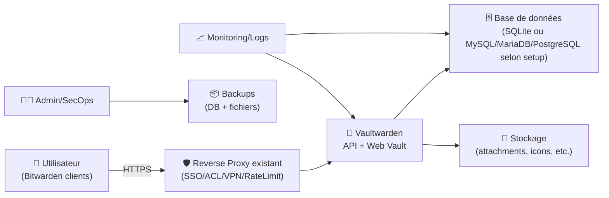
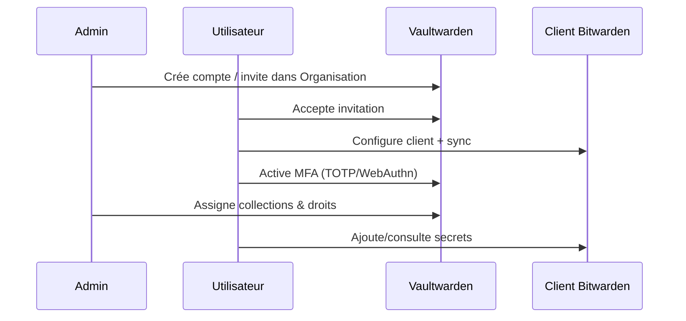

# 🔐 Vaultwarden — Présentation & Exploitation Premium (Password Manager Self-Hosted)

### Compatible Bitwarden • Léger • Sécurisable • API & clients officiels • Gouvernance & bonnes pratiques
Optimisé pour reverse proxy existant • SSO possible • Durabilité opérationnelle • Sauvegarde & rollback

---

## TL;DR

- **Vaultwarden** est une implémentation **compatible Bitwarden** (clients officiels) visant une empreinte plus légère.
- “Premium” = **exposition maîtrisée**, **politiques d’accès**, **hygiène de secrets**, **backups testés**, **procédures d’incident**, **mises à jour cadrées**.
- À traiter comme un **service critique** : il protège l’accès à tout le reste.

---

## ✅ Checklists

### Avant mise en service (préflight)
- [ ] Domaine/URL finale définie (celle vue par les clients)
- [ ] Accès protégé (reverse proxy existant + auth/SSO/VPN selon ton modèle)
- [ ] Stratégie comptes (admin(s), users, organisations, collections)
- [ ] Politique MFA (TOTP/WebAuthn) + recovery plan
- [ ] Politique de logs (ce qui est conservé, où, combien de temps)
- [ ] Backups (données + pièces jointes) planifiés + **restauration testée**

### Après mise en service (go-live)
- [ ] Création d’une **Organisation** + Collections + droits
- [ ] MFA activée pour admins + users clés
- [ ] Test client (desktop + mobile) : login, sync, création d’entrée, attachement
- [ ] Audit permissions (qui peut voir/modifier/partager)
- [ ] Runbook incident prêt (perte d’accès, brute force, DB down, cert expiré)

---

> [!TIP]
> La meilleure optimisation “premium” : **gouvernance** (Organisation + Collections + rôles) + **MFA partout** + **backups restaurables**.

> [!WARNING]
> Un gestionnaire de mots de passe expose une surface sensible : journaux, tokens, partages, liens d’invitation, pièces jointes.

> [!DANGER]
> Une mauvaise exposition (public sans contrôle) = risque direct de compromission des comptes et donc de tout ton SI. Applique le principe du **moindre privilège**.

---

# 1) Vaultwarden — Vision moderne

Vaultwarden sert à :
- 🔑 centraliser secrets (mots de passe, notes, clés, TOTP)
- 👥 partager proprement via **Organisation** / **Collections**
- 📲 utiliser les **clients Bitwarden** (desktop/mobile/web) pour l’expérience utilisateur
- 🔒 renforcer sécurité via MFA, policies, revues de partage

Référence projet : https://github.com/dani-garcia/vaultwarden

---

# 2) Architecture globale (concept)



> [!TIP]
> Même si SQLite peut convenir à de petits usages, la logique “premium” = penser **sauvegarde/restore**, **concurrence**, **migration**, **observabilité**.

---

# 3) Modèle d’usage “premium” (ce qui fait la différence)

## 3.1 Organisation & Collections (gouvernance)
- **Organisation** : espace de partage structuré
- **Collections** : sous-ensembles (équipe/projet/environnement)
- Stratégie recommandée :
  - Collections par **équipe** (Core, Data, Support)
  - Collections par **environnement** (Prod, Staging)
  - Accès en lecture seule quand possible

## 3.2 “Share hygiene”
- Interdire le partage non nécessaire
- Préférer “collection + groupe” plutôt que partage individuel ad-hoc
- Revue mensuelle : “qui a accès à quoi ?”

---

# 4) Sécurité applicative (sans recettes de reverse proxy)

## 4.1 MFA (incontournable)
- Admins : MFA obligatoire (TOTP ou WebAuthn)
- Users : MFA fortement recommandé
- Plan de récupération :
  - codes de récupération stockés hors coffre
  - au moins 2 admins

## 4.2 Politiques de mot de passe
- Longueur minimale élevée
- Passphrases encouragées
- Rotation ciblée (pas “rotation aveugle”)

## 4.3 Limiter l’exposition
- Accès depuis réseau de confiance ou via VPN/SSO
- Rate limit / anti brute force côté proxy (si disponible)
- Journaliser tentatives d’accès (sans exposer secrets)

> [!WARNING]
> Les logs ne doivent jamais contenir de secrets. Évite de “debug” en augmentant la verbosité sans cadre.

---

# 5) Pièces jointes & données sensibles

## 5.1 Attachements
- Décide si les pièces jointes sont autorisées
- Si oui :
  - limites de taille
  - politique de conservation
  - backups adaptés (c’est souvent le gros volume)

## 5.2 Icônes / favicons / ressources externes
- Selon configuration, certaines ressources peuvent générer des appels sortants
- Politique entreprise stricte : documente ce qui est permis/bloqué

---

# 6) Workflows premium (incident & exploitation)

## 6.1 Onboarding d’un utilisateur (séquence)


## 6.2 Procédure “compte suspect”
- Désactiver sessions actives (si option/outil)
- Forcer reset + ré-enrôlement MFA
- Audit des partages/collections
- Vérifier logs d’accès et origine

---

# 7) Validation / Tests / Rollback

## 7.1 Tests fonctionnels (à faire après tout changement)
```bash
# Vérifier que l'URL répond (HTTP)
curl -I https://VAULT_URL | head

# Vérifier l'accès au web vault (smoke)
curl -s https://VAULT_URL | head -n 20
```

Tests applicatifs (manuel mais indispensable) :
- login depuis un client mobile
- création d’une entrée + sync vers desktop
- création d’un item dans une collection partagée + visibilité côté autre user
- attachement (si activé) + restauration test (voir ci-dessous)

## 7.2 Rollback (principes)
Rollback “propre” = revenir à un état cohérent :
- **Données** : restaurer DB + fichiers (attachments/config) d’un même point de temps
- **Config** : restaurer variables/paramètres d’expo (URL, headers, auth)
- **Version** : revenir à une version précédente si une mise à jour casse un flux

> [!TIP]
> Le “rollback premium” n’est pas une promesse : c’est une **restauration réellement testée**.

---

# 8) Erreurs fréquentes (et comment les éviter)

- ❌ URL externe incohérente → clients qui bouclent / cookies cassés / invitations invalides  
  ✅ Fix : une URL canonique unique, documentée, stable.

- ❌ MFA non généralisée → compromission facile par credential stuffing  
  ✅ Fix : MFA obligatoire (au moins admins), campagne d’activation users.

- ❌ Partages anarchiques → fuite latérale et dette de gouvernance  
  ✅ Fix : Collections + droits par groupe + revue périodique.

- ❌ Backups non testés → faux sentiment de sécurité  
  ✅ Fix : restauration sur environnement de test à intervalle régulier.

---

# 9) Sources — Images Docker (format “URLs brutes”)

## 9.1 Image la plus citée (officielle/community)
- `vaultwarden/server` (Docker Hub) : https://hub.docker.com/r/vaultwarden/server  
- Tags `vaultwarden/server` (Docker Hub) : https://hub.docker.com/r/vaultwarden/server/tags  
- Repo Vaultwarden (référence projet) : https://github.com/dani-garcia/vaultwarden  

## 9.2 Documentation projet (références image / déploiement)
- Site/Guide “Getting Started” (Vaultwarden) : https://github.com/dani-garcia/vaultwarden/blob/main/README.md  

## 9.3 LinuxServer.io (LSIO)
- Index images LinuxServer.io : https://www.linuxserver.io/our-images  
- (À ce jour, Vaultwarden n’apparaît pas comme image LSIO dédiée dans leur index public ; référence ci-dessus pour vérifier l’existant.)

---

# ✅ Conclusion

Vaultwarden “premium”, ce n’est pas “juste un coffre” :
- c’est une **brique de sécurité centrale**
- qui exige **gouvernance**, **MFA**, **exposition maîtrisée**
- et surtout **backups + restauration + procédures d’incident**

Si tu veux, pour le prochain fichier je peux aussi te fournir un **template de page BookStack** “RUN-Vaultwarden-Incident” (sans installation), prêt à coller.