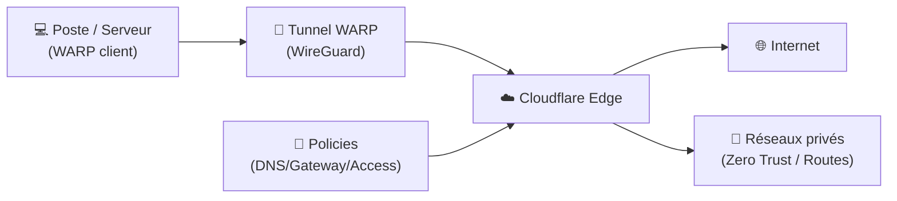
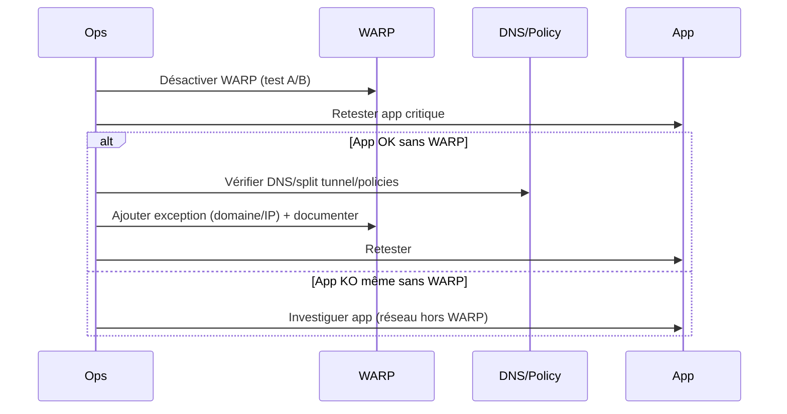

# 🛡️ Cloudflare WARP — Présentation & Configuration Premium (Réseau, Split-Tunnel, ZT, Proxies)

### Client réseau basé sur WireGuard pour sécuriser/optimiser le trafic (Consumer) ou appliquer des politiques (Zero Trust)
Optimisé pour usage poste/serveur • Split tunnel propre • DNS/Policies • Validation & Rollback

---

## TL;DR

- **WARP (Cloudflare)** = client réseau (basé sur **WireGuard**) qui route le trafic via Cloudflare.
- Deux usages distincts :
  - **Consumer WARP** : “VPN-like” simple pour l’utilisateur.
  - **Zero Trust / Cloudflare One** : **politiques d’entreprise** (Gateway, posture, routes privées, contrôles).
- En “premium ops” : **split tunnel**, **DNS**, **proxies (SOCKS/HTTP) si besoin**, **périmètres**, **tests**, **plan de rollback**.

---

## ✅ Checklists

### Pré-configuration (avant de l’activer en prod)
- [ ] Clarifier le mode : **Consumer** vs **Zero Trust**
- [ ] Définir le périmètre : tout le trafic vs **split tunnel**
- [ ] Définir la politique DNS : DoH/DoT, filtrage, logs
- [ ] Identifier les apps sensibles (banque, streaming, SSO, Git, CI/CD)
- [ ] Définir un plan de rollback (désactivation WARP + retour DNS)

### Post-configuration (qualité opérationnelle)
- [ ] Vérifier l’IP egress / DNS effectif (avant/après)
- [ ] Vérifier latence + débit sur 3 sites de référence
- [ ] Vérifier que les apps critiques fonctionnent (SSO, Git, registries, mail)
- [ ] Vérifier split tunnel (ce qui doit sortir “direct” sort direct)
- [ ] Vérifier logs/policies (Zero Trust) si activés

---

> [!TIP]
> **Le split tunnel est la clé** : tu gardes les bénéfices WARP tout en évitant les effets de bord (services qui n’aiment pas le trafic “VPN”).

> [!WARNING]
> WARP peut changer l’egress IP, le chemin réseau et le DNS : certains services peuvent déclencher des protections (geo, anti-bot, risques de MFA plus fréquent).

> [!DANGER]
> Ne déploie pas WARP “global” sur des serveurs critiques sans tests : un mauvais split tunnel / DNS peut casser l’accès à des dépendances (registries, IAM, bases managées).

---

# 1) WARP — Vision moderne

WARP sert à :
- 🔒 Protéger le trafic (tunnel WireGuard)
- 🌍 Standardiser l’egress (sortie Cloudflare)
- 🧠 Appliquer des politiques (Zero Trust) : filtrage DNS, contrôle d’accès, posture device
- 🧩 Offrir des patterns d’usage : **poste utilisateur**, **serveur**, **proxy local** (selon implémentations)

Doc “WARP stable releases” : https://developers.cloudflare.com/cloudflare-one/team-and-resources/devices/warp/download-warp/  
Doc “Linux WARP client” : https://developers.cloudflare.com/warp-client/get-started/linux/

---

# 2) Architecture globale (modes usuels)



---

# 3) Les 2 mondes : Consumer vs Zero Trust

## 3.1 Consumer WARP (simple)
- Objectif : protection + route via Cloudflare, sans gouvernance entreprise.
- Paramètres typiques : on/off, mode DNS, exceptions.

## 3.2 Zero Trust / Cloudflare One (entreprise)
- Objectif : **contrôle** (Gateway, Access, posture, routes privées, egress contrôlé).
- Tu gères :
  - Policies (DNS/HTTP)
  - Split tunnel (inclusions/exclusions)
  - Private network routing (selon architecture)
  - Observabilité (logs)

Point de repère “Private networks accessed by WARP enrolled users” (cloudflared mentionne ce contexte) : https://hub.docker.com/r/cloudflare/cloudflared

---

# 4) Split tunnel (la partie la plus “premium”)

## 4.1 Stratégie recommandée
- **Inclure** ce qui doit être protégé / standardisé (ex: navigation générale, accès SaaS)
- **Exclure** ce qui doit rester local/direct :
  - DNS interne spécifique (si tu as déjà un resolver local)
  - Services LAN (NAS, imprimantes, IoT)
  - Backends qui bloquent IPs “VPN-like”
  - Flux sensibles à la latence (selon contexte)

## 4.2 Heuristique “safe”
- Commencer **par exclusions minimales**, puis ajuster.
- Ajouter des exceptions documentées (qui, pourquoi, impact).

> [!TIP]
> Fais une page “WARP Exceptions” avec : domaine/IP, raison, propriétaire, date, ticket.

---

# 5) DNS & Politiques (éviter les surprises)

## 5.1 DNS : ce qu’il faut cadrer
- Quel resolver final ? (Cloudflare / interne / mix)
- Filtrage (malware, phishing, catégories)
- Logs (Zero Trust) : conformité, conservation, accès

Doc Cloudflare One (WARP download/pistes Zero Trust) : https://developers.cloudflare.com/cloudflare-one/team-and-resources/devices/warp/download-warp/

---

# 6) Pattern “Proxy local” (quand tu veux router UNE app, pas tout)

> Objectif : au lieu de “tunnel système global”, tu exposes un **proxy local** (SOCKS/HTTP) qui sort via WARP (selon l’image/projet choisi), et tu configures uniquement certaines apps pour l’utiliser.

Cas d’usage :
- Contourner des restrictions réseau sur une seule application
- Isoler un flux (indexers, scrapers, CI job) sans impacter le host entier
- Tester sans risque

> [!WARNING]
> Ces images/projets sont **communautaires** (pas “officiel Cloudflare” en Docker). Vérifie le code et maintiens à jour.

Exemple discussion Cloudflare (capabilities nécessaires en conteneur) : https://community.cloudflare.com/t/warp-cli-in-docker/401306

---

# 7) Workflows premium (exploitation)

## 7.1 “Incident : ça marche plus après activation WARP”


## 7.2 “Changements contrôlés”
- Une modification à la fois : DNS **ou** split tunnel **ou** policy
- Test sur un groupe pilote
- Capture “avant/après” (IP, DNS, latence)

---

# 8) Validation / Tests / Rollback

## 8.1 Tests réseau (généraux)
```bash
# IP egress (avant/après)
curl -s https://ifconfig.me ; echo
curl -s https://api.ipify.org ; echo

# DNS observé (rapide)
nslookup example.com
```

## 8.2 Tests applicatifs (smoke)
- Login SSO (Google/Microsoft/IdP)
- Git fetch/push (si dev)
- Accès registry (Docker/OCI) si concerné
- Lecture/écriture sur services managés (S3, DB, etc.)

## 8.3 Rollback (simple, documenté)
- Désactiver WARP côté client
- Revenir au DNS précédent
- Retirer exceptions ajoutées si elles étaient temporaires
- Si Zero Trust : revert policy/split tunnel à la version stable (change log)

> [!TIP]
> “Rollback” doit tenir en **2 minutes** sur poste/serveur. Sinon, tu risques de rester bloqué en incident.

---

# 9) Sources — Images Docker (format brut, comme ton exemple)

## 9.1 Image communautaire la plus citée (WARP client en conteneur)
- `cmj2002/warp-docker` (repo, Docker) : https://github.com/cmj2002/warp-docker  
- Article “Run Cloudflare WARP in Docker” (référence pratique) : https://blog.caomingjun.com/run-cloudflare-warp-in-docker/en/  

## 9.2 Images communautaires “WARP en proxy mode” (SOCKS/HTTP)
- `jerryin/cloudflare-warp` (Docker Hub) : https://hub.docker.com/r/jerryin/cloudflare-warp/tags  
- `taichunmin/cloudflare-warp` (Docker Hub) : https://hub.docker.com/r/taichunmin/cloudflare-warp/  
- `nouchka/cloudflare-warp` (Docker Hub, layers) : https://hub.docker.com/layers/nouchka/cloudflare-warp/latest/images/sha256-90958b123952631e2e0b82ada0e13df02486a95926bd330e5eccbea79beea21a  

## 9.3 Alternative “Warp Socks” (récent dans la recherche Hub)
- Recherche Docker Hub (montre `monius/docker-warp-socks`) : https://hub.docker.com/search?architecture=arm&categories=Security&order=desc&page=4&q=&sort=updated_at&type=image  

## 9.4 LinuxServer.io (LSIO)
- Collection LSIO (vérification catalogue, pas d’image WARP dédiée identifiée ici) : https://www.linuxserver.io/our-images  

---

# ✅ Conclusion

Cloudflare WARP devient “premium” quand tu l’utilises comme **brique réseau gouvernée** :
- split tunnel maîtrisé,
- DNS/policies cohérents,
- pattern proxy local quand tu veux isoler un flux,
- validation + rollback systématiques.

Si tu me confirmes si tu parles bien de **Cloudflare WARP** (et pas “Warp Terminal” ou “Warp 10”), je garde exactement cette structure pour les suivants.