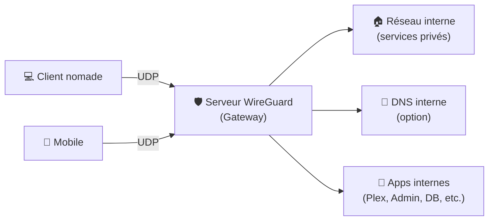
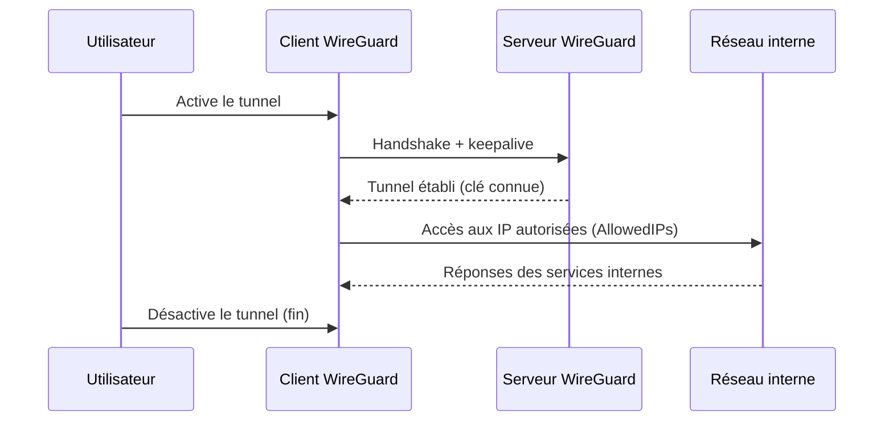

# 🛡️ WireGuard — Présentation & Exploitation Premium (VPN moderne)

### VPN ultra simple, rapide et auditable (cryptographie moderne • config minimale • perf excellente)
Optimisé pour reverse proxy/VPN gateway existant • Accès distant sécurisé • Site-to-site • Exploitation durable

---

## TL;DR

- **WireGuard** est un VPN moderne basé sur une **config très simple** (pairs + clés) et une **surface de code réduite**.
- Il fonctionne avec un modèle **peer-to-peer** : chaque client est un *peer* connu par le serveur (et inversement).
- En “premium ops” : **plan d’adressage propre**, **règles AllowedIPs maîtrisées**, **rotation/gestion des clés**, **DNS interne**, **kill-switch**, **tests + rollback**.

---

## ✅ Checklists

### Pré-configuration (design)
- [ ] Définir le type : **Road-warrior** (clients nomades) / **Site-to-site** / mix
- [ ] Choisir le réseau VPN (ex: `10.6.0.0/24`) + éviter chevauchement avec LAN
- [ ] Décider du routage : **full-tunnel** (tout passe) vs **split-tunnel** (seulement certains réseaux)
- [ ] Choisir DNS : DNS local (Pi-hole/Unbound) ou public
- [ ] Politique clés : génération, stockage, révocation, rotation
- [ ] Politique accès : qui a accès à quoi (LAN, services internes, sous-réseaux)

### Post-configuration (qualité opérationnelle)
- [ ] Un client se connecte et ping une IP interne attendue
- [ ] DNS interne résout correctement (si activé)
- [ ] Split/full-tunnel conforme au besoin (vérifié)
- [ ] Révocation d’un peer testée (désactivation immédiate)
- [ ] Logs et commandes de diagnostic maîtrisés (`wg`, `wg show`)
- [ ] Procédure rollback documentée (retour routage/firewall)

---

> [!TIP]
> La vraie puissance de WireGuard vient d’un bon **plan d’adressage** et d’une maîtrise de **AllowedIPs** (c’est à la fois routage + “ACL” côté peer).

> [!WARNING]
> Un mauvais `AllowedIPs` peut :
> - envoyer du trafic au mauvais endroit,
> - créer des routes parasites,
> - ou exposer des réseaux non prévus.

> [!DANGER]
> N’ajoute jamais “par défaut” `0.0.0.0/0` (full-tunnel) sur un client sans avoir prévu :
> - DNS,
> - kill-switch,
> - et un plan de retour si tu perds l’accès.

---

# 1) WireGuard — Vision moderne

WireGuard n’est pas un “VPN usine à gaz”.

C’est :
- 🧠 Un **modèle simple** : interface + peers
- 🔐 Une **crypto moderne** (sans négociation complexe)
- ⚡ Des **performances élevées** (latence faible, rapide)
- 🧩 Une **intégration OS-native** (Linux kernel, clients sur Windows/macOS/mobile)

---

# 2) Architecture globale (road-warrior + accès LAN)



---

# 3) Concepts clés (à connaître pour ne jamais “se surprendre”)

## 3.1 Peers & clés
- Chaque peer a :
  - **clé privée** (à garder secrète)
  - **clé publique** (à partager)
- Auth = **connaissance de la clé publique** + cryptographie : pas de mot de passe.

## 3.2 Endpoint
- Un peer peut définir un `Endpoint` (IP:port du serveur).
- Côté serveur, l’endpoint est souvent “appris” via le trafic sortant du client (NAT friendly).

## 3.3 AllowedIPs (le cœur)
- `AllowedIPs` dit : **quels réseaux passent dans le tunnel vers ce peer**.
- C’est :
  - un **routage** (routes),
  - et une **limite** sur ce qu’un peer peut annoncer/recevoir.

Exemples (logique) :
- Split tunnel vers LAN uniquement : `AllowedIPs = 10.0.0.0/24, 10.6.0.2/32`
- Full tunnel : `AllowedIPs = 0.0.0.0/0, ::/0`

---

# 4) Plan d’adressage premium (simple et scalable)

## Recommandation “pro”
- Réseau VPN dédié : `10.6.0.0/24`
- Serveur WG : `10.6.0.1`
- Clients : `10.6.0.10`, `.11`, `.12`…

Règles :
- 1 IP / peer (en `/32`)
- éviter chevauchement avec LAN/WAN
- documenter : IP ↔ user ↔ device ↔ date ↔ statut (actif/révoqué)

---

# 5) Modes d’usage (avec pièges & bonnes pratiques)

## 5.1 Road-warrior (nomades)
Objectif : accès à des ressources internes depuis extérieur.

Bonnes pratiques :
- Split tunnel par défaut (moins de surprises)
- Full tunnel seulement si tu veux :
  - filtrer/sécuriser le trafic client,
  - protéger sur Wi-Fi public,
  - forcer DNS interne.

## 5.2 Site-to-site
Objectif : relier deux LAN (ex: maison ↔ VPS / bureau ↔ DC).

Bonnes pratiques :
- Réseaux clairement séparés (LAN A, LAN B, VPN)
- AllowedIPs stricts (uniquement les subnets nécessaires)
- Routes symétriques + test ICMP + test applicatif

---

# 6) DNS & Résolution (le confort “premium”)

Options :
- **DNS interne** (recommandé) : noms courts, services internes, split-horizon
- **DNS public** : simple, mais pas de résolution interne

Approche premium :
- pousser un DNS interne aux clients (selon plateforme)
- avoir une convention de noms (ex: `svc1.home`, `nas.home`, `grafana.home`)
- valider :
  - résolution OK
  - pas de fuite DNS involontaire (si full tunnel)

---

# 7) Sécurité opérationnelle (sans recettes d’installation)

## 7.1 Gestion des clés (discipline)
- Générer les clés sur la machine client quand possible
- Stocker la clé privée de façon sûre (keystore/secret manager)
- Révocation = supprimer/désactiver le peer côté serveur
- Rotation :
  - device perdu → rotation immédiate
  - politique annuelle (option) selon criticité

## 7.2 Principe du moindre privilège
- AllowedIPs = ce que le peer doit atteindre, pas plus
- Segmenter par groupes :
  - “Support” : accès limité
  - “Ops” : accès large
  - “Read-only” : services seulement

---

# 8) Workflow premium (connexion + accès contrôlé)



---

# 9) Validation / Tests / Rollback

## 9.1 Tests (diagnostic rapide)
```bash
# État des peers, handshake, transfert
wg show

# Voir l’interface et les routes
ip a
ip route

# Ping d'une IP VPN (ex: serveur)
ping -c 3 10.6.0.1

# Ping d'une ressource LAN (ex: 10.0.0.10)
ping -c 3 10.0.0.10

# Test DNS (si DNS interne)
getent hosts nas.home || true
```

## 9.2 Tests “split vs full tunnel”
```bash
# IP publique (doit être celle du client en split, du serveur en full)
curl -s https://ifconfig.me ; echo
```

## 9.3 Rollback (plan simple)
- Si perte d’accès :
  - désactiver le tunnel côté client
  - revenir aux routes précédentes
- Si un peer pose problème :
  - retirer son entrée côté serveur (révocation immédiate)
- Si un changement AllowedIPs casse le routage :
  - revenir à la dernière config “connue stable”
  - retester ping + DNS + accès applicatif

> [!TIP]
> Avoir une “config stable” versionnée (Git privé) + un changelog = énorme gain en incident.

---

# 10) Erreurs fréquentes (et comment les reconnaître)

- **Handshake OK mais pas d’accès LAN**  
  → routes/forwarding/NAT manquants, AllowedIPs trop stricts, ou firewall LAN.
- **DNS ne marche pas**  
  → DNS non poussé aux clients, split-horizon absent, fuite DNS.
- **Perte d’Internet en full tunnel**  
  → DNS ou routage incomplet, kill-switch mal conçu, NAT manquant côté serveur.
- **Chevauchement de subnets**  
  → VPN et LAN dans la même plage : comportements imprévisibles.

---

# 11) Images Docker — sources (format demandé, URLs brutes)

## 11.1 Image officielle WireGuard (utilitaire / userspace)
- `wireguardtools/wireguard` (Docker Hub) : https://hub.docker.com/r/wireguardtools/wireguard  
- Repo (référence de l’image) : https://github.com/WireGuard/wireguard-tools  

## 11.2 Image LinuxServer.io (très utilisée en homelab)
- `lscr.io/linuxserver/wireguard` (référence) : https://docs.linuxserver.io/images/docker-wireguard/  
- `linuxserver/wireguard` (Docker Hub) : https://hub.docker.com/r/linuxserver/wireguard  
- Liste “Our Images” (référence LSIO) : https://www.linuxserver.io/our-images  

## 11.3 Références officielles WireGuard
- Site officiel (docs générales) : https://www.wireguard.com/  
- Quick start : https://www.wireguard.com/quickstart/  
- Repo principal : https://github.com/WireGuard  

---

# ✅ Conclusion

WireGuard est “premium” quand :
- ton plan d’adressage est propre,
- AllowedIPs sont stricts et compréhensibles,
- DNS/routage sont testés,
- la révocation et le rollback sont immédiats.

Résultat : un accès distant **simple, rapide, et maîtrisé**.