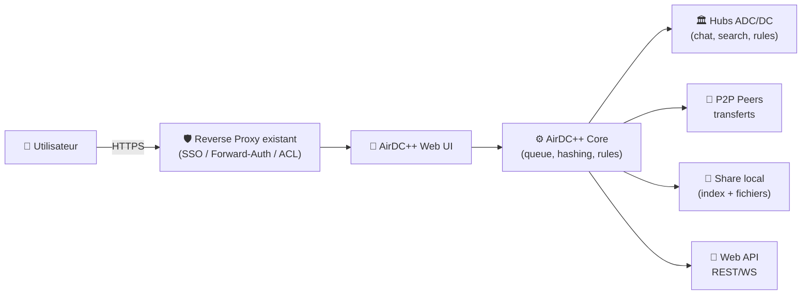
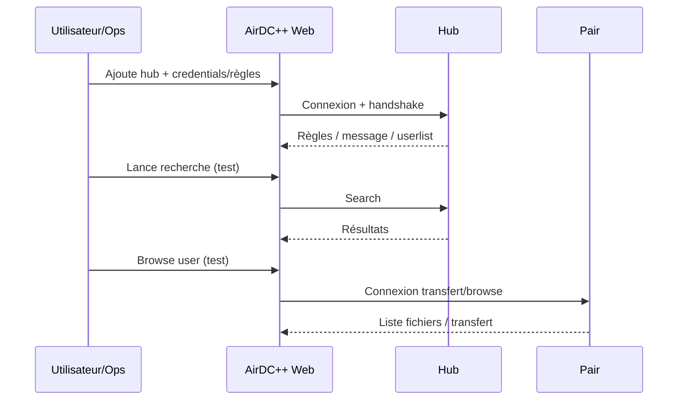

# 🔌 AirDC++ (Web Client) — Présentation & Exploitation Premium (ADC / DC)

### Client “hub-centric” pour communautés de partage : search, browse, queue, hashing, automatisation
Optimisé pour reverse proxy existant • Qualité de partage • Performance durable • Gouvernance & sécurité d’accès

---

## TL;DR

- **AirDC++ Web Client** est un client **ADC/DC** pilotable via une **UI web**, conçu pour partager des fichiers au sein de **communautés (hubs)**, avec recherche, browsing des shares, files d’attente, hashing, et automatisations. :contentReference[oaicite:0]{index=0}  
- Il excelle quand tu définis : **structure de share**, **règles de slots/vitesse**, **connectivité** (modes actif/passif), **hygiène de hubs** et **procédures d’exploitation**. :contentReference[oaicite:1]{index=1}  
- Ce n’est pas un “indexeur” type torrent/usenet : le modèle est **réseau social de partage** + hubs, avec contraintes (règles de hub, qualité de nommage, ratio/slots selon communautés).

---

## ✅ Checklists

### Pré-mise en service (qualité de base)
- [ ] Définir l’objectif : **LAN privé**, **communauté restreinte**, ou **hubs publics**
- [ ] Définir une **structure de share** (dossiers stables, noms propres, exclusions)
- [ ] Choisir ton mode réseau : **Actif** (idéal) vs **Passif** (fallback)
- [ ] Fixer une politique **slots / vitesses / limites** (pour éviter le “bruit”)
- [ ] Définir la gouvernance : hubs favoris, auto-connect, règles de chat, blacklist
- [ ] Définir une stratégie d’accès UI : **auth** (SSO/forward-auth) + réseau privé/VPN

### Post-configuration (validation opérationnelle)
- [ ] Connexion à 1 hub test + chat OK
- [ ] Search + browse share d’un autre user OK
- [ ] Download d’un petit fichier : queue, transfert, intégrité OK
- [ ] Hashing et scans : temps acceptable, CPU/IO maîtrisés
- [ ] Journaux : erreurs récurrentes absentes (reconnect loop, TLS, NAT)
- [ ] Procédure rollback (config/identity/share) documentée + testée

---

> [!TIP]
> La “qualité” sur DC++ vient surtout de : **share propre**, **noms propres**, **slots raisonnables**, **actif si possible**, et **hubs bien choisis**.

> [!WARNING]
> Les logs/partages peuvent contenir des infos sensibles (noms de dossiers, métadonnées). Traite l’accès UI comme un **accès privilégié**.

> [!DANGER]
> Éviter les “shares géantes” non maîtrisées : risque de leaks (documents perso), hashing interminable, performances dégradées.

---

# 1) Vision moderne

AirDC++ Web Client n’est pas un simple téléchargeur.

C’est :
- 🏛️ Un **client réseau** (ADC/DC) centré hubs (communautés, règles, discovery)
- 🔎 Un **moteur de recherche** multi-sources (hubs, users) + browsing
- 📥 Un **gestionnaire de queue** (priorités, bundles, dupes, auto-search)
- 🧠 Un **moteur d’index local** (hashing) pour partager efficacement
- 🔌 Une **API Web** (REST/WebSocket) pour intégration et automatisation :contentReference[oaicite:2]{index=2}  

Référence projet : :contentReference[oaicite:3]{index=3}

---

# 2) Architecture globale



---

# 3) Concepts clés (pour une config “pro”)

## 3.1 Hubs, identité, règles
- Un **hub** = point de rencontre : chat, annonce, recherche/browse (selon protocole/paramétrage). :contentReference[oaicite:4]{index=4}  
- Chaque hub peut imposer : naming, slots min, share min, comportement, etc.

## 3.2 Hashing / index local
- Pour partager, le client calcule un index (hashing) : c’est ce qui rend la recherche/browse et l’intégrité efficaces.
- Impacts : CPU/IO → à planifier (heures creuses), à limiter (exclusions, structure).

## 3.3 Actif vs passif (connectivité)
- **Actif** (recommandé) : tu acceptes des connexions entrantes (meilleures performances).
- **Passif** : plus simple derrière NAT strict, mais limitations (recherche/connexions selon hubs).

> [!TIP]
> “Premium” = viser **actif** dès que possible, sinon passif maîtrisé + hubs compatibles.

---

# 4) Configuration premium (sans “install”, uniquement principes & réglages)

## 4.1 Share design (structure & hygiène)
Objectifs :
- browsing clair
- exclusions sûres
- hashing rapide
- pas de contenu involontaire

Recommandation “pro” :
- un dossier racine par domaine (ex: Films / Séries / Musique / DocsPublic)
- exclure : dossiers temporaires, caches, `@eaDir`, `.DS_Store`, fichiers incomplets, backups

Checklist share :
- [ ] pas de “home” complet
- [ ] pas de dossiers perso
- [ ] structure stable (pas de renommage massif en continu)
- [ ] politique de mise à jour (scan) raisonnable

## 4.2 Recherche & qualité des résultats
- Favoriser des conventions de nommage stables (titre/année/saison/épisode)
- Utiliser des filtres “bundles”/catégories si disponibles
- Définir une stratégie anti-dup : préférer sources “stables” (users fiables / hubs fiables)

## 4.3 Queue & transferts
- Priorités : “now / soon / later” (éviter 10 000 items en haute priorité)
- Bundles : privilégier bundles cohérents (ex: saison complète)
- Limites : éviter d’ouvrir trop de connexions simultanées

> [!WARNING]
> Trop d’agressivité (slots/connexions) → ban hub / throttling / instabilité.

## 4.4 Sécurité d’accès (sans recettes firewall)
- Accès UI : **auth forte** (SSO/forward-auth) + **réseau privé/VPN** si possible
- Journalisation : garder les logs exploitables sans exposer d’infos sensibles
- Mises à jour : cadence régulière (le web UI est une surface d’attaque)

---

# 5) Workflows premium (ops & incidents)

## 5.1 Onboarding “hub” (séquence)


## 5.2 “Triage” quand ça ne télécharge plus
- vérifier : hub connecté ? userlist ? search répond ?
- vérifier : mode actif/passif + compat hub
- vérifier : slots dispo côté peer + queue bloquée ?
- vérifier : erreurs TLS / reconnect loop / timeouts
- vérifier : hashing/scans en cours qui saturent IO

---

# 6) Validation / Tests / Rollback

## Smoke tests (rapides)
```bash
# 1) Vérifier que l'UI répond (selon ton URL)
curl -I https://airdcpp.example.tld | head

# 2) Vérifier l'API (si exposée via même origine / token)
# (Le détail dépend de ta config d'auth/API ; l'idée est de valider qu'un endpoint répond.)
curl -s https://airdcpp.example.tld/api/ | head -n 20
```

## Tests fonctionnels (manuels mais indispensables)
- rejoindre 1 hub test
- search sur un terme connu
- browse un user
- télécharger 1 petit fichier
- vérifier intégrité + emplacement + logs

## Rollback (principes)
- sauvegarder / versionner :
  - identité / settings
  - hubs favoris & règles
  - configuration de share & exclusions
- en cas de régression :
  - revenir à la config précédente
  - désactiver temporairement nouveautés (auto-search, scans agressifs)
  - revalider sur un hub test

---

# 7) Erreurs fréquentes (et fixes)

- ❌ Share trop large / involontaire → réduire, exclure, rehasher planifié
- ❌ Hashing interminable → structurer + exclure + planifier scans
- ❌ Reconnect loop hub → vérifier creds/règles/TLS + compat protocole :contentReference[oaicite:5]{index=5}  
- ❌ Mode passif sur hub “actif only” → changer de hub ou corriger connectivité
- ❌ Queue “bloquée” → trop d’items/priorités, pairs indispo, slots limités

---

# 8) Sources — Images Docker (comme demandé)

## Officiel / projet
- Documentation officielle AirDC++ Web Client (projet & usage) : :contentReference[oaicite:6]{index=6}  
- Doc “Installation” : **pas d’image Docker officielle** (tiers uniquement) : :contentReference[oaicite:7]{index=7}  
- Web API (référence) : :contentReference[oaicite:8]{index=8}  

## Images Docker tierces (exemples courants)
- `gangefors/airdcpp-webclient` (Docker Hub) : :contentReference[oaicite:9]{index=9}  
- `padhihomelab/airdcpp` (Docker Hub) : :contentReference[oaicite:10]{index=10}  

## LinuxServer.io (LSIO)
- Liste officielle des images LinuxServer.io (AirDC++ Web Client n’y apparaît pas comme image supportée) : :contentReference[oaicite:11]{index=11}  
- On peut trouver des traces anciennes/non officielles dans l’écosystème Docker (ex: `lsiodev/airdcppd` listé dans la recherche), mais ce n’est pas une image LSIO “officielle” actuelle : :contentReference[oaicite:12]{index=12}  

---

# ✅ Conclusion

AirDC++ Web Client devient “premium” quand tu :
- maîtrises le **share** (structure + exclusions),
- choisis des **hubs** adaptés,
- règles **queue/slots** intelligemment,
- sécurises l’accès UI via ton reverse proxy existant,
- et maintiens une discipline tests/rollback.

C’est une brique puissante pour du partage communautaire — à condition de la gouverner comme un service.