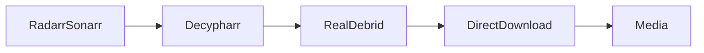
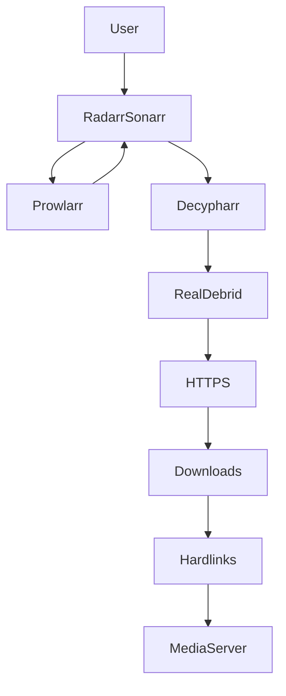

# 🧠 Decypharr — Intégration Debrid Intelligente pour l’écosystème *arr

!!! abstract ""
    **Connectez Radarr & Sonarr aux services Debrid intelligemment.**  
    Real-Debrid • Automatisation • Streaming optimisé • Docker-ready

---

# 🎯 Qu’est-ce que Decypharr ?

Decypharr est un connecteur permettant d’intégrer des services Debrid (comme Real-Debrid) directement dans l’écosystème *arr :

- Radarr
- Sonarr
- (via Prowlarr selon configuration)

Il agit comme :

> 🔄 Une passerelle entre les indexeurs et Real-Debrid.

Contrairement à un client torrent classique :

- ❌ Pas de seed
- ❌ Pas d’exposition P2P
- ✅ Téléchargement via Debrid
- ✅ Automatisation complète

---

# 🧠 Rôle dans SSDv2

Architecture simplifiée :



Decypharr :

- Intercepte les requêtes *arr
- Vérifie disponibilité Debrid
- Retourne un lien direct
- Optimise l’acquisition

---

# 🏗️ Architecture Complète



---

# ⚙️ Configuration Complète

---

# 🔑 1️⃣ API Debrid

Dans Real-Debrid :

- Générer un API Token

Dans Decypharr :

- Coller le token
- Tester connexion
- Vérifier statut API

---

# 📂 2️⃣ Dossiers

Structure recommandée SSDv2 :

```
/data/
    downloads/
    media/
```

Download path :

```
/data/downloads
```

⚠️ Même filesystem que `/data/media` pour hardlinks.

---

# 🔗 3️⃣ Intégration Radarr / Sonarr

Dans Download Client :

- Type compatible HTTP / torrent API
- Host : decypharr
- Port : interne Docker
- Category : movies / series

Activer :

- ✅ Completed Download Handling
- ✅ Hardlinks

---

# ⚙️ 4️⃣ Paramètres recommandés

## Général

- Auto-clean activé
- Retry activé
- Polling interval raisonnable (60–120s)

## Fichiers

- Auto-select activé
- Ignorer samples
- Prioriser qualité complète

---

# 🔐 5️⃣ Sécurisation

Architecture recommandée :


Recommandations :

- HTTPS obligatoire
- Pas d’exposition directe
- CrowdSec possible
- Firewall actif

---

# ⚡ 6️⃣ Performance

Decypharr est léger :

- RAM faible (<300MB)
- CPU minimal
- I/O dépend du download

Optimisé pour VPS modeste.

---

# 🛡️ 7️⃣ Sécurité & Confidentialité

Avantages Debrid :

- Pas de seed
- IP non exposée
- Téléchargement HTTPS
- Pas de port torrent ouvert

---

# 📊 8️⃣ Comparatif

| Fonction | qBittorrent | RDTClient | Decypharr |
|----------|-------------|-----------|-----------|
| P2P | ✅ | ❌ | ❌ |
| HTTPS direct | ❌ | ✅ | ✅ |
| Seed | ✅ | ❌ | ❌ |
| Intégration arr | Native | Compatible | Native Debrid |
| Simplicité | Moyenne | Élevée | Très élevée |

---

# 🚨 Erreurs fréquentes

❌ API Token invalide  
❌ Mauvais mapping Docker  
❌ Hardlinks non activés  
❌ Exposition publique  
❌ Mauvaise catégorie  

---

# 📈 Cas d’usage idéal

Decypharr est idéal si :

- Vous utilisez Real-Debrid exclusivement
- Vous ne voulez pas gérer de client torrent
- Vous souhaitez simplifier le pipeline
- Vous privilégiez HTTPS direct

---

# 💎 Avantages dans SSDv2

<div class="features-grid">

<div class="feature-card">
<h3>🔐 Confidentialité</h3>
<p>Pas d’exposition P2P.</p>
</div>

<div class="feature-card">
<h3>⚡ Simplicité</h3>
<p>Pipeline simplifié.</p>
</div>

<div class="feature-card">
<h3>🐳 Docker</h3>
<p>Isolation propre.</p>
</div>

<div class="feature-card">
<h3>🔗 Automatisation</h3>
<p>Intégration native *arr.</p>
</div>

</div>

---

# 🎯 Conclusion

Decypharr dans SSDv2 permet :

⚡ Acquisition optimisée  
🔐 Sécurité renforcée  
📦 Intégration transparente  
🐳 Déploiement Docker propre  
🧠 Simplification du pipeline  

Ce n’est pas juste un outil.

C’est une **couche d’intelligence Debrid intégrée à l’écosystème *arr moderne**.