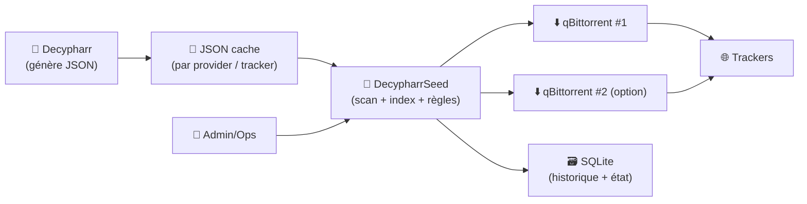
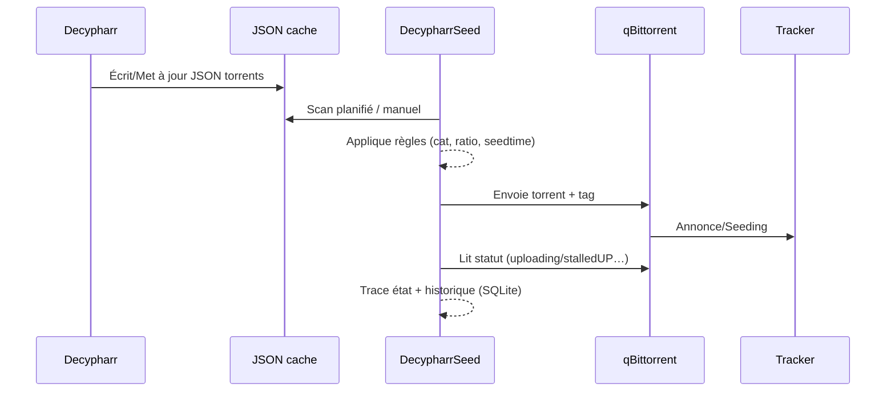

# 🌱 DecypharrSeed — Présentation & Exploitation Premium

### Seeder & orchestrateur minimaliste pour les torrents “utilisés” par Decypharr (à partir de JSON)
Optimisé pour seedbox / environnements multi-clients • Règles par tracker • Traçabilité • Exploitation durable

---

## TL;DR

- **DecypharrSeed** lit des **fichiers JSON** (issus de **Decypharr** et potentiellement d’outils équivalents) pour **centraliser** et **piloter** le seeding.
- Il apporte : **indexation**, **statuts**, **règles par tracker** (catégorie, ratio, seedtime), **envoi vers qBittorrent**, **tableau de bord**, **sauvegarde SQLite**.
- Version “premium ops” = **conventions**, **règles propres**, **contrôle d’accès**, **tests**, **rollback**, et surtout : **cohérence des entrées JSON**.

---

## ✅ Checklists

### Pré-usage (avant de brancher en prod)
- [ ] Tes JSON sont bien produits (format stable, chemins/URLs cohérents)
- [ ] Tu sais *qui* est autorisé à “envoyer” (UI = action potentiellement impactante)
- [ ] Tu as une convention de règles par tracker (cat/ratio/seedtime)
- [ ] Tu as défini la politique “auto-envoi” (global vs par tracker)
- [ ] Tu as validé que tes clients qBittorrent sont joignables et correctement séparés (tags/catégories)

### Post-configuration (qualité opérationnelle)
- [ ] Scan + indexation sans erreurs
- [ ] Un torrent “test” passe de “jamais seedé” → “en seed”
- [ ] Les règles par tracker s’appliquent (catégorie / seedtime / ratio)
- [ ] Les statuts remontent correctement (uploading, stalledUP, etc.)
- [ ] Les sauvegardes SQLite + rétention sont effectives et restaurables

---

> [!TIP]
> La meilleure config DecypharrSeed n’est pas “plein de features”, c’est : **règles simples**, **tags standards**, **séparation claire** des trackers/clients, et **validation systématique**.

> [!WARNING]
> Si Decypharr est configuré pour **retirer l’annonce des .torrents** (pas d’announce/tracker), alors **seeder devient inutile** et DecypharrSeed peut devenir **inopérant** car il se base sur ces URLs. (Voir README DecypharrSeed.)

> [!DANGER]
> N’ouvre jamais l’UI à des utilisateurs non maîtrisés : “envoyer” un torrent vers un client, c’est une action **à impact** (quota, ratio, stockage, politique tracker).

---

# 1) DecypharrSeed — Rôle dans un écosystème *arr / debrid / seedbox

DecypharrSeed se place comme une **brique de “seeding management”** :

- 📥 Il **consomme** des JSON (produits par Decypharr)
- 🧠 Il **décide** via des règles (par tracker)
- 🚀 Il **pousse** vers un ou plusieurs clients (qBittorrent)
- 📊 Il **observe** (statuts, volume, historique)
- 🗃️ Il **trace** (SQLite + sauvegardes)

---

# 2) Architecture globale



---

# 3) Ce que DecypharrSeed apporte “en premium”

## 3.1 Scan & Indexation
- Analyse automatique des JSON
- Regroupement par tracker d’origine
- Vue claire : nom, taille, date, statut, client associé
- Tri + filtres instantanés

## 3.2 Intégration qBittorrent (multi-clients)
- Ajout auto / manuel de torrents
- Application automatique :
  - catégories (par règle)
  - limites ratio/seedtime
  - tag universel (ex: `DecypharrSeed`)
- Détection temps réel des torrents actifs (`uploading`, `stalledUP`, etc.)
- Lien direct vers l’interface du client

## 3.3 Règles & automatisations
- Règles par tracker (catégorie, ratio, seedtime)
- Auto-scan planifié
- Auto-envoi configurable (global ou par tracker)
- Sauvegarde SQLite quotidienne + rétention

---

# 4) “Premium config mindset” (5 piliers)

1. 🧾 **Entrées fiables** : JSON propres, stables, nommage cohérent
2. 🏷️ **Règles minimales** : une règle par tracker (au départ)
3. 🧩 **Séparation** : trackers ≠ catégories ≠ tags (ne pas tout mélanger)
4. 🔁 **Automatisation prudente** : auto-envoi seulement sur périmètre maîtrisé
5. 🧪 **Validation & rollback** : tests simples + retour arrière documenté

---

# 5) Règles par tracker — Stratégie recommandée

## Modèle simple (robuste)
Pour chaque tracker :
- **Catégorie** : `trackername` ou `private`
- **Seedtime** : valeur conforme à ta politique (ex: 48h/72h/120h)
- **Ratio** : valeur conforme à ta politique (ex: 1.0 / 2.0)

> [!TIP]
> La stratégie qui marche bien : **catégories par tracker** + **tag unique global**.  
> Tu gardes une lecture claire dans qBittorrent et tu simplifies les audits.

## Anti-chaos : conventions à poser dès le début
- Catégories : minuscules, sans espaces (`tracker_x`, `tracker_y`)
- Tag : unique et stable (`DecypharrSeed`)
- Multi-clients : un client “prod seed”, un client “test”, un client “buffer” si besoin

---

# 6) Workflows premium (opérations)

## 6.1 Du JSON au seeding (séquence)


## 6.2 Mode “Auto-envoi” (à activer proprement)
- Commence par **manuel** (validation)
- Active l’auto-envoi **par tracker** (pas global)
- Ajoute un “périmètre test” :
  - 1 tracker
  - 1 client qBittorrent
  - 10 torrents max
- Puis étends progressivement

> [!WARNING]
> Auto-envoi global trop tôt = risques de flood, quotas, mauvaise catégorisation, et incidents de ratio.

---

# 7) Validation / Tests / Rollback

## 7.1 Tests de validation (smoke tests)
```bash
# Réseau / santé (adapte l'URL/port)
curl -I http://DECAIPHARRSEED_HOST:PORT | head

# Vérifier que le JSON directory attendu contient bien des fichiers
ls -lah /path/to/json_dir | head

# Vérifier qu'au moins un torrent "test" est détecté (contrôle visuel dans l'UI)
# (manuel) UI -> filtre tracker -> doit afficher les entrées
```

## 7.2 Tests fonctionnels (doivent passer)
- Scan → torrents listés
- “Envoi” d’un torrent test → apparaît dans qBittorrent
- Les règles s’appliquent :
  - catégorie correcte
  - tag présent
  - ratio/seedtime appliqués (si configurés)
- Statut remonte correctement dans DecypharrSeed

## 7.3 Rollback (simple et sûr)
- Désactiver auto-envoi (si actif)
- Retirer/figer les règles d’un tracker problématique
- Revenir à l’état précédent via restauration SQLite + re-scan
- En qBittorrent :
  - supprimer uniquement la tâche torrent (sans supprimer les données) si nécessaire
  - ou déplacer la catégorie pour “quarantaine”

> [!DANGER]
> Quand tu “rollback”, évite de supprimer des fichiers/data à chaud : privilégie le rollback applicatif (règles/auto-envoi) + correction, puis reprise.

---

# 8) Erreurs fréquentes (et fixes)

## “Rien n’apparaît”
Causes :
- mauvais chemin vers le répertoire JSON
- JSON vides / format inattendu
Fix :
- vérifier le répertoire scanné
- valider qu’un JSON récent est bien écrit par Decypharr

## “Statuts qBittorrent incohérents”
Causes :
- mauvaise cible client
- plusieurs clients avec mêmes torrents
Fix :
- séparer clients et catégories
- standardiser tags/catégories

## “Auto-envoi qui part en vrille”
Cause :
- auto-envoi global + règles trop larges
Fix :
- repasser en manuel
- activer par tracker
- limiter le périmètre

---

# 9) Sources — adresses (en bash, sans liens “douteux”)

```bash
# Repo officiel DecypharrSeed (README, features, avertissements)
https://github.com/Aerya/DecypharrSeed

# Image container publiée par l’auteur (GitHub Packages)
https://github.com/Aerya/DecypharrSeed/pkgs/container/decypharrseed

# URL de pull (registre) mentionnée par l’auteur
ghcr.io/aerya/decypharrseed:latest

# Repo Decypharr (contexte : générateur/usage autour des *arr)
https://github.com/sirrobot01/decypharr

# Discussion contextuelle (mention DecypharrSeed par l’auteur dans un fil)
https://upandclear.org/2025/07/04/streaming-a-la-carte-sans-stockage-rdt-client-rclone-zurg-debrideurs-et-torrenting/
```

---

# ✅ Conclusion

DecypharrSeed, en “premium ops”, c’est :
- des **JSON fiables** en entrée,
- une **gouvernance par tracker** (règles simples),
- une **séparation claire** (tags/catégories/clients),
- des **tests systématiques**,
- un **rollback** documenté.

Résultat : un seeding **maîtrisé**, **traçable** et **maintenable**.