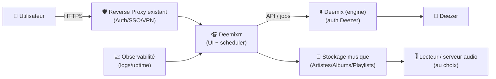
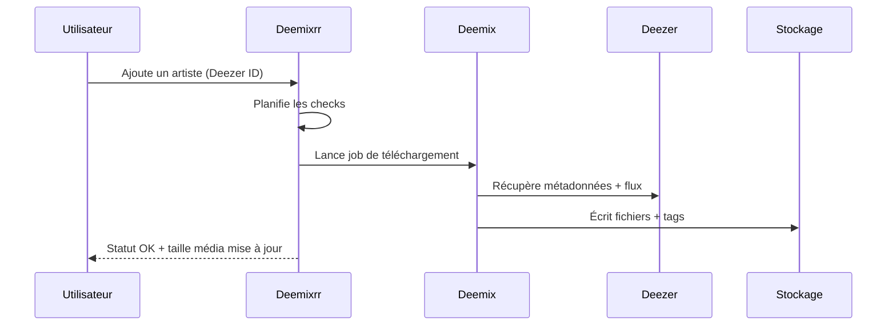

# 🎧 Deemixrr — Présentation & Configuration Premium (Automation Deezer)

### Gestion automatique d’artistes & playlists (mises à jour, téléchargements, rangement)
Optimisé pour reverse proxy existant • Qualité maîtrisée • Organisation durable • Exploitation pro

---

## TL;DR

- **Deemixrr** automatise le suivi de tes **artistes** et **playlists** : il surveille et télécharge les nouveaux titres/albums.
- Il s’appuie sur l’écosystème **Deezer / deemix** (auth Deezer requise côté deemix).
- Une config “premium” = **bibliothèque propre**, **règles qualité claires**, **planification raisonnable**, **logs exploitables**, **rollback**.

> [!WARNING]
> Le dépôt indique que le projet a eu/peut avoir des phases “non fonctionnelles” selon l’état amont (Deezer/deemix). Avant d’industrialiser, fais un POC sur 1 artiste + 1 playlist et vérifie le cycle complet.  
> Source : README du dépôt. :contentReference[oaicite:0]{index=0}

---

## ✅ Checklists

### Pré-configuration (avant d’ajouter 200 artistes)
- [ ] Chemins de stockage définis (même filesystem si tu fais des moves/hardlinks ailleurs)
- [ ] Convention de nommage des dossiers (Artiste/Album)
- [ ] Règles qualité (FLAC vs MP3, bitrate, tags) actées
- [ ] Stratégie “mises à jour” (fréquence + limite de requêtes)
- [ ] Accès sécurisé via reverse proxy existant (auth/SSO/VPN) + pas d’exposition brute

### Post-configuration (validation “ready for prod”)
- [ ] Un artiste test : ajout → téléchargement → fichiers présents → tags OK
- [ ] Une playlist test : ajout → sync → nouveaux titres téléchargés
- [ ] Logs sans boucle d’erreurs (auth Deezer, rate limit, path)
- [ ] Routine de backup/restore validée (config + DB selon ton setup)
- [ ] Runbook incident : “quoi regarder en premier” (logs, auth, providers)

---

> [!TIP]
> Deemixrr devient vraiment “premium” quand tu appliques **3 règles** :
> 1) chemins stables, 2) conventions de nommage, 3) fréquence de sync réaliste.

> [!DANGER]
> Ne le rends pas accessible publiquement sans contrôle d’accès : l’UI + les paramètres + les logs peuvent exposer des infos sensibles (chemins, IDs, erreurs, etc.).

---

# 1) Deemixrr — Vision moderne

Deemixrr n’est pas un simple downloader.

C’est :
- 🧠 un **gestionnaire** d’artistes/playlists
- 🔄 un **orchestrateur de mises à jour** (nouveaux albums/titres)
- 🗂️ un **ranger** (emplacements par artiste/playlist)
- 📏 un **outil de pilotage** (taille média, statut, suivi)

Liste “What Deemixrr does for you” : gestion artistes/playlists, updates automatiques, choix d’emplacement, ajout par Deezer ID, etc. :contentReference[oaicite:1]{index=1}

---

# 2) Architecture globale



---

# 3) Philosophie de configuration (premium)

## 5 piliers
1. 🎯 **Qualité** : FLAC/MP3, bitrate, normalisation des attentes
2. 🗂️ **Organisation** : structure dossier + conventions + tags cohérents
3. 🔄 **Planification** : fréquence réaliste, éviter le spam Deezer
4. 🧪 **Validation** : tests sur cas simples, avant “mass import”
5. 🛡️ **Sécurité d’accès** : reverse proxy existant + auth (pas d’accès brut)

---

# 4) Modèle de données (comment penser Deemixrr)

## Deux objets principaux
- **Artistes** : “je veux tout ce qui sort”
- **Playlists** : “je veux refléter une sélection” (sync / delta)

## Stratégie premium recommandée
- Utilise **Artistes** pour la discographie / nouveautés
- Utilise **Playlists** pour :
  - “Découvertes”
  - “Top du moment”
  - “Curations perso”
- Évite de dupliquer : si une playlist recopie un artiste déjà suivi, définis une règle de priorité (ex: playlist = exceptions/bonus)

---

# 5) Organisation des fichiers (critique)

## Structure conseillée (lisible et durable)
Exemple générique :

```
/music/
  Artists/
    Artist Name/
      2024 - Album Title/
        01 - Track Title.flac
  Playlists/
    Playlist Name/
      Artist - Track Title.flac
```

> [!WARNING]
> Le vrai “premium” = **stabilité des chemins**. Si tu changes le chemin racine après coup, tu te crées un enfer (réindex, doublons, confusions).

## Tags & métadonnées (qualité perçue)
Objectifs :
- Artiste/Album/Piste corrects
- Cover correcte
- Année / track number cohérents
- Codec/bitrate conforme à ta stratégie

Astuce :
- Fais un audit sur 20 fichiers : si tu corriges manuellement souvent, tes règles qualité ne sont pas bonnes (ou ta source est instable).

---

# 6) Qualité & stratégie audio (décisions “pro”)

## Profil “Audiophile raisonnable”
- FLAC si disponible
- Sinon MP3 320kbps
- Pas de “bitrate lottery” : tu veux un résultat prévisible

## Profil “Storage friendly”
- MP3 320 (ou V0)
- Pas de FLAC (sauf exceptions)
- Politique anti-doublons stricte

> [!TIP]
> Le meilleur choix est celui que tu peux maintenir : la constance > l’optimisation théorique.

---

# 7) Planification (scheduler) & anti-boucles

## Pourquoi c’est important
- Trop de sync = erreurs, rate-limit, instabilité
- Pas assez = tu perds l’intérêt “automation”

## Rythme conseillé (point de départ)
- Sync artistes : 1 à 2 fois / jour
- Sync playlists : 2 à 6 fois / jour (si playlists très actives)
- “Full rescan” : hebdomadaire (ou mensuel) si nécessaire

> [!WARNING]
> Si tu vois des erreurs récurrentes d’auth ou de rate-limit, **réduis la fréquence** avant de “forcer”.

---

# 8) Workflows premium (exploitation)

## Cycle “nouvelle sortie artiste”


## Runbook “incident” (ordre de triage)
1. Logs Deemixrr : erreurs d’app, DB, jobs
2. Logs deemix : auth Deezer / timeouts
3. Vérifier le chemin de sortie : droits + espace disque
4. Réduire la fréquence si boucle d’erreurs
5. Tester sur **un seul** artiste

---

# 9) Validation / Tests / Rollback

## Smoke tests (rapides)
```bash
# 1) Le service répond (adapter host/port)
curl -I http://DEEMIXRR_HOST:PORT | head

# 2) Les logs montrent un démarrage propre (adapter la commande à ton runtime)
# Exemple Docker:
docker logs --tail=200 deemixrr 2>/dev/null || true
```

## Tests fonctionnels (à faire dans l’UI)
- Ajouter 1 artiste (Deezer ID) → lancer update → vérifier un album/titre téléchargé
- Ajouter 1 playlist → lancer sync → vérifier le delta (nouveaux titres)
- Vérifier que les fichiers sont dans le bon répertoire et lisibles par ton lecteur

## Rollback (principe)
- Sauvegarder **config + DB + répertoires de sortie** (au minimum config/DB)
- En cas de régression :
  - revenir à l’état précédent (restore config/DB)
  - relancer un test sur 1 artiste/playlist
  - seulement ensuite réactiver la sync globale

> [!TIP]
> Pour éviter les catastrophes : garde un “groupe test” (5 artistes + 2 playlists) qui sert de canari avant toute modification majeure.

---

# 10) Erreurs fréquentes (et fixes)

- ❌ **Rien ne télécharge** → souvent auth Deezer/deemix : vérifier credentials et logs
- ❌ **Téléchargements partiels** → timeouts/rate-limit : réduire fréquence, vérifier réseau
- ❌ **Fichiers au mauvais endroit** → chemins de sortie mal pensés : normaliser la racine
- ❌ **Doublons** → overlap artistes/playlists : définir une règle et s’y tenir
- ❌ **Tags incohérents** → stratégie qualité floue : choisir un profil et verrouiller

---

# 11) Sources — Images Docker & docs (adresses en bash, sans liens “cliquables”)

```bash
# Dépôt officiel Deemixrr (README + état du projet + wiki)
echo "https://github.com/TheUltimateC0der/Deemixrr"
echo "https://github.com/TheUltimateC0der/Deemixrr/wiki"

# Image Docker (mentionnée publiquement par l’auteur / communauté)
echo "https://hub.docker.com/r/theultimatecoder/deemixrr"

# Build ARM communautaire (si besoin)
echo "https://hub.docker.com/r/nails909/deemixrr-arm"

# Note: pas d'image LinuxServer.io dédiée à Deemixrr (LSIO n'est pas la source standard pour ce projet)
echo "https://www.linuxserver.io/our-images"
```

Sources : dépôt + wiki Deemixrr. :contentReference[oaicite:2]{index=2}  
Références publiques au dépôt Docker Hub (communauté) + image ARM. :contentReference[oaicite:3]{index=3}