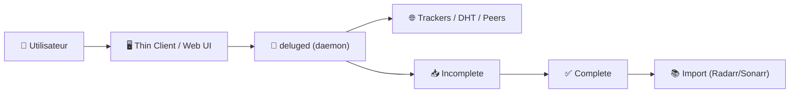

# 🌊 Deluge — Présentation & Configuration Premium (Daemon/Thin Client/Web UI)

### Client BitTorrent “daemon-first” : contrôle fin, multi-interfaces, intégrations propres
Optimisé pour reverse proxy existant • QoS & files • Labels/catégories • Exploitation durable

---

## TL;DR

- **Deluge** est un client BitTorrent basé sur un **modèle daemon/client** : un daemon (`deluged`) fait le travail, et tu pilotes via **GTK**, **Web UI** (`deluge-web`), **console** ou **thin client**. :contentReference[oaicite:0]{index=0}  
- En setup “premium”, Deluge devient un **download client stable** pour l’écosystème *Prowlarr → Radarr/Sonarr → Deluge → bibliothèque*.  
- Le vrai gain vient de : **catégories/labels**, **chemins propres**, **gestion ratio/seed**, **limites de vitesse**, **priorités** et **observabilité**.

---

## ✅ Checklists

### Pré-configuration (avant de connecter Radarr/Sonarr)
- [ ] Choisir la stratégie : **Web UI** pour usage simple vs **Thin Client** pour contrôle riche
- [ ] Définir les **catégories** (ex: `movies`, `tv`, `manual`)
- [ ] Définir une politique seed : ratio/temps, priorités, limites upload
- [ ] Normaliser les chemins : `downloads/incomplete`, `downloads/complete`
- [ ] Activer une auth + restreindre l’accès (via ton reverse proxy existant / ACL / VPN)
- [ ] Décider : plugins (Label, Scheduler, etc.) vs config minimaliste

### Validation (quand tout est branché)
- [ ] Un torrent test passe : **Ajout → DL → completion → seed**
- [ ] La catégorie est bien appliquée (Radarr/Sonarr/manuel)
- [ ] Les vitesses respectent les limites (global + par torrent)
- [ ] Les torrents se déplacent au bon endroit (complete)
- [ ] Les logs ne montrent pas de boucles d’erreur (tracker / permissions / disque)

---

> [!TIP]
> Deluge est excellent si tu veux une approche **“serveur + clients”** : tu administres depuis ton poste (thin client) sans exposer une UI web.

> [!WARNING]
> La **Web UI** est un service distinct (`deluge-web`) qui se connecte au daemon (`deluged`). Si l’un est up et pas l’autre, tu auras des symptômes “bizarres” (connexion/état). :contentReference[oaicite:1]{index=1}

> [!DANGER]
> Évite d’exposer Deluge (daemon ou Web UI) “tel quel” sur Internet. Traite ça comme un **service sensible** (IP allowlist / SSO / VPN).

---

# 1) Deluge — Vision moderne

Deluge n’est pas juste “un client torrent”.

C’est :
- 🧠 Un **moteur BitTorrent** (basé sur libtorrent) pilotable de plusieurs façons
- 🧱 Un **daemon** stable, autonome
- 🧰 Une **boîte à outils** : files, priorités, ratio/seed, plugins, quotas
- 🧩 Une brique d’intégration pour Radarr/Sonarr (catégories, Completed Download Handling côté *arr)

Modèle daemon/client (interfaces GTK/Web/Console) : :contentReference[oaicite:2]{index=2}

---

# 2) Architecture globale



---

# 3) Philosophie premium (5 piliers)

1. 🧾 **Catégories/labels** (séparer tv/movies/manual)
2. ⚖️ **Politique seed** (ratio/temps, limites upload, priorités)
3. 📁 **Chemins propres** (incomplete/complete, permissions stables)
4. 🚦 **QoS réseau** (limites globales + plages horaires + per-torrent)
5. 🔍 **Exploitation** (logs, validation, rollback)

---

# 4) Catégories / Labels (le multiplicateur de qualité)

## Pourquoi c’est critique
Sans catégories :
- Radarr/Sonarr se marchent dessus
- Les torrents manuels polluent les imports
- Le tri et le diagnostic deviennent lents

## Convention simple qui marche
- `movies` → tout Radarr
- `tv` → tout Sonarr
- `manual` → tes ajouts à la main
- `books` / `music` (si tu fais aussi autre chose)

> [!TIP]
> Même si tu utilises un plugin “Label”, garde une convention **minimale** et documentée.

---

# 5) Politique Seed (qualité + réseau sous contrôle)

## Stratégie “propre et stable”
- Ratio cible (ex: 1.0 à 2.0) **ou** temps de seed (ex: 48–168h)
- Limite upload globale (sinon tu t’auto-DDOS)
- Limites par torrent (évite qu’un torrent monopolise)
- Priorité :
  - torrents en cours > seed anciens
  - `tv` parfois prioritaire (épisodes rapides)

## Anti-pièges
- Trop d’upload = latence globale, pertes, et parfois “soft-ban”
- Pas de règles seed = explosion nombre torrents actifs

---

# 6) Files, priorités, et hygiène “downloads”

## Structure recommandée (logique)
- `incomplete/` : zone tampon
- `complete/` : zone stable, prête à être importée

## Réglages premium typiques (conceptuellement)
- Déplacement automatique en “complete”
- Nettoyage/gestion des erreurs (fichiers partiels, renommages)
- Priorité de fichiers dans un torrent (si utile)

> [!WARNING]
> Le “chaos de dossiers” crée des faux positifs côté *arr, et des imports ratés.

---

# 7) Thin Client vs Web UI — quand choisir quoi ?

## Web UI
- ✅ simple, accessible
- ✅ pratique via reverse proxy existant
- ⚠️ surface d’attaque plus évidente
- ⚠️ parfois moins riche que le client desktop

La Web UI est un service (`deluge-web`) qui se connecte au daemon. :contentReference[oaicite:3]{index=3}

## Thin Client (recommandation premium)
- ✅ contrôle riche depuis ton poste
- ✅ évite d’exposer une UI web publique
- ✅ “admin à distance” propre
- ⚠️ nécessite config réseau/ports maîtrisée

Doc thin client : :contentReference[oaicite:4]{index=4}

---

# 8) Observabilité & dépannage (patterns utiles)

## Logs : ce que tu cherches en premier
- erreurs tracker (announce fail, auth, banned)
- erreurs disque (no space, permissions, read-only)
- erreurs réseau (timeouts, DNS)
- boucles de retry

## “Triage express” (méthode)
1) Un torrent test (petit)  
2) Vérifie la catégorie  
3) Vérifie le chemin (incomplete → complete)  
4) Vérifie upload/seed rules  
5) Vérifie connectivité tracker/DHT (selon tes besoins)

---

# 9) Validation / Tests / Rollback

## Smoke tests
```bash
# UI répond (si tu as une URL)
curl -I https://deluge.example.tld | head

# Vérifier que le daemon est vivant (adapté selon ton environnement)
# (exemple générique) vérifier un port / un service supervisé
# nc -zv DELUGE_HOST DELUGE_PORT
```

## Tests fonctionnels (simples, fiables)
- Ajouter un torrent test
- Observer : état → download → completion → seed
- Vérifier :
  - catégorie assignée
  - fichiers déplacés au bon endroit
  - respect des limites vitesse
  - stabilité pendant 10–15 minutes

## Rollback (pratique)
- Revenir aux réglages réseau précédents (limites/ports)
- Désactiver un plugin récemment activé
- Restaurer une config sauvegardée (export/backup de conf si tu en as un)
- Revenir à une version précédente (si tu pin une version d’image)

---

# 10) Erreurs fréquentes (et fixes rapides)

- ❌ “Ça télécharge mais n’importe où”  
  ✅ chemins incomplete/complete + catégories + règles de déplacement

- ❌ “Radarr/Sonarr n’importent pas”  
  ✅ catégorie correcte + Completed Download Handling côté *arr + chemins visibles

- ❌ “Ça sature le réseau”  
  ✅ limite upload globale + limites par torrent + plages horaires

- ❌ “Web UI instable / connexion bizarre”  
  ✅ vérifier `deluged` vs `deluge-web` (services distincts). :contentReference[oaicite:5]{index=5}

---

# 11) Sources — Images Docker (URLs en bash, comme demandé)

```bash
# Deluge — upstream (projet)
https://github.com/deluge-torrent/deluge
https://deluge-torrent.org/

# LinuxServer.io — image Deluge (docs + registry)
https://docs.linuxserver.io/images/docker-deluge/
https://hub.docker.com/r/linuxserver/deluge
https://hub.docker.com/r/linuxserver/deluge/tags

# Référence : Dozzle (exemple précédent) — pas nécessaire ici, mais format identique
# https://hub.docker.com/r/amir20/dozzle
```

> Note rapide : l’image LinuxServer Deluge est documentée côté LSIO et référencée sur Docker Hub. :contentReference[oaicite:6]{index=6}