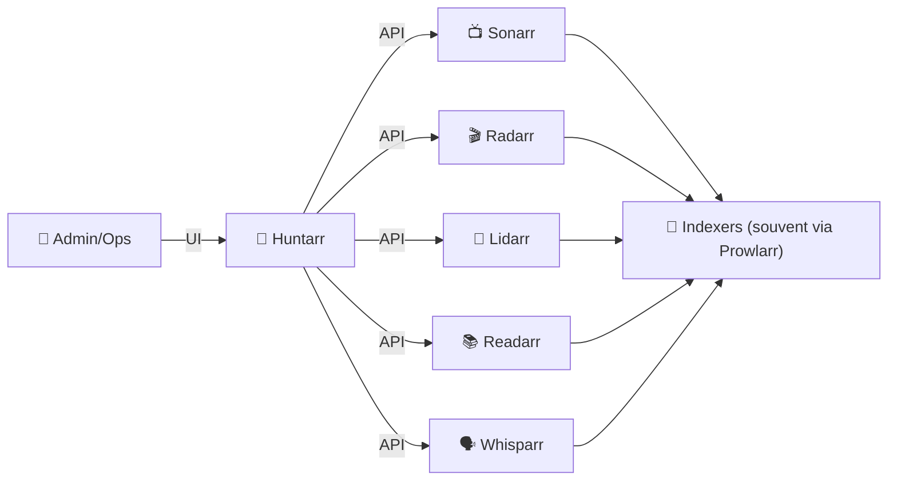
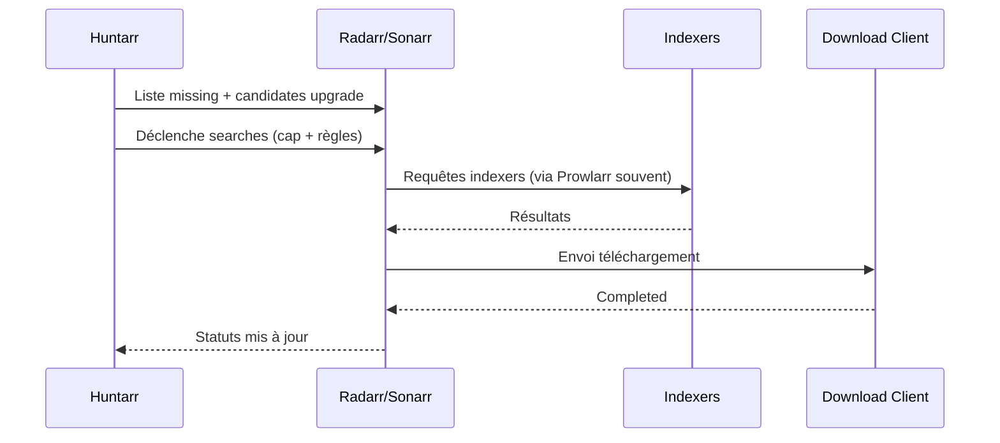

# 🐾 Huntarr — Présentation & Configuration Premium (Arr Stack “Missing & Upgrade Hunter”)

### Chasse automatisée : manquants + upgrades pour Sonarr / Radarr / Lidarr / Readarr / Whisparr  
Optimisé pour reverse proxy existant • Indexers “gentle” • Gouvernance par limites • Exploitation durable

---

## TL;DR

- **Huntarr** automatise des **recherches** (missing + upgrades) sur tes apps *arr (Sonarr/Radarr/etc.) pour “compléter” ta bibliothèque progressivement. :contentReference[oaicite:0]{index=0}  
- Il faut le configurer **avec des garde-fous** : fréquence, caps de recherches, fenêtres horaires, et une stratégie par instance. :contentReference[oaicite:1]{index=1}  
- ⚠️ **Sécurité** : des analyses récentes (communauté) signalent des risques si l’instance est accessible sur ton réseau/Internet sans protections (exposition d’infos sensibles via endpoints). Traite-le comme **outil à fort privilège**. :contentReference[oaicite:2]{index=2}  

---

## ✅ Checklists

### Pré-configuration (avant de connecter tes *arr)
- [ ] Définir objectif : missing seulement, upgrades seulement, ou les deux
- [ ] Définir un **budget de requêtes** (par jour / par heure) pour ne pas saturer indexers
- [ ] Définir une fenêtre horaire (ex: nuit)
- [ ] S’assurer que les profils qualité *arr sont cohérents (sinon Huntarr “upgrade” en boucle)
- [ ] Prévoir une **stratégie multi-instance** (ex: Radarr-4K séparé de Radarr-1080p)

### Post-configuration (qualité opérationnelle)
- [ ] Les recherches déclenchées correspondent à l’intention (missing ≠ upgrade)
- [ ] Les caps limitent réellement le volume (pas d’orage de requêtes)
- [ ] Les logs montrent un cycle stable (pas de retries infinis)
- [ ] Un plan de rollback est documenté (désactiver Huntarr / reset scheduling)

---

> [!TIP]
> Huntarr est excellent en “**bruit de fond**” : il complète ta bibliothèque petit à petit, sans que tu aies à lancer des recherches manuelles.

> [!WARNING]
> Si tes profils qualité et cutoffs sont mal définis, Huntarr peut déclencher des **upgrades inutiles** (et donc consommer des requêtes).

> [!DANGER]
> Huntarr manipule les APIs de toute ta stack (*arr, parfois Prowlarr, etc.).  
> En cas d’exposition non maîtrisée, tu peux **révéler des clés API** ou donner une surface d’attaque à ton écosystème. :contentReference[oaicite:3]{index=3}  

---

# 1) Huntarr — Vision moderne

Huntarr n’est pas un *arr supplémentaire.

C’est :
- 🔎 Un **déclencheur automatique de searches** (missing content)
- ♻️ Un **moteur d’upgrades progressifs** (selon règles des apps)
- 🧭 Un **orchestrateur de cadence** (caps, scheduling, cycles)
- 🧰 Un outil “ops” pour maintenir une bibliothèque complète dans le temps :contentReference[oaicite:4]{index=4}  

---

# 2) Architecture globale



---

# 3) Philosophie de configuration (premium)

Une configuration premium repose sur 5 piliers :

1. 🎯 **Intention claire** (missing vs upgrade)
2. ⛔ **Garde-fous** (caps, fenêtres, cooldown)
3. 🧠 **Cohérence qualité** côté *arr (profils, cutoffs, CF)
4. 🧩 **Découpage par instance** (4K ≠ 1080p ≠ anime)
5. 🛡️ **Sécurité d’accès** (ne pas traiter Huntarr comme un “petit dashboard”)

---

# 4) Stratégies “Missing” & “Upgrade” (éviter les pièges)

## 4.1 Missing (compléter la bibliothèque)
But : déclencher des recherches pour les éléments “monitorés” mais sans fichiers.

Bon pour :
- backlog Sonarr (saisons anciennes)
- Radarr (watchlist importée, films manquants)
- Readarr/Lidarr (catalogue incomplet)

Piège :
- si tu monitors “tout”, tu lances une avalanche.

**Règle premium** : monitor **ce que tu veux vraiment** + limite Huntarr par jour. :contentReference[oaicite:5]{index=5}  

## 4.2 Upgrade (améliorer la qualité)
But : pousser *arr à chercher mieux que ce que tu as, selon cutoffs.

Pièges fréquents :
- profils qualité trop permissifs
- cutoffs trop ambitieux (upgrade infini)
- custom formats trop agressifs

**Règle premium** : upgrades par “vagues” (petits caps + fenêtres horaires).

---

# 5) Scheduling & Caps (le cœur opérationnel)

Huntarr met en avant la configuration de cadence (intervals, caps, cycles) : l’objectif est d’être **gentle** pour tes indexers tout en restant efficace. :contentReference[oaicite:6]{index=6}  

## Recommandations de cadence (logique, pas une valeur magique)
- **Courts cycles + caps faibles** > longs cycles + caps énormes
- Prioriser “missing” la plupart du temps
- Activer “upgrade” sur fenêtres dédiées (ex: 1–2 nuits/semaine)

> [!TIP]
> Mets un cap “searches par cycle” et un cap “par jour” si l’UI le permet : tu veux un plafond dur.

---

# 6) Multi-instance (pattern pro)

Exemples d’instances à séparer :
- Radarr-1080p (usage général)
- Radarr-4K (sélectif)
- Sonarr-Anime (règles très spécifiques)
- Sonarr-Kids (qualité + restrictions)

Pourquoi :
- caps/scheduling différents
- priorités différentes
- éviter qu’un gros backlog “mange” tout le budget

---

# 7) Workflow premium (de bout en bout)



---

# 8) Sécurité (à traiter comme un composant sensible)

Des revues communautaires récentes indiquent un risque d’exposition de données sensibles (credentials/keys) si l’instance est accessible sans protections. :contentReference[oaicite:7]{index=7}  

## Posture premium (principes)
- Accès **restreint** (réseau interne / VPN / reverse proxy existant + SSO/forward-auth)
- Ne jamais considérer l’UI comme “safe by default”
- Rotation de clés API si suspicion
- Mise à jour régulière + veille sur advisories/discussions

> [!WARNING]
> Si tu as déjà exposé Huntarr publiquement, considère une action “incident” :
> - couper l’accès
> - rotation des clés API des apps *arr
> - vérifier logs d’accès proxy/firewall

---

# 9) Validation / Tests / Rollback

## Tests de validation (fonctionnels)
```bash
# Test de reachability (adapte URL)
curl -I https://huntarr.example.tld | head

# Smoke test côté *arr : vérifier qu'une recherche a été déclenchée
# (manuel) Dans Radarr/Sonarr: Activity / History → doit montrer des searches déclenchées
```

## Tests “garde-fous”
- Fixer un cap très bas (ex: 1–3) → vérifier qu’il n’est pas dépassé
- Lancer un cycle → vérifier que les logs ne bouclent pas
- Désactiver upgrade → vérifier qu’il ne cherche que du missing

## Rollback
- Désactiver scheduling (ou pause globale) dans Huntarr
- Retirer/neutraliser les connexions aux apps *arr
- En dernier recours : révoquer/renouveler les clés API *arr

---

# 10) Erreurs fréquentes

- ❌ “Ça spamme mes indexers” → caps trop hauts / scheduling trop agressif
- ❌ “Ça upgrade sans arrêt” → profils qualité/cutoffs incohérents côté *arr
- ❌ “Rien ne se passe” → items non monitorés / mauvais mapping logique / permissions API
- ❌ “Risque sécurité sous-estimé” → accès trop large / absence de contrôle d’accès :contentReference[oaicite:8]{index=8}  

---

# 11) Sources — Images Docker & Docs (URLs en bash, comme demandé)

```bash
# Docs officielles Huntarr
https://plexguide.github.io/Huntarr.io/index.html
https://plexguide.github.io/Huntarr.io/getting-started/installation.html

# Repo (référence projet)
https://github.com/plexguide/Huntarr.io

# Docker image Huntarr (officiel)
https://hub.docker.com/r/huntarr/huntarr

# Tags / releases (utile pour pinner une version)
https://github.com/plexguide/Huntarr.io/releases

# LinuxServer.io — catalogue images (pour vérifier si une image LSIO existe)
# (À date, Huntarr n’apparaît pas comme image LSIO dédiée dans le catalogue.)
https://www.linuxserver.io/our-images

# Contexte sécurité (revues/analyses communauté)
https://github.com/rfsbraz/huntarr-security-review
https://www.reddit.com/r/PleX/comments/1rckriu/huntarr_your_passwords_and_your_entire_arr_stacks/
```

---

# ✅ Conclusion

Huntarr est une excellente “**couche d’automatisation**” pour compléter et améliorer ta bibliothèque,
à condition de le traiter comme un composant **ops + sensible** :

- caps & scheduling stricts
- qualité cohérente côté *arr
- accès fortement contrôlé
- validation + rollback simples

Tu obtiens une bibliothèque qui progresse “toute seule” sans brûler tes indexers.