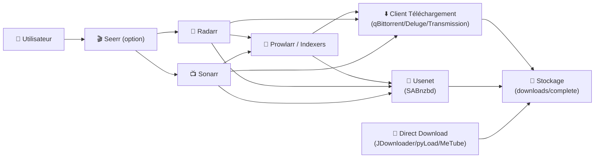

# 📥 Applications Téléchargement

> Cette catégorie regroupe l’ensemble des applications dédiées à la récupération, l’orchestration et l’optimisation des téléchargements (torrents, usenet, direct download), au service de l’écosystème SSDv2.

---

## 🧠 Objectif

Les applications Téléchargement permettent :

- ⬇️ Le téléchargement de contenus (torrents, usenet, liens directs)
- 🧲 La gestion des clients (catégories, files, priorités)
- 🔎 La connexion aux indexeurs (Torznab, trackers via agrégateurs)
- 🔄 L’automatisation des flux avec les apps *Arr (Radarr/Sonarr)
- 🧰 La supervision et le dépannage (queues, erreurs, performance)

Elles fonctionnent généralement ensemble au sein d’un pipeline cohérent.

---

## 🏗 Architecture Type

---

## 📦 Applications Disponibles

### 🧲 qBittorrent
Client torrent moderne, stable, idéal pour l’automatisation (*Arr) via catégories.

### 🌊 Deluge
Client torrent léger et extensible (plugins), efficace sur serveurs modestes.

### 🚇 Transmission
Client torrent minimaliste, très utilisé en environnement headless.

### 📰 SABnzbd
Client Usenet performant avec gestion avancée des files, priorités et réparations.

### 🧭 NZBHydra
Métamoteur/agrégateur d’indexeurs Usenet (centralisation + scoring + stats).

### 🗂 NZBDAV
Accès “type WebDAV”/outil d’intégration Usenet (selon usage dans ton stack).

### 🧩 Jackett
Pont “indexeurs → Torznab” pour exposer des trackers à *Arr/Prowlarr.

### 🧰 JDownloader
Téléchargement de liens directs (hosters), pratique pour archives, packs, mirrors.

### 🧪 pyLoad
Gestionnaire de téléchargement léger orienté direct download (hosters).

### 📺 MeTube
Téléchargement de vidéos (YouTube & co), utile pour archives, cours, playlists.

### 🌪️ qFlood / rFlood
Interfaces web “flood” pour clients rTorrent (pilotage & monitoring de sessions).

### 🧱 ruTorrent
UI web historique pour rTorrent, très complète (plugins), toujours répandue.

### 🎯 RdtClient
Pont orienté “debrid” pour automatiser la récupération via ton workflow existant.

### 🧬 Decypharr / Decypharrseed / Deemixrr / Huntarr / airdcpp
Outils complémentaires selon ton stack (debrid, seedbox, musique, DC++, etc.).

---

## 🔗 Intégration

Ces applications s’intègrent avec :

- 🎬 Média (*Arr) : Radarr, Sonarr, Seerr, Prowlarr
- 🔎 Indexation : Prowlarr, Jackett, NZBHydra, Zilean (selon stack)
- 📁 Stockage : dossiers `downloads/complete` et bibliothèques médias
- 🌐 Reverse Proxy : Traefik (accès web unifié, SSO/forward-auth si besoin)
- 📊 Monitoring : Dozzle/Netdata (logs, perf, disponibilité)

---

# 🎯 Résumé

La catégorie Téléchargement est le “moteur” de l’écosystème SSDv2.

Elle assure :
- la récupération fiable (torrent/usenet/direct),
- la bonne orchestration (catégories, files, priorités),
- et l’intégration fluide avec Radarr/Sonarr via Prowlarr.

Bien structurée, elle rend l’automatisation **stable, prévisible et facile à dépanner**.