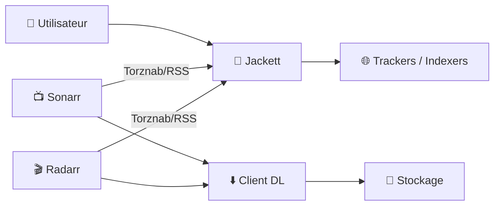
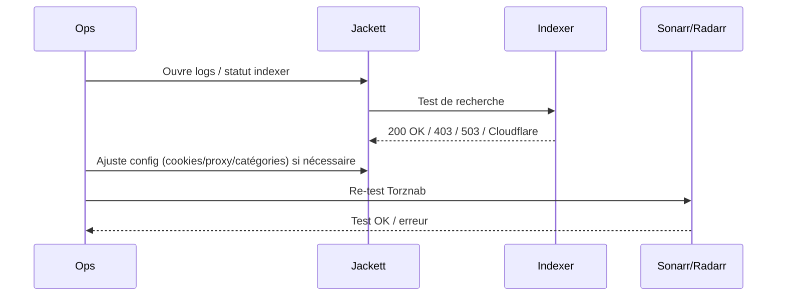

# 🧷 Jackett — Présentation & Configuration Premium (Indexers pour Sonarr/Radarr)

### “Traducteur” d’indexers : Torznab / RSS / Recherche unifiée
Optimisé pour reverse proxy existant • Catégories propres • Stabilité & hygiene des indexers • Exploitation durable

---

## TL;DR

- **Jackett** sert d’**adaptateur** entre tes apps (Sonarr/Radarr/Lidarr/Readarr…) et une multitude d’**indexers** (trackers).
- Il expose une API **Torznab** + **RSS**, consommée par Sonarr/Radarr pour chercher et automatiser les téléchargements.
- En premium : **indexers minimaux mais fiables**, **catégories propres**, **protection anti-ban**, **logs exploitables**, **sécurisation d’accès**, **tests + rollback**.

---

## ✅ Checklists

### Pré-configuration (avant d’ajouter 25 indexers)
- [ ] Définir la stratégie : public / semi-privé / privé (trackers)
- [ ] Choisir un “set minimal” d’indexers fiables (2–5) plutôt que 30 médiocres
- [ ] Décider de la gestion Cloudflare / anti-bot (proxy, cookies, etc.)
- [ ] Normaliser les catégories (movies / tv) et les profils (1080p/2160p)
- [ ] Prévoir une politique de rotation/maintenance (indexer down, API change)

### Post-configuration (qualité & stabilité)
- [ ] Torznab OK dans Sonarr/Radarr (test réussi)
- [ ] RSS Sync propre (pas de spam / pas de downloads parasites)
- [ ] Latence et taux d’erreurs acceptables (logs)
- [ ] Les recherches retournent des résultats cohérents (qualité/catégories)
- [ ] Accès Jackett protégé (auth + réseau interne / proxy existant)

---

> [!TIP]
> **Moins d’indexers = plus de stabilité**. Jackett est très efficace avec un petit set bien entretenu.

> [!WARNING]
> Trop de requêtes = blocage/ban côté indexer. Ajuste les intervalles RSS, évite les “mass searches” répétés.

> [!DANGER]
> Jackett peut contenir des infos sensibles (clé API, cookies, tokens). Ne l’expose pas sans contrôle d’accès.

---

# 1) Jackett — Vision moderne

Jackett n’est pas “un indexer”.

C’est :
- 🧩 Un **middleware** qui transforme des trackers hétérogènes en **interfaces standard** (Torznab/RSS)
- 🔎 Un **moteur de mapping** (catégories, recherche, parsing)
- 🧰 Un **outil d’exploitation** (tests, logs, santé des indexers)

---

# 2) Architecture globale



---

# 3) Philosophie premium (les 5 piliers)

1. 🎯 **Indexers sélectionnés** (qualité > quantité)
2. 🧾 **Catégories propres** (TV/Movie, codecs, packs)
3. 🧠 **RSS maîtrisé** (fréquences, filtres, pas de spam)
4. 🧪 **Tests systématiques** (Torznab, recherche, latence)
5. 🛡️ **Sécurité** (accès protégé, clés API, logs)

---

# 4) Configuration premium (sans recettes d’installation)

## 4.1 API Key & principe Torznab

Jackett expose :
- une **API Key** (auth côté Sonarr/Radarr)
- des endpoints **Torznab** par indexer + éventuellement un “all” (selon config)

💡 Règle :
- traite l’API Key comme un **secret**
- évite de la coller dans des captures publiques

---

## 4.2 Ajout d’indexers : méthode “stable”

### Stratégie recommandée
- Commence par **2 à 5 indexers**
- Valide :
  - recherche manuelle OK
  - catégories OK
  - RSS OK
  - pas d’erreurs/ban
- Ensuite seulement, étends

### Hygiène
- Désactive/supprime les indexers :
  - instables
  - trop lents
  - qui cassent souvent (API change)
- Note dans ta doc interne :
  - raison du choix
  - latence moyenne
  - types de contenus (TV/Movie/Anime/FR)

---

## 4.3 Catégories : le nerf de la guerre

Objectif : que Sonarr/Radarr reçoivent des résultats “justes”.

- Séries : catégories TV (et Anime si besoin)
- Films : catégories Movie

> [!WARNING]
> Des catégories trop larges = téléchargements parasites (packs, CAM, releases indésirables).

---

## 4.4 RSS Sync (contrôle fin)

### Approche premium
- RSS pour l’automatisation “continuous”
- Recherche manuelle pour les cas spécifiques
- Evite de “tout activer partout”

Conseils :
- limite les recherches massives
- surveille les logs après chaque ajout d’indexer

---

# 5) Intégration Sonarr/Radarr (propre)

## 5.1 Dans Sonarr (Settings → Indexers)
- Type : **Torznab**
- URL : endpoint Torznab de l’indexer (depuis Jackett)
- API Key : celle de Jackett
- Catégories : TV (ajuste selon tes besoins)
- Test : doit réussir

## 5.2 Dans Radarr (Settings → Indexers)
- Type : **Torznab**
- URL + API Key idem
- Catégories : Movies
- Test : doit réussir

> [!TIP]
> Si tu utilises Prowlarr, il peut remplacer une bonne partie de Jackett. Mais Jackett reste utile selon tes indexers/compatibilités.

---

# 6) Workflows premium (diagnostic & exploitation)

## 6.1 “Indexers down” (séquence de triage)



## 6.2 “Qualité des résultats” (routine)
- Lancer une recherche test sur un titre connu
- Vérifier :
  - cohérence qualité (1080p/2160p)
  - cohérence codec (x265/x264)
  - absence de releases indésirables (CAM/LQ)
- Ajuster catégories et/ou profils côté Sonarr/Radarr

---

# 7) Validation / Tests / Rollback

## Tests (smoke + fonctionnels)

```bash
# Smoke : vérifier que Jackett répond
curl -I http://JACKETT_HOST:PORT | head

# Test : endpoint Torznab (exemple générique)
# (Remplace URL et apikey par les tiens)
curl -s "http://JACKETT_HOST:PORT/api/v2.0/indexers/all/results/torznab/api?apikey=YOUR_KEY&t=search&q=matrix" | head -n 20
```

## Indicateurs à surveiller
- taux d’erreur par indexer (403/429/503)
- latence des recherches
- erreurs Cloudflare/anti-bot
- timeouts récurrents

## Rollback (propre)
- Si un indexer ajoute du bruit :
  - désactive-le
  - purge-le de Sonarr/Radarr si nécessaire
  - reviens à un set minimal stable
- Si un changement casse tout :
  - restaure la config Jackett depuis backup (config directory)
  - re-teste Torznab

> [!TIP]
> Une stratégie rollback efficace = **documenter** “avant/après” pour chaque ajout d’indexer (1 min, énorme gain).

---

# 8) Erreurs fréquentes

- ❌ Trop d’indexers → instabilité, bans, bruit
- ❌ Catégories mal réglées → mauvais téléchargements
- ❌ RSS trop agressif → throttling/ban
- ❌ API Key exposée → accès non autorisé
- ❌ Tests non faits après ajout → “ça marche chez moi” jusqu’à l’incident

---

# 9) Sources (URLs en bash, comme demandé)

```bash
# Jackett — upstream
https://github.com/Jackett/Jackett
https://github.com/Jackett/Jackett/wiki

# Image Docker LinuxServer.io (LSIO) — Jackett
https://docs.linuxserver.io/images/docker-jackett/
https://hub.docker.com/r/linuxserver/jackett
https://github.com/linuxserver/docker-jackett

# (Optionnel) Catalogue des images LinuxServer.io
https://www.linuxserver.io/our-images
```

---

# ✅ Conclusion

Jackett devient “premium” quand tu le traites comme un composant de prod :
- indexers sélectionnés,
- catégories propres,
- RSS maîtrisé,
- tests systématiques,
- secrets protégés,
- rollback documenté.

Résultat : moins de bruit, moins de bans, plus d’automatisation utile.