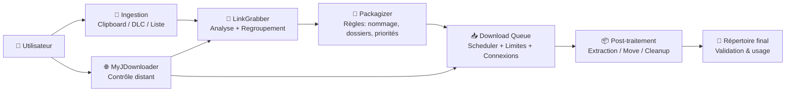
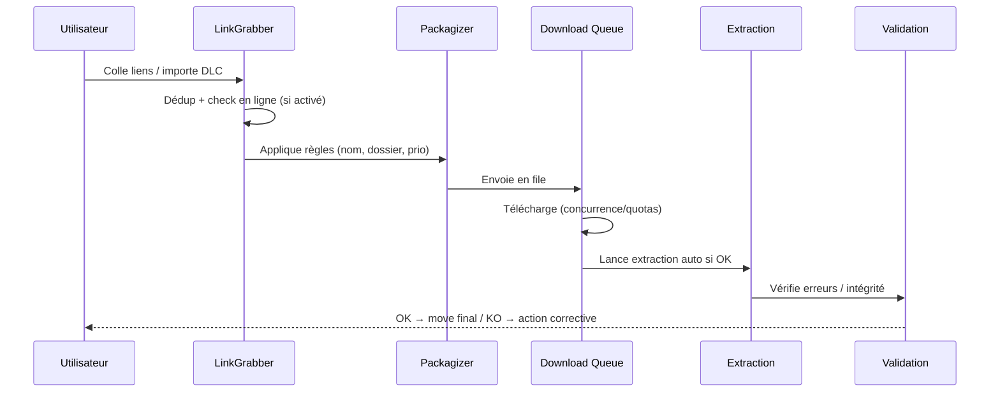

# ⬇️ JDownloader 2 — Présentation & Configuration Premium (Sans install / Sans Docker / Sans Nginx)

### Gestionnaire de téléchargements “power-user” : LinkGrabber, débridage, extraction, automatisations, contrôle distant
Optimisé pour MyJDownloader • Qualité & hygiène des liens • Organisation durable • Exploitation & rollback

---

## TL;DR

- **JDownloader 2** automatise les téléchargements (hosters, HTTP/HTTPS, listes de liens) avec :
  - 🧲 **LinkGrabber** (détection & nettoyage)
  - 📦 **Extraction** & post-traitements
  - 🧠 **Règles** (Packagizer, renommage, dossiers)
  - 🌐 **MyJDownloader** pour le contrôle à distance
- Une config premium = **sources propres**, **règles d’organisation**, **gestion captcha**, **comptes/quotas**, **journalisation**, **tests & rollback**.

> [!TIP]
> Traite JDownloader comme une “chaîne de production” : **Ingestion → Normalisation → File d’attente → Post-traitement → Validation**.

> [!WARNING]
> Les logs peuvent contenir des URLs, tokens ou identifiants de comptes hosters. Applique une politique “least exposure”.

> [!DANGER]
> Utilise JDownloader **uniquement** dans le respect des lois, des CGU et des droits d’auteur. Je peux t’aider à configurer l’outil, pas à contourner des protections ou faciliter des usages illégaux.

---

## ✅ Checklists

### Pré-configuration (objectif : zéro chaos)
- [ ] Définir un **répertoire racine** stable (ex: `/data/downloads`)
- [ ] Définir une convention **temp / final / archives**
- [ ] Choisir une stratégie **comptes hosters** (si tu en as) + quotas
- [ ] Définir ta stratégie **captchas** (manuel vs remote)
- [ ] Activer/relier **MyJDownloader** (contrôle distant)
- [ ] Décider “qualité” : extraction auto, renommage, nettoyage

### Post-configuration (objectif : fiable au quotidien)
- [ ] “LinkGrabber → Download” ne crée pas de doublons
- [ ] Les packages sont bien **nommés** et rangés
- [ ] Les archives s’extraient, et les erreurs sont visibles
- [ ] Les téléchargements reprennent après restart (persistant)
- [ ] Procédure de rollback (config) testée

---

# 1) JDownloader — Vision moderne

JDownloader 2, ce n’est pas “coller un lien et attendre”.

C’est :
- 🧲 Un **pipeline d’ingestion** (détection, regroupement, dédoublonnage)
- 🧰 Un **orchestrateur** (priorités, concurrence, limites)
- 📦 Un **moteur de post-traitement** (extract, rename, move, cleanup)
- 🌐 Un **client pilotable à distance** (MyJDownloader)

---

# 2) Architecture globale



---

# 3) “Premium config mindset” (5 piliers)

1. 🧹 **Hygiène des liens** (LinkGrabber propre, pas de doublons)
2. 🧠 **Règles déterministes** (Packagizer = ton meilleur ami)
3. 📦 **Post-traitements fiables** (extraction, mots de passe, erreurs)
4. 🌐 **Contrôle distant** (MyJDownloader : pratique mais à sécuriser)
5. 🧪 **Validation / Rollback** (tests simples, retour arrière rapide)

---

# 4) LinkGrabber — l’étape qui fait gagner (ou perdre) du temps

## Objectifs premium
- Regrouper automatiquement par “package”
- Nettoyer les liens morts / dupliqués
- Valider les tailles/noms avant de lancer
- Appliquer tes règles (dossier, renommage, priorité)

## Règles pratiques
- Active l’auto-confirmation **seulement** si tes sources sont fiables
- Garde une étape manuelle “review” pour les gros packages
- Utilise des filtres :
  - exclure les formats inutiles
  - ignorer les mirrors indésirables

> [!TIP]
> Le meilleur workflow : **tu ne lances pas** tant que le package n’est pas “propre” (nom, taille, structure, destination).

---

# 5) Packagizer — le cœur “pro” (tri, nommage, dossiers, priorité)

Le Packagizer permet :
- 📁 d’envoyer certains liens dans certains dossiers
- 🏷️ de renommer / normaliser
- ⚖️ de fixer priorité / quotas / conditions
- 🧩 de gérer des exceptions (hosters, patterns, mots-clés)

## Stratégie recommandée
- Une règle par intention (pas une règle “monstre”)
- Prioriser l’ordre : spécifique → général
- Ajouter une règle “catch-all” qui range “proprement” le reste

### Exemple de structure logique
- `inbox/` : ingestion brute
- `work/` : en cours (temp)
- `final/` : terminé + validé
- `archives/` : DLC, listes, logs exportés

---

# 6) Comptes, hosters & quotas (fiabilité sans surprises)

## Principes
- Utiliser des comptes légitimes si tu en as (premium, quotas clairs)
- Régler la concurrence par hoster (évite throttling)
- Définir une politique “retries” raisonnable

## Hygiène premium
- Ne mélange pas 10 hosters “instables” dans la même file
- Mets les hosters sensibles en priorité basse
- Surveille :
  - erreurs d’auth
  - restrictions IP
  - captchas fréquents

> [!WARNING]
> Ne stocke pas tes mots de passe dans des exports non chiffrés. Et ne partage jamais tes fichiers de config.

---

# 7) Captchas & contrôle distant (MyJDownloader)

## Pourquoi MyJDownloader
- Piloter JD2 à distance (PC/serveur)
- Ajouter des liens depuis mobile
- Valider certains captchas quand nécessaire

## Sécurité “premium”
- Compte MyJDownloader protégé (mot de passe fort + 2FA si dispo sur ton compte)
- Ne partage pas l’accès “admin” à tout le monde
- Évite d’exposer inutilement l’UI JD2 (préférer accès privé)

Docs API/plateforme MyJDownloader : :contentReference[oaicite:0]{index=0}

---

# 8) Extraction & post-traitements (zéro “archives cassées”)

## Objectifs
- Extraction automatique des archives
- Gestion des mots de passe (si tu en utilises légitimement)
- Détection claire des erreurs (CRC, missing parts)
- Nettoyage du répertoire temp une fois validé

## Bonnes pratiques
- Activer extraction, MAIS :
  - ne supprime pas les archives avant validation
  - conserve un log d’erreur exploitable
- Standardiser l’emplacement des fichiers “incomplets”
- Gérer les fichiers multi-part (vérifier que tout est présent avant extract)

---

# 9) Workflow premium (end-to-end)



---

# 10) Validation / Tests / Rollback

## Tests fonctionnels (rapides)
- Ajouter un petit package test (quelques Mo)
- Vérifier :
  - destination correcte (règles)
  - reprise après pause/restart
  - logs lisibles
  - extraction (si archive test)

## Signaux d’alerte
- Beaucoup de “retry” sur un host → concurrence trop élevée ou quotas
- Packages dupliqués → LinkGrabber pas nettoyé / règles trop permissives
- Extraction qui échoue souvent → missing parts / mots de passe / CRC

## Rollback (configuration)
- Sauvegarde régulière du profil/config (export si possible)
- Garder au moins :
  - une version “stable”
  - une version “expérimentale”
- Retour arrière = restaurer config stable + redémarrer JD2

> [!TIP]
> Le rollback le plus utile : revenir à **Packagizer minimal** quand “tout part en vrille”.

---

# 11) Sources (adresses en bash, comme demandé)

```bash
# Sites & docs officielles
echo "JDownloader (site officiel) : https://jdownloader.org/"
echo "JDownloader - page Download : https://jdownloader.org/download/index"
echo "Support / Knowledge Base : https://jdownloader.org/knowledge/index"
echo "MyJDownloader API (developers) : https://my.jdownloader.org/developers/"

# Images Docker (références publiques — tu voulais notamment LinuxServer si dispo)
echo "Docker image (jlesage) - repo : https://github.com/jlesage/docker-jdownloader-2"
echo "Docker Hub (jlesage/jdownloader-2) : https://hub.docker.com/r/jlesage/jdownloader-2"
echo "Docker Hub tags (jlesage) : https://hub.docker.com/r/jlesage/jdownloader-2/tags"

# LinuxServer.io (état : pas d'image JDownloader officielle LSIO listée ; pages de référence)
echo "LinuxServer - Our Images : https://www.linuxserver.io/our-images"
echo "LinuxServer - discussion 'request jdownloader' : https://discourse.linuxserver.io/t/request-jdownloader/214"
```

Références officielles JDownloader & support : :contentReference[oaicite:1]{index=1}  
Références MyJDownloader API : :contentReference[oaicite:2]{index=2}  
Références images Docker (jlesage) : :contentReference[oaicite:3]{index=3}  
Références LinuxServer (pas d’image dédiée listée + discussion) : :contentReference[oaicite:4]{index=4}

---

# ✅ Conclusion

JDownloader 2 “premium”, c’est :
- des liens propres (LinkGrabber),
- des règles déterministes (Packagizer),
- une file maîtrisée (quotas/concurrence),
- des post-traitements fiables (extraction + validation),
- et une capacité à revenir en arrière (rollback config).

Si tu veux, donne-moi ton **objectif exact** (ex: “organiser par domaines”, “limiter par hoster”, “zéro doublon”, “workflow remote”), et je te rédige un **template Packagizer** ultra propre (sans aucune partie install).