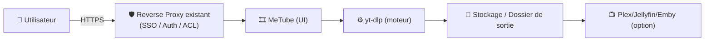
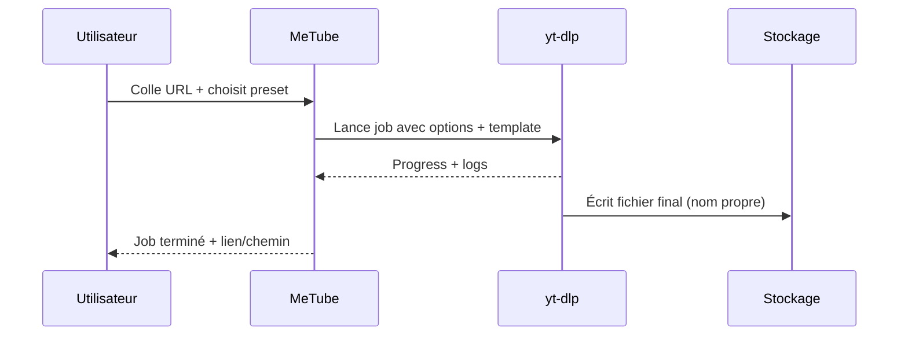

# 🎞️ MeTube — Présentation & Configuration Premium (Sans install / Sans Docker / Sans Nginx)

### Téléchargeur web self-hosted basé sur yt-dlp : fiable, flexible, “ops-friendly”
Optimisé pour reverse proxy existant • Qualité maîtrisée • Templates propres • Cookies/headers • Exploitation durable

---

## TL;DR

- **MeTube** est une interface web pour **yt-dlp** (fork moderne de youtube-dl) : tu colles une URL, tu récupères un fichier propre.
- Le “premium” = **options yt-dlp maîtrisées**, **templates de sortie**, **cookies/headers** (si besoin), **quotas & discipline d’usage**, **validation & rollback**.
- **Point clé** : MeTube = exécution **à la demande** ; c’est ton cadre (naming, dossiers, options, règles) qui fait la qualité.

Références projet : https://github.com/alexta69/metube

---

## ✅ Checklists

### Pré-usage (avant d’ouvrir aux utilisateurs)
- [ ] Définir les **formats cibles** (ex: mp4/h264, mkv, audio-only)
- [ ] Définir une **stratégie de nommage** (template stable)
- [ ] Définir le **répertoire de sortie** + conventions (par chaîne, playlist, date)
- [ ] Définir la politique **cookies/headers** (si contenus nécessitant login)
- [ ] Définir les limites d’usage (downloads concurrents, taille, durée)
- [ ] Vérifier accès via reverse proxy existant + auth/SSO si nécessaire

### Post-configuration (qualité)
- [ ] 3 cas test : 1 vidéo, 1 playlist, 1 vidéo avec sous-titres
- [ ] Les fichiers sortent au bon endroit, avec le bon nom, et le bon format
- [ ] Les logs montrent les options yt-dlp attendues
- [ ] Procédure “problème classique” documentée (403, throttling, geo, age)
- [ ] Rollback simple (retour à un preset yt-dlp minimal)

---

> [!TIP]
> Le meilleur ROI MeTube : **presets** (options yt-dlp) + **templates** (OUTPUT_TEMPLATE) + **conventions** (dossiers).  
> C’est ça qui transforme “outil” → “service”.

> [!WARNING]
> Les sites changent souvent : si un provider casse, c’est rarement “ta faute”.  
> La stabilité vient de : **yt-dlp à jour**, presets simples, et tests rapides.

> [!DANGER]
> Ne publie pas MeTube en accès public sans contrôle d’accès : ça peut devenir un “download service” abusé, et exposer des logs/URLs sensibles.

---

# 1) MeTube — Vision moderne

MeTube n’est pas “juste” une UI.

C’est :
- 🧠 Un **front-end** pour un moteur de téléchargement puissant (yt-dlp)
- 🧩 Un **outil de normalisation** (formats, templates, sous-titres, métadonnées)
- 🔁 Un **workflow** (URL → job → fichier propre → intégration bibliothèque)

Support multi-sites via yt-dlp : https://github.com/yt-dlp/yt-dlp/blob/master/supportedsites.md

---

# 2) Architecture globale



---

# 3) Philosophie premium (5 piliers)

1. 🎯 **Formats maîtrisés** (qualité stable, compat, tailles)
2. 🗂️ **Templates de sortie** (noms propres, dossiers predictibles)
3. 🧾 **Sous-titres & métadonnées** (quand utile, sans surcharger)
4. 🍪 **Cookies/headers** (uniquement si nécessaire)
5. 🛡️ **Gouvernance d’accès** (reverse proxy existant + règles d’usage)

---

# 4) Formats & Qualité (la base “pro”)

## Objectif
Avoir des sorties :
- lisibles par ton écosystème (TV, mobile, serveur media),
- constantes (pas un format différent à chaque fois),
- et raisonnables en taille.

## Stratégies recommandées
- **Compat maximale** : mp4 + h264 + aac (souvent le plus universel)
- **Qualité/archivage** : mkv + meilleure vidéo + audio original (plus lourd)
- **Audio-only** : extraction propre + tags (si tu gères une médiathèque audio)

> [!TIP]
> Le “bon” preset dépend de ton lecteur cible.  
> Si tu vises TV + mobile : la compat prime.

---

# 5) Templates de sortie (OUTPUT_TEMPLATE) — “zéro chaos”

## Pourquoi c’est critique
Sans template :
- noms imprévisibles,
- collisions,
- tri difficile,
- ingestion media server pénible.

## Exemples de patterns (à adapter)
- Par uploader + date :
  - `%(uploader)s/%(upload_date)s - %(title)s [%(id)s].%(ext)s`
- Par playlist :
  - `Playlists/%(playlist_title)s/%(playlist_index)s - %(title)s [%(id)s].%(ext)s`
- Minimal propre :
  - `%(title)s [%(id)s].%(ext)s`

Cookbook officiel OUTPUT_TEMPLATE : https://github.com/alexta69/metube/wiki/OUTPUT_TEMPLATE-Cookbook

---

# 6) Options yt-dlp (YTDL_OPTIONS) — “presets” propres

## Principes
- Un preset = une intention (ex: “compat mp4”, “best archive”, “audio only”)
- Commencer simple, ajouter seulement si besoin
- Éviter d’empiler 30 flags “au cas où”

Cookbook officiel YTDL_OPTIONS : https://github.com/alexta69/metube/wiki/YTDL_OPTIONS-Cookbook

## Exemples d’intentions (sans imposer de syntaxe)
- Forcer un conteneur/codec compatible
- Télécharger sous-titres (langues, auto/manuel)
- Gérer playlists proprement (ordre, exclusions)
- Retry/timeout raisonnables

> [!WARNING]
> Certaines options peuvent générer des sorties “surprenantes” (fusion, remux, conversions).  
> Fais toujours 3 tests avant de déployer un preset aux équipes.

---

# 7) Cookies / Headers (cas “auth / contenu protégé”)

## Quand c’est utile
- contenu nécessitant compte,
- restrictions d’âge,
- certains sites avec protections.

Approche premium :
- maintenir un fichier cookies séparé,
- limiter son accès (secret),
- rotation périodique,
- ne jamais exposer les cookies dans les logs partagés.

Point d’entrée (wiki MeTube) : https://github.com/alexta69/metube/wiki

---

# 8) Workflows premium (usage, incident, qualité)

## 8.1 Workflow “Download propre”


## 8.2 Workflow “Qualité”
- Échantillonner 1 fichier sur 20 :
  - lisibilité (codec),
  - audio OK,
  - sous-titres si requis,
  - nommage conforme.

---

# 9) Validation / Tests / Rollback

## Tests de validation (smoke)
```bash
# 1) La page répond
curl -I https://metube.example.tld | head

# 2) Santé “fonctionnelle” (manuel)
# - Coller une URL courte
# - Télécharger en preset minimal
# - Vérifier le fichier final + nom + extension
```

## Tests “régression” (après changement de preset)
- Vidéo simple (10 min)
- Playlist (3 items)
- Vidéo + sous-titres (1 langue)
- Cas “difficile” (si tu en as un : restrictions, cookies)

## Rollback (simple)
- Revenir au **preset minimal** (options yt-dlp par défaut)
- Désactiver temporairement :
  - remux/conversions,
  - sous-titres auto,
  - options agressives (concurrency/retries extrêmes)
- Conserver une “baseline” documentée :
  - preset A = minimal stable
  - preset B = compat
  - preset C = archive

---

# 10) Erreurs fréquentes (et lecture rapide)

- **403 / Forbidden** : cookies nécessaires, ou protection site → tester cookies/headers, ou mise à jour yt-dlp
- **Fichier illisible** : codec/container trop exotique → preset compat
- **Noms chaotiques** : OUTPUT_TEMPLATE absent → appliquer template stable
- **Playlists en vrac** : template playlist + index + dossier dédié
- **Sous-titres manquants** : options subs + langues + “auto vs manuel” à clarifier

---

# 11) Sources — Images Docker (URLs brutes)

## 11.1 Images officielles (les plus citées)
- `ghcr.io/alexta69/metube` (GitHub Container Registry) : https://github.com/alexta69/metube  
- `alexta69/metube` (Docker Hub) : https://hub.docker.com/r/alexta69/metube  
- Releases (liste les tags + images publiées) : https://github.com/alexta69/metube/releases  

## 11.2 Documentation / paramètres
- Repo (README) : https://github.com/alexta69/metube  
- Wiki MeTube (cookbooks env vars) : https://github.com/alexta69/metube/wiki  
- YTDL_OPTIONS Cookbook : https://github.com/alexta69/metube/wiki/YTDL_OPTIONS-Cookbook  
- OUTPUT_TEMPLATE Cookbook : https://github.com/alexta69/metube/wiki/OUTPUT_TEMPLATE-Cookbook  

## 11.3 LinuxServer.io (si image existe)
- Collection d’images LSIO (vérification) : https://www.linuxserver.io/our-images  
- Index docs images LSIO : https://docs.linuxserver.io/images/  
- À ce jour, MeTube n’apparaît pas comme image LSIO dédiée dans ces index (références ci-dessus).

---

# ✅ Conclusion

MeTube devient “premium” quand tu standardises :
- 🎯 formats,
- 🗂️ templates de sortie,
- 🧠 presets yt-dlp,
- 🍪 cookies/headers si nécessaire,
- 🛡️ gouvernance d’accès via ton reverse proxy existant,
- 🧪 validation + rollback.

Résultat : moins de surprises, des fichiers propres, et un service durable.