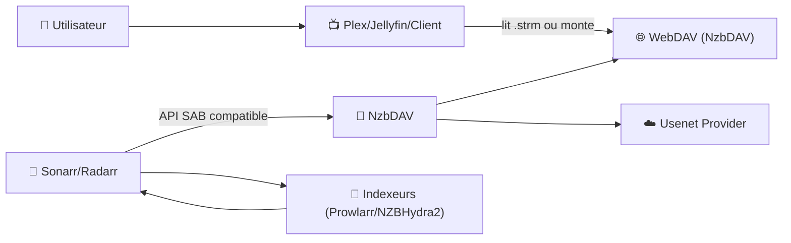
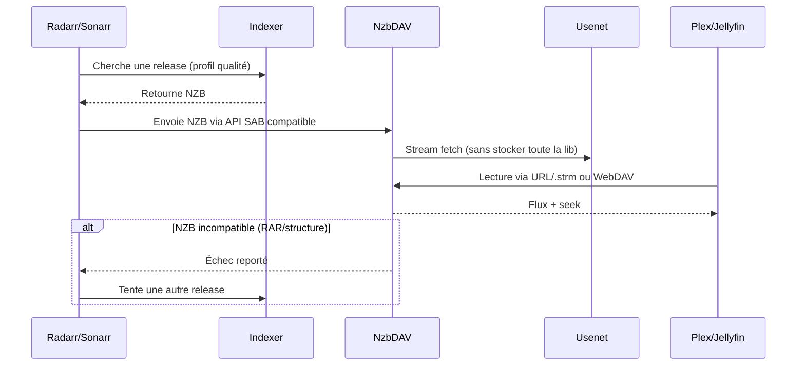

# 🌊 NzbDAV — Présentation & Configuration Premium (WebDAV + Streaming Usenet)

### “Bibliothèque infinie” : streamer depuis Usenet via WebDAV, avec API compatible SABnzbd
Optimisé pour *arr (Sonarr/Radarr) • Plex/Jellyfin • Strm workflow • Qualité & contrôle • Exploitation durable

---

## TL;DR

- **NzbDAV** expose un **serveur WebDAV** qui te permet de **monter/streamer** du contenu référencé par des **NZB**, sans “bibliothèque” qui gonfle ton stockage local.
- Il fournit aussi une **API compatible SABnzbd**, donc les *arr peuvent le piloter comme un “download client” logique.
- En “premium” : tu maîtrises **sources NZB**, **compatibilité (rar vs non-rar)**, **performances (seek/stream)**, **naming/strm**, **observabilité**, et **rollback**.

---

## ✅ Checklists

### Pré-configuration (avant de toucher aux *arr)
- [ ] Accès **Usenet** (provider) opérationnel + identifiants prêts
- [ ] Indexeur(s) / méta-indexeur(s) prêts (via Prowlarr / NZBHydra2, etc.)
- [ ] Décider du workflow : **WebDAV mount direct** vs **.strm library**
- [ ] Définir les contraintes : tolérance aux archives **RAR** (oui/non), formats acceptés, extensions ignorées
- [ ] Définir la politique “qualité” : qui choisit la release (Radarr/Sonarr) et comment NzbDAV réagit aux incompatibilités

### Post-configuration (validation)
- [ ] WebDAV accessible et listable (PROPFIND / browse) depuis ton client
- [ ] Stream + seek OK sur un fichier de test
- [ ] *arr ↔ NzbDAV : ajout du “download client” OK (API SAB compatible)
- [ ] Gestion des erreurs propre : si NZB incompatible, remontée d’erreur → *arr retente une autre release
- [ ] Logs clairs (pas de boucle retry / pas de spam)

---

> [!TIP]
> Le combo le plus robuste : **Radarr/Sonarr choisissent la release**, NzbDAV **stream** via WebDAV, et si une NZB ne convient pas (RAR/problème), NzbDAV **fail** proprement pour forcer un nouvel essai côté *arr.

> [!WARNING]
> Tous les NZB ne se valent pas : **archives RAR**, naming exotique, ou structures internes bizarres peuvent casser l’expérience (listing/seek). Fixe une stratégie claire : “RAR ok” ou “RAR non”.

> [!DANGER]
> N’expose pas WebDAV publiquement sans contrôle d’accès solide. WebDAV = surface d’attaque + fuite potentielle de contenu/metadata si mal protégé.

---

# 1) NzbDAV — Vision moderne

NzbDAV n’est pas un “téléchargeur”.

C’est :
- 🗂️ Un **serveur WebDAV** qui présente les NZB comme un **filesystem virtuel**
- 🎬 Un **moteur de streaming** (lecture + seek) depuis Usenet
- 🔌 Un **endpoint compatible SABnzbd** pour s’intégrer aux *arr
- 🧠 Un “routeur” de décisions : si le contenu est **incompatible**, il remonte l’échec pour déclencher une alternative

Référence projet : https://github.com/nzbdav-dev/nzbdav

---

# 2) Architecture globale



---

# 3) Deux workflows “premium” (choisis ton style)

## A) WebDAV mount direct (mode “filesystem”)
- Tu montes NzbDAV comme un disque réseau (WebDAV)
- Avantage : simple, immédiat
- Limite : dépend beaucoup de ton client WebDAV (certains gèrent mal certains listings/latences)

## B) Bibliothèque `.strm` (mode “media server-friendly”)
- NzbDAV génère des **fichiers `.strm`** pointant vers des URLs streamables
- Plex/Jellyfin indexe une bibliothèque *minuscule* (des `.strm`), et le flux part vers NzbDAV
- Avantage : expérience “Netflix-like” côté media server, stockage minimal
- Limite : discipline de naming + chemins + refresh

---

# 4) Intégration *arr (SABnzbd-compatible API)

## Idée clé
Les *arr savent parler à SABnzbd.  
NzbDAV expose une API “style SABnzbd”, donc *arr le traite comme un **download client**.

## Bonnes pratiques
- Laisse *arr gérer :
  - profils qualité
  - upgrades
  - indexers
  - retry logic (quand NzbDAV échoue)
- Laisse NzbDAV gérer :
  - streaming
  - WebDAV
  - compatibilité (RAR, formats)
  - règles de présentation (extensions ignorées, duplicates, etc.)

---

# 5) Paramètres qui font la différence (configuration premium)

## 5.1 Compatibilité & contenu (RAR / duplicates / extensions)
Stratégies courantes :
- **RAR-friendly** : utile si ton indexeur renvoie beaucoup de releases en archives
- **RAR-avoid** : privilégie des NZB “direct files” (plus fluide pour listing/seek)

Réglages (conceptuellement) à cadrer :
- comportement face aux **duplicates**
- liste d’**extensions ignorées** (samples, nfo, junk)
- règles de sélection du “main file” (si plusieurs gros fichiers)

## 5.2 Streaming & Seek (expérience utilisateur)
Objectif :
- démarrage rapide
- seek “propre” (avance/retour) sans freeze
- priorité bandwidth (stream vs queue) selon ton usage

> [!TIP]
> Valide le seek sur 3 cas : fichier unique, multi-fichiers, et archives (si activées). C’est là que tu vois la qualité réelle du setup.

## 5.3 Sécurité applicative (au bon endroit)
- Auth WebDAV + UI : active et teste
- Si tu utilises un SSO/forward-auth, vérifie les headers/redirects
- Scoping : si tu as plusieurs utilisateurs, définis qui peut lister quoi (au minimum par instance)

---

# 6) Observabilité & “ops hygiene”

## Signaux à surveiller
- erreurs répétées d’un indexer/release
- échecs de listing WebDAV
- latence importante au démarrage stream
- timeouts / throttling côté Usenet provider
- loops de retry côté *arr

## Habitudes pro
- garde un “journal d’incidents” (page BookStack) :
  - symptôme
  - logs clés
  - cause
  - fix
  - prévention

---

# 7) Séquence “release → lecture” (réalité terrain)



---

# 8) Validation / Tests / Rollback

## 8.1 Tests WebDAV (listing + auth)
```bash
# Tester la réponse HTTP (adapt e l’URL)
curl -I "https://TON_DOMAINE_WEBDAV/" | head

# Tester un PROPFIND (WebDAV listing)
curl -X PROPFIND -H "Depth: 1" "https://TON_DOMAINE_WEBDAV/" -u "user:pass" -i | head -n 50
```

## 8.2 Tests streaming (pratiques)
- Lire 1 film complet “standard”
- Faire 10 seeks (avant/arrière) sur 2 min
- Tester 1 release “complexe” (multi-fichiers, ou archives si activées)

## 8.3 Rollback (propre, rapide)
- Revenir à une config “safe” :
  - désactiver options RAR / features récentes si elles posent problème
  - réduire le périmètre (1 indexer, 1 bibliothèque test)
- Règle d’or :
  - un changement à la fois
  - validation immédiate (listing + stream + seek)
  - documenter le delta

---

# 9) Erreurs fréquentes (et comment les tuer)

## “Le client WebDAV liste lentement / timeouts”
- Cause : client WebDAV capricieux, profondeur listing, latence
- Fix :
  - limiter la profondeur (Depth)
  - réduire le nombre d’items présentés
  - préférer workflow `.strm` si ton client WebDAV est fragile

## “Les *arr bouclent sur la même release”
- Cause : échec non propagé proprement, ou indexer renvoie variantes identiques
- Fix :
  - activer une stratégie “fail fast” côté NzbDAV
  - affiner côté *arr (restrictions, preferred words, etc.)
  - gérer duplicates

## “Seek casse sur certaines releases”
- Cause : structure interne, archives, provider quirks
- Fix :
  - basculer “RAR avoid” si possible
  - filtrer certaines releases/groupes
  - tester et whitelister les patterns qui marchent

---

# 10) Sources — Images Docker (format demandé)

## 10.1 Image officielle / upstream (GHCR)
- `ghcr.io/nzbdav-dev/nzbdav` (GitHub Container Registry via workflows) : https://github.com/nzbdav-dev/nzbdav/actions  
- Repo (référence du build/Dockerfile) : https://github.com/nzbdav-dev/nzbdav  
- Dockerfile (référence technique) : https://github.com/nzbdav-dev/nzbdav/blob/main/Dockerfile  

## 10.2 Images Docker Hub (communautaires observées)
- `fatbob01/nzbdav` (Docker Hub) : https://hub.docker.com/r/fatbob01/nzbdav  
- Tags `fatbob01/nzbdav` : https://hub.docker.com/r/fatbob01/nzbdav/tags  
- `r3dlobst3r/nzbdav-parallel` (Docker Hub) : https://hub.docker.com/r/r3dlobst3r/nzbdav-parallel  

## 10.3 LinuxServer.io (LSIO)
- Catalogue des images LinuxServer.io (vérification de disponibilité) : https://www.linuxserver.io/our-images  

> Note : au moment de la rédaction, NzbDAV n’apparaît pas comme image dédiée dans le catalogue LSIO (contrairement à d’autres composants Usenet/*arr).