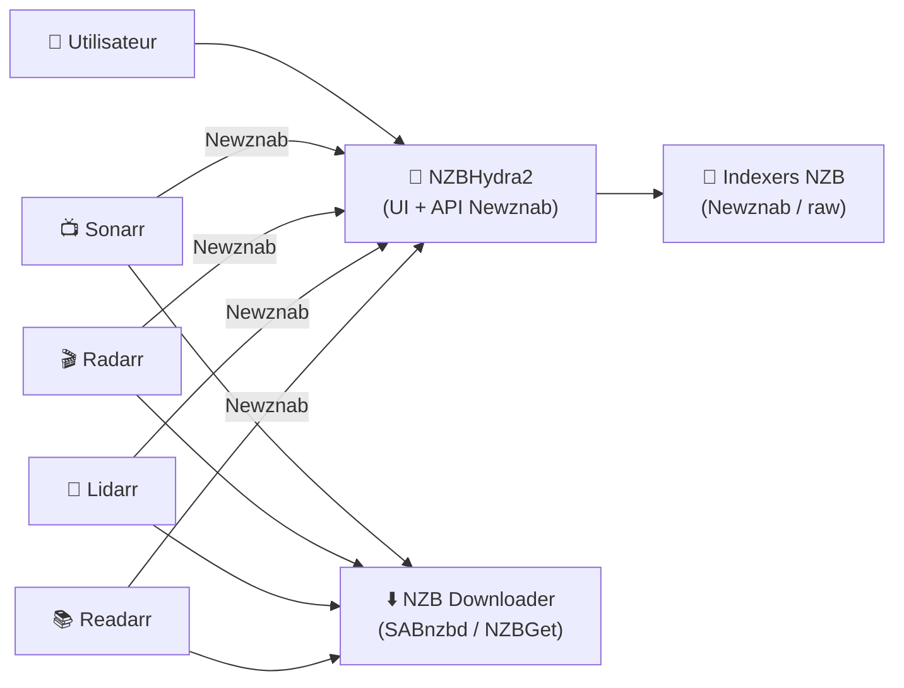
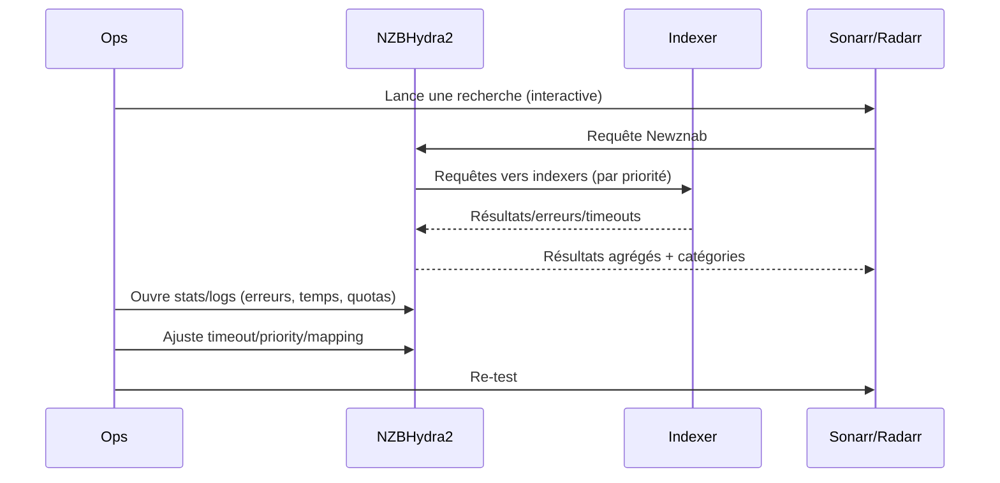

# 🧠 NZBHydra2 — Présentation & Configuration Premium (Meta-indexeur Newznab)

### Recherche unifiée + agrégation d’indexers NZB pour tout ton écosystème (Sonarr/Radarr/Lidarr/Readarr)
Optimisé pour reverse proxy existant • Qualité maîtrisée • Anti-faux positifs • Exploitation durable

---

## TL;DR

- **NZBHydra2** = **méta-indexeur** : un seul endpoint **Newznab** qui agrège plusieurs indexers.
- Il sert d’“indexer unique” à Sonarr/Radarr/Lidarr/Readarr : **moins de duplication**, meilleure **résilience**, scoring plus fin.
- Config premium = **indexers propres**, **catégories cohérentes**, **règles anti-bruit**, **priorités**, **rate limiting**, **monitoring** + **tests/rollback**.

---

## ✅ Checklists

### Pré-configuration (avant de brancher tes apps)
- [ ] Liste d’indexers validés (Newznab/Torznab-like côté NZB) + clés API prêtes
- [ ] Objectif de couverture : généralistes + spécialisés (mais pas 30 indexers “moyens”)
- [ ] Stratégie catégories (Movies/TV/Music/Books) définie
- [ ] Stratégie qualité (bluray/web/hdtv, x265, etc.) portée par Sonarr/Radarr (Hydra = discovery/filtrage)
- [ ] Politique de quotas/rate limit (anti ban providers)
- [ ] Accès sécurisé via ton reverse proxy existant (auth/SSO/ACL)

### Post-configuration (qualité opérationnelle)
- [ ] Un seul “Indexer Newznab” Hydra ajouté dans Sonarr/Radarr
- [ ] Tests de recherche OK (manuel + depuis Sonarr/Radarr)
- [ ] Résultats propres (peu de doublons, catégories cohérentes)
- [ ] Logs sans erreurs “API”, timeouts, rate-limit permanents
- [ ] Procédure “incident indexers” documentée (désactiver/mettre en pause/diagnostic)

---

> [!TIP]
> Hydra2 est surtout un **multiplicateur de propreté** : si tes indexers/catégories sont propres, ton écosystème devient *beaucoup* plus stable.

> [!WARNING]
> Hydra2 ne “répare” pas une stratégie qualité bancale.  
> La **décision qualité** se fait surtout dans Sonarr/Radarr (profils + custom formats).

> [!DANGER]
> Trop d’indexers = plus de bruit + plus de throttling + plus de maintenance.  
> Vise **peu mais fiables**, puis élargis si nécessaire.

---

# 1) NZBHydra2 — Vision moderne

NZBHydra2 n’est pas “juste une barre de recherche”.

C’est :
- 🔎 Un **agrégateur** multi-indexers (Newznab/raw)
- 🧠 Un **normalisateur** (catégories, parsing, uniformisation)
- 🧰 Un **hub** pour Sonarr/Radarr (un seul endpoint)
- 📈 Un **outil d’observabilité** (stats par indexer, erreurs, temps de réponse)

---

# 2) Architecture globale



---

# 3) Philosophie premium (5 piliers)

1. 🧩 **Indexers sélectionnés** (fiables, rapides, catégories correctes)
2. 🧭 **Catégories cohérentes** (mapping Hydra ⇄ Sonarr/Radarr)
3. 🧼 **Anti-bruit** (filtres, gestion doublons, regex, priorités)
4. ⏱️ **Quotas & résilience** (timeouts, retries, rate limiting, fallback)
5. 🧪 **Validation / Tests / Rollback** (avant mise en prod)

---

# 4) Indexers — Sélection & hygiène (ce qui fait 80% du résultat)

## 4.1 Stratégie de sélection
- 1–2 généralistes solides
- 1–2 spécialisés (selon tes besoins : “TV”, “Movies”, “Anime”, “FR”, “Books”)
- Évite les indexers “instables” (downtime, catégories incohérentes, API flaky)

## 4.2 Paramètres critiques par indexer (dans Hydra)
- **API key** + URL (évident)
- **Timeout** raisonnable (sinon Hydra “bloque” tes requêtes)
- **Priority** (les meilleurs en haut)
- **Category mapping** (voir section dédiée)
- **Rate limit / hits per day** si l’indexer impose un quota

> [!TIP]
> Utilise les **stats Hydra** (temps de réponse, erreurs, hits) pour décider quels indexers méritent d’être gardés.

---

# 5) Catégories & Mapping (anti-faux positifs)

## Objectif
Quand Sonarr demande “TV”, Hydra doit renvoyer majoritairement **TV** — pas du “Movie” mal classé.

## Règle d’or
- **Hydra** fait la traduction et l’uniformisation
- **Tes apps** (Sonarr/Radarr/…) ne doivent voir **qu’un indexer** (Hydra), avec des catégories propres

### Mapping typique (conceptuel)
- TV → `5000` (et sous-catégories)
- Movies → `2000`
- Music → `3000`
- Books → `7000`

> [!WARNING]
> Les IDs exacts varient selon conventions Newznab.  
> L’important : **cohérence** entre Hydra et ce que Sonarr/Radarr attend.

---

# 6) Recherche & Qualité de résultats (réduction du bruit)

## 6.1 Doublons & agrégation
Hydra agrège plusieurs sources : tu dois maîtriser :
- doublons (même release vue sur plusieurs indexers)
- “near-duplicates” (variantes de nommage)

## 6.2 Filtres (premium)
Idées de filtres à activer/ajuster :
- Exclure tags “cam/ts” si ta stratégie l’interdit
- Favoriser release groups fiables (si tu as une liste)
- Exclure patterns “passworded”, “fake”, “sample”, etc.

## 6.3 Query rules (intelligence de requête)
- Ajuster la façon dont Hydra construit la requête :
  - recherche exacte vs souple
  - fallback si 0 résultat
- Utile quand certains indexers aiment un format de query particulier

> [!TIP]
> Le meilleur combo : **Hydra propre** + **profils qualité** bien faits dans Sonarr/Radarr.

---

# 7) Intégration Sonarr/Radarr/Lidarr/Readarr (propre & maintenable)

## Approche premium : “un seul indexer”
Dans chaque app :
- Ajouter **un indexer Newznab** (Hydra)
- Ne pas multiplier les indexers directement dans l’app

Bénéfices :
- 🔧 Maintenance centralisée (un endroit)
- 🧠 Normalisation (catégories, parsing)
- 🛟 Résilience : si un indexer tombe, Hydra peut continuer via les autres

---

# 8) Sécurité d’accès (sans recettes reverse proxy)

Bonnes pratiques :
- Accès via ton reverse proxy existant + **auth/SSO** ou ACL réseau
- Désactiver toute exposition “brute” non contrôlée
- Éviter de laisser l’UI accessible publiquement (données et clés indexers)

> [!DANGER]
> Hydra contient des secrets (API keys indexers) et révèle des métadonnées de recherche.  
> Traite-le comme un service sensible.

---

# 9) Workflows premium (incident & exploitation)

## 9.1 Debug d’une recherche “qui ne trouve rien”


## 9.2 Gestion “indexer instable”
- Mettre l’indexer en **pause** temporaire
- Réduire son **priority**
- Ajuster **timeouts**
- Vérifier quotas / rate limit
- Si instabilité chronique : retirer

---

# 10) Validation / Tests / Rollback

## 10.1 Tests de validation (smoke)
```bash
# 1) L'endpoint répond (adapter URL/port)
curl -I http://NZBHYDRA_HOST:PORT | head

# 2) Test API Newznab (conceptuel : adapter endpoint/paramètres)
# (Certaines instances exposent /api? ou /api/v1 ; selon config)
# Vérifie dans l'UI Hydra la doc de l'URL "Newznab API endpoint".
curl -s "http://NZBHYDRA_HOST:PORT/api" | head -n 20
```

## 10.2 Tests fonctionnels
- Dans l’UI Hydra :
  - test de chaque indexer
  - recherche manuelle d’un titre connu
  - vérification catégories (TV vs Movies)
- Dans Sonarr/Radarr :
  - “Test” de l’indexer Hydra
  - recherche d’un épisode/film connu

## 10.3 Rollback (simple)
- Exporter la config Hydra (si option dispo) avant gros changements
- Modifier une seule variable à la fois (timeouts / mapping / filtres)
- En cas de régression :
  - revenir à la config exportée
  - remettre priorités anciennes
  - désactiver le filtre responsable

> [!TIP]
> En prod, le rollback le plus efficace = **désactiver l’indexer fautif** plutôt que tout reconfigurer à chaud.

---

# 11) Erreurs fréquentes (et fixes rapides)

- ❌ Résultats “TV” qui ramènent des films  
  ✅ Corriger mapping catégories + réduire indexers aux catégories correctes

- ❌ Timeouts permanents / UI lente  
  ✅ Réduire timeouts indexers, baisser ceux lents en priorité, limiter le nombre d’indexers

- ❌ Bannissement / rate-limit  
  ✅ Réduire fréquence queries, config quotas, enlever indexer trop strict, éviter “mass search” inutile

- ❌ Trop de doublons  
  ✅ Ajuster agrégation/dedup, réduire sources redondantes, améliorer filtres

---

# 12) Sources — Images Docker (format “URLs brutes”)

## 12.1 Image LinuxServer.io (la plus utilisée)
- `linuxserver/nzbhydra2` (Docker Hub) : https://hub.docker.com/r/linuxserver/nzbhydra2  
- Tags `linuxserver/nzbhydra2` (Docker Hub) : https://hub.docker.com/r/linuxserver/nzbhydra2/tags  
- Doc LinuxServer “docker-nzbhydra2” : https://docs.linuxserver.io/images/docker-nzbhydra2/  
- Repo packaging LinuxServer : https://github.com/linuxserver/docker-nzbhydra2  
- Releases LinuxServer : https://github.com/linuxserver/docker-nzbhydra2/releases  

## 12.2 Alternatives communautaires (si besoin)
- `binhex/arch-nzbhydra2` (Docker Hub) : https://hub.docker.com/r/binhex/arch-nzbhydra2  
- `digrouz/nzbhydra2` (repo image) : https://github.com/digrouz/docker-nzbhydra2  

## 12.3 Historique / images dépréciées (référence)
- LSIO “hydra” déprécié (Docker Hub) : https://hub.docker.com/r/linuxserver/hydra  
- Repo archive “docker-hydra2” (déprécié) : https://github.com/linuxserver-archive/docker-hydra2  
- Doc LSIO deprecated “hydra2” : https://docs.linuxserver.io/deprecated_images/docker-hydra2/  

---

# ✅ Conclusion

NZBHydra2 devient une brique premium quand tu :
- réduis le nombre d’indexers à ceux qui comptent,
- normalises catégories et filtres,
- centralises l’intégration (un seul endpoint),
- testes et rollback proprement.

Résultat : **recherche plus fiable**, **moins d’erreurs**, **maintenance simplifiée**.