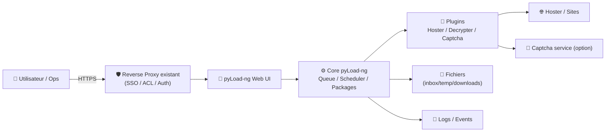
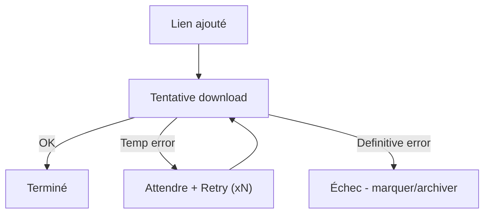
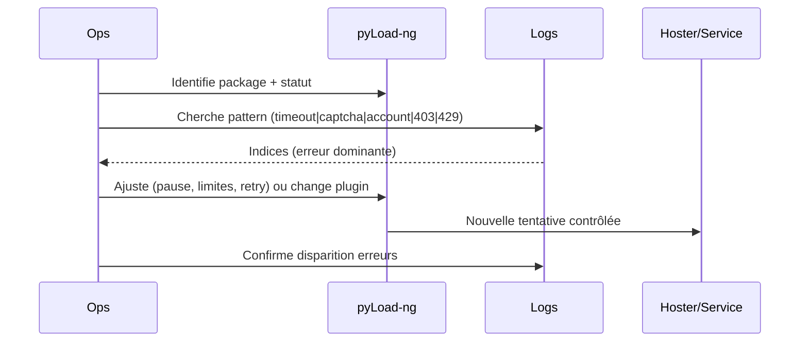

# ⬇️ pyLoad-ng — Présentation & Configuration Premium (Ops + Qualité + Sécurité)

### Download manager léger avec Web UI + plugins : hosters, décryptage, captchas, automation
Optimisé pour reverse proxy existant • Comptes premium • Plugins maîtrisés • Exploitation durable

---

## TL;DR

- **pyLoad-ng** = gestionnaire de téléchargements **pilotable via une UI web** + **plugins** (hosters, décryptage, captchas, comptes premium).
- En “premium ops”, tu verrouilles : **auth**, **plugins**, **répertoires**, **quotas**, **rétries**, **logs**, **tests**, **rollback**.
- Objectif : **téléchargements fiables** + **bibliothèque propre** + **moins d’interventions**.

Références : https://pyload.net/  
Repo : https://github.com/pyload/pyload

---

## ✅ Checklists

### Pré-configuration (avant d’ouvrir l’accès)
- [ ] Définir les dossiers : `inbox` (entrée), `downloads` (final), `temp`
- [ ] Définir une politique de fichiers : naming, sous-dossiers, “one package = one dossier”
- [ ] Lister les plugins strictement nécessaires (hosters, decrypter, captcha)
- [ ] Définir les limites : connexions, retries, backoff, taille max si besoin
- [ ] Choisir le modèle d’accès : SSO/proxy headers OU auth interne forte
- [ ] Définir un “runbook incident” (dépannage rapide)

### Post-configuration (qualité opérationnelle)
- [ ] Un téléchargement test (HTTP direct) OK
- [ ] Un téléchargement via un decrypter/collector OK
- [ ] Un téléchargement via compte premium OK (si utilisé)
- [ ] Les fichiers atterrissent au bon endroit (pas de mélange)
- [ ] Les logs sont exploitables (niveau/rotation)
- [ ] Plan de rollback documenté (config + data)

---

> [!TIP]
> pyLoad-ng est excellent quand tu le traites comme un **service** : règles simples, plugins limités, logs lisibles, et un chemin “inbox → tri → stockage”.

> [!WARNING]
> Les plugins hosters/captcha évoluent souvent (changements côté sites).  
> **Ne surcharge pas** : moins de plugins = moins de casse.

> [!DANGER]
> Ne publie pas pyLoad-ng sans contrôle d’accès. L’UI peut exposer des URLs, comptes, historiques, et des fichiers.

---

# 1) pyLoad-ng — Vision moderne

pyLoad-ng n’est pas “juste une file de téléchargement”.

C’est :
- 🧩 Un **moteur de plugins** (hosters, decrypt, captchas)
- 🧠 Un **orchestrateur** (packages, priorités, retries, scheduler)
- 🔐 Un **gestionnaire d’accès** (comptes premium / services externes)
- 🌐 Une **UI web** (pilotage, monitoring, contrôles rapides)

Cas d’usage typiques :
- Téléchargements réguliers depuis hosters
- Collecte de liens (packages) + traitement “batch”
- Automatisation légère (scheduler, règles de retry)
- Dépannage via logs + UI (sans shell)

---

# 2) Architecture globale



---

# 3) Configuration premium (5 piliers)

1. 🔐 **Accès sécurisé** (SSO/proxy auth ou auth interne robuste)
2. 🧩 **Plugins minimalistes** (nécessaires uniquement)
3. 🗂️ **Dossiers & packages** (structure stable, pas de chaos)
4. 🔁 **Fiabilité** (retries, backoff, limites, planification)
5. 🧪 **Validation + rollback** (tests simples, retour arrière clair)

---

# 4) Gouvernance d’accès (propre)

## Modèle recommandé
- **Admin** : configuration, plugins, comptes premium
- **Ops** : contrôle queue, pause/reprise, logs
- **User** : ajout de liens/packages, consultation (lecture)

Bonnes pratiques :
- Session courte / cookies derrière proxy
- Désactiver/limiter les endpoints “dangereux” si disponibles
- Journaliser les actions (si option) ou au minimum conserver logs

> [!WARNING]
> Si tu relies pyLoad-ng à un reverse proxy avec SSO, teste : logout, expiration, et accès direct au port interne (doit être inaccessible).

---

# 5) Dossiers & “packages” (ce qui rend la queue maintenable)

## Stratégie “3 zones”
- **Inbox** : ce qui arrive (liens déposés, imports)
- **Temp** : téléchargement en cours (incomplet)
- **Final** : destination stable

Objectif :
- pas de mélange “en cours / fini”
- nettoyage facile
- tri automatisable (scripts externes si besoin)

## Convention package “pro”
- 1 package = 1 sujet = 1 dossier
- nom de package stable :
  - `YYYY-MM - Source - Sujet`
  - `ProjetX - Batch01`

> [!TIP]
> Quand un incident arrive, une bonne convention package te permet de “voir” immédiatement ce qui coince (source, série de liens, priorité).

---

# 6) Plugins (stratégie premium : moins mais mieux)

## Typologies
- **Hoster** : gère un site / provider
- **Decrypter** : transforme une URL “collector” en liens directs
- **Captcha** : résout/interagit (services externes ou manuel)

## Règles d’or
- Désactiver tout ce qui est inutile
- Tester un plugin sur 1 téléchargement avant de l’activer “globalement”
- Documenter : *plugin*, *version*, *symptômes connus*, *workaround*

### Matrice “stabilité”
| Catégorie | Risque | Contrôle |
|---|---:|---|
| Hoster | Élevé | Update + tests réguliers |
| Decrypter | Moyen | Limiter aux sources clés |
| Captcha | Variable | Backoff + fallback manuel |

> [!WARNING]
> Certains hosters changent fréquemment : un plugin “cassé” peut provoquer retries infinis → throttling → ban. Mets des limites.

---

# 7) Fiabilité : queue, retries, backoff, limites

## Politique recommandée (générique)
- Limiter les connexions simultanées (évite bans)
- Retries : oui, mais avec plafond
- Backoff progressif (attendre plus longtemps après échec)
- Distinguer :
  - erreurs “temporaires” (timeout, 5xx)
  - erreurs “définitives” (404, lien mort, compte invalide)

### Pattern d’optimisation (logique)


---

# 8) Workflows premium (ops & support)

## 8.1 “Triage incident” (séquence)


## 8.2 “Runbook express”
- **Captcha** : vérifier service/compte → basculer en manuel → limiter retries
- **403/429** : réduire concurrence → augmenter backoff → vérifier proxy/VPN si utilisé
- **Compte premium** : vérifier quota/validité → re-auth → fallback sans compte
- **Lien mort** : marquer échec définitif → purge propre

---

# 9) Validation / Tests / Rollback

## Tests de validation (fonctionnels)
```bash
# 1) Accès UI (interne)
curl -I http://PYLOAD_HOST:PORT | head

# 2) Test téléchargement “simple” (HTTP direct)
# (manuel via UI) Ajouter une URL directe → doit passer en "Finished"

# 3) Test décryptage (si utilisé)
# (manuel via UI) Ajouter une URL collector → doit se transformer en liens téléchargeables

# 4) Test hoster + compte premium (si utilisé)
# (manuel) Ajout lien hoster → vérifier vitesse/erreur "account"
```

## Tests de non-régression (après MAJ plugins)
- 1 lien par source critique
- 1 test captcha (si concerné)
- 1 test package multi-liens

## Rollback (propre)
- Sauvegarder :
  - config pyLoad-ng
  - base/DB interne si applicable
  - dossiers `downloads` + métadonnées de queue si séparées
- Rollback = revenir à la config précédente + désactiver plugin fautif

> [!TIP]
> Un rollback “opérationnel” peut être aussi simple que : *désactiver 1 plugin + purger 1 batch + relancer un test contrôlé*.

---

# 10) Dépannage premium (symptômes → causes → actions)

## 10.1 Téléchargements bloqués “en boucle”
Causes possibles :
- Plugin hoster cassé
- Captcha non résolu
- Throttling (429) / ban

Actions :
- réduire concurrence
- augmenter backoff
- désactiver plugin incriminé
- valider avec 1 seul lien test

## 10.2 “Fichier introuvable” / “move failed”
Causes :
- chemins incohérents
- permissions
- espace disque

Actions :
- vérifier espace disque + droits
- vérifier que temp/final sont cohérents
- réduire “post-processing” si instable

## 10.3 UI lente / timeouts
Causes :
- queue énorme non purgée
- logs trop verbeux
- ressources faibles

Actions :
- purger anciens packages
- réduire verbosité
- revoir planification / limites

---

# 11) Sources — Images Docker (URLs brutes, format demandé)

## 11.1 Image LinuxServer.io (la plus utilisée en homelab)
- `linuxserver/pyload-ng` (Docker Hub) : https://hub.docker.com/r/linuxserver/pyload-ng  
- Doc LinuxServer “pyload-ng” : https://docs.linuxserver.io/images/docker-pyload-ng/  
- Repo de packaging (référence de l’image) : https://github.com/linuxserver/docker-pyload-ng  
- Package GHCR (pull ghcr.io/linuxserver/pyload-ng) : https://github.com/orgs/linuxserver/packages/container/pyload-ng

## 11.2 Ancienne image LinuxServer (historique / deprecated)
- `linuxserver/pyload` (Docker Hub) : https://hub.docker.com/r/linuxserver/pyload  
- Doc LinuxServer (deprecated) “pyload” : https://docs.linuxserver.io/deprecated_images/docker-pyload/

## 11.3 Références projet (upstream)
- Site pyLoad : https://pyload.net/  
- Repo GitHub : https://github.com/pyload/pyload  
- Releases (indique aussi LinuxServer comme option Docker) : https://github.com/pyload/pyload/releases

---

# ✅ Conclusion

pyLoad-ng devient “premium” quand :
- tu limites les plugins à l’essentiel,
- tu imposes une gouvernance d’accès,
- tu stabilises les dossiers/packages,
- tu contrôles retries/backoff,
- et tu testes systématiquement après toute évolution côté plugins/hosters.

Résultat : moins de babysitting, plus de fiabilité, et une queue qui reste lisible même en charge.