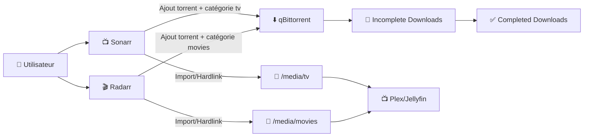
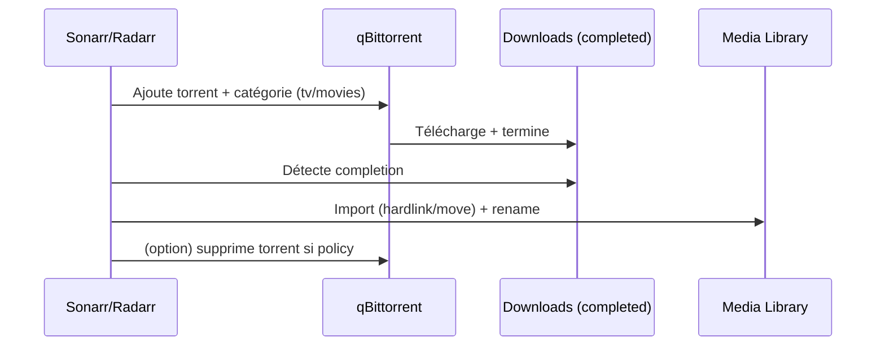

# ⬇️ qBittorrent — Présentation & Configuration Premium (Ops + Qualité + Sécurité d’accès)

### Client BitTorrent moderne : catégories propres, chemins stables, automatisation Radarr/Sonarr, exploitation fiable
Optimisé pour écosystème *arr • Qualité maîtrisée • Organisation SSDv2 • Accès sécurisé via reverse proxy existant

---

## TL;DR

- **qBittorrent** = client BitTorrent complet avec **WebUI**, gestion **catégories**, **tags**, **RSS**, limites, files d’attente.
- En stack média : qBittorrent devient le “**download engine**” derrière **Sonarr/Radarr**.
- “Premium” = **catégories strictes**, **chemins cohérents**, **hardlinks possible**, **règles de queue**, **sécurité WebUI**, **tests & rollback**.

---

## ✅ Checklists

### Pré-configuration (avant de brancher Sonarr/Radarr)
- [ ] Choisir une convention **catégories** (ex: `tv`, `movies`)
- [ ] Définir une structure de dossiers **stable** (incomplete / completed)
- [ ] Valider que “downloads” et “media” sont sur le **même filesystem** si tu veux des hardlinks
- [ ] Définir la stratégie **ratio/seed-time** (selon usage/trackers)
- [ ] Sécuriser l’accès WebUI (auth forte + IP whitelist si possible)

### Post-configuration (qualité opérationnelle)
- [ ] Un torrent test arrive dans la bonne catégorie + bon dossier
- [ ] Completed → import côté Sonarr/Radarr OK
- [ ] Les permissions fichiers sont correctes (lecture/écriture)
- [ ] Les règles de queue évitent le “torrent-storm” (trop de simultané)
- [ ] Le WebUI n’est pas exposé publiquement sans contrôle d’accès

---

> [!TIP]
> Le combo gagnant : **catégories + chemins + hardlinks** (quand possible) = imports instantanés, pas de duplication disque.

> [!WARNING]
> Problème #1 en prod : **mauvais chemins / catégories** → Sonarr/Radarr n’importent pas, ou importent dans le mauvais endroit.

> [!DANGER]
> Ne laisse jamais le **WebUI** accessible publiquement sans auth + contrôle d’accès : c’est une surface d’attaque (et un aimant à bots).

---

# 1) qBittorrent — Vision moderne

qBittorrent n’est pas “juste un client torrent”.

C’est :
- 🧠 Un **orchestrateur de transferts** (queues, priorités, limites)
- 🏷️ Un **moteur d’organisation** (catégories, tags, règles)
- 🔌 Un **endpoint d’automatisation** (API/WebUI utilisée par *arr)
- 📈 Un **outil d’exploitation** (logs, état des pairs, erreurs tracker, DHT/PeX)

---

# 2) Architecture globale (stack *arr)



---

# 3) Philosophie “premium” (5 piliers)

1. 🏷️ **Catégories strictes** (tv/movies + éventuellement anime/music/books)
2. 🧭 **Chemins cohérents** (incomplete/completed + mapping stable)
3. ⚖️ **Queues & limites intelligentes** (éviter saturation CPU/disque/IO)
4. 🌱 **Politique de seeding claire** (ratio/temps/trackers)
5. 🛡️ **WebUI sécurisé** (auth + restrictions d’accès)

---

# 4) Organisation des dossiers (le socle)

## Modèle recommandé (SSDV2-friendly)

- Downloads (zone de travail)  
  - `/data/downloads/incomplete/`
  - `/data/downloads/completed/`

- Media (bibliothèque)  
  - `/data/media/tv/`
  - `/data/media/movies/`

> [!WARNING]
> Si tu veux des **hardlinks** (imports sans duplication), `/data/downloads` et `/data/media` doivent être sur le **même filesystem** (même partition / même pool).

---

# 5) Catégories, chemins et règles (la partie qui change tout)

## 5.1 Catégories
Crée au minimum :
- `tv`
- `movies`

Et associe si possible un **Save Path** spécifique par catégorie (ou via règles/auto-management), pour éviter le mélange.

## 5.2 Incomplete vs Completed
Objectif :
- Incomplete = fichiers en cours (risque de fragmentations, renommages partiels)
- Completed = prêts à être importés

## 5.3 Tags (option premium)
Exemples :
- `tracker_private`
- `tracker_public`
- `4k`
- `x265`
- `priority_high`

Ça permet des vues filtrées et du tri incident (ex: “tout ce qui vient du tracker X”).

---

# 6) Seeding & ratio : stratégie “propre”

## Deux approches simples

### A) Seed-time (pragmatique)
- Seed 24h / 72h selon ton usage
- Avantage : stable, prévisible, évite l’infini

### B) Ratio-based (souvent requis en privé)
- Ratio min (ex: 1.0) + seed-time max (ex: 7 jours)
- Avantage : respecte les règles trackers tout en limitant l’occupation

> [!TIP]
> Si tu mélanges public + privé : applique des règles différentes via catégories/tags, sinon tu vas soit sous-seeder (private), soit sur-seeder (public).

---

# 7) Queues & limites (stabilité et performance)

## Pourquoi c’est critique
Sans limites :
- pics CPU (hashing)
- saturation disque (écritures parallèles)
- latence réseau
- import *arr instable (timing, IO)

## Réglage premium (logique)
- Limiter **torrents actifs** (download + upload)
- Limiter **downloads simultanés**
- Limiter **uploads simultanés**
- Ajuster **connexions par torrent** (pas besoin d’exploser)

> [!WARNING]
> Trop d’uploads simultanés = performance globale dégradée + timeouts trackers + UI lente.

---

# 8) WebUI & sécurité d’accès (sans recettes reverse proxy)

## Points indispensables
- ✅ **Mot de passe fort** (et change-le dès le départ)
- ✅ Désactiver l’accès anonyme
- ✅ Restreindre par IP (whitelist) si tu es en LAN
- ✅ Si exposé via reverse proxy existant : ajouter un contrôle d’accès (SSO/forward-auth/VPN)

## “Whitelist LAN” (approche très efficace)
Autoriser seulement un subnet interne (ex: `192.168.1.0/24`) et refuser le reste.

> [!DANGER]
> Même si tu es derrière HTTPS, sans contrôle d’accès tu peux te faire brute-force. Le WebUI doit être traité comme une interface admin.

---

# 9) Intégration Sonarr/Radarr (le contrat de compatibilité)

## Ce que *arr attend de qBittorrent
- Catégorie dédiée (`tv` / `movies`)
- Completed Download Handling côté *arr activé
- Chemins cohérents : ce que qBittorrent écrit doit être lisible par *arr
- Si hardlinks : mêmes volumes / même filesystem

## Erreurs typiques
- Catégorie différente entre *arr et qBittorrent → imports ratés
- Completed écrit ailleurs que prévu → *arr “ne voit rien”
- Permissions (UID/GID) → import impossible

---

# 10) Workflows premium

## 10.1 Workflow “happy path”


## 10.2 Workflow “incident”
- Tracker down / announce fails
- Downloads bloqués (stalled)
- Disque plein
- Permissions refusées
- Saturation IO (trop de torrents actifs)

Dozzle/outil logs (si tu en as) + logs qBittorrent = diagnostic rapide.

---

# 11) Validation / Tests / Rollback

## Tests rapides (smoke)
```bash
# WebUI répond (adapte host/port)
curl -I http://QB_HOST:QB_PORT | head

# Connectivité basique (si tu as une URL reverse proxy)
curl -I https://qb.example.tld | head
```

## Tests fonctionnels
- Ajouter 1 torrent test dans la catégorie `tv`
- Vérifier :
  - il va en `incomplete`, puis `completed`
  - Sonarr importe correctement vers `/media/tv`
  - le renommage est propre
  - aucun doublon disque inattendu (si hardlinks)

## Rollback (safe)
- Sauvegarder la config qBittorrent (fichier de conf + état) avant changement majeur
- Si modification de chemins/catégories :
  - revenir aux anciens chemins
  - relancer un test torrent
  - vérifier que *arr réimporte correctement

> [!TIP]
> Quand tu changes chemins/catégories : fais-le sur un environnement “test” ou hors heures de pointe.

---

# 12) Erreurs fréquentes (et fixes)

## “Sonarr/Radarr n’importe pas”
- Cause : catégorie incorrecte / completed path inattendu
- Fix : aligner catégorie + vérifier dossier completed + permissions

## “Téléchargements très lents”
- Cause : trop de torrents actifs / trop de connexions / IO saturé
- Fix : baisser simultané, ajuster connexions, vérifier disque

## “WebUI inaccessible / mot de passe oublié”
- Fix : suivre la procédure officielle de reset/identifiants selon ton mode de déploiement (varie selon paquet/image)

---

# 13) Sources — Images Docker (format demandé, URLs brutes)

## 13.1 Image officielle qBittorrent
- `qbittorrentofficial/qbittorrent-nox` (Docker Hub) : https://hub.docker.com/r/qbittorrentofficial/qbittorrent-nox  
- Repo officiel “docker-qbittorrent-nox” (référence de l’image) : https://github.com/qbittorrent/docker-qbittorrent-nox  

## 13.2 Image LinuxServer.io (très utilisée en self-hosted)
- `linuxserver/qbittorrent` (Docker Hub) : https://hub.docker.com/r/linuxserver/qbittorrent  
- Doc LinuxServer “docker-qbittorrent” : https://docs.linuxserver.io/images/docker-qbittorrent/  

## 13.3 Image hotio (alternative populaire, options VPN selon doc)
- `hotio/qbittorrent` (documentation) : https://hotio.dev/containers/qbittorrent/  
- Repo GitHub (référence) : https://github.com/hotio/qbittorrent  

---

# ✅ Conclusion

qBittorrent “premium” = un client torrent **prévisible** et **automatisable** :
- catégories strictes
- chemins stables (incomplete/completed)
- limites de queue pour préserver les ressources
- politique de seeding claire
- WebUI verrouillé (auth + restrictions)

C’est ce qui rend l’écosystème *arr vraiment “zéro friction”.