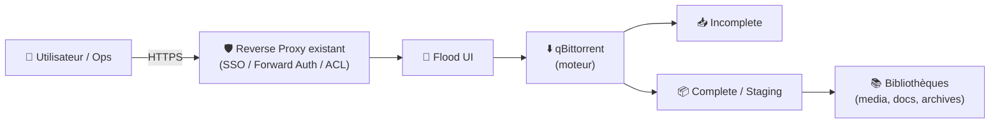
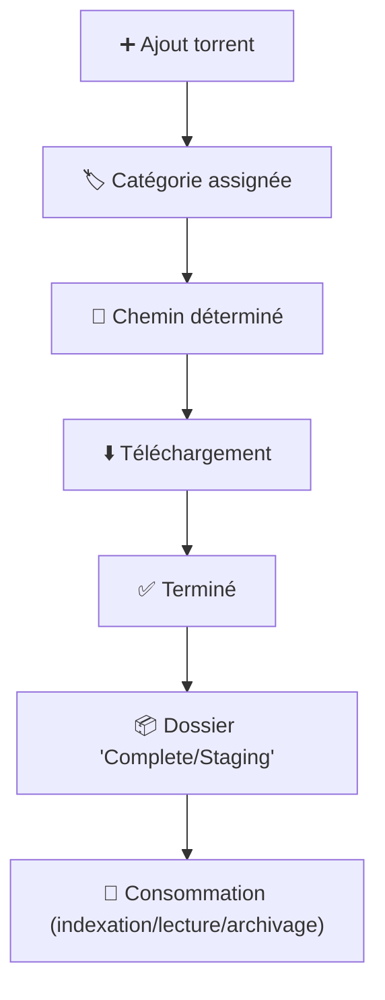
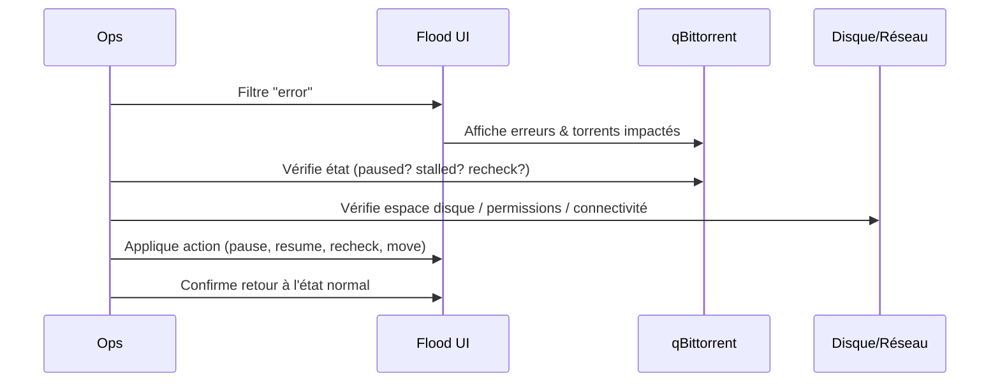

# 🌊 qflood — Présentation & Configuration Premium (qBittorrent + Flood UI)

### Client BitTorrent + UI moderne “ops-friendly”
Optimisé pour reverse proxy existant • Organisation propre • Contrôle d’accès • Exploitation durable

---

## TL;DR

- **qflood** = **qBittorrent** (moteur) + **Flood** (UI moderne) dans une même solution.
- Valeur : **pilotage plus agréable** que l’UI native, **filtres**, **vues**, **actions en masse**, **meilleure lisibilité**.
- “Premium” = **catégories/paths cohérents**, **labels/naming**, **droits**, **quotas**, **monitoring**, **tests** + **rollback**.

---

## ✅ Checklists

### Pré-configuration (avant usage “prod”)
- [ ] Politique d’accès (qui voit/qui agit) définie
- [ ] Stratégie **catégories** (ex: `movies`, `tv`, `manual`, `seed`) définie
- [ ] Stratégie de **chemins** (incomplete/complete) claire et stable
- [ ] Politique de **ratio/seed time** alignée (par catégorie si possible)
- [ ] Stratégie de **gestion disque** (hardlinks/atomic moves selon ton écosystème) décidée
- [ ] Politique de logs : quoi capturer en incident (extraits + timestamps)

### Post-configuration (qualité opérationnelle)
- [ ] Ajout d’un torrent place le contenu **dans le bon répertoire** via catégorie
- [ ] Les téléchargements finissent, sont déplacés/traités comme prévu
- [ ] Les statuts (DL/UL/paused/error) sont lisibles en 10 secondes
- [ ] Les erreurs récurrentes sont identifiables (I/O, permissions, trackers, réseau)
- [ ] Procédure “rollback” documentée (retour UI native / rollback version)

---

> [!TIP]
> Flood est excellent pour **l’exploitation** (lecture, tri, opérations en masse).  
> qBittorrent reste le **moteur** : catégories + chemins + limites = la base de la stabilité.

> [!WARNING]
> Le piège #1 : catégories mal alignées → fichiers au mauvais endroit, automations qui “ratent” le contenu, rangement incohérent.

> [!DANGER]
> Si qBittorrent (ou l’UI) est accessible depuis l’extérieur : impose **contrôle d’accès fort** (SSO/forward-auth/VPN) + permissions minimales.  
> Une UI de téléchargement est une surface sensible.

---

# 1) Vision moderne

qflood n’est pas “juste une UI”.

C’est :
- 🧠 Un **poste de contrôle** (files, priorités, tags/categories)
- 🔍 Un **outil de diagnostic** (erreurs, vitesse, connexions, état)
- 🧩 Un **pivot d’automatisation** quand tu relies d’autres outils (bibliothèques, post-traitements, etc.)
- 🧰 Un **outil de maintenance** (pause globale, purge, recheck, relabel)

---

# 2) Architecture globale (concept)



---

# 3) Philosophie premium (5 piliers)

1. 🗂️ **Catégories cohérentes** (règles simples, stables)
2. 🧭 **Chemins maîtrisés** (incomplete/complete, même logique partout)
3. 🎛️ **Limites/quotas** (connexion, bande passante, seed policy)
4. 🔐 **Accès sécurisé** (auth, scopes, moindre privilège)
5. 🧪 **Validation + rollback** (tests courts, retour arrière prêt)

---

# 4) Catégories & Chemins (le cœur de la stabilité)

## 4.1 Convention catégories (exemple “propre”)
- `manual` : ajouts manuels (triage)
- `tv` : séries
- `movies` : films
- `seed` : stockage long (si tu sépares)
- `temp` : tests

> [!TIP]
> Choisis 5–8 catégories max.  
> Trop de catégories = confusion, erreurs, maintenance lourde.

## 4.2 Règles de chemins recommandées
Objectif : un flux prévisible.

- **Incomplete** : zone “en cours”
- **Complete/Staging** : zone “terminé”
- Optionnel : par catégorie → sous-dossiers dédiés

Résultat attendu :
- le contenu “fini” n’est jamais mélangé avec le contenu “en cours”
- une catégorie place automatiquement au bon endroit

## 4.3 Politique de déplacement
- **Évite les déplacements manuels** : tout doit être déterministe (catégorie → chemin)
- Mets en place une règle “un torrent → un dossier racine”
- Pour les packs : préfère des noms de dossiers stables et lisibles

---

# 5) Seed policy & Limites (éviter le chaos réseau/disque)

## 5.1 Seed policy (approche pragmatique)
- Catégorie `manual` : seed court (validation rapide)
- Catégorie `seed` : seed long (si tu gardes)
- Catégorie `tv/movies` : selon ton usage (temps ou ratio)

Le but :
- éviter d’avoir 200 torrents “actifs” inutilement
- protéger le disque (et le CPU) des rechecks permanents

## 5.2 Limites (baseline)
- Limite de connexions raisonnable
- Limite d’upload si ton lien est sensible
- Limite de torrents actifs/seed actifs

> [!WARNING]
> Trop d’actifs = UI lente, I/O saturé, latence réseau, timeouts.

---

# 6) Exploitation “ops” avec Flood (ce qui fait la différence)

## 6.1 Vues & filtres utiles
- **État** : downloading / seeding / paused / error
- **Catégorie** : `tv`, `movies`, `manual`
- **Age** : ce qui traîne depuis X jours
- **Size** : gros volumes
- **Tracker / source** : si pertinent pour diagnostiquer

## 6.2 Routine “triage” (5 minutes)
1. Filtrer `error`
2. Vérifier erreurs disque (permissions / espace)
3. Vérifier erreurs réseau (DNS / connectivité)
4. Vérifier ratios/seed policies (torrents “bloqués”)
5. Nettoyer/archiver (pause, remove, recheck si besoin)

---

# 7) Sécurité & Contrôle d’accès (sans recettes proxy)

## 7.1 Principes non négociables
- Accès **protégé** (SSO/forward-auth/VPN)
- Compte admin utilisé uniquement pour l’admin
- Comptes “opérations” avec droits minimaux si possible
- Journaliser l’accès si ton proxy/SSO le permet

## 7.2 Surface sensible (à anticiper)
- UI = actions destructives (supprimer, déplacer, recheck)
- Logs = infos sensibles (chemins, erreurs, identifiants selon contexte)

> [!DANGER]
> Si tu dois ouvrir à plusieurs personnes : impose une gouvernance (qui supprime / qui pause / qui change les chemins).

---

# 8) Workflows premium (diagrammes)

## 8.1 Ajout → catégorie → rangement (flow)


## 8.2 Incident : “ça télécharge pas / ça plante” (sequence)


---

# 9) Validation / Tests / Rollback

## 9.1 Tests de validation (smoke)
```bash
# 1) UI répond (depuis réseau interne)
curl -I http://QFLOOD_HOST:PORT | head

# 2) Ajout d'un torrent "test" (manuel) et vérification:
# - catégorie appliquée
# - chemin final correct
# - passage DL -> Done
```

## 9.2 Tests fonctionnels (qualité)
- Torrent test catégorie `manual` :
  - doit aller en “incomplete” puis “complete/manual”
- Torrent test catégorie `tv` :
  - doit finir en “complete/tv”
- Vérifier que la suppression “sans supprimer les données” vs “avec données” est claire (éviter accident)

## 9.3 Rollback (prêt en 2 minutes)
- Revenir à l’UI native (si Flood pose problème)
- Revenir à une version connue stable (si tu utilises des tags de version)
- Restaurer configuration (sauvegarde du dossier de config) si corruption/erreur de paramétrage

> [!TIP]
> Avant toute mise à jour : snapshot/backup de la config + test sur un petit subset de torrents.

---

# 10) Sources — Images / Projets / Références (URLs brutes)

## 10.1 Image qflood (engels74) — la plus citée
- `engels74/qflood` (Docker Hub) : https://hub.docker.com/r/engels74/qflood  
- Tags `engels74/qflood` (Docker Hub) : https://hub.docker.com/r/engels74/qflood/tags  
- Repo GitHub (engels74/qflood) : https://github.com/engels74/qflood  
- Documentation engels74 (qflood) : https://engels74.net/containers/qflood/  

## 10.2 Flood (upstream UI)
- Repo Flood (jesec/flood) : https://github.com/jesec/flood  
- Site Flood : https://flood.js.org/  
- Flood “ancien repo” (DEPRECATED, renvoie vers jesec) : https://github.com/Flood-UI/flood  
- Image Flood (Docker Hub) : https://hub.docker.com/r/jesec/flood  

## 10.3 LinuxServer.io (info “si existe”)
- Images LinuxServer (liste officielle) : https://www.linuxserver.io/our-images  
- `linuxserver/flood` (Docker Hub) : https://hub.docker.com/r/linuxserver/flood  

## 10.4 Note “hotio/qflood” (si tu croises ce nom)
- Page communautaire mentionnant `hotio/qflood` : https://wiki.ravianand.me/en/home-server/apps/servarr/qflood  