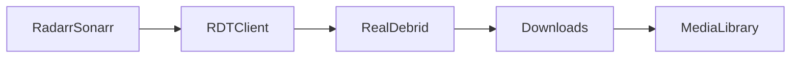
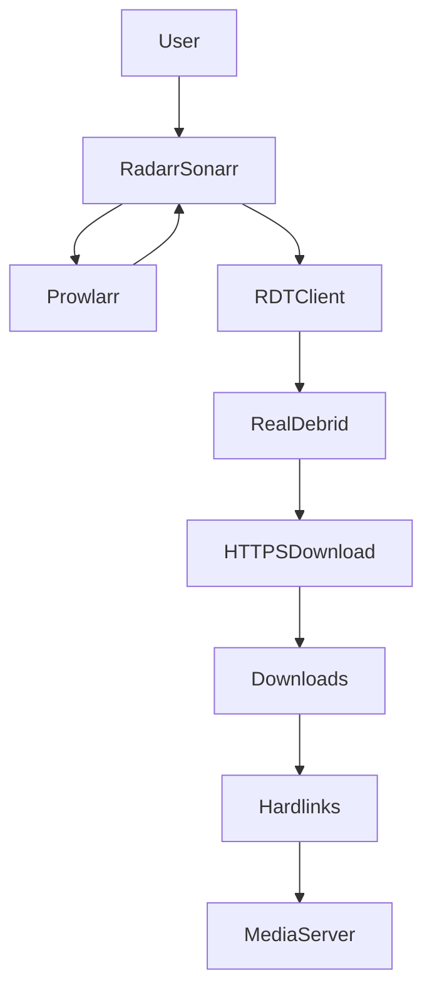
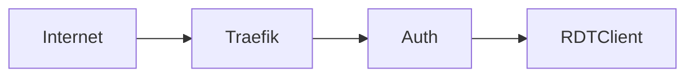

# ⚡ RDTClient — Intégration Real-Debrid Premium

!!! abstract ""
    **Téléchargement via Real-Debrid sans exposition torrent.**  
    Sécurisé • Automatisé • Intégré Radarr/Sonarr • Optimisé SSDv2

---

# 🎯 Qu’est-ce que RDTClient ?

RDTClient (Real-Debrid Torrent Client) est un client permettant :

- D’envoyer des torrents vers Real-Debrid
- De récupérer les fichiers via téléchargement direct HTTPS
- D’éviter l’exposition P2P publique
- D’automatiser via Radarr / Sonarr

Contrairement à qBittorrent :

- ❌ Pas de seed
- ❌ Pas d’exposition IP torrent
- ✅ Téléchargement via Real-Debrid
- ✅ Connexion chiffrée HTTPS

---

# 🧠 Rôle dans l’écosystème SSDv2

Architecture simplifiée :



RDTClient agit comme :

- Interface entre *arr apps* et Real-Debrid
- Gestionnaire de téléchargement direct
- Alternative au client torrent classique

---

# 🏗️ Architecture Complète



---

# ⚙️ Configuration Complète RDTClient

---

# 🔑 1️⃣ API Real-Debrid

1. Se connecter sur :
   https://real-debrid.com/apitoken

2. Générer un token API

3. Dans RDTClient :

- Coller API Key
- Tester connexion

---

# 📂 2️⃣ Configuration des Dossiers

Structure recommandée :

```
/data/
    downloads/
    media/
```

Dans RDTClient :

- Download Path : `/data/downloads`

⚠️ Important :

- Même filesystem que `/data/media`
- Hardlinks doivent fonctionner

---

# 🔄 3️⃣ Intégration Radarr / Sonarr

Dans Radarr / Sonarr :

Settings > Download Clients

Ajouter :

- Type : qBittorrent compatible (selon implémentation)
- Host : rdtclient
- Port : interne Docker
- Category : movies / series

Activer :

- ✅ Completed Download Handling
- ✅ Use Hardlinks

---

# 📊 4️⃣ Paramètres recommandés RDTClient

## 🔧 Général

- Auto import activé
- Suppression automatique après import (optionnel)
- Retry activé

## 📦 Files

- Auto-select files activé
- Skip sample files activé

## 🕒 Monitoring

- Polling interval raisonnable (ex : 60s)

---

# 🔐 5️⃣ Sécurisation

Ne jamais exposer RDTClient publiquement.

Architecture recommandée :



Recommandations :

- HTTPS obligatoire
- Accès limité
- CrowdSec possible

---

# ⚡ 6️⃣ Avantages vs Torrent classique

| Fonction | qBittorrent | RDTClient |
|-----------|-------------|-----------|
| P2P direct | ✅ | ❌ |
| Seed | ✅ | ❌ |
| Exposition IP | Oui | Non |
| Téléchargement HTTPS | ❌ | ✅ |
| Simplicité | Moyenne | Élevée |

---

# 🛡️ 7️⃣ Sécurité & Confidentialité

Avec RDTClient :

- Pas de ports torrent ouverts
- Pas de seed obligatoire
- Téléchargement chiffré HTTPS
- IP masquée derrière Real-Debrid

---

# 🔗 8️⃣ Hardlinks

Même logique que Radarr / Sonarr :

- `/data/downloads`
- `/data/media`

Doivent partager le même volume Docker.

Sinon :

- Copie au lieu de hardlink
- Double espace disque

---

# 🚨 Erreurs fréquentes

❌ API Token invalide  
❌ Dossiers mal montés Docker  
❌ Hardlinks non activés  
❌ Catégorie incorrecte  
❌ RDTClient exposé publiquement  

---

# 📈 Cas d’usage idéal

RDTClient est idéal si :

- Vous utilisez principalement Real-Debrid
- Vous ne souhaitez pas gérer le seed
- Vous voulez éviter VPN torrent
- Vous privilégiez simplicité

---

# 🎯 Conclusion

RDTClient dans SSDv2 permet :

⚡ Téléchargement rapide via Real-Debrid  
🔐 Sécurité accrue (pas de P2P direct)  
📦 Intégration complète Radarr / Sonarr  
🔗 Hardlinks optimisés  
🛡️ Infrastructure simplifiée  

Ce n’est pas juste un client.

C’est une **alternative moderne au torrent traditionnel**, parfaitement adaptée à un environnement automatisé.