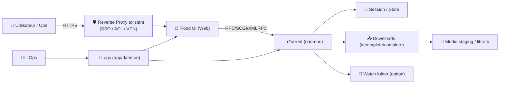
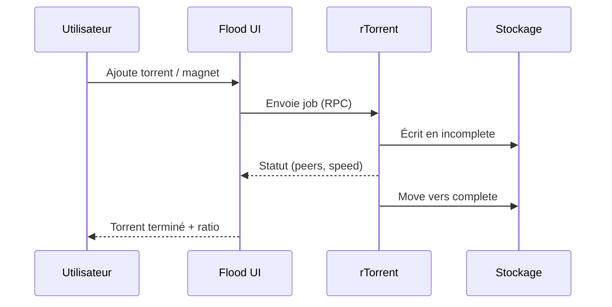

# 🌊 rFlood — Présentation & Configuration Premium (rTorrent + Flood UI)

### Client torrent performant + UI moderne + intégration “propre” dans un écosystème self-hosted
Optimisé pour reverse proxy existant • Qualité d’exploitation • Segmentation par labels • Observabilité utile

---

## TL;DR

- **rFlood** = un packaging “prêt à exploiter” de **rTorrent** (moteur torrent) + **Flood** (UI web moderne).
- Objectif : un **workflow stable** (ports, paths, permissions), une **UI rapide** (gestion, tri, monitoring), et une **exposition contrôlée** (reverse proxy existant / VPN / SSO).
- En premium : **paths cohérents**, **ports maîtrisés**, **auth**, **règles de logs**, **tests** et **rollback**.

---

## ✅ Checklists

### Pré-configuration (avant de mettre en prod)
- [ ] Stratégie d’accès (SSO/forward-auth/VPN) définie
- [ ] Stratégie ports (listen torrent + DHT/PEX si utilisé) validée
- [ ] Dossiers : `downloads` / `watch` / `session` / `data` définis
- [ ] Permissions (UID/GID) cohérentes avec le reste de ton stack
- [ ] Convention de labels (ex: `env=prod`, `app=rflood`, `team=media`)
- [ ] Politique “logs & secrets” (éviter tokens en clair)

### Post-configuration (validation)
- [ ] UI Flood accessible via reverse proxy existant
- [ ] rTorrent démarre sans erreurs (socket/SCGI/XMLRPC OK)
- [ ] Téléchargement test OK + upload OK (si seed)
- [ ] Les fichiers finissent au bon endroit (pas de “mystery path”)
- [ ] Aucune fuite d’info sans auth

---

> [!TIP]
> rFlood est idéal si tu veux un **rTorrent solide** avec une **UI moderne** sans retomber sur des interfaces vieillissantes.

> [!WARNING]
> Le point de rupture #1 = **ports** (listen/forward) + **permissions** (écriture sur les volumes).  
> Valide d’abord “un torrent test” avant d’ouvrir l’accès à d’autres.

> [!DANGER]
> N’expose pas Flood/rTorrent “en clair” sans contrôle d’accès : l’UI donne de la visibilité sur ton activité et parfois sur des chemins/infos sensibles.

---

# 1) rFlood — Vision moderne

rFlood n’est pas juste “un client torrent”.

C’est :
- 🧱 Un **moteur** (rTorrent) optimisé perf/ressources
- 🖥️ Une **console** (Flood) moderne pour gérer au quotidien
- 🔄 Un **bloc d’écosystème** (avec les *arr, médiathèque, monitoring)
- 🛡️ Un **service** à gouverner : accès, ports, logs, upgrades, rollback

---

# 2) Architecture globale



---

# 3) Les 5 piliers “premium”

1. 🔐 **Accès** (reverse proxy existant + auth/SSO)
2. 🧭 **Paths** (structure stable : watch / incomplete / complete / session)
3. 🔌 **Ports** (listen + forwarding + cohérence réseau)
4. 🧠 **Ergonomie d’exploitation** (labels/naming, filtres, procédures)
5. 🧪 **Validation & rollback** (tests simples, retour arrière documenté)

---

# 4) Chemins (la base d’un stack propre)

## Structure recommandée (lisible + robuste)

- `downloads/incomplete` : en cours
- `downloads/complete` : terminé
- `watch` : dépôt de `.torrent` (option si tu aimes le “drop folder”)
- `session` : état rTorrent (reprendre proprement après restart)

Exemple (logique, pas une obligation) :

```
/data/torrents/
  incomplete/
  complete/
  watch/
  session/
```

## Règles d’or
- Les chemins doivent être **stables** (pas de renommage sauvage)
- Les services qui consomment les fichiers doivent voir **les mêmes chemins**
- Les permissions doivent permettre : création + renommage + move/hardlink (selon ton workflow)

---

# 5) Ports & Réseau (éviter 90% des galères)

## Ce qu’il faut comprendre
- rTorrent a besoin d’un **port d’écoute** (incoming) pour être joignable correctement.
- Sans port correctement exposé/forwardé (si nécessaire), tu peux :
  - télécharger “à moitié”
  - uploader presque jamais
  - avoir des peers instables

## Stratégie premium (simple)
- **Un seul port d’écoute** (fixe) → plus facile à forward/monitor
- Vérifier que le port est réellement joignable depuis l’extérieur si tu seeds

> [!TIP]
> Si tu es derrière VPN/CGNAT, la stratégie ports dépend du fournisseur et du modèle (port-forwarding, split tunneling, etc.). Garde la config “testable”.

---

# 6) Flood UI — Organisation & Observabilité utile

## Conventions de nommage (pour filtrer vite)
- Préfixer les torrents par “source” ou “projet” si tu as plusieurs usages
- Utiliser des tags/catégories côté UI quand disponible (ex: `movies`, `series`, `iso`, `temp`)

## Patterns de recherche (incident / debug)
Cherches typiques :
- `announce|tracker|timed out|could not resolve`
- `hash check|recheck|piece`
- `permission denied|read-only file system`
- `no route to host|connection refused`

---

# 7) Sécurité d’accès (sans recettes reverse proxy)

## Objectif
- UI accessible **seulement** via ton reverse proxy existant (SSO/ACL)
- et/ou via VPN
- jamais en “port public brut”

Bonnes pratiques :
- Auth obligatoire
- Limiter par IP / réseau quand possible
- Logging d’accès (au niveau reverse proxy)

> [!WARNING]
> Les logs peuvent contenir des noms de releases, trackers, chemins…  
> Traite l’accès comme **priviliégié**.

---

# 8) Workflows premium

## 8.1 “Téléchargement propre” (séquence)


## 8.2 “Dépannage express”
1) Vérifier : UI accessible + rTorrent alive  
2) Vérifier : permissions sur paths  
3) Vérifier : trackers/announce et DNS  
4) Vérifier : port d’écoute + reachability  
5) Vérifier : espace disque + I/O

---

# 9) Validation / Tests / Rollback

## Smoke tests (réseau + service)
```bash
# 1) UI répond (en interne)
curl -I http://RFLOOD_HOST:PORT | head

# 2) Si exposé via URL
curl -I https://rflood.example.tld | head
```

## Tests fonctionnels (indispensables)
- Ajouter un torrent test (petit) :
  - téléchargement OK
  - move “incomplete → complete” OK
- Vérifier un redémarrage :
  - torrents repris (state/session OK)
- Vérifier l’upload (si attendu) :
  - port d’écoute réellement joignable si nécessaire

## Rollback (pratique)
- Sauvegarder **config + session** avant changement
- En cas de souci :
  - revenir à la version précédente
  - restaurer config + session
  - relancer et re-tester le torrent test

> [!TIP]
> Ton meilleur “test de non-régression” = **un torrent test** + **un restart** + **un check d’écriture**.

---

# 10) Sources — Images Docker (format demandé)

## 10.1 Image communautaire la plus citée (rFlood)
- `hotio/rflood` (documentation image) : https://hotio.dev/containers/rflood/  
- `hotio/rflood` (repo packaging) : https://github.com/hotio/rflood  
- `ghcr.io/hotio/rflood` (package registry) : https://github.com/orgs/hotio/packages/container/package/rflood  

## 10.2 Upstream Flood (UI)
- `jesec/flood` (Docker Hub) : https://hub.docker.com/r/jesec/flood  
- `jesec/flood` (repo upstream) : https://github.com/jesec/flood  
- Site Flood (docs/releases) : https://flood.js.org/  

## 10.3 LinuxServer.io (si tu veux une image Flood “LSIO”)
- `linuxserver/flood` (Docker Hub) : https://hub.docker.com/r/linuxserver/flood  
- `linuxserver/docker-flood` (repo - template/doc) : https://github.com/linuxserver/docker-flood/blob/master/READMETEMPLATE.md  
- Catalogue images LSIO : https://www.linuxserver.io/our-images  

---

# ✅ Conclusion

rFlood est un excellent choix si tu veux :
- rTorrent performant + UI moderne
- une exploitation “propre” (paths/ports/permissions)
- une exposition contrôlée (reverse proxy existant + auth)

Le niveau “premium” se joue sur :
**gouvernance d’accès + discipline des chemins + tests simples + rollback documenté**.