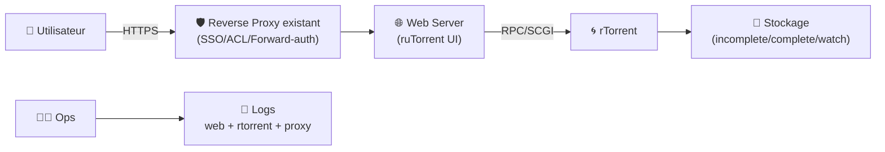
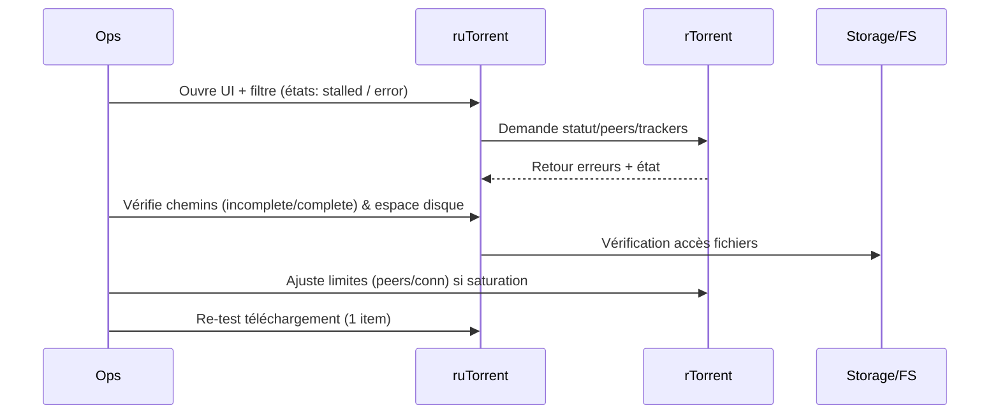

# 🌀 ruTorrent — Présentation & Configuration Premium (Ops, Sécurité, Exploitation)

### WebUI moderne pour rTorrent : contrôle, automatisation, plugins, observabilité
Optimisé pour reverse proxy existant • Multi-instances • Gouvernance par labels • Exploitation durable

---

## TL;DR

- **ruTorrent** = interface web pour piloter **rTorrent** (un client BitTorrent en ligne de commande).
- Valeur : **gestion centralisée** (torrents, files, priorités), **plugins**, **automatisation**, visibilité rapide.
- Version “premium ops” : **accès sécurisé**, **périmètres**, **plugins maîtrisés**, **paths propres**, **tests + rollback**.

---

## ✅ Checklists

### Pré-configuration (avant ouverture aux équipes)
- [ ] Décider du **périmètre d’accès** (qui voit quels torrents / quelles instances)
- [ ] Définir l’**auth** (SSO/forward-auth via proxy existant ou auth interne selon stack)
- [ ] Fixer une **convention de chemins** (data/downloads/complete/incomplete/watch)
- [ ] Choisir une **politique plugins** (liste autorisée, liste interdite)
- [ ] Définir un **plan de logs** (rTorrent + web + reverse proxy) et une rétention

### Post-configuration (validation)
- [ ] UI OK + commandes rTorrent OK (start/stop, ajout, suppression)
- [ ] Permissions fichiers/volumes : lecture/écriture correctes
- [ ] Un test “watch folder” fonctionne (si utilisé)
- [ ] Les erreurs réseau (tracker/DHT/port) sont diagnostiquées rapidement (runbook prêt)
- [ ] Rollback prêt (désactivation plugins / retour config)

---

> [!TIP]
> ruTorrent marche le mieux quand tu **sépares clairement** :
> - “incomplete/working”
> - “complete”
> - “watch/autoload”
> et quand tu as des conventions stables de noms/labels.

> [!WARNING]
> Les plugins ruTorrent peuvent élargir la surface d’attaque (exécution de commandes, accès fichiers, etc.).
> Garde une **liste blanche** de plugins et désactive le reste.

> [!DANGER]
> N’expose pas ruTorrent publiquement sans contrôle d’accès solide. L’UI permet des actions sensibles (gestion des téléchargements, chemins, plugins, parfois shell).

---

# 1) ruTorrent — Vision moderne

ruTorrent n’est pas “juste une UI”.

C’est :
- 🧠 un **contrôleur** rTorrent (files, priorités, throttling)
- 🧩 un **système de plugins** (monitoring, automation, UI enrichie)
- 🗂️ un **gestionnaire de flux** (watch folder, organisation des répertoires)
- 🔍 un **outil de diagnostic** (état trackers, pairs, erreurs)

Références upstream :
- ruTorrent (projet) : https://github.com/Novik/ruTorrent  
- rTorrent (projet) : https://github.com/rakshasa/rtorrent  

---

# 2) Architecture globale



---

# 3) Philosophie premium (5 piliers)

1. 🔐 **Accès & gouvernance** (auth, rôles, segmentation par instance)
2. 🧭 **Chemins & permissions** (filesystems, ownership, umask)
3. 🧩 **Plugins maîtrisés** (whitelist, mise à jour, sécurité)
4. ⚙️ **Performance & stabilité** (sessions, limites, files)
5. 🧪 **Validation / tests / rollback** (avant chaque changement)

---

# 4) Gouvernance : mono-instance vs multi-instance

## Mono-instance (simple)
- 1 ruTorrent ↔ 1 rTorrent
- Idéal pour une petite équipe ou un usage perso/unique

## Multi-instance (propre pour équipes/env)
- Plusieurs couples ruTorrent/rTorrent (ex: `prod`, `staging`, `team-a`, `team-b`)
- Avantages :
  - périmètres étanches
  - quotas et throttling par équipe
  - rollback facile (tu ne casses pas tout)

> [!TIP]
> En environnement “partagé”, le multi-instance est souvent plus sûr que d’essayer de “cacher” des torrents dans une seule instance.

---

# 5) Chemins & organisation (le socle)

## Modèle recommandé
- `downloads/incomplete` : en cours
- `downloads/complete` : terminés
- `watch` : dépôt automatique (si utilisé)
- `session` : état rTorrent (stateful)

Objectifs :
- éviter les conflits de permissions
- faciliter la supervision
- rendre le rollback trivial (tu sais quoi sauvegarder)

## Permissions (principes)
- un user/service dédié (ex: `rtorrent`)
- umask cohérent (évite “fichiers illisibles par l’UI”)
- pas de chemins exotiques dans ruTorrent (privilégier des mounts simples)

---

# 6) Plugins : stratégie “liste blanche”

## Plugins souvent utiles (selon build)
- **trafic / throttle** : visualiser et limiter
- **ratio / seeding rules** : politique de seed
- **rss / autopull** : automation contrôlée (si et seulement si gouvernée)
- **diskspace** : éviter les surprises (disque plein)

## Plugins à traiter avec prudence
- tout ce qui exécute des commandes côté serveur
- tout ce qui manipule des fichiers hors périmètre
- intégrations “shell” / scripts non audités

> [!WARNING]
> Un plugin “pratique” peut devenir une porte d’entrée. Si tu ne sais pas l’auditer, désactive-le.

---

# 7) Paramètres rTorrent qui font la différence (stabilité)

## Points clés
- **session** (state) : indispensable pour redémarrages propres
- **limites connexions/peers** : éviter la saturation CPU/RAM
- **ports** : cohérence + debug simple
- **disk I/O** : éviter “IO storm” (surtout sur HDD)
- **logging** : logs exploitables en incident

> [!TIP]
> En prod, l’objectif n’est pas “max peers”, c’est “débit stable + latence basse + pas d’instabilité”.

---

# 8) Sécurité (sans recettes proxy spécifiques)

## Principes incontournables
- ruTorrent derrière un **reverse proxy existant** avec :
  - authentification forte (SSO/forward-auth/VPN)
  - limitation d’accès (ACL IP / groups)
  - HTTPS
- réduire la surface :
  - désactiver plugins inutiles
  - limiter l’accès aux chemins
  - éviter d’exposer des endpoints internes (SCGI/RPC) hors réseau interne

## Données sensibles
- chemins, noms de fichiers, éventuelles clés/plugins, logs
- traite les logs comme sensibles (rétention + accès restreint)

---

# 9) Workflow premium (ops)

## Incident triage (séquence)


## Runbook “symptômes → causes”
- **Stalled** :
  - trackers indisponibles
  - port fermé / NAT
  - quota/limite atteinte
- **UI lente** :
  - trop de torrents/peers
  - IO saturée
  - logs/FS en contention
- **Erreurs permission** :
  - ownership/umask
  - chemins différents entre web et rtorrent
  - montage RO

---

# 10) Validation / Tests / Rollback

## Smoke tests (fonctionnels)
```bash
# Vérifier que l'UI répond
curl -I https://RUTORRENT_URL | head

# Vérifier qu'une page renvoie un code attendu (auth/proxy)
curl -I https://RUTORRENT_URL | head -n 5
```

## Tests applicatifs (manuel)
- Ajouter un élément de test (légal / interne) → vérifier :
  - démarrage OK
  - écriture dans `incomplete`
  - passage en `complete` (si applicable)
  - suppression propre (fichiers selon policy)

## Rollback (pratique)
- Si problème UI :
  - désactiver le dernier plugin activé
  - revenir à la config précédente (backup conf)
- Si problème rTorrent :
  - restaurer `session`
  - réduire limites (peers/conn)
  - revenir à un port stable connu

> [!TIP]
> Avant toute évolution : snapshot des configs + test sur une instance “staging” si tu es en multi-instance.

---

# 11) Sources — Images Docker (format demandé, URLs brutes)

## 11.1 Image LinuxServer.io (historique / à noter)
- `linuxserver/rutorrent` (Docker Hub) : https://hub.docker.com/r/linuxserver/rutorrent  
- Tags / “last updated” (utile pour voir l’activité) : https://hub.docker.com/r/linuxserver/rutorrent/tags  
- Doc LinuxServer (rutorrent) — page marquée deprecated : https://docs.linuxserver.io/deprecated_images/docker-rutorrent/  
- Repo packaging archivé (référence) : https://github.com/linuxserver-archive/docker-rutorrent  
- Notice de dépréciation (référencée par la communauté Unraid) : https://info.linuxserver.io/issues/2021-03-13-rutorrent/  
- Thread Unraid mentionnant la dépréciation : https://forums.unraid.net/topic/45596-deprecated-linuxserverio-rutorrent/  

## 11.2 Image communautaire active (alternative courante)
- `crazymax/rtorrent-rutorrent` (Docker Hub) : https://hub.docker.com/r/crazymax/rtorrent-rutorrent  
- Tags (activité récente) : https://hub.docker.com/r/crazymax/rtorrent-rutorrent/tags  
- Repo (documentation et packaging) : https://github.com/crazy-max/docker-rtorrent-rutorrent  

## 11.3 Upstream applicatif (non Docker)
- ruTorrent (upstream) : https://github.com/Novik/ruTorrent  
- rTorrent (upstream) : https://github.com/rakshasa/rtorrent  

---

# ✅ Conclusion

ruTorrent est excellent comme **console web** pour rTorrent, à condition d’être traité comme un outil sensible :
- accès sécurisé,
- plugins gouvernés,
- chemins propres,
- tests & rollback à chaque changement.

Avec ça, tu obtiens une exploitation “pro” : stable, observable, et maintenable.