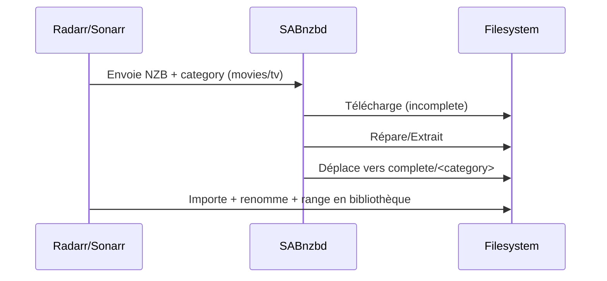

# 📦 SABnzbd — Présentation & Configuration Premium (Sans install / Sans Nginx / Sans UFW)

### Téléchargement Usenet “zéro friction” : débit, fiabilité, post-processing, intégration *arr
Optimisé pour reverse proxy existant • Catégories propres • Réparation/Extraction maîtrisées • Exploitation durable

---

## TL;DR

- **SABnzbd** automatise le téléchargement Usenet : **download → vérif → repair (PAR2) → extract → clean → dispatch**.
- Une config “premium” = **catégories strictes**, **dossiers cohérents**, **priorités**, **quotas**, **post-processing contrôlé**, **intégration Sonarr/Radarr**, **tests + rollback**.
- SABnzbd est un **moteur d’exécution** : la qualité du résultat dépend surtout de ta **discipline de catégories + dossiers + politiques**.

---

## ✅ Checklists

### Pré-configuration (qualité opérationnelle)
- [ ] Définir les dossiers : `incomplete` / `complete` / `watch` (NZB) / `scripts`
- [ ] Définir une **stratégie catégories** (movies / tv / manual / books / music…)
- [ ] Définir une **stratégie de priorités** (ex: tv > movies > bulk)
- [ ] Valider le **post-processing** (décompression, réparation, nettoyage)
- [ ] Définir une stratégie **quota / planning / bande passante**
- [ ] Définir la stratégie d’accès (reverse proxy existant, auth, IP allowlist)

### Post-configuration (validation)
- [ ] Un NZB test va jusqu’à “Completed” sans erreurs PAR2/unrar
- [ ] Les catégories routent vers les bons dossiers
- [ ] Sonarr/Radarr voient SABnzbd et récupèrent correctement
- [ ] Les logs sont lisibles et exploitables (niveau + rotation)
- [ ] Procédure de rollback documentée (config + dossiers)

---

> [!TIP]
> Le combo gagnant : **catégories propres + dossiers séparés + intégration *arr**.  
> Si tu fais “tout dans /downloads”, tu perds la moitié de l’intérêt.

> [!WARNING]
> Les plus gros incidents viennent de :  
> **permissions**, **mauvais mapping de dossiers**, **catégorie vide/incorrecte**, **post-processing trop agressif**.

> [!DANGER]
> Les logs peuvent contenir des infos sensibles (noms de serveurs Usenet, chemins, erreurs détaillées).  
> Traite SABnzbd comme un service interne derrière ton contrôle d’accès existant.

---

# 1) SABnzbd — Vision moderne

SABnzbd n’est pas seulement un downloader.

C’est :
- ⚙️ un **pipeline automatisé** (vérif/réparation/extraction/dispatch)
- 🧠 un **orchestrateur** (priorités, files, quotas, scheduling)
- 🧩 une **brique d’écosystème** (*arr, scripts, médiathèque)
- 🧪 un **outil d’exploitation** (files, historique, logs, diagnostic)

---

# 2) Architecture globale

```mermaid
flowchart LR
    User["👤 Utilisateur / *arr"] -->|NZB| SAB["📦 SABnzbd"]
    SAB --> Queue["🧾 Queue\n(priorités, slots)"]
    Queue --> DL["⬇️ Download\n(incomplete)"]
    DL --> Verify["✅ Verify / PAR2\n(repair)"]
    Verify --> Extract["🗜️ Extract\n(unrar/7z)"]
    Extract --> Clean["🧹 Clean\n(post-processing)"]
    Clean --> Complete["📁 Complete\n(sort par catégorie)"]
    Complete --> Arr["🎬 Radarr / 📺 Sonarr\n(Import + Rename)"]
    Arr --> Library["📚 Media Library"]
    Library --> Player["📺 Plex/Jellyfin/Emby"]
```



---

# 3) Philosophie premium (6 piliers)

1. 🗂️ **Dossiers & séparation** (incomplete/complete/catégories)
2. 🏷️ **Catégories strictes** (routage + scripts + règles)
3. 🎚️ **Priorités & scheduling** (TV/Movies/Batch)
4. 🧰 **Post-processing maîtrisé** (repair/extract/cleanup)
5. 🔗 **Intégration *arr** (API + category mapping)
6. 🧪 **Validation / tests / rollback** (répétable)

---

# 4) Dossiers : modèle “propre” (évite 80% des bugs)

## Arborescence recommandée (conceptuelle)
- `…/usenet/incomplete/` : travail en cours (temp)
- `…/usenet/complete/` : sortie SAB “avant import”
- `…/usenet/complete/movies/`
- `…/usenet/complete/tv/`
- `…/usenet/complete/manual/`
- `…/usenet/watch/` : dépôt de NZB (optionnel)
- `…/usenet/scripts/` : scripts post-processing (optionnel)

> [!WARNING]
> **Même filesystem** recommandé entre `incomplete` et `complete` pour éviter des mouvements lents / comportements surprenants.

---

# 5) Catégories : le cœur stratégique

## Pourquoi c’est critique
Une catégorie bien pensée = 
- routage correct vers le bon dossier
- post-processing adapté (ou désactivé)
- intégration *arr fiable (Radarr/Sonarr ne “devinent” pas)

## Catégories recommandées (base)
- `tv` → `complete/tv`
- `movies` → `complete/movies`
- `manual` → `complete/manual` (aucun script, safe)
- `bulk` → `complete/bulk` (basse priorité, quota éventuel)

> [!TIP]
> Ajoute une catégorie “manual” **obligatoire** : c’est ton “airbag” pour tester sans casser la prod.

---

# 6) Priorités & files (pour que ça reste fluide)

## Logique premium
- **TV** : haute priorité (latence faible)
- **Movies** : moyenne
- **Bulk/Backfill** : basse (ne doit pas étouffer le reste)

Recommandations pratiques :
- Limiter le nombre de downloads simultanés si ton storage est le bottleneck
- Ajuster “Article cache” / “Direct unpack” selon CPU/IO
- Mettre un scheduling (heures creuses) si ton FAI bride

> [!WARNING]
> Débit max + extraction lourde + disque lent = files instables.  
> Si tu vois du “stalling” ou des temps d’extraction énormes, c’est souvent **IO**.

---

# 7) Post-processing (repair/extract/cleanup) — “maîtrisé, pas magique”

## Objectif
- Réparer (PAR2) quand nécessaire
- Extraire correctement
- Nettoyer les résidus sans supprimer ce qui est utile

## Bonnes pratiques
- Garder les logs de post-processing assez verbeux en phase de mise au point
- Éviter les scripts “agressifs” en prod sans tests
- Préférer que **Radarr/Sonarr** fassent l’import/rename plutôt que SAB

> [!TIP]
> Dans beaucoup de setups modernes :  
> SAB “sort propre” → *arr “importe et renomme”.  
> Ça réduit drastiquement la complexité.

---

# 8) Intégration Radarr / Sonarr (résultat propre)

## Le contrat à respecter
- SABnzbd doit exposer une **API** accessible
- *arr doit utiliser la **catégorie dédiée** (`movies`, `tv`)
- *arr doit voir le chemin “complete” (et importer depuis là)

## Modèle mental


> [!WARNING]
> Si la catégorie envoyée par *arr ne matche pas celle attendue dans SAB, tu finis dans un dossier par défaut → import raté.

---

# 9) Sécurité d’accès (sans recettes proxy)

Recommandations de principe (avec ton reverse proxy existant) :
- Accès **authentifié** (SSO/forward-auth) + idéalement restrictions IP
- Ne jamais laisser l’UI ouverte sans contrôle
- Protéger l’API (mêmes règles que l’UI)
- Si possible : compte “lecture” pour support/ops, admin pour un nombre réduit

---

# 10) Validation / Tests / Rollback

## 10.1 Smoke tests (techniques)
```bash
# UI répond (exemple)
curl -I http://SAB_HOST:SAB_PORT | head

# Si derrière HTTPS
curl -I https://sab.example.tld | head

# Vérifier que la queue répond via API (si tu as un token API)
# (exemple générique, l’endpoint exact dépend de ta config)
curl -s "http://SAB_HOST:SAB_PORT/api?mode=queue&output=json&apikey=YOUR_API_KEY" | head
```

## 10.2 Tests fonctionnels (opérationnels)
- Déposer 1 NZB “petit” en **manual** → vérifier pipeline complet
- Déposer 1 NZB via Radarr/Sonarr → vérifier :
  - catégorie correcte
  - arrivée en `complete/<category>`
  - import *arr OK
  - aucun résidu indésirable

## 10.3 Rollback (simple, fiable)
- Sauvegarder :
  - le fichier de configuration SABnzbd (ou dossier config)
  - la structure `incomplete/complete` (au moins la structure, pas forcément le contenu)
- Pour rollback :
  - restaurer la config
  - remettre la catégorie “manual only” temporairement
  - relancer un test minimal

> [!DANGER]
> Ne rollback pas “à l’aveugle” : fais toujours un NZB test en `manual` après restauration.

---

# 11) Erreurs fréquentes (et remèdes rapides)

## “Download OK mais import *arr ne marche pas”
- Cause : catégorie incorrecte ou dossier complete non vu par *arr
- Fix :
  - harmoniser catégories
  - vérifier chemins et permissions
  - vérifier que *arr pointe sur `complete/<category>`

## “PAR2 / Unrar échoue”
- Cause : outils manquants, archive corrompue, manque de place disque
- Fix :
  - vérifier espace disque
  - vérifier logs de réparation
  - tester un autre release/source

## “Surcharge CPU/IO”
- Cause : direct unpack + extraction simultanée + disque lent
- Fix :
  - réduire simultanéité
  - ajuster options d’unpack
  - déplacer incomplete sur stockage plus rapide

---

# 12) Sources — Images Docker (format demandé, URLs brutes)

## 12.1 Image LinuxServer.io (la plus utilisée en self-hosting)
- `linuxserver/sabnzbd` (Docker Hub) : https://hub.docker.com/r/linuxserver/sabnzbd  
- Doc LinuxServer “docker-sabnzbd” : https://docs.linuxserver.io/images/docker-sabnzbd/  
- Repo de packaging (référence de l’image) : https://github.com/linuxserver/docker-sabnzbd  

## 12.2 Image Dozzle (exemple upstream) — pas SAB, juste pour cohérence (ignore si inutile)
- (non applicable ici)

## 12.3 Image “officielle”/communautaire upstream (si tu préfères upstream)
- Recherche Docker Hub “sabnzbd” (liste d’images) : https://hub.docker.com/search?q=sabnzbd  
- Wiki SABnzbd (mention Docker selon plateformes) : https://sabnzbd.org/wiki/installation/install-nas  

> [!TIP]
> Si tu veux une recommandation “standardisation” : utilise **une seule famille d’images** (ex: LSIO) pour homogénéiser PUID/PGID, conventions, et maintenance.

---

# ✅ Conclusion

Une configuration SABnzbd premium se reconnaît à :
- 🏷️ catégories strictes
- 🗂️ dossiers séparés et cohérents
- 🎚️ priorités + scheduling
- 🧰 post-processing maîtrisé
- 🔗 intégration *arr fiable
- 🧪 tests + rollback documentés

Résultat : téléchargements rapides, imports propres, et une exploitation sans surprises.