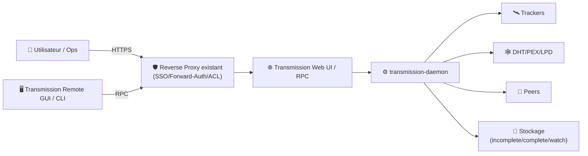
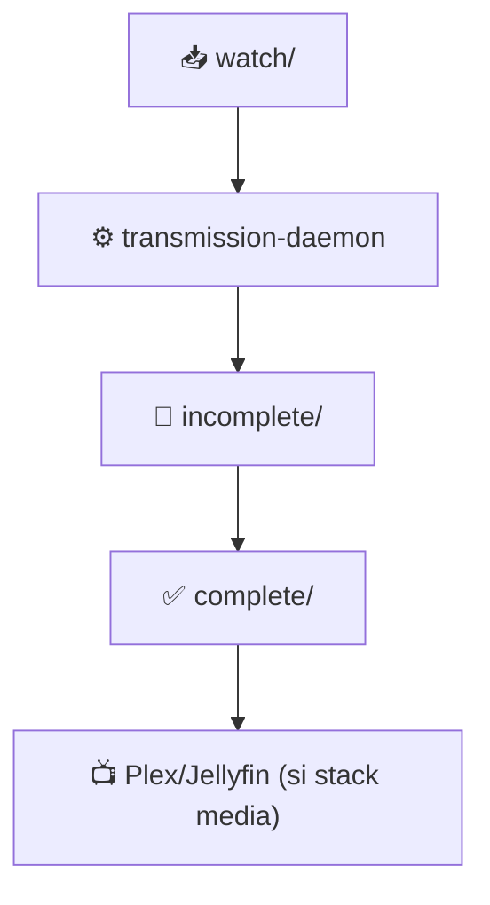
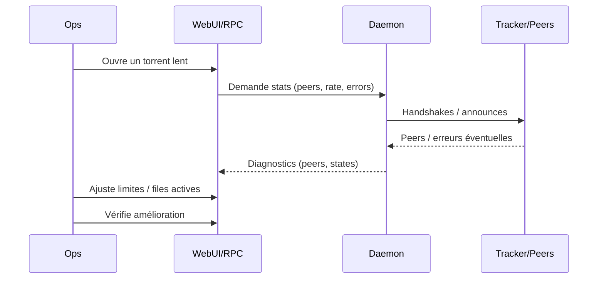

# 🚀 Transmission — Présentation & Configuration Premium (RPC, Sécurité, Qualité de service)

### Client BitTorrent léger, fiable, automatisable — parfait en stack media/seedbox
Optimisé pour reverse proxy existant • RPC maîtrisé • Isolation réseau/VPN possible • Exploitation durable

---

## TL;DR

- **Transmission** = daemon BitTorrent + **Web UI** + **RPC** (contrôle à distance via clients/GUI/scripts).
- En “premium ops” : **RPC sécurisé**, **whitelist stricte**, **auth**, **conventions de dossiers**, **gestion des quotas**, **observabilité**, **rollback**.
- Si tu veux forcer le trafic torrent via VPN : approche “**Transmission + VPN**” (container ou host), avec règles d’étanchéité.

---

## ✅ Checklists

### Pré-configuration (avant d’ouvrir l’accès)
- [ ] Définir l’objectif : **seedbox**, **stack media**, **partage interne**, **VPN obligatoire**
- [ ] Décider l’interface de pilotage : Web UI / Transmission Remote GUI / scripts RPC
- [ ] Fixer une convention de dossiers : `inbox` (watch) / `incomplete` / `complete`
- [ ] Définir limites : vitesse, ratio, slots, files actives, horaires
- [ ] Fixer le modèle d’accès : LAN/VPN/SSO via reverse proxy existant
- [ ] Prévoir logs + stratégie de debug (erreurs tracker, ports, DHT, etc.)

### Post-configuration (validation)
- [ ] Web UI OK (session, auth, pas d’accès anonyme)
- [ ] RPC OK via client remote (auth + URL correcte)
- [ ] Un torrent test : download → complete → seeding selon règle ratio/horaire
- [ ] Port “listening” cohérent (si tu utilises l’atteignabilité entrante)
- [ ] Aucun secret en clair exposé (logs, UI, reverse proxy)

---

> [!TIP]
> Transmission est excellent quand tu veux **stabilité + simplicité + automatisation** (RPC), sans usine à gaz.

> [!WARNING]
> L’accès distant propre = **reverse proxy existant + auth/SSO** OU **VPN**.  
> Évite l’exposition brute du RPC.

> [!DANGER]
> La mauvaise config la plus risquée : RPC accessible publiquement (même “par accident”) + whitelist permissive.  
> Résultat : prise de contrôle, ajout de torrents, fuite d’infos, abuse.

---

# 1) Transmission — Vision moderne

Transmission n’est pas “juste un client torrent”.

C’est :
- ⚙️ Un **daemon** (transmission-daemon) robuste
- 🌐 Une **Web UI** pour l’usage quotidien
- 🧩 Un **RPC** standard pour pilotage (apps, clients, scripts)
- 🧠 Un moteur de **policy** (ratio, limites, files actives, planification)

---

# 2) Architecture globale



---

# 3) “Premium config mindset” (5 piliers)

1. 🔐 **RPC sécurisé** (auth, whitelist, headers, pas d’exposition brute)
2. 📁 **Dossiers & conventions** (watch/incomplete/complete, droits)
3. 📏 **QoS & limites** (débits, files actives, ratio, horaires)
4. 🌐 **Réseau maîtrisé** (port, NAT, DHT/PEX selon contexte, VPN si requis)
5. 🧪 **Validation / rollback** (tests simples, retour arrière rapide)

---

# 4) RPC & Accès distant (ce qui fait la différence)

## 4.1 RPC : concepts
- **RPC** = API HTTP utilisée par Web UI et clients distants
- Auth typique : **HTTP Basic** (selon config)
- Endpoint RPC : varie selon packaging / chemins, mais la spec décrit le protocole.

> [!WARNING]
> Certains environnements attendent un endpoint précis (ex: `/transmission/rpc` ou variante).  
> Si ton client remote “n’accroche pas”, c’est souvent : URL RPC + auth + headers.

## 4.2 Bonnes pratiques “premium”
- **Auth obligatoire** (pas d’accès anonyme)
- **Whitelist** stricte :
  - LAN uniquement OU
  - reverse proxy existant (SSO) + accès restreint
- **Limiter les surfaces** :
  - si tu n’utilises pas DHT/PEX, désactive-les
  - si tu n’as pas besoin de découverte locale, coupe LPD

---

# 5) Dossiers & stratégie de flux (propre et maintenable)

## Recommandation “3 dossiers”
- `watch/` : dépôt automatique `.torrent` (inbox)
- `incomplete/` : en cours (temp)
- `complete/` : final (seeding + consommation media)



## Pourquoi c’est premium
- Debug plus simple (où ça bloque ?)
- Moins de fichiers “mi-cuits”
- Migration/backup plus lisibles

---

# 6) QoS : vitesse, ratio, files actives (éviter de se tirer une balle)

## Modèle “stable”
- Limiter **uploads** (sinon tu flingues la latence)
- Limiter **torrents actifs** (CPU/IO)
- Ratio / Seed time cohérents :
  - privé : respecter règles tracker
  - public : seed “raisonnable” sans saturer

## Patterns utiles
- “Heures creuses” : full speed la nuit
- “Heures pleines” : upload limité + downloads modérés
- “Files actives” : 3–10 selon IO/CPU

> [!TIP]
> Pour la stabilité, l’upload est le paramètre #1 à maîtriser.

---

# 7) Réseau : port, NAT, DHT/PEX, VPN (choisir consciemment)

## 7.1 Port entrant (listening)
- Si tu veux maximiser connectivité : port entrant atteignable (NAT/forward)
- Si tu es derrière VPN / CGNAT / règles strictes : accepte une connectivité réduite

## 7.2 DHT / PEX / LPD (choix stratégique)
- Trackers privés : DHT souvent interdit → désactiver
- Usage public : DHT/PEX peut aider mais augmente le “bruit”

## 7.3 VPN obligatoire (approche “étanche”)
Objectif : **aucun trafic torrent hors VPN**.  
La meilleure pratique = isolation réseau (namespace/VPN gateway) + kill-switch (selon ta stack).

> [!WARNING]
> Le “VPN obligatoire” est une exigence d’architecture, pas juste un toggle.  
> Si tu l’exiges, fais-le correctement (étanchéité), sinon tu auras des fuites.

---

# 8) Workflows premium (incident & debug)

## 8.1 “Ça ne télécharge pas”
Checklist rapide :
- Tracker : annonce OK ? erreurs d’auth/ratio ?
- DNS : résout correctement ?
- Port : connectivité entrante nécessaire ?
- DHT/PEX : autorisés ?
- IO disque : saturé ? permissions ?

## 8.2 “Ça télécharge mais c’est lent”
- Trop de torrents actifs → réduire
- Upload illimité → limiter
- Peers trop faibles → vérifier trackers/DHT
- MTU/VPN → vérifier si VPN impliqué



---

# 9) Validation / Tests / Rollback

## Smoke tests
```bash
# 1) UI répond
curl -I http://TRANSMISSION_HOST:PORT | head

# 2) RPC répond (selon reverse proxy / auth)
# (adapter l’URL RPC à ton chemin réel)
curl -i https://transmission.example.tld/transmission/rpc | head
```

## Test fonctionnel (simple)
- Ajouter un torrent “test”
- Vérifier : start → download → complete → seeding
- Vérifier ratio/time rule appliquée

## Rollback (principe)
- Revenir à :
  - config précédente (fichier settings.json / équivalent)
  - règles RPC/whitelist précédentes
  - paramètres QoS précédents
- Objectif : **retour arrière en < 5 minutes**

---

# 10) Erreurs fréquentes (et fixes)

- ❌ RPC inaccessible via client remote  
  ✅ Vérifier : URL RPC exacte + auth + headers reverse proxy + base path

- ❌ UI accessible sans auth  
  ✅ Forcer auth + restreindre accès (LAN/VPN/SSO)

- ❌ Perf mauvaise / machine “à genoux”  
  ✅ Réduire torrents actifs + limiter upload + vérifier IO disque

- ❌ Tracker privé en erreur (DHT/PEX)  
  ✅ Désactiver DHT/PEX si interdit + suivre règles tracker

---

# 11) Sources — Images Docker (format URLs brutes)

## 11.1 Image LinuxServer.io (la plus utilisée)
- `linuxserver/transmission` (Docker Hub) : https://hub.docker.com/r/linuxserver/transmission  
- Tags (dates/versions) : https://hub.docker.com/r/linuxserver/transmission/tags  
- Doc LinuxServer “docker-transmission” : https://docs.linuxserver.io/images/docker-transmission/  
- Repo packaging LSIO : https://github.com/linuxserver/docker-transmission  
- Releases LSIO : https://github.com/linuxserver/docker-transmission/releases  

## 11.2 Image “Transmission + VPN” (option fréquente)
- `haugene/transmission-openvpn` (repo) : https://github.com/haugene/docker-transmission-openvpn  

## 11.3 Autres images communautaires (à évaluer selon ton besoin)
- `phlak/transmission` (repo) : https://github.com/PHLAK/docker-transmission  

---

# 12) Références techniques (RPC & docs)

- Spec RPC (Transmission) : https://github.com/transmission/transmission/blob/main/docs/rpc-spec.md  
- Site officiel Transmission : https://www.transmissionbt.com/  
- Guide “Securing Transmission RPC” (proxy d’accès) : https://www.pomerium.com/docs/guides/transmission  