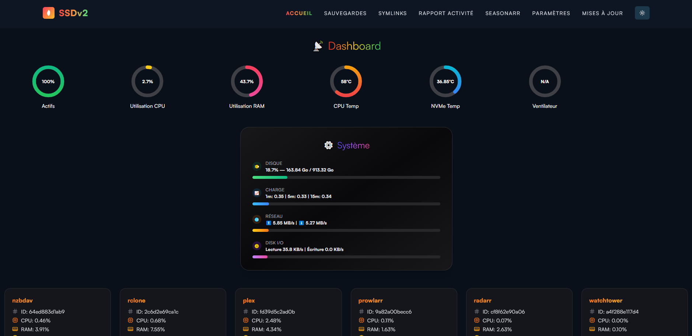
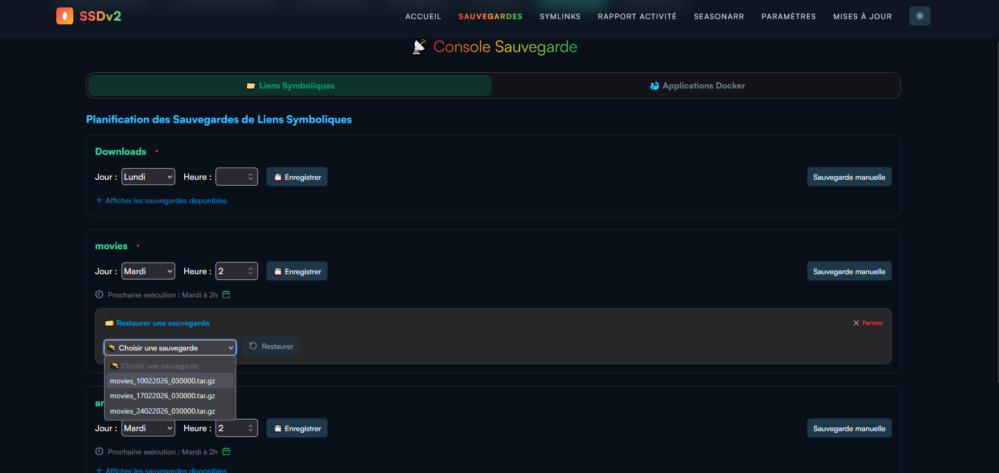
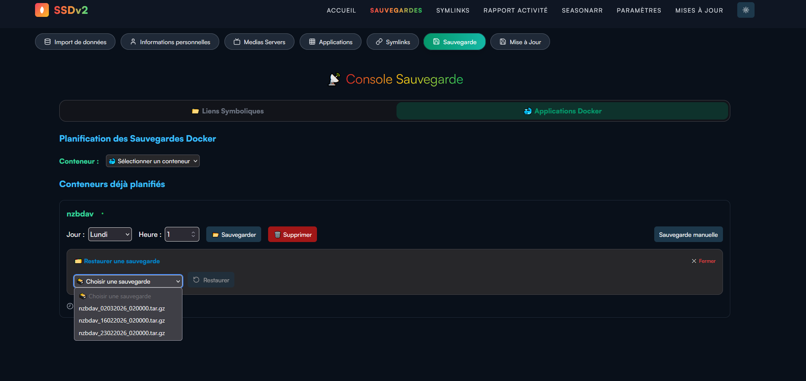
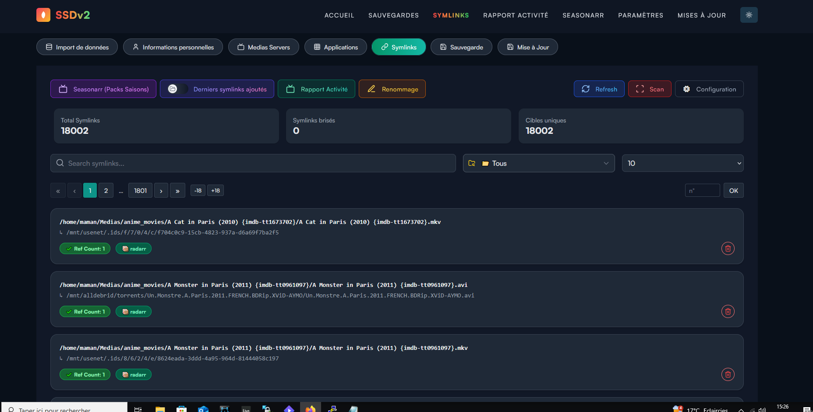
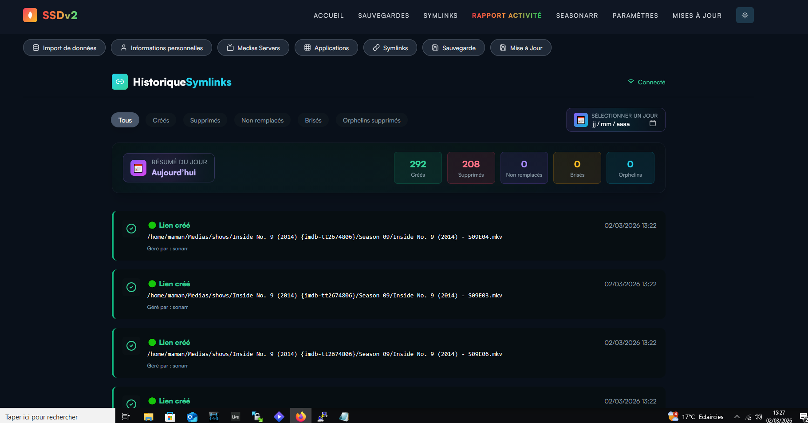
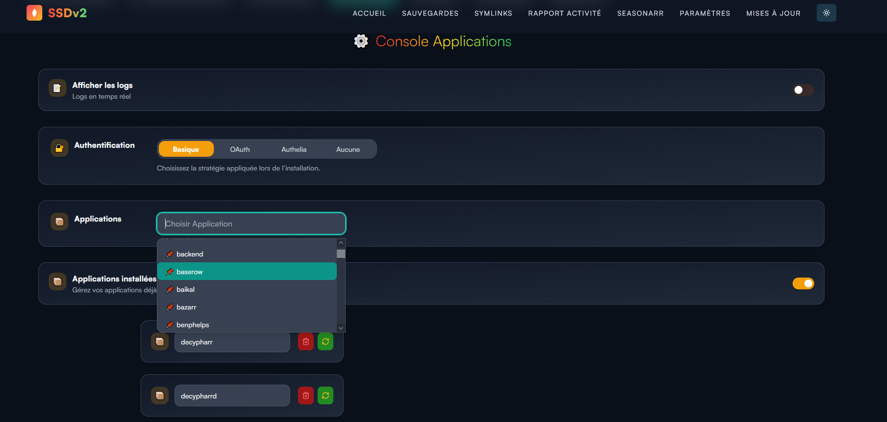
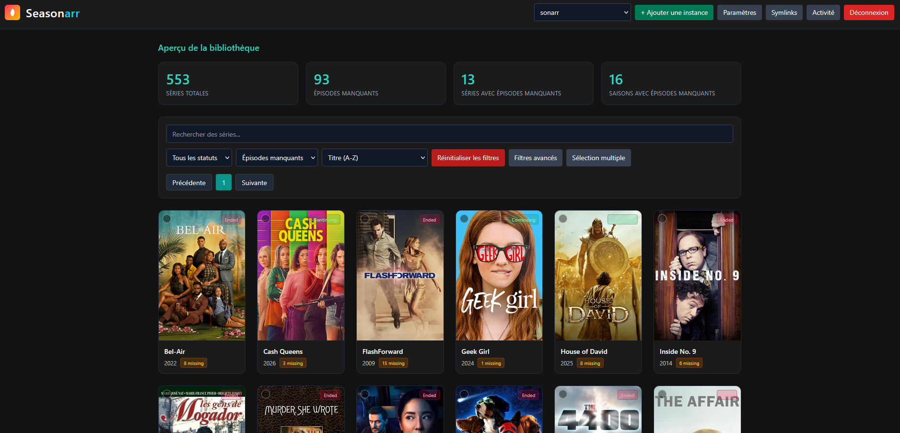
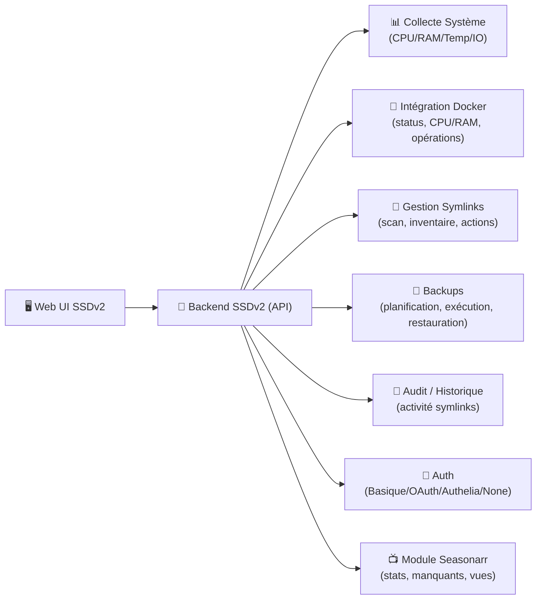

# 🧭 SSDv2 — Web UI (Console de Pilotage)

> Une **console web unifiée** pour piloter un environnement SSDv2 : **état du système**, **sauvegardes**, **gestion des symlinks**, **rapport d’activité**, **console applications**, **mises à jour**, et un module dédié **Seasonarr**.

---

## TL;DR

- 🎛️ **Dashboard** : santé machine + métriques (CPU/RAM/temp/IO) + aperçu containers
- 💾 **Sauvegardes** : planification + exécution manuelle + **restauration** (symlinks & containers)
- 🔗 **Symlinks** : inventaire/scan, détection liens cassés, renommage, filtres
- 🧾 **Rapport d’activité** : historique des événements (créations/suppressions/bris)
- 🧩 **Console Applications** : gestion des apps + stratégie d’auth (Basique/OAuth/Authelia/Aucune)
- 📺 **Seasonarr** : vue “bibliothèque” orientée séries (stats, filtres, affichage posters)

---

## 🧠 Objectif

La Web UI SSDv2 est pensée pour :

- centraliser le pilotage d’un stack média/infra **sans passer par 10 interfaces**
- rendre les opérations “lourdes” **simples** : sauvegardes/restaurations, scan symlinks, suivi activité
- fournir une **vision temps réel** (système + containers)
- industrialiser l’exploitation : **planification**, **audit**, **actions manuelles contrôlées**

---

## 🗺️ Navigation (ce que montre l’UI)

Barre principale :

- **Accueil** → Dashboard
- **Sauvegardes** → Console Sauvegarde (Symlinks / Applications Docker)
- **Symlinks** → Console Symlinks + outils (scan, renommage, configuration)
- **Rapport activité** → Historique & résumé (créés/supprimés/brisés, etc.)
- **Seasonarr** → Module séries
- **Paramètres** → Console applications + auth + options
- **Mises à jour** → gestion des updates

---

## 🖼️ Aperçu visuel (screens)

### 1) Dashboard — santé système & containers

Ce qu’on voit :
- jauges : **CPU**, **RAM**, **Temp CPU**, **Temp NVMe**, etc.
- carte **Système** : disque, charge, réseau, I/O
- tuiles en bas : apps/containers (ex: nzbdav, rclone, plex, prowlarr, radarr, watchtower) avec **CPU/RAM**

---

### 2) Sauvegardes — symlinks (planification + restauration)

Fonctions clés :
- planifier par **Jour/Heure**
- exécuter une **sauvegarde manuelle**
- restaurer depuis des archives `.tar.gz` (sélecteur + action Restore)

---

### 3) Sauvegardes — containers Docker (planification + snapshots)

Fonctions clés :
- sélection d’un **conteneur**
- liste des conteneurs déjà planifiés (jour/heure)
- actions rapides : **Sauvegarder / Supprimer**
- restauration à partir d’archives de sauvegarde

---

### 4) Symlinks — inventaire, scan, filtres & actions

Ce qu’on comprend :
- stats globales : **Total symlinks**, **Symlinks brisés**, **Cibles uniques**
- recherche + filtres
- actions visibles : **Refresh**, **Scan**, **Configuration**
- affichage détaillé par entrée :
  - chemin du lien
  - cible (ex: `/mnt/usenet/...`, `/mnt/alldebrid/...`)
  - tags (ex: `radarr`)
  - action suppression (icône corbeille)

---

### 5) Rapport d’activité — historique et états

Ce que couvre l’historique :
- résumé du jour (ex: **créés**, **supprimés**, **non remplacés**, **brisés**, **orphelins**)
- filtres par type d’événement (Tous / Créés / Supprimés / etc.)
- items horodatés avec source (ex: “Géré par : sonarr”)

---

### 6) Paramètres / Console Applications — auth + gestion apps

Fonctions visibles :
- bascule “**Afficher les logs**” (logs temps réel)
- sélection de stratégie d’auth :
  - **Basique**
  - **OAuth**
  - **Authelia**
  - **Aucune**
- gestion des applications :
  - choix d’une application (liste : backend, baserow, baikal, bazarr, …)
  - zone “Applications installées” + actions (suppression / refresh)

---

### 7) Seasonarr — vue bibliothèque séries (ops + suivi)

Ce que montre la vue :
- stats rapides :
  - séries totales
  - épisodes manquants
  - séries avec épisodes manquants
  - saisons avec épisodes manquants
- recherche + filtres (statuts, manquants, tri)
- affichage posters type “catalogue”
- gestion multi-instance (bouton “Ajouter une instance” + select instance)

---

## 🏗️ Architecture fonctionnelle (vue logique)

---

## ✨ Ce qui rend le projet “pro” (et pas juste une UI)

- **Opérations critiques couvertes** : sauvegarde + restauration (symlinks / containers)
- **Audit lisible** : historique d’activité et indicateurs de santé
- **Actions contrôlées** : scan, refresh, suppression, configuration
- **Vision stack complète** : système + containers + modules métiers (Seasonarr)
- **Stratégie d’auth configurable** : adaptation aux environnements (SSO/Authelia, OAuth, etc.)

---

## ✅ Résumé

La Web UI SSDv2 est une **console d’exploitation** orientée “ops” :

- tu **vois** (dashboard),
- tu **protèges** (backups + restore),
- tu **contrôles** (symlinks + scan + nettoyage),
- tu **traces** (rapport activité),
- tu **administres** (applications + auth),
- et tu **opères** ton module séries (Seasonarr).

> Si tu veux, je peux te sortir la même page au format “doc produit” (features + cas d’usage + FAQ + troubleshooting), toujours avec les screenshots intégrés.