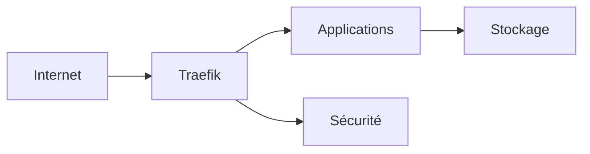

<h1>🚀 SSDv2</h1>

La plateforme Seedbox Docker moderne.

Déployez un écosystème complet en quelques minutes. 
Automatisation • Sécurité • Reverse Proxy • Real-Debrid • +100 Applications

<a href="Installation/introduction.md" class="btn-primary">🚀 Commencer</a>
<a href="https://discordapp.com/invite/ZhWvKVmTuh" class="btn-secondary">💬 Discord</a>

---

# 🎯 Introduction

Dans un univers numérique en constante évolution, la gestion et le partage de contenu peuvent rapidement devenir complexes.

SSDV2 est né pour simplifier cela.

Cette nouvelle version — entièrement repensée — est centrée sur :

- Alldebrid
- Docker
- Traefik
- Automatisation complète

Elle transforme un serveur brut en un environnement cohérent, sécurisé et prêt à évoluer.

---

# 💎 Caractéristiques principales

<h3>⚡ Installation simplifiée</h3>

Déploiement automatisé via script unique. Docker, Traefik et configuration serveur inclus.

<h3>🛡️ Sécurité intégrée</h3>

Fermeture des ports inutiles, HTTPS automatique, compatibilité CrowdSec et authentification externe.

<h3>🌐 Support Cloudflare</h3>

Gestion DNS et sous-domaines simplifiée pour performance et sécurité accrues.

<h3>📦 +100 applications</h3>

Un écosystème riche couvrant multimédia, développement, cloud personnel et monitoring.

---

# 🧠 Avantages distinctifs

SSDV2 se distingue par :

- ✔ Installation complète en un seul script
- ✔ Environnement standardisé facilitant le support
- ✔ Menu riche pour gestion simplifiée
- ✔ Intégration facile de vos propres applications
- ✔ Reverse proxy automatique via Traefik

L’objectif : uniformité + simplicité + évolutivité.

---

# 🏗️ Architecture Simplifiée

---

# 🌍 Univers d’applications

SSDV2 donne accès à un environnement complet :

### 🎬 Multimédia
Plex • Jellyfin • Emby • Radarr • Sonarr • Prowlarr

### 🔐 Sécurité
Authelia • CrowdSec • Cloudflare

### ☁️ Cloud Personnel
Nextcloud • FileRun • Chevereto

### 🧠 Développement
Gitea • GitLab • Outils DevOps

### 📊 Monitoring
Speedtest • Watchtower • Outils système

👉 Une plateforme modulaire prête à évoluer.

---

# 🎥 Démonstration

---

# 🛠️ Guide d'installation

Le guide complet est disponible ici :

👉 [Guide d’installation SSDv2](Installation/introduction.md)

Accessible à tous niveaux, structuré et progressif.

---

# 🤝 Communauté & Remerciements

### 💙 JetBrains
Merci pour les licences open source permettant un développement professionnel.

### 📘 TRaSH-Guides
Source majeure d’inspiration pour les sections Radarr/Sonarr.

---

# ⚠️ Note importante

SSDV2 est fourni à des fins éducatives et expérimentales.

L’utilisateur est responsable :

- du respect de la législation
- du respect des droits d’auteur
- de l’usage conforme des contenus téléchargés

---

# 🚀 Conclusion

SSDV2 n’est pas un simple script de seedbox.

C’est :

- 🧠 Une architecture standardisée
- ⚡ Une automatisation intelligente
- 🛡️ Une base sécurisée
- 📦 Un écosystème complet
- 🚀 Une plateforme évolutive

Installez. Automatisez. Sécurisez. Évoluez.