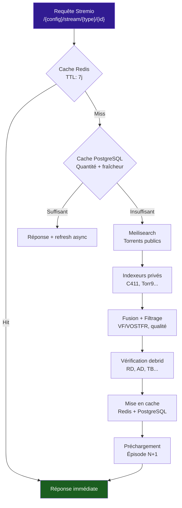

# :material-television: API Stremio

Les endpoints Stremio sont les points d'entrée principaux du addon, conformes au protocole Stremio Addon.

---

## :material-view-list: Endpoints

### Manifest

| Méthode | URL | Description |
|---|---|---|
| `GET` | `/manifest.json` | Manifest public (sans auth) |
| `GET` | `/{config}/manifest.json` | Manifest avec préférences utilisateur |

### Configuration

| Méthode | URL | Description |
|---|---|---|
| `GET` | `/configure` | Page de configuration HTML |
| `GET` | `/{config}/configure` | Page de config avec config existante |

### Recherche

| Méthode | URL | Description |
|---|---|---|
| `GET` | `/{config}/stream/{type}/{id}` | :material-magnify: **Recherche principale** |

### Catalogue & Métadonnées

| Méthode | URL | Description |
|---|---|---|
| `GET` | `/{config}/catalog/{type}/{id}.json` | Catalogue Stremio |
| `GET` | `/{config}/catalog/{type}/{id}/skip={skip}.json` | Catalogue paginé |
| `GET` | `/{config}/meta/{type}/{id}.json` | Métadonnées enrichies |

### Lecture

| Méthode | URL | Description |
|---|---|---|
| `GET/HEAD` | `/playback/{config}/{query:path}` | Proxy de lecture |

---

## :material-magnify: Pipeline de recherche



### Paramètres de recherche

| Paramètre | Type | Description |
|---|---|---|
| `config` | `str` | Token Fernet encodé (préférences + clé API) |
| `type` | `str` | `movie` ou `series` |
| `id` | `str` | ID du contenu (`tmdb:{id}` ou `tt{id}`) |

### Exemple de réponse

```json
{
  "streams": [
    {
      "name": "StreamFusion",
      "title": "Film (2024) - TRUEFRENCH 1080p",
      "url": "https://...",
      "behaviorHints": {
        "filename": "Film.2024.TRUEFRENCH.1080p.mkv"
      }
    }
  ]
}
```

---

## :material-play-circle: Lecture (Playback)

Le proxy de lecture gère le rate limiting et l'option de proxification :

| En-tête | Description |
|---|---|
| `X-Playback-Limit` | Limite de requêtes par fenêtre |
| `X-Playback-Remaining` | Requêtes restantes |
| `X-Playback-Reset` | Timestamp de réinitialisation |

Configuration via :

```env
PLAYBACK_LIMIT_REQUESTS=60    # Max requêtes par fenêtre
PLAYBACK_LIMIT_SECONDS=60     # Durée de la fenêtre (s)
```