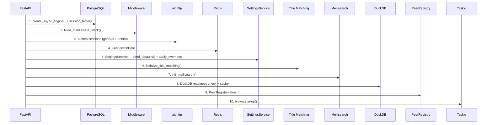

# :fontawesome-solid-code: Conventions de code

Cette page documente les conventions, règles et contraintes qui s'appliquent à l'ensemble du codebase Stream Fusion. Tout contributeur doit les connaître avant de modifier le code.

---

## :material-weather-lightning: I/O asynchrone obligatoire

**Toute la chaîne de traitement des requêtes est asynchrone.** Aucune opération réseau ou base de données synchrone n'est tolérée dans le chemin de requête.

| Technologie | Client | Usage |
|---|---|---|
| HTTP sortant | `aiohttp.ClientSession` | API debrid, indexeurs, TMDB, IMDB |
| PostgreSQL | `asyncpg` via SQLAlchemy 2.0 async | Toutes les requêtes DB |
| Redis | `redis-py` (ConnectionPool) | Cache, verrous, résultats |

```python
# ✅ Correct : tout est async
async with app.state.http_session.get(url) as resp:
    data = await resp.json()

async with app.state.db_session_factory() as session:
    result = await session.execute(select(Model))

# ❌ Incorrect : bloquant — bloque le worker Gunicorn
import requests
resp = requests.get(url)

import psycopg2
conn = psycopg2.connect(...)
```

!!! danger "Pas d'appels synchrones dans le chemin de requête"
    Un appel HTTP synchrone (`requests`, `urllib`) ou une connexion DB synchrone (`psycopg2`) bloque le worker Gunicorn entier pendant toute la durée de l'opération. Cela réduit la capacité de traitement et peut causer des timeouts en cascade.

---

## :material-file-document: Logging (Loguru)

Le système de logging est configuré dans `stream_fusion/logging_config.py` :

```python
from stream_fusion.logging_config import logger

logger.info("Message informatif")
logger.debug("Message de debug")
logger.error("Erreur critique")
```

### Caractéristiques

| Aspect | Détail |
|---|---|
| **Bibliothèque** | Loguru (pas `logging` standard) |
| **Censure** | JWT, tokens API, URLs de téléchargement automatiquement caviardés |
| **Niveau** | `LOG_LEVEL` (TRACE, DEBUG, INFO, WARNING, ERROR, FATAL) — chaud via admin |
| **Console** | Sortie standard avec couleurs, horodatage, fonction:ligne |
| **Fichier** | Un fichier par worker PID : `stream-fusion.w{pid}.log` |
| **Rotation** | Quotidienne, rétention 7 jours, compression ZIP |
| **Interception** | Capture les logs de la bibliothèque standard (`uvicorn`, `httpx`) |

!!! tip "Changement de niveau à chaud"
    Le niveau de log peut être modifié via le panneau d'administration (`/admin/settings` → Niveau de verbosité). Le changement prend effet **immédiatement** dans le worker courant sans redémarrage, car `SettingsService.set("log_level", ...)` appelle automatiquement `configure_logging()`.

### Patterns de censure

```python
patterns = [
    r"/ey[A-Za-z0-9_\-]+\.[A-Za-z0-9_\-]+\.[A-Za-z0-9_\-]*/",  # JWT
    r"/db/(?:duckdb|meilisearch)/dump/download/([a-f0-9]{64})",  # Download tokens
]
```

Les messages sont censurés avant d'atteindre les handlers — le filtrage est implémenté via `SecretFilter`.

---

## :material-database: Assignations Redis DB

Stream Fusion utilise **deux bases de données Redis distinctes** avec des rôles bien définis :

| DB Redis | Rôle | Contenu |
|---|---|---|
| **DB 5** | Cache SF | Résultats de recherche, disponibilité debrid, métadonnées TMDB cache, verrous de refresh, verrous de préchargement, tokens de téléchargement de dumps |
| **DB 6** | Broker Taskiq | Files d'attente de tâches, résultats de tâches, sources de planification cron (`sfr:sched:*`) |

!!! danger "Ne pas inverser"
    DB5 et DB6 ont des politiques d'expiration et des schémas de clés complètement différents. **Ne jamais stocker de données applicatives dans DB6** — elles seraient supprimées par les opérations de maintenance Redis. **Ne jamais configurer le broker Taskiq sur DB5** — cela provoquerait la consommation de résultats de cache comme des tâches.

| Variable | Valeur | DB |
|---|---|---|
| `REDIS_DB` | `5` | DB cache applicatif |
| `TASKIQ_REDIS_DB` | `6` | DB broker Taskiq |

---

## :material-pool: Compatibilité PgBouncer

La connexion PostgreSQL est configurée pour être compatible avec **PgBouncer en mode transaction** :

```python
engine = create_async_engine(
    str(settings.pg_url),
    pool_size=settings.pg_pool_size,
    max_overflow=settings.pg_max_overflow,
    pool_pre_ping=True,          # Valide la connexion avant usage
    pool_recycle=1800,           # Recycle après 30 min (avant le timeout PgBouncer)
    connect_args={
        "statement_cache_size": 0,  # Requis pour PgBouncer (transaction mode)
    },
)
```

| Paramètre | Valeur | Raison |
|---|---|---|
| `pool_pre_ping` | `True` | Détecte les connexions mortes (PgBouncer peut en fermer silencieusement) |
| `pool_recycle` | `1800` (30 min) | Recycle avant le `server_idle_timeout` de PgBouncer |
| `statement_cache_size` | `0` | Désactive le cache de statements préparés — incompatible avec PgBouncer |

---

## :material-package-variant: Imports conditionnels

### `constants.py` — patterns lourds

Les patterns de regex géants (`FR_RELEASE_GROUPS`, `FRENCH_PATTERNS`) sont dans `stream_fusion/constants.py` et **ne doivent jamais être importés dans des chemins froids** :

```python
# ✅ Correct : import tardif, uniquement quand nécessaire
def detect_french_release(title: str) -> bool:
    from stream_fusion.constants import FRENCH_PATTERNS
    return bool(FRENCH_PATTERNS.search(title))

# ❌ Incorrect : import au niveau module — chargé à chaque démarrage
from stream_fusion.constants import FRENCH_PATTERNS
```

Ces patterns peuvent faire plusieurs dizaines de kilooctets et leur compilation est coûteuse.

---

## :material-format-letter-case: Normalisation centralisée des titres

La fonction `normalize_title()` dans `utils/metadata/imdb/title_normalizer.py` est le **point d'entrée unique** pour la normalisation des titres. Elle est utilisée par :

1. **DuckDB (insert)** — les titres insérés dans la base IMDB sont normalisés
2. **Meilisearch (enrichissement)** — les titres enrichis sont normalisés avec la même fonction
3. **Recherche live** — les titres recherchés sont normalisés avant matching

!!! tip "Garantie de parité"
    Cette centralisation garantit que le matching fonctionne de manière cohérente entre les bases DuckDB (interne) et Meilisearch (externe). Un titre normalisé de la même façon produira le même hash de recherche, quelle que soit la source.

---

## :material-file-tree: Convention de nommage des indexeurs

Chaque indexeur privé suit un **pattern 3 fichiers** dans `indexers/private/{nom}/` :

| Fichier | Rôle |
|---|---|
| `{nom}_api.py` | Client HTTP bas niveau — retourne les objets bruts de l'API |
| `{nom}_result.py` | Modèle de résultat — conversion `raw` → dataclass → `TorrentItem` |
| `{nom}_service.py` | Orchestrateur — logique métier, cache, persistance PG |

Les indexeurs publics (`indexers/public/`) sont éphémères — leurs résultats ne sont jamais stockés dans PostgreSQL.

Exemples :
```
indexers/private/c411/c411_api.py
indexers/private/c411/c411_result.py
indexers/private/c411/c411_service.py

indexers/public/zilean/zilean_api.py
indexers/public/zilean/zilean_service.py
```

!!! note "Checklist pour ajouter un indexeur"
    L'ajout d'un indexeur privé nécessite de toucher environ 14 fichiers. Voir le guide complet dans [Support > Ajouter un indexeur privé](../support.md#guide-ajouter-un-indexeur-prive).

---

## :material-source-branch: Stratégie de branches

| Opération | Branche |
|---|---|
| Base de développement | `develop` |
| Base de production | `master` |
| Nouvelle fonctionnalité | Brancher depuis `develop` |
| Pull request | Cibler `develop` |

---

## :material-timeline: Séquence de démarrage (lifespan.py)

L'ordre d'initialisation dans `web/lifespan.py` est **critique** — chaque étape dépend de la précédente :



!!! warning "Ne pas réorganiser"
    `seed_defaults()` doit s'exécuter **avant** `apply_overrides_to_singleton()` pour capturer les valeurs env par défaut. Les sessions aiohttp doivent être créées **avant** l'initialisation de Meilisearch car l'enrichissement IMDB utilise ces sessions.

| Étape | Composant | Dépend de |
|---|---|---|
| 1 | Connexion PostgreSQL | Rien |
| 2 | Middleware FastAPI | Étape 1 |
| 3 | Sessions aiohttp | Paramètres env (proxy) |
| 4 | Pool Redis | Configuration réseau |
| 5 | SettingsService | Steps 1, 4 |
| 6 | Title matching | Steps 1, 4, 5 |
| 7 | Meilisearch | Steps 3, 5 |
| 8 | DuckDB readiness | Rien (vérification indépendante) |
| 9 | PeerRegistry | Step 1 |
| 10 | Broker Taskiq | Steps 5 |

---

## :material-function-variant: Factory d'application

L'application FastAPI est construite par une factory dans `web/application.py` :

```python
def get_app() -> FastAPI:
    app = FastAPI(
        title="StreamFusion",
        lifespan=lifespan_setup,
        docs_url=None,          # Swagger masqué (security_hide_docs)
        redoc_url=None,
        openapi_url="/api/openapi.json",
    )
    app.add_middleware(CORSMiddleware, ...)
    app.add_middleware(SessionMiddleware, secret_key=settings.session_key)

    app.include_router(router=root_router)       # Stremio: /configure, /manifest, /catalog, /stream
    app.include_router(router=register_router)    # /register (inscription publique)
    app.include_router(router=stream_router)      # /playback (proxy de stream)
    app.include_router(router=api_router, prefix="/api")  # API interne
    app.include_router(router=admin_router, prefix="/admin") # Admin dashboard

    app.mount("/static", StaticFiles(...), name="static")
    return app
```
