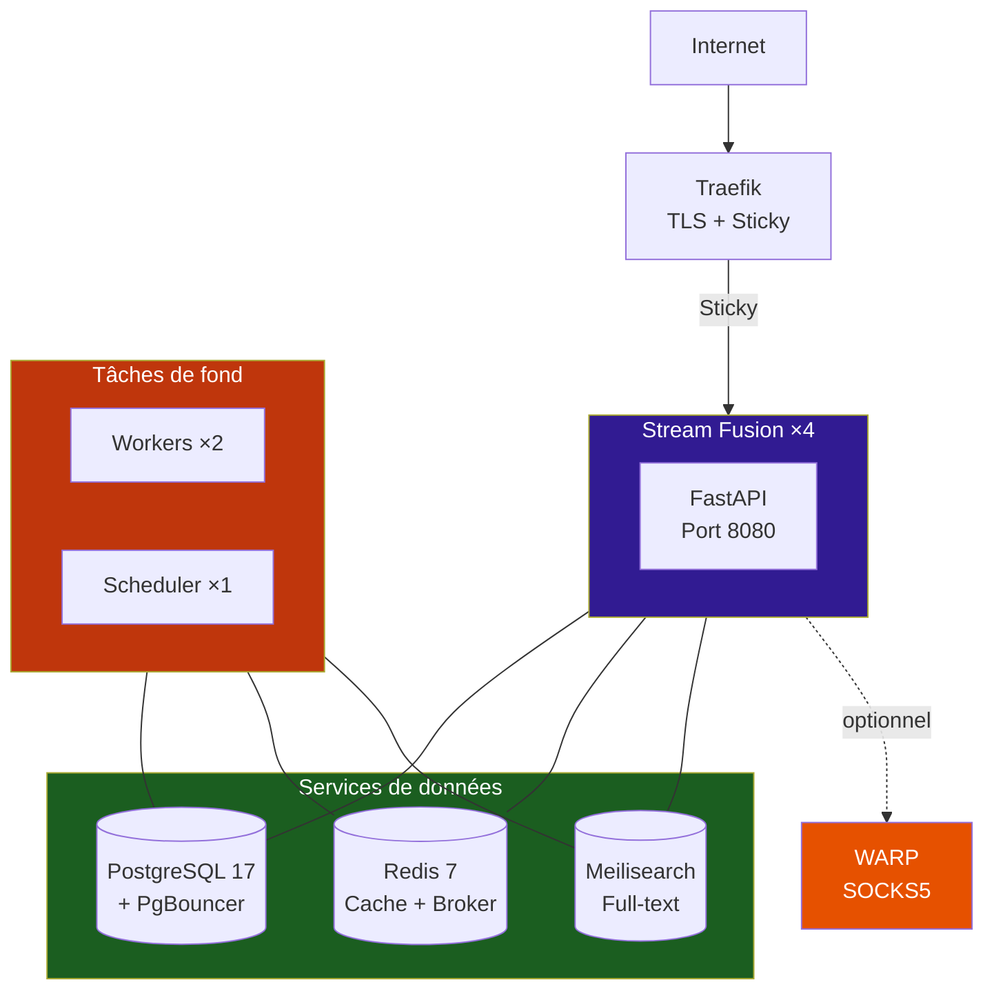
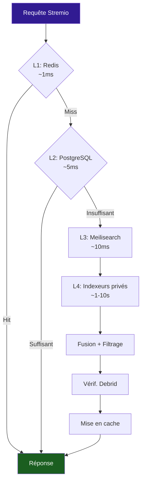

# :material-floor-plan: Architecture

Stream Fusion est une application FastAPI avec un système de cache multi-couches, des workers distribués et un mécanisme de peering crypté.

---

## :material-sitemap: Vue d'ensemble

---

## :material-swap-vertical: Flux d'une requête Stremio

---

## :material-view-list: Couches de données

-   :material-memory: **L1 : Redis**

    Cache hot, latence ~1ms, TTL 7 jours
    
    Résultats de recherche, streams, métadonnées

-   :material-database: **L2 : PostgreSQL**

    Persistance, requêtes structurées
    
    Torrents avec métadonnées, clés, config

-   :material-magnify: **L3 : Meilisearch**

    Recherche full-text, latence ~10ms
    
    Torrents publics indexés (DMM, Zilean, peers)

-   :material-database: **L4 : DuckDB**

    Base locale analytique, matching IMDB
    
    Voir [Cache et bases de données](../cache/index.md) pour les détails

---

## :material-cog-sync: Workers et scheduler

| Composant | Réplicas | Rôle |
|---|---|---|
| :material-web: **Stream Fusion** | 4 | Application FastAPI |
| :material-cog: **Taskiq Worker** | 2+ | Exécution des tâches de fond |
| :material-timer: **Taskiq Scheduler** | **1** | Planification cron |

!!! danger "Scheduler unique"
    Le scheduler doit toujours être en exactement **1 replica**. Scaler cause des tâches en double.

---

## :material-arrow-right: Sections détaillées

-   :material-magnify: **[Pipeline de recherche](pipeline-recherche.md)**
    
    Flux de recherche détaillé, filtrage, préchargement

-   :material-cog-sync: **[Tâches distribuées](taches-distribuees.md)**
    
    Workers Taskiq, scheduler, tâches cron, planification dynamique

-   :material-tune-variant: **[Système de configuration](systeme-configuration.md)**
    
    Configuration 2-couches : variables d'environnement + surcharges PostgreSQL

-   :fontawesome-solid-code: **[Conventions de code](conventions-code.md)**
    
    Async I/O obligatoire, logging Loguru, Redis DBs, conventions de nommage

-   :material-code-braces: **[Parsing RTN](parsing-rtn.md)**
    
    Double pipeline de parsing RTN (Meilisearch + PostgreSQL) avec règles DB-backed

-   :material-movie-search: **[Matching IMDB/TMDB](matching-imdb-tmdb.md)**
    
    Matchers PostgreSQL avec historique, batch processing et retry