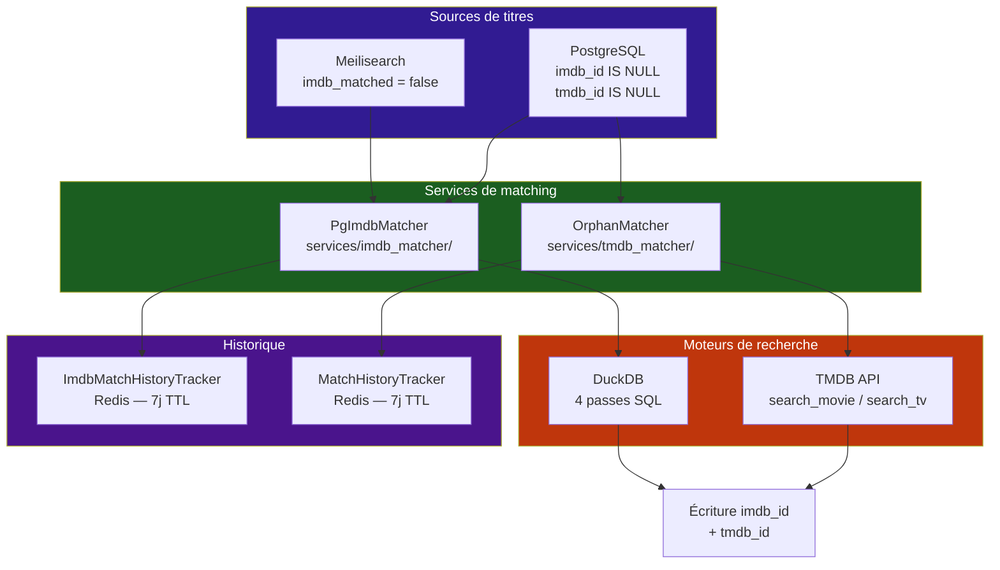
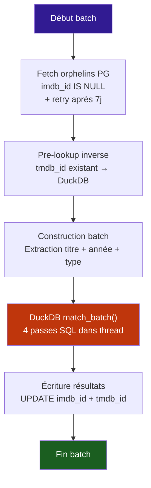
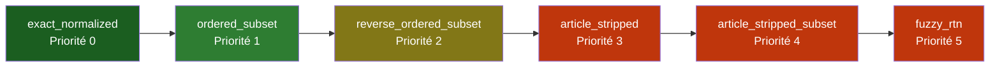

# :material-movie-search: Matching IMDB & TMDB — Architecture

Le système de matching IMDB/TMDB assigne des identifiants de métadonnées aux torrents stockés dans PostgreSQL et Meilisearch. Il repose sur deux services dédiés avec historique de matching et des tâches cron d'enrichissement.

---

## :material-sitemap: Architecture globale



---

## :material-database: IMDB Matcher — `PgImdbMatcher`

Le `PgImdbMatcher` (`services/imdb_matcher/pg_imdb_matcher.py`) est un service de matching IMDB pour les `torrent_items` PostgreSQL.

### Stratégie en deux passes

| Passe | Déclencheur | Cible |
|---|---|---|
| **Passe 1 — À la volée** | Recherches Stremio live | Items confirmés par le filtre de correction reçoivent leur `media.id` directement |
| **Passe 2 — Batch** | Tâche cron `imdb_orphan_matching` | Items orphelins (jamais vus dans une recherche) → DuckDB 4 passes |

### Flux batch (Passe 2)



### Règles conservatives

- **Retry 7 jours** : les items non matchés sont réessayés après 7 jours (`imdb_match_attempted_at`)
- **Filtre ebooks** : mots-clés (`ebook`, `epub`, `cbr`, `pdf`, `mobi`…) + taille < 300 MB
- **Type content** : détection du type (`movie` vs `show`) avec variantes FR (`Film`, `Série`, `Séries`, `Anime`…)
- **Séries** : année mise à `None` (l'année encodée ≠ l'année de début IMDB), sauf si `imdb_series_year_wide_tolerance` est activé (±5 ans)
- **Pre-lookup inverse** : si un item a déjà un `tmdb_id`, son `imdb_id` est résolu directement depuis la table `imdb_tmdb` de DuckDB (sans passer par le matching 4 passes)

### Extraction de titre

```python
# 1. Titre RTN stocké (parsed_data.title) — prioritaire
clean_title = item.parsed_data.get("title") or ""

# 2. Extraction par boundary detection (TitleNormalizer)
clean_title = normalizer.extract_clean_title(raw)

# 3. Normalisation (même fonction que DuckDB builder)
norm = normalize_title(clean_title)

# 4. Strip P2P terms (safety-net avant matching)
norm = normalizer.strip_p2p_terms(norm)
```

---

## :material-television: TMDB Matcher — `OrphanMatcher`

Le `OrphanMatcher` (`services/tmdb_matcher/orphan_matcher.py`) est un service de matching TMDB pour les `torrent_items` PostgreSQL.

### Stratégie conservative

Le matcher préfère **ne pas matcher** plutôt que de produire un faux match :

| Règle | Films | Séries |
|---|---|---|
| **Niveaux acceptés** | `exact_normalized`, `ordered_subset` | `exact_normalized`, `ordered_subset` |
| **Année dans le titre** | Doit correspondre ±1 an (même exact_normalized) | Doit correspondre ±2 ans |
| **Pas d'année dans le titre** | Seulement `exact_normalized` accepté | Tous les niveaux acceptés sans vérification d'année |
| **Fuzzy RTN** | Accepté seulement si `article_stripped` passe aussi (two-factor rule) | Idem |
| **Type inconnu** | Cherche movie + TV, garde le meilleur match (niveau le plus strict) | — |

### Niveaux de matching



Seuls les niveaux `exact_normalized` et `ordered_subset` sont automatiquement acceptés. Les niveaux `reverse_ordered_subset`, `article_stripped` et `article_stripped_subset` sont rejetés. `fuzzy_rtn` nécessite une validation two-factor (doit aussi passer `article_stripped`).

### DuckDB pre-lookup

Avant d'appeler l'API TMDB, le matcher vérifie si l'item a déjà un `imdb_id` :

1. Pour chaque `imdb_id` dans le batch → lookup dans `imdb_tmdb` (DuckDB)
2. Si un `tmdb_id` est trouvé → écriture directe dans `torrent_items` (sans appel API)
3. Les items résolus sont exclus du traitement API

### Écriture retour DuckDB

Après un matching TMDB réussi, le matcher enrichit aussi la table `imdb_tmdb` de DuckDB :

1. **Phase 1** : lecture des mappings existants (connexion read-only DuckDB)
2. **Phase 2** : pour les IDs non mappés → appel API TMDB `fetch_external_ids()` → `trigger_duckdb_writeback()`
3. Les `imdb_id` résolus sont aussi écrits dans `torrent_items`

!!! warning "Verrou DuckDB"
    La connexion read-only de la phase 1 est **fermée** avant les écritures de la phase 2 pour éviter un conflit de verrou lecture/écriture dans DuckDB.

### Fallback de titre

Si aucun match n'est trouvé avec le titre normalisé, le matcher réessaie avec des formes alternatives :

- `cleaned_title` (titre nettoyé mais non normalisé)
- `rtn_title` (titre extrait par RTN)

---

## :material-history: Traçage de l'historique

Chaque service a son propre tracker d'historique basé sur Redis.

### Structure commune

```python
# Redis Run Key: scheduler:{service}_match:run:{uuid}
# Redis Index:   scheduler:{service}_match:runs (sorted set par timestamp)
# TTL: 7 jours
```

### Historique IMDB — `ImdbMatchHistoryTracker`

| Entité | Description |
|---|---|
| `ImdbMatchEntry` | `info_hash`, `raw_title`, `imdb_id`, `imdb_title`, `imdb_year`, `item_type`, `match_pass` (1-4) |
| `ImdbMatchResult` | `processed`, `matched`, `unmatched`, `matches` |
| `ImdbRunSummary` | `run_id`, `run_at`, `processed`, `matched`, `unmatched` |
| `ImdbRunDetail` | `ImdbRunSummary` + liste des `ImdbMatchEntry` |

### Historique TMDB — `MatchHistoryTracker`

| Entité | Description |
|---|---|
| `MatchEntry` | `info_hash`, `raw_title`, `tmdb_id`, `tmdb_title`, `tmdb_year`, `item_type`, `match_level` |
| `MatchResult` | `processed`, `matched`, `unmatched`, `matches` |
| `RunSummary` | `run_id`, `run_at`, `processed`, `matched`, `unmatched` |
| `RunDetail` | `RunSummary` + liste des `MatchEntry` |

### Capacité de reset

Les deux matchers supportent le reset du timestamp `*_match_attempted_at` pour forcer un réessai de tous les items non matchés :

- **IMDB** : `/admin/imdb-match-pg/reset` → met `imdb_match_attempted_at = NULL` pour tous les `imdb_id IS NULL`
- **TMDB** : `/admin/tmdb-match-pg/reset` → met `tmdb_match_attempted_at = NULL` pour tous les `tmdb_id IS NULL`

### Revert TMDB

Le matching TMDB supporte le **revert** manuel : un admin peut annuler un match spécifique qui serait incorrect. L'item est alors ajouté à la table `tmdb_mismatches` pour éviter qu'il ne soit re-matché.

---

## :material-monitor-dashboard: Interface d'administration

L'admin META est accessible via `/admin/meta/` et agrège plusieurs sous-sections :

### Dashboard META

`/admin/meta` — Vue agrégée des statistiques DuckDB + PostgreSQL + Meilisearch :

- **DuckDB** : état `ready`, stats des tables, stats d'enrichissement TMDB, derniers builds
- **PostgreSQL** : total items, taux de matching IMDB/TMDB, mappings, mismatches
- **Meilisearch** : total documents, parsed/unparsed, taux matching IMDB

### Modules spécialisés

| Page | Route | Fonctionnalités |
|---|---|---|
| **Dashboard** | `/admin/meta` | Stats agrégées DuckDB + PG + Meilisearch |
| **IMDB Matcher** | `/admin/imdb-match-pg` | Historique des runs, stats PG, trigger manuel (force/batch), reset |
| **TMDB Matcher** | `/admin/tmdb-match-pg` | Historique des runs, stats PG, trigger manuel (force/batch_size), reset, revert |
| **Mappings** | `/admin/mappings` | Gestion des mappings metadata |
| **Mismatches** | `/admin/mismatches` | Gestion des mismatches TMDB |
| **IMDB** | `/admin/imdb` | Exploration IMDB |

### Gestion des dumps

Le dashboard META intègre aussi la gestion des dumps/restores :

- `/admin/meta/dumps/{db_type}` — Liste des dumps disponibles
- `/admin/meta/dumps/create` — Créer un dump (DuckDB ou Meilisearch)
- `/admin/meta/dumps/restore/{db_type}/{dump_id}` — Restaurer un dump
- `/admin/meta/dumps/delete/{db_type}/{dump_id}` — Supprimer un dump
- `/admin/meta/peer-dumps` — Lister les dumps des pairs
- `/admin/meta/peer-pull/start` — Tirer un dump depuis un pair

---

## :material-clock: Tâches cron de matching

### `imdb_orphan_matching`

| Paramètre | Valeur |
|---|---|
| **Cron** | `*/30 * * * *` |
| **Activation** | `imdb_orphan_matching_enabled` |
| **Batch size** | 500 (configurable) |
| **Force mode** | Ignore la fenêtre de 7 jours, process tous les `imdb_id IS NULL` |

### `tmdb_orphan_matching`

| Paramètre | Valeur |
|---|---|
| **Cron** | `*/30 * * * *` |
| **Activation** | `tmdb_orphan_matching_enabled` |
| **Batch size** | Configurable |
| **Force mode** | Ignore la fenêtre de 7 jours et le check `schedule_enabled` |

### Enrichissement DuckDB

Deux tâches d'enrichissement complètent le pipeline :

| Tâche | Description | Flux |
|---|---|---|
| **`imdb_tmdb_enrich_duck`** | Enrichit DuckDB avec les mappings TMDB manquants | TMDB API → `imdb_tmdb` (DuckDB). Résout les `imdb_id` sans `tmdb_id` |
| **`tmdb_enrich_meili`** | Backfill `tmdb_id` dans Meilisearch | DuckDB lookup → Meilisearch. **Purement local**, aucun appel API |

!!! tip "tmdb_enrich_meili — zero API calls"
    Cette tâche lit la table `imdb_tmdb` de DuckDB pour trouver les `tmdb_id` correspondant aux `imdb_id` déjà présents dans Meilisearch. Aucun appel à l'API TMDB n'est effectué — tout est résolu localement.

---

## :material-file-tree: Fichiers clés

| Fichier | Rôle |
|---|---|
| `services/imdb_matcher/pg_imdb_matcher.py` | `PgImdbMatcher` — matching IMDB pour PostgreSQL |
| `services/imdb_matcher/history.py` | `ImdbMatchHistoryTracker` — historique Redis (7j TTL) |
| `services/tmdb_matcher/orphan_matcher.py` | `OrphanMatcher` — matching TMDB pour PostgreSQL |
| `services/tmdb_matcher/history.py` | `MatchHistoryTracker` — historique Redis (7j TTL) |
| `services/tmdb_matcher/tmdb_search.py` | `TmdbSearchClient` — client API TMDB avec cache |
| `services/duckdb/dao/imdb_dao.py` | `ImdbDAO` — 4 passes SQL + `match_batch()` |
| `services/duckdb/duckdb_config.py` | Connexion DuckDB (read-only / read-write) |
| `utils/metadata/imdb/title_normalizer.py` | `normalize_title()` — fonction partagée de normalisation |
| `utils/metadata/id_resolver.py` | `trigger_duckdb_writeback()` — écriture sécurisée DuckDB |
| `utils/processing/filter/title_matching/__init__.py` | `get_normalizer()` — singleton TitleNormalizer |
| `web/admin/meta/dashboard.py` | Dashboard META — stats agrégées + gestion dumps |
| `web/admin/meta/imdb_matcher/views.py` | Admin IMDB matcher — historique, stats, trigger, reset |
| `web/admin/meta/tmdb_matcher/views.py` | Admin TMDB matcher — historique, stats, trigger, reset, revert |
| `web/admin/meta/router.py` | Router racine META — agrège tous les sub-routers |
