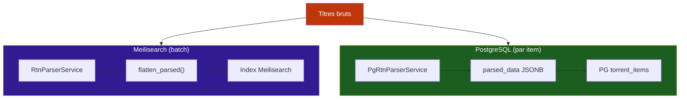
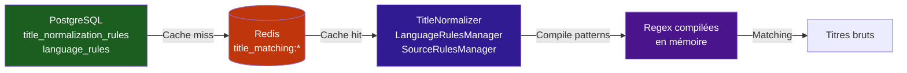
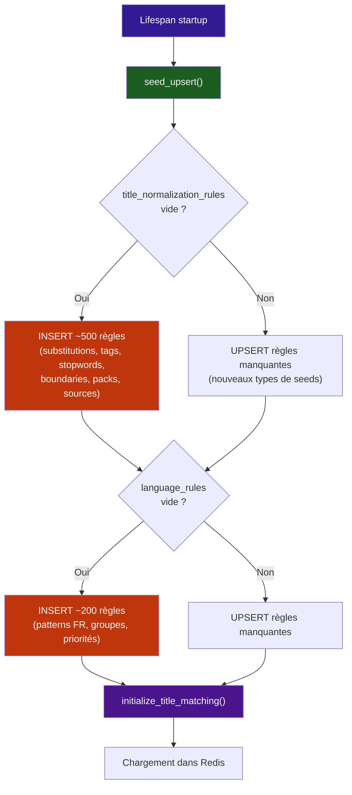

# :material-code-braces: Parsing RTN — Pipeline de parsing des titres

Le système de parsing RTN (Release Title Name) extrait les métadonnées techniques des titres bruts de torrents : résolution, codec, audio, langue, groupe de release, HDR, saisons, épisodes, etc. Stream Fusion utilise un **double pipeline** pour couvrir à la fois Meilisearch et PostgreSQL.

---

## :material-sitemap: Architecture double pipeline



Deux services distincts opèrent sur deux sources de données différentes :

| Pipeline | Source | Service | Stockage | Déclencheur |
|---|---|---|---|---|
| **Meilisearch** | Documents Meilisearch (`parsed = false`) | `RtnParserService` | Champs plats dans Meilisearch | Tâche cron `rtn_parse` |
| **PostgreSQL** | `torrent_items` PG (`parsed = FALSE`) | `PgRtnParserService` | Colonne JSONB `parsed_data` | Tâche cron `pg_rtn_parse` |

Les deux pipelines partagent le même cœur de parsing : `parse_title()` du module `utils/processing/rtn`.

---

## :material-database: PG RTN — `PgRtnParserService`

Le service `PgRtnParserService` (`utils/external/sync/pg_rtn_parser_service.py`) parse les `torrent_items` stockés dans PostgreSQL et enrichit la colonne JSONB `parsed_data`.

### Fonctionnement

1. **Fetch** : récupère les items où `parsed = FALSE` par lots de 5000, avec `OFFSET 0` (les items déjà traités sont marqués `parsed = TRUE`)
2. **Parse** : chaque `raw_title` est parsé via `parse_title()` dans un thread executor (tâche CPU-bound)
3. **Enrich** : les enrichissements SF sont calculés via `enrich_parsed()` et stockés sous le namespace `_sf` dans le JSONB
4. **Write** : mise à jour par sous-lots de 1000 — `parsed_data` + `parsed = TRUE`
5. **Loop** : continue tant qu'il reste des items non parsés ou qu'un stop n'est pas demandé

```python
# Structure du JSONB parsed_data
{
    "title": "The Matrix",
    "year": 1999,
    "resolution": "1080p",
    "source": "BluRay",
    "codec": "x264",
    "audio": "DTS",
    "languages": ["VFF", "VOF"],
    "seasons": [1, 2],
    "episodes": [1, 2, 3],
    "_sf": {  # Namespace privé — enrichissements Stream Fusion
        "integrale": true,
        "pack": true,
        ...
    }
}
```

!!! note "Différence avec Meilisearch"
    Contrairement à `RtnParserService`, le service PG n'appelle **pas** `flatten_parsed()`. Les enrichissements sont stockés sous le namespace `_sf` dans le JSONB — rétrocompatible et sans pollution des champs RTN natifs.

### Performances

- Lots de fetch : 5000 items
- Lots d'écriture : 1000 items
- Nettoyage mémoire (`gc.collect()`) après chaque lot
- Log de throughput tous les 50 000 items
- Support d'arrêt progressif (`stop_requested`)

---

## :material-clock: Tâche cron `pg_rtn_parse`

La tâche `pg_rtn_parse` (`tasks/pg_rtn_tasks.py`) est **indépendante** de la sync DMM. Elle a son propre schedule, ses propres verrous et son propre suivi de progression.

### Gardes (identiques à `rtn_parse`)

1. `pg_rtn_schedule_enabled` — bypassé si `force=True`
2. `sfr:schedule:paused` — pause globale du scheduler
3. `taskiq:lock:hashlist_sync` — jamais bypassé (évite les conflits avec la sync)
4. `taskiq:lock:pg_rtn_parse` — `SET NX EX 600`, empêche les exécutions concurrentes

### Modes

| Mode | Description | Déclencheur |
|---|---|---|
| **Single pass** | Traite un seul lot de 5000 items non parsés | Cron standard |
| **Drain loop** | Boucle jusqu'à épuisement de tous les items non parsés | Admin "Parse Full" ou `loop_until_done=True` |

### Suivi

- Progression temps réel via `SyncProgressTracker` (Redis)
- Historique des 7 derniers runs dans Redis (`taskiq:history:pg_rtn_parse`)
- Logs détaillés accessibles depuis l'admin

---

## :material-file-cog: Règles DB-backed

Toutes les règles de parsing et matching sont stockées dans PostgreSQL et cachées dans Redis. Elles remplacent ou complètent les patterns historiquement codés en dur dans `constants.py`.

### Types de règles

| Type | Table PG | Cache Redis | Manager | Rôle |
|---|---|---|---|---|
| **Normalisation de titres** | `title_normalization_rules` | `title_matching:title_rules` | `TitleNormalizer` | Substitutions, ligatures, articles, stopwords, boundary markers, pack keywords |
| **Détection de langue** | `language_rules` | `title_matching:language_rules` | `LanguageRulesManager` | Patterns VFF/VFQ/VOSTFR, groupes de release FR, priorité des langues |
| **Détection de source** | `title_normalization_rules` (type `source_detection`) | `title_matching:source_detection_rules` | `SourceRulesManager` | Regex → Radarr source_id (BluRay=9, WEB-DL=7, Remux=10…) |
| **Détection de packs** | `title_normalization_rules` (types `pack_keyword`, `integrale_variant`, `integrale_series_group`, `video_format`) | Même cache que titre | `TitleNormalizer` | Keywords collection (Trilogie, Saga…), variantes Intégrale, groupes series-pack, formats vidéo |

### Flux de données



### Règles de normalisation de titres

`TitleNormalizer` compile les règles en structures optimisées :

| Sous-type | Exemple | Utilisation |
|---|---|---|
| `substitution` | `&` → `and` | Normalisation avant matching |
| `ligature` | `œ` → `oe` | Suppression des caractères spéciaux |
| `article` | `the`, `le`, `la`… | Suppression des articles en début de titre |
| `release_tag` | `MULTI`, `VOSTFR`, `BLURAY`… | Nettoyage des tags techniques |
| `meili_stopword` | `1080p`, `x264`, `dts`… | Stopwords Meilisearch + boundary markers |
| `title_boundary` | `FRENCH`, `1080p`, `BluRay`… | Détection de la frontière titre/technique |
| `pack_keyword` | `Trilogie`, `Saga`, `Coffret`… | Détection de collections/packs |
| `integrale_variant` | `INTÉGRALE`, `COMPLET`… | Détection des releases Intégrale |
| `integrale_series_group` | `Team Loki` | Groupes utilisant [Intégrale] pour séries |
| `video_format` | `.mkv`, `.mp4`, `.avi`… | Extensions de fichiers vidéo |
| `source_detection` | `BluRay` → `9` | Mapping source → Radarr source_id |

### Règles de langue

`LanguageRulesManager` gère 4 types de règles :

| Type | Exemple | Utilisation |
|---|---|---|
| `french_pattern` | `VFF` → `r"\b(?:VFF\|TRUEFRENCH)\b"` | Détection de la langue dans le titre |
| `release_group` | Patterns des groupes FR (18 lots) | Identification des releases FR |
| `code_mapping` | `fr` → `FRENCH` | Conversion code court → forme canonique |
| `priority_group` | `VFF` → groupe 1, `VOSTFR` → groupe 3 | Priorité des langues (défaut et mode VFQ) |

---

## :material-seed: Amorçage des règles — `seeds.py`

Au premier démarrage, `seeds.py` insère les règles par défaut dans PostgreSQL via `seed_upsert()`.

### Flux d'amorçage



### Contenu des seeds

| Fichier | Règles | Nombre |
|---|---|---|
| `DEFAULT_TITLE_RULES` | Substitutions, ligatures, articles, release tags | ~170 |
| `DEFAULT_MEILI_STOPWORDS` | Stopwords techniques pour Meilisearch | ~130 |
| `DEFAULT_TITLE_BOUNDARY_RULES` | Marqueurs de frontière titre/technique | ~80 |
| `DEFAULT_SOURCE_DETECTION_RULES` | Patterns source → Radarr ID | 6 |
| `DEFAULT_LANGUAGE_RULES` | Patterns FR, groupes, priorités | ~90 |

!!! tip "Fonction idempotente"
    `seed_upsert()` utilise `bulk_upsert()` — les règles existantes ne sont jamais écrasées. Les nouvelles règles ajoutées dans les seeds (ex: nouveaux types comme `meili_stopword`) sont automatiquement insérées sans toucher aux règles personnalisées.

### Restauration des défauts

Le bouton **Restaurer les défauts** dans l'admin appelle `reset_to_defaults()` :

1. Supprime **toutes** les règles existantes (opération destructive)
2. Réinsère toutes les règles par défaut
3. Recharge les singletons (`normalizer.reload()`, `lang_manager.reload()`)

---

## :material-monitor-dashboard: Interface d'administration

L'admin de parsing est accessible via `/admin/parsing/` et se divise en plusieurs sections :

### Gestion des règles

| Page | Route | Règles gérées |
|---|---|---|
| **Règles de titre** | `/admin/parsing/rules/title-rules` | Substitutions, release tags, title boundaries, meili stopwords, articles, ligatures |
| **Règles de langue** | `/admin/parsing/rules/language-rules` | Patterns français, groupes de release, code mappings, priorités |
| **Règles de source** | `/admin/parsing/rules/source-rules` | Détection de source (BluRay, WEB-DL…) |
| **Règles de pack** | `/admin/parsing/rules/pack-rules` | Keywords collection, intégrale, formats vidéo |

Chaque page offre un CRUD complet :

- :material-plus: **Créer** une règle (formulaire avec validation)
- :material-pencil: **Modifier** une règle existante (édition inline)
- :material-delete: **Supprimer** une règle
- :material-reload: **Recharger** les règles (invalide le cache Redis + recharge depuis PG)
- :material-restore: **Restaurer les défauts** (reset complet)

### Page de test

`/admin/parsing/rules/test` — Permet de tester le matching en direct :

- Saisir un titre brut
- Saisir des titres TMDB candidats (un par ligne)
- Visualiser chaque étape de normalisation : intégrale → dot_to_space → boundary → clean_release → normalize → p2p_strip → strip_article

### Monitoring RTN

| Page | Route | Fonctionnalités |
|---|---|---|
| **RTN Meilisearch** | `/admin/parsing/rtn` | Stats parsed/unparsed, lancer/arrêter le parsing, logs, progression temps réel |
| **RTN PostgreSQL** | `/admin/parsing/rtn/pg` | Stats PG, lancer/arrêter, drain loop, reset parsed, logs, progression |

---

## :material-recycle: Remplacement des patterns codés en dur

Les règles DB-backed remplacent ou complètent les patterns historiquement dans `constants.py` :

| Ancien emplacement | Remplacé par | Type de règle |
|---|---|---|
| `FRENCH_PATTERNS` | `LanguageRulesManager._french_patterns` | `french_pattern` |
| `FR_RELEASE_GROUPS` | `LanguageRulesManager._release_group_patterns` | `release_group` |
| `lang_mapping` (language_priority_filter.py) | `LanguageRulesManager._code_mapping` | `code_mapping` |
| `language_priority_groups` | `LanguageRulesManager._priority_groups_default` | `priority_group` |
| `_RELEASE_TAGS_PATTERN` (filter_results.py) | `TitleNormalizer._release_tags_re` | `release_tag` |
| `_FIX_TAGS_RE` (filter_results.py) | `TitleNormalizer._release_tags_re` | `release_tag` |
| `_STRONG_BOUNDARY_RE` (normalizer.py) | `TitleNormalizer._db_boundary_re` | `title_boundary` |
| `_PACK_KEYWORD_RE` (normalizer.py) | `TitleNormalizer._pack_keyword_re` | `pack_keyword` |
| `_INTEGRALE_RE` (normalizer.py) | `TitleNormalizer._integrale_re_db` | `integrale_variant` |
| `_FALLBACK_PATTERNS` (source.py) | `SourceRulesManager._patterns` | `source_detection` |
| `video_formats` (general.py) | `TitleNormalizer._video_formats_db` | `video_format` |

!!! note "Fallback automatique"
    Si aucune règle DB n'est chargée pour un type donné, les patterns codés en dur du module correspondant sont utilisés comme fallback. Par exemple, `_STRONG_BOUNDARY_RE` est utilisé si `_db_boundary_re` est `None`.

---

## :material-power: Initialisation des singletons

Les singletons sont initialisés au démarrage de l'application dans `web/lifespan.py` via `initialize_title_matching()` :

```python
async def initialize_title_matching(
    redis_pool: ConnectionPool,
    db_session_factory: async_sessionmaker,
) -> None:
    # 1. Créer le client Redis et le cache
    redis_client = Redis(connection_pool=redis_pool)
    cache = RedisRulesCache(redis_client)

    # 2. Amorcer les règles par défaut (idempotent)
    await seed_upsert(db_session_factory)

    # 3. Construire les singletons
    _normalizer = TitleNormalizer(cache, db_session_factory)
    _lang_manager = LanguageRulesManager(cache, db_session_factory)
    _source_manager = SourceRulesManager(cache, db_session_factory)
    _matcher = TitleMatcher(_normalizer)

    # 4. Initialiser chaque manager (charge depuis Redis ou PG)
    await _normalizer.initialize()
    await _lang_manager.initialize()
    await _source_manager.initialize()
```

### Cycle de vie du cache Redis

```
[Démarrage] → seed_upsert (PG) → Cache miss → Chargement PG → Cache set (Redis)
[Runtime]   → Cache hit (Redis) → Données servies directement
[Admin CRUD] → Écriture PG → Invalidation Redis (manuel via "Recharger")
[Redémarrage] → Cache miss → Rechargement PG → Cache set
```

Le cache Redis n'a **pas de TTL** — il est invalidé manuellement après chaque modification admin. Cela garantit que les règles restent cohérentes sans latence de propagation.

### Accès aux singletons

```python
from stream_fusion.utils.processing.filter.title_matching import (
    get_normalizer,      # → TitleNormalizer
    get_matcher,          # → TitleMatcher
    get_lang_manager,     # → LanguageRulesManager
    get_source_manager,   # → SourceRulesManager
)
```

!!! danger "Initialisation obligatoire"
    Les getters lèvent `RuntimeError` si `initialize_title_matching()` n'a pas été appelé au préalable. L'initialisation doit avoir lieu dans le lifespan **avant** toute requête.

---

## :material-file-tree: Fichiers clés

| Fichier | Rôle |
|---|---|
| `utils/processing/filter/title_matching/__init__.py` | Point d'entrée, singletons, `initialize_title_matching()` |
| `utils/processing/filter/title_matching/normalizer.py` | `TitleNormalizer` — normalisation, extraction de titre, boundary detection |
| `utils/processing/filter/title_matching/language_rules.py` | `LanguageRulesManager` — patterns de langue, groupes FR, priorités |
| `utils/processing/filter/title_matching/source_rules.py` | `SourceRulesManager` — détection de source (BluRay, WEB-DL…) |
| `utils/processing/filter/title_matching/seeds.py` | Règles par défaut, `seed_upsert()`, `reset_to_defaults()` |
| `utils/processing/filter/title_matching/cache.py` | `RedisRulesCache` — couche cache Redis sans TTL |
| `utils/external/sync/pg_rtn_parser_service.py` | `PgRtnParserService` — parsing batch PostgreSQL |
| `tasks/pg_rtn_tasks.py` | Tâche cron `pg_rtn_parse` — gardes, verrous, modes |
| `web/admin/parsing/router.py` | Routes admin de parsing |
| `web/admin/parsing/rules/views.py` | CRUD règles (titre, langue, source, pack) + page de test |
| `web/admin/parsing/rtn/views.py` | Monitoring RTN (Meili + PG), lancement/arrêt |
