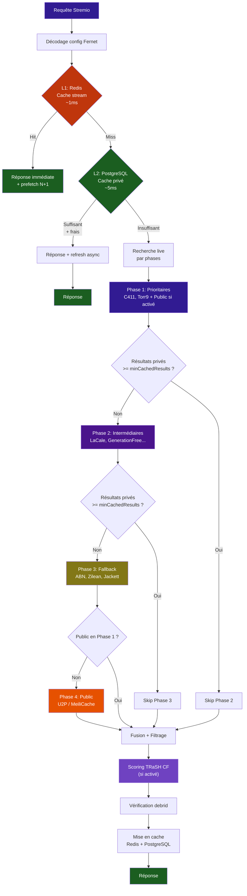
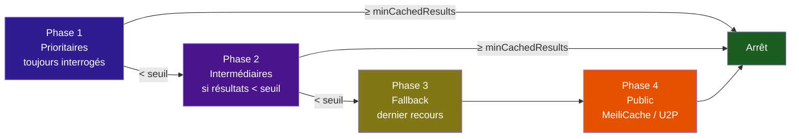
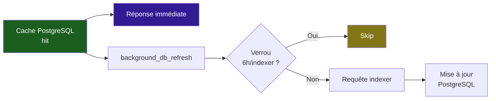
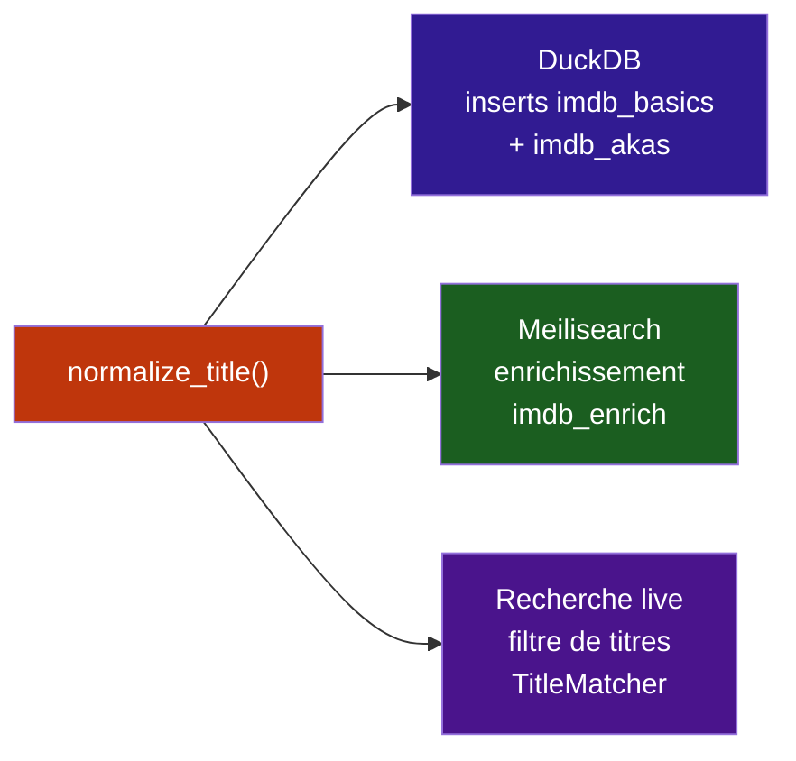

# Pipeline de recherche

Le pipeline de recherche est le cœur de Stream Fusion. Il orchestre la recherche de torrents à travers les 4 couches de cache avec une stratégie **cache-first**, et ne consulte les indexeurs externes que lorsque c'est nécessaire — économisant les appels API et assurant des réponses rapides.

---

## Flux complet

---

## Stratégie par phases

Les indexeurs privés sont organisés en **3 niveaux de priorité**, configurables par l'utilisateur depuis la page de configuration du plugin. Seuls les indexeurs nécessaires sont interrogés — si les phases précédentes retournent assez de résultats, les phases suivantes sont ignorées.

### Niveaux de priorité par défaut

| Niveau | Indexeurs | Comportement |
|---|---|---|
| **Prioritaire** | C411, Torr9, Nostradamus | Toujours interrogés |
| **Intermédiaire** | LaCale, GenerationFree, G3mini, TheOldSchool | Uniquement si résultats insuffisants |
| **Fallback** | ABN, Zilean, Jackett | Dernier recours |
| **Public** | U2P / MeiliCache | En Phase 1 si priorité activée, sinon en Phase 4 |

!!! tip "Configurer un maximum d'indexeurs n'impacte pas la vitesse"
    Les phases ultérieures ne sont interrogées que si les phases précédentes n'ont pas retourné assez de résultats. **Configurer plus d'indexeurs améliore la complétude sans ralentir les recherches courantes.** Seuls les indexeurs prioritaires sont toujours interrogés.

---

## Couches de cache

### L1 — Redis (cache hot, ~1ms)

Vérification immédiate avec une clé dérivée du type, ID, langue et préférences utilisateur. Si un résultat existe, il est retourné **immédiatement** et un préchargement de l'épisode suivant est lancé en arrière-plan.

### L2 — PostgreSQL (cache privé, ~5ms)

Si Redis est vide, PostgreSQL est interrogé. Deux conditions déterminent si les résultats sont suffisants :

- **Quantité** : nombre de résultats confirmés >= `minPostgresResults` (défaut: 5)
- **Fraîcheur** : le résultat le plus récent date de moins de `postgresMaxAgeDays` (défaut: 7 jours)

Si les deux sont remplis → réponse immédiate + **refresh asynchrone** en arrière-plan pour mettre à jour le cache.

!!! tip "Touch TTL"
    Lors d'un hit L2, le timestamp des entrées PostgreSQL est **rafraîchi automatiquement** (`touch TTL`). Cela évite qu'un résultat populaire soit considéré comme périmé simplement parce qu'il a été mis en cache il y a plusieurs jours — il reste frais tant qu'il est régulièrement consulté.

### L3/L4 — Meilisearch + Indexeurs live

Si le cache est insuffisant, la recherche live est déclenchée par phases (voir ci-dessus). Meilisearch agit comme un indexeur "public" et est interrogé selon sa priorité.

---

## Tâches de fond déclenchées par une recherche

Chaque recherche peut déclencher des tâches de fond pour maintenir le cache à jour **sans ralentir la réponse utilisateur**.

### Refresh asynchrone (`background_db_refresh`)

Après un hit sur le cache PostgreSQL, une tâche de fond est lancée pour rafraîchir les données auprès de tous les indexeurs stockés en base :

- Délai de 2 secondes avant démarrage
- **Verrou par indexeur** : chaque indexeur a un verrou Redis avec TTL de 6h (`bg_refresh:{indexer}:{tmdb_id}:{season}{episode}`)
- Si le verrou existe, l'indexeur est **ignoré** — pas de requête inutile
- Si la requête échoue, le verrou est supprimé pour permettre un réessai

### Préchargement d'épisodes (`prefetch_next_episode`)

Quand un utilisateur regarde l'épisode N, le système pré-charge les streams de l'épisode N+1 en arrière-plan :

- **Verrou par épisode** : `prefetch_next:{user}:{tmdb_id}:{S{season}E{episode}}` avec TTL 20 min — empêche les préchargements en double
- **Limite de concurrence** : max 2 tâches simultanées par utilisateur/saison
- **Cascade** : si `prefetch_depth >= 2`, l'épisode N+2 est aussi préchargé
- Le préchargement exécute le **pipeline complet** (metadata → indexeurs → filtres → debrid → streams) et met en cache le résultat

### Assignation TMDB/IMDB rétroactive

Les torrents sans ID sont traités en tâche de fond :

- `tmdb_orphan_matching` : matching par titre via l'API TMDB (toutes les 30 min)
- `imdb_orphan_matching` : matching via DuckDB IMDB (toutes les 30 min)

---

## Configuration utilisateur des indexeurs

Depuis la page de configuration du plugin Stremio (`http://votre-domaine/`), chaque utilisateur peut configurer :

### Priorité des indexeurs

Pour chaque indexeur auquel il a accès, l'utilisateur choisit un niveau de priorité :

| Niveau | Description | Impact |
|---|---|---|
| **Prioritaire** | Toujours interrogé | Utile pour les indexeurs rapides avec un bon cache FR |
| **Intermédiaire** | Interrogé si résultats insuffisants | Bon compromis entre couverture et performance |
| **Fallback** | Dernier recours | Pour les indexeurs lents ou avec un cache moins complet |
| **Désactivé** | Jamais interrogé | L'indexeur n'est pas utilisé |

### Autres paramètres de recherche

| Paramètre | Défaut | Description |
|---|---|---|
| `minCachedResults` | 8 | Seuil de résultats privés pour déclarer une phase suffisante |
| `minPostgresResults` | 5 | Seuil pour le cache PostgreSQL fast-path |
| `postgresMaxAgeDays` | 7 | Âge max du cache PostgreSQL (en jours) |
| `rdMinCachedBeforeCheck` | 3 | Skip Real-Debrid si N résultats déjà en cache debrid |
| `maxResults` | 30 | Nombre max de streams vérifiés debrid |
| `resultsPerQuality` | 10 | Nombre max de résultats par résolution |
| `sort` | `quality` | Méthode de tri des résultats |
| `languages` | `fr, multi` | Langues souhaitées |
| `exclusion` | `cam` | Qualités exclues |
| `utopeerPriority` / `meiliCachePriority` | `True` | Public en Phase 1 (sinon Phase 4) |
| `nostradamus` | `True` | Activer l'indexeur Nostradamus |
| `meiliCache` | `True` | Activer le Cache Public Local (MeiliCache) |
| `trashScoring` | `False` | Activer le scoring TRaSH CF |
| `trashTemplate` | `default` | Slug du template de scoring à utiliser |

!!! tip "Conseil de configuration"
    Configurez un **maximum d'indexeurs** avec des identifiants personnels. La stratégie par phases garantit que seuls les indexeurs prioritaires sont interrogés en premier. Les indexeurs intermédiaires et fallback ne seront sollicités que si les résultats sont insuffisants — **aucun impact sur la vitesse de chargement**.

---

## Scoring TRaSH Custom Formats

Si `TRASH_SCORING_ENABLED` est actif et que l'utilisateur a sélectionné un template dans `/configure`, le pipeline injecte une étape de scoring **après** les `correctness_filters` et **avant** la vérification debrid :

1. **Parsing RTN** : le titre brut est analysé pour extraire résolution, codec, audio, groupe, HDR, langues
2. **Évaluation CFs** : chaque Custom Format actif teste si le torrent correspond à ses spécifications
3. **Somme des scores** : les poids des CFs matchés s'additionnent selon le template choisi
4. **Classement** : les résultats sont triés par score décroissant. Ceux sous `ban_below` restent visibles mais en fin de liste

!!! tip "Bypass ResultsPerQualityFilter"
    Quand le scoring TRaSH est actif, le filtre `resultsPerQuality` est contourné. Le tri par score CF remplace le tri par qualité, permettant à un résultat de qualité inférieure mais avec un excellent score (ex: VFF Remux) de surpasser un résultat de meilleure qualité mais moins valorisé.

---

## Normalisation des titres

La normalisation des titres est une étape critique du pipeline. La fonction `normalize_title()` (`utils/metadata/imdb/title_normalizer.py`) est la **même** pour tous les systèmes :

Cette **parité de normalisation** garantit que :

- Les titres insérés dans DuckDB (`norm_primary`, `norm_original`, `norm_title`) utilisent exactement la même transformation que les titres de torrents
- L'enrichissement Meilisearch (`imdb_enrich`) normalise les titres de la même façon que le builder DuckDB
- La recherche live (`TitleMatcher`) compare des titres normalisés avec le même algorithme

### Étapes de normalisation

1. **Substitutions** : `&` → `and`, `+` → `and` (règles DB)
2. **Ligatures** : `œ` → `oe`, `æ` → `ae` (règles DB)
3. **Possessif `'s`** : supprimé ("world's" → "world")
4. **Apostrophes** : remplacées par espace ("l'homme" → "l homme")
5. **Ponctuation** : `[,!?;:]` → espace
6. **Accents** : NFD + strip combining characters
7. **Minuscules** + collapse des espaces

### `TitleNormalizer` DB-backed

Le `TitleNormalizer` compile les règles depuis PostgreSQL (via Redis) et étend les capacités de normalisation au-delà des patterns codés en dur :

- **Extraction de titre** : boundary detection avec ~120 marqueurs DB (vs ~40 hardcodés)
- **Strip P2P terms** : suppression des termes techniques résiduels avant matching
- **Détection de packs** : keywords collection (Trilogie, Saga…) configurables

Voir [Parsing RTN](parsing-rtn.md) pour l'architecture complète des règles DB-backed.

---

## Détection de langue

La langue des torrents est détectée via une approche à deux niveaux :

### 1. `LanguageRulesManager` — Règles DB-backed

Les patterns de détection sont chargés depuis PostgreSQL et compilés en expressions régulières :

| Type de règle | Exemple | Rôle |
|---|---|---|
| `french_pattern` | `VFF` → `r"\b(?:VFF\|TRUEFRENCH)\b"` | Détection de la langue dans le titre brut |
| `release_group` | 18 lots de groupes FR (~180 groupes) | Identification des releases de la scène française |
| `code_mapping` | `fr` → `FRENCH`, `vff` → `VFF` | Conversion code court → forme canonique |
| `priority_group` | `VFF` → groupe 1, `VOSTFR` → groupe 3 | Priorité des langues pour le filtrage |

### 2. Fallback regex

Si les règles DB ne sont pas chargées, les patterns codés en dur dans `constants.py` (`FRENCH_PATTERNS`, `FR_RELEASE_GROUPS`) sont utilisés comme fallback.

Voir [Parsing RTN](parsing-rtn.md) pour le détail des `LanguageRulesManager`.

---

## Vérification debrid

Après la fusion, le filtrage et le scoring, chaque torrent est vérifié sur le(s) service(s) debrid configuré(s) :

1. **Cache debrid** : vérification en bulk des hashes en cache (ultra-rapide)
2. **Requêtes live** : pour les services non-cachés, vérification individuelle
3. **Real-Debrid conditionnel** : si `rdMinCachedBeforeCheck` résultats sont déjà en cache debrid, la vérification RD est skippée (économie d'appels API)

Les résultats en cache debrid sont renommés "SF - Cache" pour indiquer la disponibilité instantanée.

---

## Résumé des verrous et TTL

| Verrou Redis | TTL | But |
|---|---|---|
| Stream cache | 10-20 min | Dédoublonnage des requêtes identiques |
| Media cache | 7 jours | Cache des résultats de recherche externes |
| `bg_refresh:{indexer}:{id}` | 6h | Éviter de re-requêter un indexer récemment rafraîchi |
| `prefetch_next:{user}:{id}:{ep}` | 20 min | Empêcher les préchargements en double |
| `prefetch_active:{user}:{id}:{season}` | 120s | Limiter à 2 prefetch simultanés par saison |