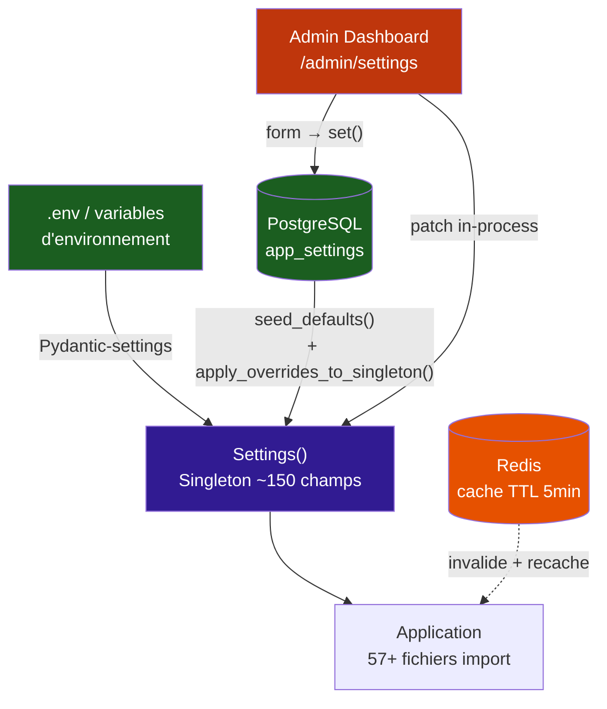
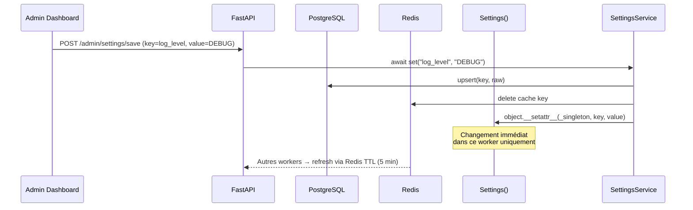
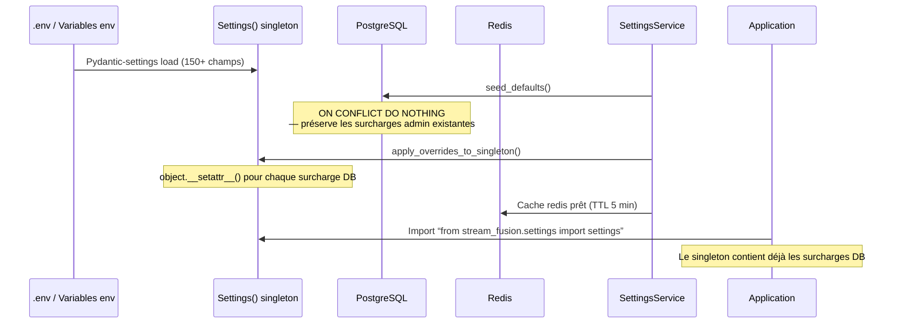

# :material-tune-variant: Système de configuration

Stream Fusion utilise une architecture de configuration **2-couches** qui combine variables d'environnement et base de données PostgreSQL pour offrir à la fois simplicité de déploiement et reconfiguration à chaud sans redémarrage.

---

## :material-sitemap: Architecture 2-couches



### Couche 1 : Variables d'environnement

Le fichier `settings.py` définit un singleton Pydantic `Settings()` (~150 champs) initialisé à partir de :

- `.env` à la racine du projet
- `/run/secrets/` (secrets Docker Swarm)
- Variables d'environnement du conteneur

```python
class Settings(BaseSettings):
    port: int = 8080
    redis_host: str = "redis"
    log_level: LogLevel = LogLevel.INFO
    # ... ~150 champs

    model_config = SettingsConfigDict(
        env_file=".env",
        secrets_dir="/run/secrets",
    )

settings = Settings()
```

### Couche 2 : Surcharges PostgreSQL

Les valeurs stockées dans la table `app_settings` écrasent les valeurs par défaut de la couche 1 au démarrage. Le service `SettingsService` (`services/settings/settings_service.py`) assure la cohérence entre les deux couches :

```python
# Au démarrage (lifespan.py)
settings_service = SettingsService(session_factory, redis_pool)
await settings_service.seed_defaults()          # Insère les valeurs env par défaut
await settings_service.apply_overrides_to_singleton()  # Applique les surcharges DB
```

---

## :material-database-edit: Flux de modification admin

Lorsqu'un administrateur modifie un paramètre via le panneau d'administration (`/admin/settings`) :



!!! tip "Immédiat et sans redémarrage"
    Le `SettingsService.set()` applique le changement sur le singleton **dans le processus courant** immédiatement. Les autres workers Gunicorn verront la nouvelle valeur dans un délai maximal de 5 minutes (TTL du cache Redis).

---

## :material-view-list: SettingsRegistry

Le fichier `services/settings/settings_registry.py` définit la source de vérité pour tous les paramètres administrables. Chaque paramètre est un `SettingDef` :

```python
@dataclass
class SettingDef:
    key: str                # Nom de l'attribut sur le singleton Settings
    type: SettingType       # "bool" | "int" | "str" | "float" | "enum"
    label: str              # Libellé français pour l'admin
    category: str           # Catégorie de regroupement
    requires_restart: bool  # Nécessite un redémarrage de l'app ?
    enum_choices: list[str] # Valeurs possibles si type="enum"
    description: str        # Aide contextuelle (français)
```

!!! info "100+ définitions"
    Le registre contient plus de 100 `SettingDef`, organisés en 16 catégories, tous avec des descriptions en français.

---

## :material-shape: Catégories

| Catégorie | Clé | Description |
|---|---|---|
| :fontawesome-solid-gear: Général | `general` | Paramètres généraux (download, inscription, HTTPS, logs) |
| :fontawesome-solid-shield-halved: Proxy | `proxy` | Proxyfication des liens et rate limiting |
| :material-database: Cache | `cache` | TTL Redis, verrous de refresh |
| :material-magnify: Indexeurs | `indexers` | Flags d'activation des indexeurs (C411, Torr9, etc.) |
| :material-link: URLs Indexeurs | `indexer_urls` | URLs de base des indexeurs |
| :material-cog: Avancé Indexeurs | `indexers_advanced` | Délai entre appels background |
| :material-server: Système | `system` | Workers Gunicorn, pool PostgreSQL, pools HTTP |
| :material-filmstrip: TMDB | `tmdb` | Langue, rate limit API TMDB |
| :material-text-search: Meilisearch | `meilisearch` | Hôte, port, clé, activation cache public |
| :material-swap-vertical: U2P | `u2p` | Relais Nostr, catégories, timeouts |
| :material-download: DMM | `dmm` | Dépôt hashlists, chemins, activation sync |
| :material-database: IMDB | `imdb` | Build DuckDB, enrichissement, régions AKA |
| :material-star: TRaSH | `trash` | Scoring, sync, templates |
| :material-clock-outline: Tâches planifiées | `tasks` | Schedule enabled flags et expressions cron |
| :material-database-export: Dumps DB | `system` / `tasks` | Dumps DuckDB, Meilisearch, PostgreSQL |
| :material-key: Indexeurs privés | `indexers` | Comptes uniques, flags d'activation |

---

## :material-file-document: Modèle de données

### Table `app_settings`

| Colonne | Type | Description |
|---|---|---|
| `id` | `uuid` | Identifiant unique |
| `key` | `varchar(255)` | Nom du paramètre (ex: `log_level`) |
| `value` | `text` | Valeur sérialisée en chaîne |
| `updated_at` | `bigint` | Timestamp Unix de dernière modification |
| `updated_by` | `varchar(64)` | Source de la modification (`admin`, `reset`, `seed`) |

### DAO

Le fichier `stream_fusion/services/postgresql/dao/appsetting_dao.py` expose :

| Méthode | Description |
|---|---|
| `get(key)` | Lire une valeur (chaîne brute) |
| `get_all()` | Dictionnaire `{key: value}` de toutes les surcharges |
| `upsert(key, value, updated_by)` | Insérer ou mettre à jour (ON CONFLICT DO UPDATE) |
| `seed_defaults(defaults)` | Insérer les valeurs par défaut env (ON CONFLICT DO NOTHING) |
| `reset(key)` | Restaurer la valeur env par défaut |

---

## :material-flash: Flux de démarrage



---

## :material-table: Variables d'environnement vs Administration

| Critère | Variables d'environnement | Panneau d'administration |
|---|---|---|
| **Persistance** | Fichier `.env`, secrets Docker | Table `app_settings` PostgreSQL |
| **Application** | Au démarrage uniquement | Immédiate (ce worker), 5 min (autres) |
| **Redémarrage requis** | Toujours | Rarement (sauf `requires_restart=True`) |
| **Portée** | Globale (tous les workers) | Globale (via DB + Redis) |
| **Versionnage** | Git (`.env.example`) | Non versionné (données d'instance) |
| **Utilisateur cible** | Déploiement initial, secrets | Configuration continue, A/B testing |
| **Exemples** | `TMDB_API_KEY`, `PG_PASS` | `log_level`, `allow_debrid_download` |
| **Sécurité** | Fichiers protégés, jamais dans les logs | Chiffré au repos (PG), redacted dans les logs |

!!! tip "Bonne pratique"
    Utilisez les variables d'environnement pour les secrets (clés API, mots de passe) et les paramètres structurels (taille de pool, hôtes). Utilisez le panneau d'administration pour les paramètres comportementaux que vous pourriez ajuster en cours d'exploitation (niveau de log, activation de fonctionnalités, expressions cron).

---

## :material-code-braces: API SettingsService

Le service expose les méthodes publiques suivantes :

| Méthode | Signature | Description |
|---|---|---|
| `get()` | `async (key: str) -> Any` | Redis → DB → singleton fallback |
| `get_all_effective()` | `async () -> dict[str, Any]` | Toutes les valeurs effectives (pour l'admin) |
| `set()` | `async (key: str, value: Any)` | Persiste DB, invalide Redis, patch singleton |
| `set_many()` | `async (updates: dict) -> list[str]` | Batch update, retourne les clés nécessitant restart |
| `seed_defaults()` | `async ()` | Insère les valeurs env par défaut au démarrage |
| `reset_many()` | `async (keys: list) -> list[str]` | Restaure les valeurs env par défaut |
| `apply_overrides_to_singleton()` | `async ()` | Applique toutes les surcharges DB au démarrage |

!!! note "Gestion des enums"
    Le service gère automatiquement la conversion entre types Python et chaînes DB pour les champs enum (`LogLevel`, `DebridService`, `NoCacheVideoLanguages`). Pour `no_cache_video_language`, le formulaire admin utilise le nom de l'enum (`FR`/`EN`) plutôt que sa valeur (URL complète).
