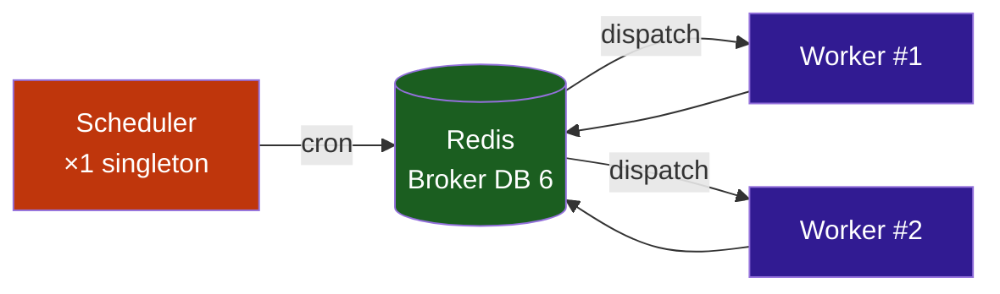

# :material-cog-sync: Tâches distribuées (Taskiq)

Stream Fusion utilise **Taskiq** comme système de tâches de fond distribuées avec Redis comme broker.

---

## :material-sitemap: Architecture



!!! danger "Scheduler = singleton"
    Le scheduler **ne doit jamais** avoir plus de 1 replica. Sinon les tâches cron seraient exécutées en double.

---

## :material-format-list-checks: Tâches automatiques

### :material-database: Maintenance base de données

| Tâche | Cron | Description |
|---|---|---|
| `debrid_cache_cleanup` | `0 */6 * * *` | :material-delete-sweep: Cache debrid expiré |
| `torrent_orphan_cleanup` | `0 1 * * *` | :material-delete: Orphelins sans TMDB (>7j) |
| `torrent_dedup` | `0 2 * * *` | :material-content-duplicate: Dédoublonnage |
| `torrent_group_hash` | `0 3 * * *` | :material-group: Groupement par hash |
| `torrent_group_title_size` | `0 4 * * *` | :material-group: Groupement titre/taille |
| `fix_type_inconsistencies` | `0 5 * * *` | :material-wrench: Correction types |
| `db_dump_create` | `0 4 * * 0` | :material-package-variant-closed: Création dumps DuckDB + Meilisearch |
| `db_dump_create_pg` | `0 3 * * *` | :material-database-export: Dump PostgreSQL quotidien |

### :material-key: Nettoyage des clés

| Tâche | Cron | Description |
|---|---|---|
| `api_keys_cleanup` | `0 */6 * * *` | :material-key-remove: Clés API expirées |
| `peer_keys_cleanup` | `0 */6 * * *` | :material-key-remove: Peer keys expirées |

### :material-link-variant: Matching automatique

| Tâche | Cron | Description |
|---|---|---|
| `tmdb_orphan_matching` | `*/30 * * * *` | :material-movie-search: Matching TMDB |
| `imdb_orphan_matching` | `*/30 * * * *` | :material-movie-search: Matching IMDB |

### :material-cloud-sync: Synchronisation

| Tâche | Cron | Description |
|---|---|---|
| `dmm_sync` | `0 2 * * *` | :material-download: Hashlists DMM |
| `u2p_sync` | `0 3 * * 0` | :material-swap-vertical: Nostr NIP-35 |
| `peer_sync` | Configurable | :material-share-variant: Cache inter-instances |
| `imdb_build` | `0 3 1,15 * *` | :material-database: Rebuild DuckDB |
| `imdb_enrich` | `0 5 * * *` | :material-magnify: Enrichissement Meili |
| `pg_rtn_parse` | Configurable | :material-code-braces: Parsing RTN PostgreSQL items |
| `trash_sync` | `0 */6 * * *` | :material-star: Sync TRaSH CFs + templates |
| `imdb_tmdb_enrich_duck` | Configurable | :material-movie-search: Enrichissement TMDB → DuckDB |
| `tmdb_enrich_meili` | Configurable | :material-magnify: Backfill tmdb_id Meilisearch (local) |

---

## :material-lock: Verrous distribués

Taskiq utilise des verrous Redis pour empêcher les exécutions simultanées :

| Verrou | Clé Redis | TTL | Description |
|---|---|---|---|
| Background refresh | `bg_refresh_indexer:{name}` | 6h | Un refresh par indexeur |
| Préchargement | `prefetch_next:{hash}` | 20 min | Un prefetch par épisode |
| Peer sync | `peer_sync:{instance_id}` | 24h | Une sync par instance |
| Hashlist sync | `taskiq:lock:hashlist_sync` | — | Empêche conflits avec sync DMM |
| RTN parse | `taskiq:lock:rtn_parse` | 10 min | Une passe RTN à la fois |
| PG RTN parse | `taskiq:lock:pg_rtn_parse` | 10 min | Une passe PG RTN à la fois |
| DB dump create | `taskiq:lock:db_op:{db_type}` | 60s | Un dump par type de DB |
| DB peer pull | `taskiq:lock:db_peer_pull:{db_type}` | — | Un pull par type de DB |

---

## :material-toggle-switch: Activation/désactivation

=== "Variables d'environnement"

    ```env
    # Désactiver une tâche
    TASK_SCHEDULE_ENABLED_DEBRID_CACHE_CLEANUP=False
    
    # Modifier un horaire cron
    TASK_CRON_DEBRID_CACHE_CLEANUP=0 */4 * * *
    ```

=== "Panneau d'administration"

    `/admin/` → **Scheduler** : activer/désactiver, déclencher manuellement
    
    `/admin/` → **Maintenance** : nettoyage manuel de la base

---
    
## :material-clock-edit-outline: Système de planification dynamique
    
La planification des tâches est gérée par un système dynamique qui lit les paramètres depuis le singleton `Settings()` (surcharges PostgreSQL incluses) au démarrage du worker, et les modifie à chaud via les vues admin.

### Mappings de configuration

Le fichier `stream_fusion/tkq.py` définit deux mappings essentiels :

**`_TASK_SETTINGS_KEYS`** — associe chaque `task_id` à ses attributs de configuration sur le singleton `Settings` :

```python
_TASK_SETTINGS_KEYS: dict[str, tuple[str, str]] = {
    "debrid_cache_cleanup":   ("task_cron_debrid_cache_cleanup",   "task_schedule_enabled_debrid_cache_cleanup"),
    "hashlist_sync":          ("dmm_sync_cron",                    "dmm_sync_schedule_enabled"),
    "imdb_build_duck":        ("imdb_build_duck_cron",             "imdb_build_duck_schedule_enabled"),
    "db_dump_duckdb":         ("db_dump_cron",                     "db_dump_schedule_enabled"),
    # ... 22 entrées
}
```

Chaque entrée est un tuple `(cron_attr, enabled_attr)` — le premier est le nom de l'attribut contenant l'expression cron, le second celui du booléen d'activation.

**`TASK_BROKER_NAMES`** — associe chaque `task_id` au nom complet de la fonction enregistrée dans le broker :

```python
TASK_BROKER_NAMES: dict[str, str] = {
    "debrid_cache_cleanup": "stream_fusion.tasks.db_tasks:debrid_cache_cleanup",
    "db_dump_duckdb":      "stream_fusion.tasks.db_tasks:db_dump_create",
    "trash:sync":           "trash:sync",
    # ... 24 entrées
}
```

!!! note "Format module:fonction"
    Taskiq utilise le séparateur `:` (deux-points) entre le module et la fonction — `stream_fusion.tasks.db_tasks:debrid_cache_cleanup`. C'est exactement le nom que `@broker.task` enregistre.

### `seed_schedules_from_settings()`

Cette fonction est appelée lors de l'événement `WORKER_STARTUP`. Elle :

1. Lit le singleton `Settings` **après** que `apply_overrides_to_singleton()` a appliqué les surcharges PostgreSQL
2. Pour chaque entrée de `_TASK_SETTINGS_KEYS`, lit l'expression cron et le flag d'activation
3. Supprime toute version obsolète du schedule dans Redis
4. Si le flag d'activation est `True`, crée un `ScheduledTask` dans `ListRedisScheduleSource`

Un verrou distribué (`sfr:sched:startup-lock`, SET NX, TTL 30s) garantit qu'un seul worker sème les schedules à la fois.

### `update_redis_schedule()`

Appelée par les vues admin (`/admin/tasks`) lors de la sauvegarde d'une configuration de tâche :

- Supprime l'ancien schedule du `task_id` dans Redis
- Si `enabled=True` et qu'une expression cron est fournie, crée un nouveau `ScheduledTask`
- Aucun redémarrage requis — le changement est **immédiat** dans Redis

### Verrou global de pause

La clé Redis `sfr:schedule:paused` permet de mettre en pause **toutes** les tâches planifiées sans modifier leurs configurations individuelles. Chaque tâche vérifie cette clé avant exécution.

!!! warning "Distinction importante : flags vs expressions cron"
    - **Flags d'activation** (`TASK_SCHEDULE_ENABLED_*`) : lus à chaque **exécution** de la tâche (ex: `if not settings.pg_rtn_schedule_enabled: return`). L'activation/désactivation prend effet **immédiatement**, sans aucun redémarrage. Applicable aussi bien via variables d'environnement que via l'admin.
    - **Expressions cron** (`TASK_CRON_*`) modifiées via **variables d'environnement** : le scheduler Taskiq lit la config au démarrage uniquement. Nécessite un **redémarrage du scheduler et des workers**.
    - **Expressions cron** modifiées via l'**admin** : `update_redis_schedule()` modifie directement le schedule dans Redis. Appliquées **immédiatement**, aucun redémarrage.