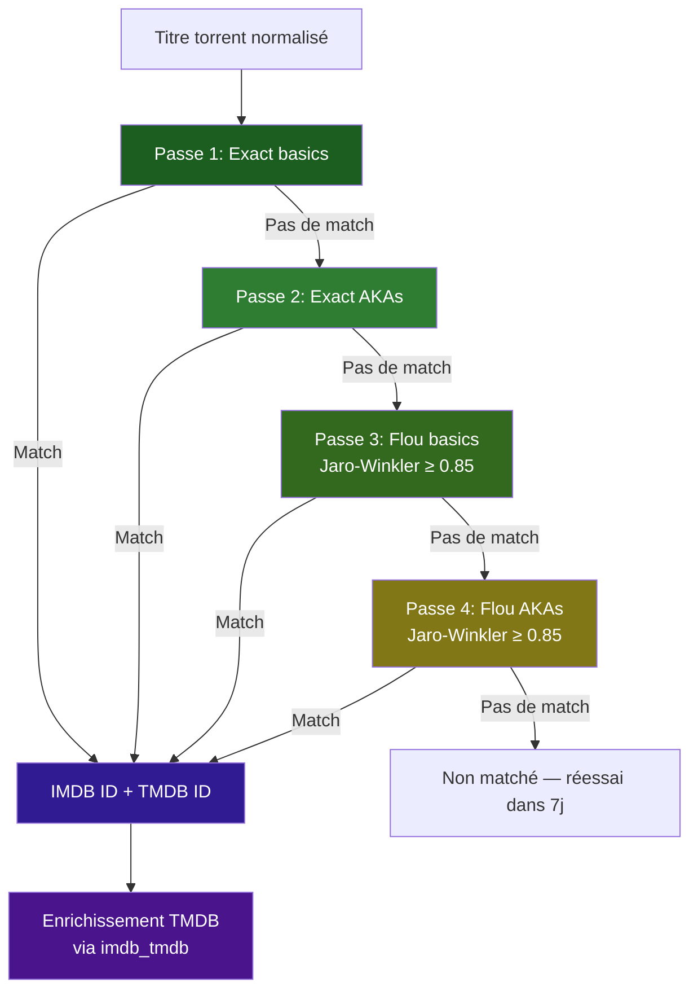

# Matching IMDB — Détails techniques

Schéma des tables DuckDB, algorithme de matching en 4 passes et pipelines d'enrichissement.

---

## Base DuckDB

DuckDB est une base de données analytique locale construite automatiquement par l'application. Elle agrège les datasets publics d'IMDB et un mapping IMDB→TMDB pour le matching des titres.

### Datasets importés

| Dataset | Source | Table | Filtre |
|---|---|---|---|
| Title Basics | `datasets.imdbws.com` | `imdb_basics` | Seulement `movie`, `tvSeries`, `tvMiniSeries`, `tvMovie` ; exclut `isAdult=1` |
| Title AKAs | `datasets.imdbws.com` | `imdb_akas` | Seulement régions `FR`, `BE`, `CH`, `CA`, `LU` ou langue `fr` |
| Title Ratings | `datasets.imdbws.com` | `imdb_ratings` | Aucun filtre |
| IMDB→TMDB Mapping | GitHub Gist | `imdb_tmdb` | IDs sans préfixe `tt` corrigés |

### Schéma des tables

```sql
-- Titres IMDB (basics)
CREATE TABLE imdb_basics (
    tconst         VARCHAR PRIMARY KEY,  -- ex: tt0111161
    title_type     VARCHAR NOT NULL,     -- movie, tvSeries, tvMiniSeries, tvMovie
    primary_title  VARCHAR NOT NULL,     -- titre original
    original_title VARCHAR NOT NULL,     -- titre original
    start_year     INTEGER,              -- année de début
    norm_primary   VARCHAR NOT NULL,     -- titre normalisé (pour le matching)
    norm_original  VARCHAR NOT NULL       -- titre original normalisé
);

-- Titres alternatifs (AKAs)
CREATE TABLE imdb_akas (
    title_id          VARCHAR NOT NULL,    -- référence vers imdb_basics.tconst
    ordering          INTEGER,
    title             VARCHAR NOT NULL,    -- titre alternatif
    region            VARCHAR,             -- FR, BE, CH, CA, LU
    language          VARCHAR,
    norm_title        VARCHAR NOT NULL,    -- titre normalisé
    is_original_title BOOLEAN
);

-- Notes
CREATE TABLE imdb_ratings (
    tconst         VARCHAR PRIMARY KEY,
    average_rating FLOAT,
    num_votes      INTEGER
);

-- Correspondance IMDB → TMDB
CREATE TABLE imdb_tmdb (
    imdb_id VARCHAR PRIMARY KEY,  -- ex: tt0111161
    tmdb_id VARCHAR               -- ex: 278
);
```

### Index

| Index | Table | Colonnes |
|---|---|---|
| `idx_basics_norm_primary` | `imdb_basics` | `norm_primary, start_year` |
| `idx_basics_norm_original` | `imdb_basics` | `norm_original, start_year` |
| `idx_basics_prefix` | `imdb_basics` | `LEFT(norm_primary, 3), norm_primary` |
| `idx_akas_norm` | `imdb_akas` | `norm_title, title_id` |

### Normalisation des titres

Tous les titres (côté IMDB et côté torrents) sont normalisés avec le même algorithme avant comparaison :

1. Suppression du possessif `'s` ("world's" → "world")
2. Apostrophes → espace ("l'homme" → "l homme")
3. Ponctuation `[,!?;:]` → espace
4. Suppression des accents (NFD + strip combining)
5. Minuscules + collapse des espaces

---

## Matching IMDB multi-niveaux

Le matching IMDB est le cœur du système d'identification. Il s'effectue en **4 passes successives**, chaque passe ne traitant que les torrents non matchés par les passes précédentes.



### Détail des 4 passes

| Passe | Stratégie | Join | Filtres | Disambiguïsation |
|---|---|---|---|---|
| **1** | Exact sur `imdb_basics` | `norm_primary = norm_title` OU `norm_original = norm_title` | Année ±1 (ou NULL) ; type contenu | `ROW_NUMBER()` par hash, tri par `num_votes DESC` |
| **2** | Exact sur `imdb_akas` | `imdb_akas.norm_title = norm_title` → `JOIN imdb_basics` | Année ±1 ; type contenu | `ROW_NUMBER()` par hash, tri par `num_votes DESC` |
| **3** | Flou sur `imdb_basics` | Pré-filtre `LEFT(norm, 3)` puis `jaro_winkler_similarity ≥ 0.85` | Année ±1 ; type contenu | `ROW_NUMBER()` par hash, tri par `votes DESC, score DESC` |
| **4** | Flou sur `imdb_akas` | Pré-filtre `LEFT(norm, 3)` puis `jaro_winkler_similarity ≥ 0.85` | Année ±1 ; type contenu | `ROW_NUMBER()` par hash, tri par `votes DESC, score DESC` |

### Enrichissement TMDB

Après le matching IMDB, un lookup est effectué dans la table `imdb_tmdb` pour associer le `tmdb_id` correspondant, permettant le lien avec l'API TMDB.

---

## Quatre pipelines de matching

Le matching IMDB/TMDB est déclenché par **quatre pipelines indépendants** :

### Pipeline A : Enrichissement Meilisearch (`imdb_enrich`)

Match les documents Meilisearch où `imdb_matched = false` contre DuckDB, puis écrit le `imdb_id` et `tmdb_id` résultants directement dans Meilisearch.

**Tâche cron** : `imdb_enrich` — fréquence configurable.

### Pipeline B : Orphelins PostgreSQL (`imdb_orphan_matching`)

Match les `torrent_items` PostgreSQL où `imdb_id IS NULL` contre DuckDB. Possède une intelligence supplémentaire :

- Préfère le `parsed_data.title` RTN quand disponible
- Extrait le titre des noms de fichiers bruts via un regex de boundary
- Met `year = None` pour les séries (l'année encodée ≠ l'année de début IMDB)
- Filtre les ebooks (mots-clés + taille < 300 MB)
- Réessaie les non-matchés après 7 jours
- Pre-lookup inverse : si `tmdb_id` existe déjà → résolution directe `imdb_id` via `imdb_tmdb` DuckDB

**Tâche cron** : `imdb_orphan_matching` — toutes les 30 minutes.

### Pipeline C : Enrichissement DuckDB via TMDB (`imdb_tmdb_enrich_duck`) :material-new-box:

Résout les mappings IMDB→TMDB manquants dans la table `imdb_tmdb` de DuckDB :

1. Identifie les `imdb_id` présents dans DuckDB mais sans `tmdb_id` associé
2. Appelle l'API TMDB (`fetch_external_ids`) pour obtenir le `tmdb_id` correspondant
3. Écrit le mapping dans `imdb_tmdb`

Ce pipeline enrichit DuckDB pour que les futurs matchings (A, B, D) puissent résoudre les `tmdb_id` sans appel API.

**Tâche cron** : `imdb_tmdb_enrich_duck` — fréquence configurable.

### Pipeline D : Backfill Meilisearch local (`tmdb_enrich_meili`) :material-new-box:

Injecte les `tmdb_id` dans Meilisearch en utilisant **uniquement** la table `imdb_tmdb` de DuckDB :

1. Parcourt les documents Meilisearch qui ont un `imdb_id` mais pas de `tmdb_id`
2. Lookup dans `imdb_tmdb` (DuckDB) pour trouver le `tmdb_id` correspondant
3. Écrit le `tmdb_id` directement dans Meilisearch

**Aucun appel à l'API TMDB** — tout est résolu localement via DuckDB. Complémentaire au pipeline A qui fait le matching inverse (titre → imdb_id).

**Tâche cron** : `tmdb_enrich_meili` — fréquence configurable.

---

## Cache de disponibilité DuckDB

Pour éviter des vérifications coûteuses à chaque requête, l'état de disponibilité de DuckDB est mis en cache.

### Vérification au démarrage

Lors du lifespan startup, `ImdbDAO` vérifie que les tables DuckDB (`imdb_basics`, `imdb_akas`, `imdb_ratings`, `imdb_tmdb`) existent et contiennent des données :

```python
# ImdbDAO._cached_ready — booléen statique au niveau de la classe
ImdbDAO._cached_ready = True  # si toutes les tables sont prêtes
```

### Utilisation au runtime

Avant chaque matching, les services vérifient le cache :

```python
dao = ImdbDAO(con)
if not dao.is_ready():  # lit _cached_ready
    logger.warning("DuckDB IMDB tables not ready — skipping")
    return result
```

### Override admin

Le statut peut être forcé manuellement depuis l'admin :

- `GET /admin/meta/duckdb-status` — lit `ImdbDAO._cached_ready`
- `POST /admin/meta/duckdb-status` — force `ready = true` ou `ready = false`

Utile pour les situations où DuckDB est partiellement reconstruit ou en maintenance.

### Dashboard META

Le dashboard `/admin/meta` affiche l'état DuckDB en temps réel avec :

- Statut `ready` (booléen)
- Stats des tables (nombre de lignes)
- Stats d'enrichissement TMDB (taux de couverture `imdb_tmdb`)
- Dernier build (dates de début/fin, statut)
- Liste des dumps disponibles

---

## :material-backup-restore: Sauvegarde et restauration

La sauvegarde de DuckDB est critique pour la préservation des données de matching. Consultez la page dédiée :

<div class="grid cards" markdown>

-   :material-database: **[Sauvegarde DuckDB](../cache/sauvegarde-duckdb.md)**

    Procédure complète de backup : `CHECKPOINT` + copie de fichier directe. Pourquoi `EXPORT DATABASE` est à éviter. Restauration bit-perfect.

</div>