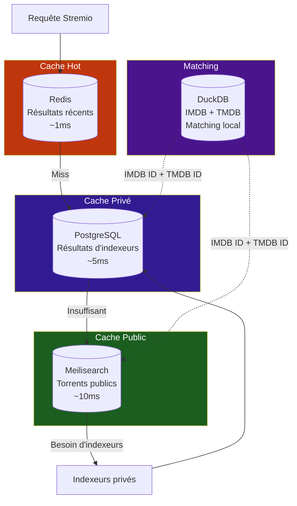

# Cache et bases de données

Stream Fusion repose sur **4 couches de données** spécialisées, chacune avec un rôle et des caractéristiques distincts.

---

## Vue d'ensemble

---

## Les 4 couches

-   :material-flash: **L1 — Redis (hot cache)**

    Latence ~1ms, TTL 7 jours
    
    Résultats de recherche récents, streams, métadonnées TMDB
    
    Se remplit automatiquement au fil des requêtes

-   :material-database: **L2 — PostgreSQL (cache privé)**

    Latence ~5ms, persistant
    
    Torrents issus des indexeurs privés (C411, Torr9, LaCale…)
    
    Se remplit au fil des requêtes utilisateur

-   :material-magnify: **L3 — Meilisearch (cache public)**

    Latence ~10ms, full-text
    
    Torrents publics (DMM, Zilean, U2P, peers)
    
    Se remplit via les syncs (DMM, U2P) et le peering

-   :material-movie-search: **L4 — DuckDB (matching IMDB)**

    Base locale analytique
    
    Datasets IMDB + mapping TMDB
    
    4 passes de matching (exact → flou)

---

## Redis — Cache hot

| Clé | Contenu | TTL |
|---|---|---|
| `search:{hash}` | Résultats de recherche | 7 jours |
| `stream:{hash}` | Résultats stream | 10-20 min |
| `media:{hash}` | Métadonnées TMDB | 7 jours |
| `stream_link:{hash}` | Liens debrid | 6 heures |
| `download:{hash}` | Flags download | 10 min |
| `ready:{hash}` | Flags stream prêt | 6 heures |

Stratégie **cache-first** : si une entrée existe, elle est retournée immédiatement. Si l'entrée est présente mais ancienne, un **refresh asynchrone** est lancé pendant que l'utilisateur reçoit les résultats en cache.

---

## PostgreSQL — Cache privé

| Caractéristique | Détail |
|---|---|
| Type | Persistant, structuré |
| Rôle | Torrents issus des indexeurs privés |
| Remplissage | Automatique, au fil des requêtes |
| Contenu | Hash, titre, taille, langues, seeders, IMDB, TMDB |

!!! tip "Cache privé = résultats de requêtes"
    PostgreSQL ne contient que les torrents effectivement cherchés par les utilisateurs. Plus l'instance est utilisée, plus le cache se remplit.

---

## Meilisearch — Cache public

| Caractéristique | Détail |
|---|---|
| Type | Full-text, latence ~10ms |
| Rôle | Torrents publics, recherche rapide |
| Remplissage | Syncs DMM, U2P, Zilean + peering |
| Contenu | Hash, titre parsé, résolution, codec, langues, IMDB, TMDB |

| Source | `hash_source` | Méthode |
|---|---|---|
| DMM Hashlists | `DMM - Hashlist` / `DMM - hashlist` | Clone GitHub quotidien |
| Zilean | `Zilean` | API REST |
| U2P / Utopeer | `U2P - Nostr` | WebSocket Nostr |
| Peers distants | `Peer - {nom}` | API HMAC+Fernet |

!!! warning "Peuplement intentionnel"
    Contrairement à PostgreSQL, Meilisearch doit être peuplé intentionnellement via les syncs. Voir le [tutoriel de population initiale](population-initiale.md).

---

## DuckDB — Matching IMDB

DuckDB est une base analytique locale construite automatiquement. Elle agrège les datasets publics IMDB et un mapping IMDB→TMDB.

| Dataset | Source | Table | Filtre |
|---|---|---|---|
| Title Basics | `datasets.imdbws.com` | `imdb_basics` | `movie`, `tvSeries`, `tvMiniSeries`, `tvMovie` ; exclut `isAdult=1` |
| Title AKAs | `datasets.imdbws.com` | `imdb_akas` | Régions `FR`, `BE`, `CH`, `CA`, `LU` ou langue `fr` |
| Title Ratings | `datasets.imdbws.com` | `imdb_ratings` | Aucun filtre |
| IMDB→TMDB | GitHub Gist | `imdb_tmdb` | IDs sans préfixe `tt` corrigés |

!!! info "Construction automatique"
    La base DuckDB est construite au premier démarrage ou sur cron. Voir les [détails techniques](details-imdb.md).

---

## Sections détaillées

-   :material-movie-search: **[Matching IMDB](details-imdb.md)**

    Schéma des tables DuckDB, 4 passes de matching, normalisation des titres, enrichissement TMDB

-   :material-rocket-launch: **[Population initiale](population-initiale.md)**

    Tutoriel pas-à-pas pour peupler les caches sur une nouvelle instance (DMM, U2P, RTN, IMDB)

-   :material-sitemap: **[Pipeline de recherche](../architecture/pipeline-recherche.md)**

    Flux complet d'une requête Stremio à travers les 4 couches

