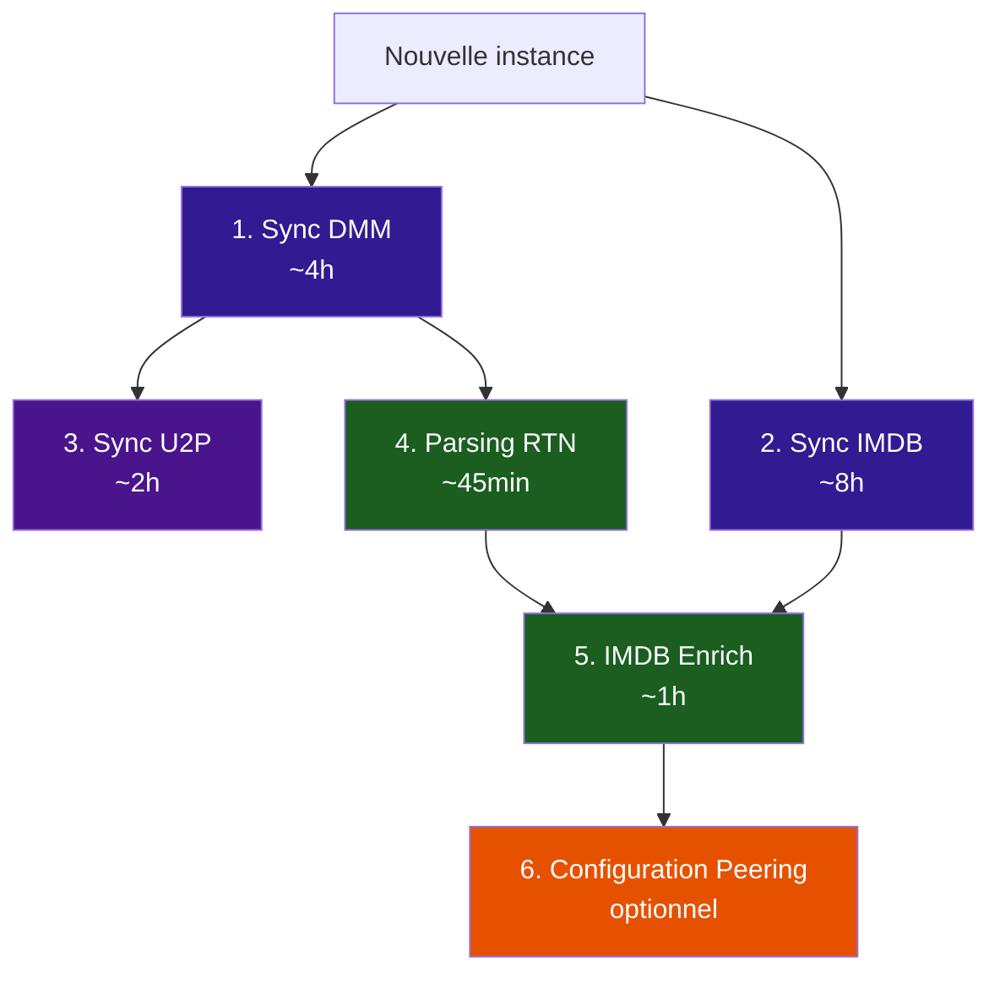

# Population initiale du cache

Après une installation fraîche, les caches public et IMDB sont vides. Ce tutoriel guide l'ordre de population pour optimiser les performances. **Il est recommandé de déclencher chaque étape depuis le panneau d'administration** (`/admin/`).

La construction des bases est longue mais ne doit être faite **qu'une seule fois**.

!!! warning "Temps indicatifs"
    Les durées ci-dessous sont indicatives et dépendent de la puissance de votre machine (CPU, RAM, réseau).

---

## Ordre de population



### 1. Sync DMM (~4h)

Depuis le panneau d'administration, déclenchez la **sync DMM**. Elle clone le dépôt GitHub de Debrid Media Manager et indexe plus d'un million de hashlists dans Meilisearch.

??? info "Variables d'environnement indicatives"
    Ces variables sont déjà activées par défaut. Déclenchez plutôt la sync depuis `/admin/`.
    ```env
    DMM_SYNC_ENABLED=True
    DMM_SYNC_SCHEDULE_ENABLED=True
    ```

### 2. Sync IMDB (~8h) — en parallèle avec DMM

Déclenchez la **sync IMDB** en même temps que DMM. Elle télécharge les datasets IMDB (Title Basics, AKAs, Ratings) et le mapping TMDB, puis construit la base DuckDB.

??? info "Variables d'environnement indicatives"
    ```env
    IMDB_SYNC_ENABLED=True
    IMDB_BUILD_SCHEDULE_ENABLED=True
    ```

### 3. Sync U2P (~2h) — après la fin de DMM

Une fois la sync DMM terminée, déclenchez la **sync U2P** depuis le panneau d'administration. Elle indexe les torrents Nostr NIP-35 dans Meilisearch.

??? info "Variables d'environnement indicatives"
    ```env
    U2P_SYNC_ENABLED=True
    U2P_SYNC_SCHEDULE_ENABLED=True
    ```

!!! info "U2P est optionnel"
    La sync U2P est désactivée par défaut. Elle nécessite un relais Nostr accessible. Activez-la uniquement si vous avez configuré les relais.

### 4. Parsing RTN (~45 min) — après la fin de DMM

Une fois que DMM (et optionnellement U2P) a peuplé Meilisearch, déclenchez le **parsing RTN** depuis le panneau d'administration. Il analyse tous les titres bruts pour extraire les métadonnées structurées (résolution, codec, langues, etc.).

??? info "Variables d'environnement indicatives"
    ```env
    RTN_SCHEDULE_ENABLED=True
    RTN_CRON_SCHEDULE=0 * * * *
    ```

### 5. IMDB Enrich (~1h) — après Parsing RTN et IMDB Sync

**Prérequis** : la base DuckDB doit être construite (étape 2 terminée) ET le parsing RTN doit être fait (étape 4 terminée).

Déclenchez l'**enrichissement IMDB** depuis le panneau d'administration. Il matche les torrents Meilisearch contre la base DuckDB pour leur attribuer des IDs IMDB et TMDB.

??? info "Variables d'environnement indicatives"
    ```env
    IMDB_ENRICH_SCHEDULE_ENABLED=True
    ```

### 6. Configuration Peering (optionnel)

Une fois vos bases peuplées, vous pouvez configurer les syncs peer pour enrichir encore davantage votre cache public.

Voir [Peering - Configuration](../peering/configuration.md).

---

## Résumé des durées indicatives

| Étape | Durée approximative | Dépendance |
|---|---|---|
| Sync DMM | ~4h | Aucune |
| Sync IMDB | ~8h | Aucune (en parallèle avec DMM) |
| Sync U2P | ~2h | Après DMM |
| Parsing RTN | ~45 min | Après DMM |
| IMDB Enrich | ~1h | Après IMDB Sync + RTN |
| **Total** | **~10-12h** | |

!!! tip "Astuce"
    Les syncs DMM et IMDB peuvent tourner en parallèle. Le parsing RTN et la sync U2P peuvent aussi tourner en parallèle. Le seul point bloquant est l'IMDB Enrich qui nécessite à la fois la base DuckDB prête ET le parsing RTN terminé.

---

## Vérification

Après chaque étape, vérifiez la progression depuis le panneau d'administration (`/admin/`) :

- **Meilisearch** : le nombre de documents indexés augmente
- **DuckDB** : le fichier `/data/imdb_db/imdb.duckdb` existe et pèse plusieurs centaines de MB
- **PostgreSQL** : les torrents se remplissent au fil des requêtes utilisateur