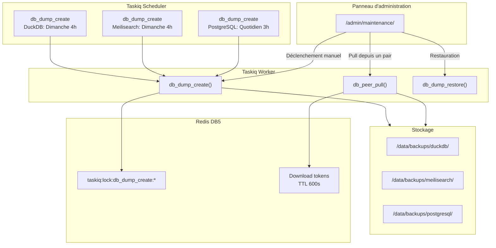
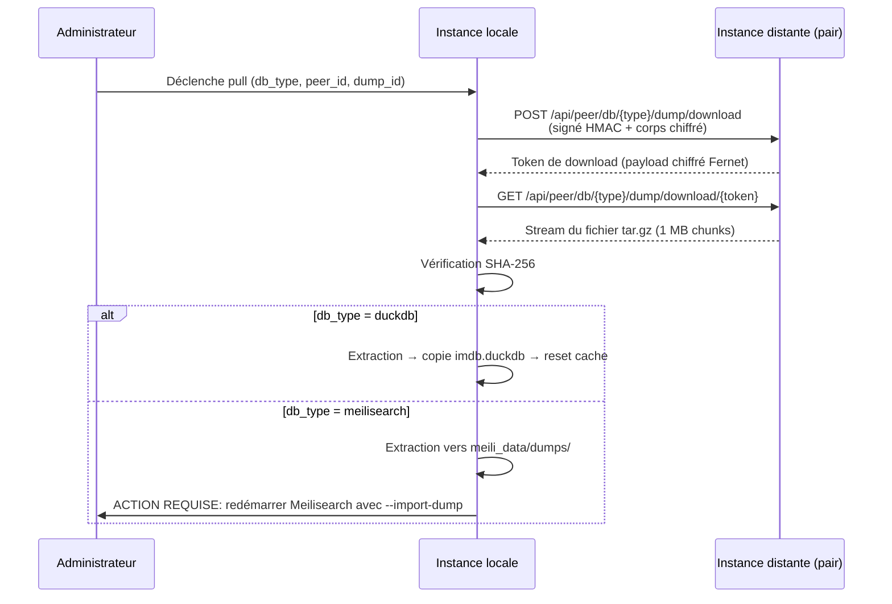

# Sauvegarde et restauration

Stream Fusion propose un système complet de sauvegarde automatisée pour les trois bases de données critiques : **DuckDB** (matching IMDB), **Meilisearch** (cache public full-text), et **PostgreSQL** (cache privé + configuration).

---

## Concept

Trois types de dumps coexistent, avec des périmètres de partage distincts :

<div class="grid cards" markdown>

-   :material-database: **DuckDB**

    Base IMDB locale. Dump transférable entre pairs.  
    Méthode : `CHECKPOINT` + copie fichier `imdb.duckdb`

-   :material-magnify: **Meilisearch**

    Index full-text public. Dump transférable entre pairs.  
    Méthode : API `create_dump()` Meilisearch

-   :material-server: **PostgreSQL**

    Cache privé + configuration. **Local uniquement** (contient secrets).  
    Méthode : `pg_dump --format=custom`

</div>

!!! warning "PostgreSQL : jamais de partage entre pairs"
    Les dumps PostgreSQL contiennent des données sensibles (clés API utilisateur, tokens debrid, secrets de configuration). Ils ne sont **jamais** exposés via l'API peer et restent strictement locaux.

!!! tip "DuckDB et Meilisearch : partage entre pairs"
    Les dumps DuckDB (base IMDB) et Meilisearch (index full-text) sont conçus pour être partagés entre instances appairées. Une nouvelle instance peut ainsi récupérer une base IMDB pré-construite (gain de ~8h de build) et un index Meilisearch déjà peuplé.

---

## Architecture



Le système utilise :

| Composant | Rôle |
|---|---|
| **Tâches Taskiq** | `db_dump_create` (création), `db_peer_pull` (pull distant), `db_dump_restore` (restauration) |
| **Verrous Redis** | `taskiq:lock:db_dump_create:{type}` (2h TTL) — empêche les exécutions concurrentes |
| **Redis DB5** | Tokens de téléchargement (TTL configurable via `DB_DUMP_TOKEN_TTL`) |
| **`SyncProgressTracker`** | Suivi de progression en temps réel (affiché dans l'UI admin) |
| **Panneau d'administration** | Section maintenance à `/admin/maintenance/` |

---

## Dump DuckDB

### Méthode correcte : CHECKPOINT + copie fichier

Le dump DuckDB est réalisé par **copie directe du fichier** `imdb.duckdb` après un `CHECKPOINT` qui vide le WAL (Write-Ahead Log) sur disque :

```
CHECKPOINT  →  copie imdb.duckdb  →  tar.gz  →  SHA-256
```

Cette méthode est **fiable, rapide, et bit-perfect**. Le fichier copié est identique à la base en cours d'utilisation.

!!! danger "Ne JAMAIS utiliser EXPORT DATABASE / IMPORT DATABASE"
    La méthode `EXPORT DATABASE` de DuckDB exporte les tables au format CSV, et `IMPORT DATABASE` les réimporte depuis CSV. Ce round-trip CSV est **cassé** sur les données IMDB réelles :
    
    - Les titres contiennent des **apostrophes** (`L'Affaire`, `Today's Special`), des **guillemets** et des caractères spéciaux
    - Les données originales entrent dans DuckDB via `executemany()` Python, **pas** via parsing CSV
    - Le parsing CSV de DuckDB est plus strict et échoue ou corrompt ces valeurs
    - Résultat : **perte de données silencieuse**, matching IMDB dégradé
    
    La copie directe du fichier est également **plus rapide** et ne nécessite aucune reconstruction d'index.

### Contenu du dump

| Fichier dans l'archive | Description |
|---|---|
| `imdb.duckdb` | Base DuckDB complète (tables `imdb_basics`, `imdb_akas`, `imdb_ratings`, `imdb_tmdb`) |

Le WAL n'est pas inclus dans l'archive car le `CHECKPOINT` l'a vidé avant la copie.

---

## Dump Meilisearch

### Méthode : API create_dump()

Le dump Meilisearch utilise l'API native de Meilisearch :

```
create_dump()  →  wait_for_task()  →  récupération .dump  →  tar.gz  →  SHA-256
```

1. Appel à l'API `POST /dumps` de Meilisearch
2. Attente de la complétion de la tâche (timeout 5 minutes)
3. Récupération du fichier `.dump` le plus récent dans `meili_db_path/dumps/`
4. Archivage en `tar.gz` avec SHA-256

### Restauration

!!! warning "Restauration Meilisearch : redémarrage requis"
    Contrairement à DuckDB et PostgreSQL, la restauration d'un dump Meilisearch nécessite un **redémarrage du conteneur Meilisearch** avec l'option `--import-dump` :
    
    ```
    meilisearch --import-dump /meili_data/dumps/meili_dump.dump
    ```
    
    L'interface d'administration affiche un avertissement explicite avant toute restauration.

---

## Dump PostgreSQL

### Méthode : pg_dump --format=custom

Le dump PostgreSQL utilise l'outil standard `pg_dump` au format custom (compressé) :

```
pg_dump --format=custom --no-owner --no-acl --dbname <database>
```

| Caractéristique | Détail |
|---|---|
| Format | Custom (compressé, restaurable par `pg_restore`) |
| Rétention | 7 jours (configurable via `DB_DUMP_PG_RETENTION`) |
| Partage | **Jamais** — local uniquement |
| Restauration | `pg_restore --clean --if-exists` |

!!! danger "Restauration destructive"
    La restauration PostgreSQL utilise `pg_restore --clean --if-exists` et **détruit toutes les données actuelles**. La confirmation est demandée dans l'interface d'administration.

---

## Configuration

### Variables d'environnement

| Variable | Défaut | Description |
|---|---|---|
| `DB_DUMP_SCHEDULE_ENABLED` | `False` | Active la création automatique des dumps DuckDB + Meilisearch |
| `DB_DUMP_CRON` | `0 4 * * 0` | Planification des dumps DuckDB + Meilisearch (Dimanche 4h) |
| `DB_DUMP_RETENTION` | `3` | Nombre de dumps conservés par type (DuckDB, Meilisearch) |
| `DB_DUMP_TOKEN_TTL` | `600` | TTL des tokens de téléchargement en secondes (Redis DB5) |
| `DB_DUMP_PG_SCHEDULE_ENABLED` | `False` | Active la création automatique des dumps PostgreSQL |
| `DB_DUMP_PG_CRON` | `0 3 * * *` | Planification des dumps PostgreSQL (Quotidien 3h) |
| `DB_DUMP_PG_RETENTION` | `7` | Nombre de dumps PostgreSQL conservés |
| `BACKUPS_DB_DIR` | `/data/backups` | Répertoire racine des sauvegardes (volume partagé) |
| `MEILI_DB_PATH` | `/meili_data` | Répertoire des données Meilisearch |

### Planifications par défaut

<div class="grid cards" markdown>

-   :material-database: **DuckDB + Meilisearch**

    **Dimanche à 4h du matin** (`0 4 * * 0`)
    
    Rétention : 3 dumps
    
    Interrupteur principal : `DB_DUMP_SCHEDULE_ENABLED`

-   :material-server: **PostgreSQL**

    **Tous les jours à 3h du matin** (`0 3 * * *`)
    
    Rétention : 7 dumps
    
    Interrupteur principal : `DB_DUMP_PG_SCHEDULE_ENABLED`

</div>

!!! note "Changement de planification"
    Les expressions cron nécessitent un **redémarrage du worker** pour être prises en compte. Les flags d'activation (`*_SCHEDULE_ENABLED`) sont vérifiés à chaque exécution et peuvent être modifiés à chaud.

---

## Panneau d'administration

La gestion des dumps est accessible dans le panneau d'administration, section **Maintenance** (`/admin/maintenance/`).

### Fonctionnalités disponibles

| Action | Description |
|---|---|
| :fontawesome-solid-play: **Créer un dump** | Déclenchement manuel d'un dump pour DuckDB, Meilisearch ou PostgreSQL |
| :fontawesome-solid-download: **Pull depuis un pair** | Téléchargement d'un dump DuckDB ou Meilisearch depuis une instance appairée |
| :fontawesome-solid-rotate-left: **Restaurer** | Restauration d'un dump local (avec confirmation + avertissement destructif) |
| :fontawesome-solid-trash: **Supprimer** | Suppression d'un dump obsolète |
| :fontawesome-solid-clock: **Planification** | Activer/désactiver et configurer le cron de création automatique |

### Suivi de progression

L'interface affiche une **badge de progression** en temps réel pendant les opérations longues :

- **Création** : progression du dump (DuckDB/Meilisearch/PostgreSQL)
- **Pull distant** : pourcentage de téléchargement (`downloading 45%`)
- **Restauration** : progression de l'import (DuckDB/PostgreSQL) ou staging (Meilisearch)

---

## Transfert entre pairs

### Flux de pull



### Sécurité

- Les requêtes sont **signées HMAC-SHA256** et le corps est **chiffré Fernet** (AES-128)
- Les tokens de téléchargement ont une durée de vie limitée (TTL configurable, défaut 600 secondes)
- Les tokens sont stockés dans **Redis DB5** avec expiration automatique
- La vérification **SHA-256** garantit l'intégrité du fichier téléchargé

!!! warning "Restriction"
    Les dumps PostgreSQL ne sont **jamais** exposés via l'API peer. Seuls DuckDB et Meilisearch sont transférables.

---

## Restauration manuelle

En cas de problème nécessitant une intervention directe :

=== "DuckDB"

    ```bash
    # 1. Arrêter l'application
    docker compose stop app
    
    # 2. Extraire le dump
    tar xzf /data/backups/duckdb/2025-01-01_04-00.tar.gz -C /tmp/
    
    # 3. Remplacer le fichier
    cp /tmp/imdb.duckdb /data/imdb_db/imdb.duckdb
    
    # 4. Redémarrer
    docker compose start app
    ```

=== "PostgreSQL"

    ```bash
    # Restaurer un dump custom
    pg_restore --clean --if-exists --no-owner --no-acl \
      --dbname stream_fusion \
      /data/backups/postgresql/2025-01-01_03-00.dump
    ```

=== "Meilisearch"

    ```bash
    # 1. Extraire le dump
    tar xzf /data/backups/meilisearch/2025-01-01_04-00.tar.gz \
      -C /meili_data/dumps/
    
    # 2. Redémarrer Meilisearch avec import
    meilisearch --import-dump /meili_data/dumps/meili_dump.dump
    ```

---

## Bonnes pratiques

!!! tip "Recommandations"
    - **Activez les dumps automatiques** — `DB_DUMP_SCHEDULE_ENABLED=True` et `DB_DUMP_PG_SCHEDULE_ENABLED=True` en production
    - **Sauvegardez `/data/backups`** — montez ce volume sur un stockage externe ou inclus dans vos backups système
    - **Testez vos restaurations** — un dump non testé est un dump qui n'existe pas
    - **DuckDB est le plus critique** — une corruption = ~8h de reconstruction complète. Les dumps DuckDB doivent être votre priorité de sauvegarde
    - **Ne partagez jamais les dumps PostgreSQL** — ils contiennent toutes les données sensibles de votre instance
