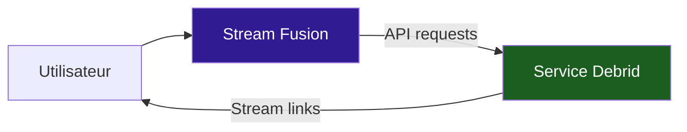
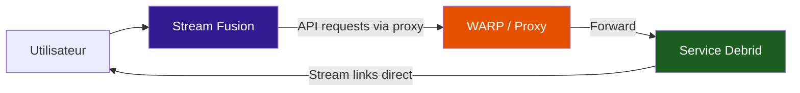
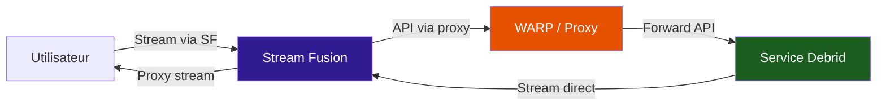
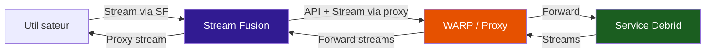

# Proxy

Stream Fusion Reborn propose plusieurs options de proxy pour contourner les restrictions géographiques et les blocages IP des services debrid.

---

## Configuration du proxy

| Variable | Description | Défaut |
|----------|-------------|--------|
| `PROXIED_LINK` | Activer la proxyfication des liens debrid | `False` |
| `PROXY_URL` | URL du proxy pour les requêtes API vers les debrideurs | `None` |
| `PLAYBACK_PROXY` | Proxy pour les liens de streaming depuis le serveur | `None` |

!!! info "Fonctionnement des variables de proxy"
    - **`PROXIED_LINK`** : Transforme l'application en proxy, faisant passer tous les streams par le serveur. Utilisé pour partager un compte debrid entre tous les utilisateurs. Chaque clé API peut activer/désactiver cette option individuellement.
    - **`PROXY_URL`** : Contient l'URL du proxy (SOCKS5 ou HTTP) utilisée pour les requêtes API vers les services debrid.
    - **`PLAYBACK_PROXY`** : Applique le proxy à toutes les interactions avec les debrideurs, y compris les liens de streaming vidéo. Utile quand `PROXIED_LINK` est activé, pour que le streaming passe également par le proxy.

!!! warning "Utilisation des proxys et interactions avec les debrideurs"
    Il est important de comprendre les différents aspects des interactions avec les debrideurs :

    1. **Streaming** : Concerne les liens de streaming des contenus debrid.
    2. **Interactions API** : Concerne les requêtes à l'API des debrideurs.

    ---

    - Certains debrideurs (comme AllDebrid) bloquent les requêtes API provenant de serveurs (datacenter IPs), d'où l'utilisation d'un proxy pour les contacter.
    - Il peut arriver que des adresses IP de serveurs soient bannies par Real-Debrid ou AllDebrid, empêchant même le streaming de liens vidéo. Dans ce cas, activez `PLAYBACK_PROXY` pour faire passer les lectures vidéo par le proxy.
    - L'utilisation de `PLAYBACK_PROXY` est généralement évitée pour économiser les ressources et réduire la latence, sauf en cas de nécessité.

---

## Architecture du proxy

### Sans proxy



### Avec PROXY_URL uniquement



### Avec PROXIED_LINK + PROXY_URL

Ici, SF proxifie les streams vers l'utilisateur (PROXIED_LINK), et les requêtes API passent par le proxy (PROXY_URL). Mais les streams eux-mêmes ne passent pas par WARP (PLAYBACK_PROXY non activé).



### Avec PROXIED_LINK + PLAYBACK_PROXY

Tout passe par WARP : les requêtes API et les streams. L'utilisateur ne contacte jamais le debrideur directement.



---

## Cloudflare WARP

L'image Docker inclut un conteneur WARP optionnel pour les instances de production. WARP fournit un proxy SOCKS5 qui permet de contourner les blocages IP des datacenter.

=== "Production scalable"

    Le conteneur WARP est inclus dans le docker-compose de production. Ajoutez simplement :

    ```env
    PROXY_URL=http://warp:1080
    PLAYBACK_PROXY=http://warp:1080
    ```

=== "Instance unique"

    Ajoutez le service WARP à votre docker-compose :

    ```yaml
    warp:
      image: caomingjun/warp:latest
      container_name: sfr-warp
      restart: always
      expose:
        - 1080
      environment:
        WARP_SLEEP: "2"
      cap_add:
        - NET_ADMIN
      sysctls:
        - net.ipv6.conf.all.disable_ipv6=0
        - net.ipv4.conf.all.src_valid_mark=1
      volumes:
        - warp-data:/var/lib/cloudflare-warp
      networks:
        - sfr-network
    ```

    Puis ajoutez les variables :

    ```env
    PROXY_URL=http://warp:1080
    ```

---

## Proxyfication des flux par clé API

L'option `PROXIED_LINK` peut être activée **par clé API** depuis le panneau d'administration. Cela permet de Décider individuellement quels utilisateurs font passer leurs streams par le serveur.

Pour activer la proxyfication pour une clé :

1. Allez dans `/admin/` → **Sécurité** → **Clés API**
2. Créez ou éditez une clé
3. Activez l'option **Proxyfier les flux**

!!! tip "Quand utiliser PROXIED_LINK"
    - Pour partager un compte debrid entre plusieurs utilisateurs
    - Quand le debrideur bloque les IPs de datacenter (activer aussi `PLAYBACK_PROXY`)
    - Pour cacher l'IP de l'utilisateur final au debrideur