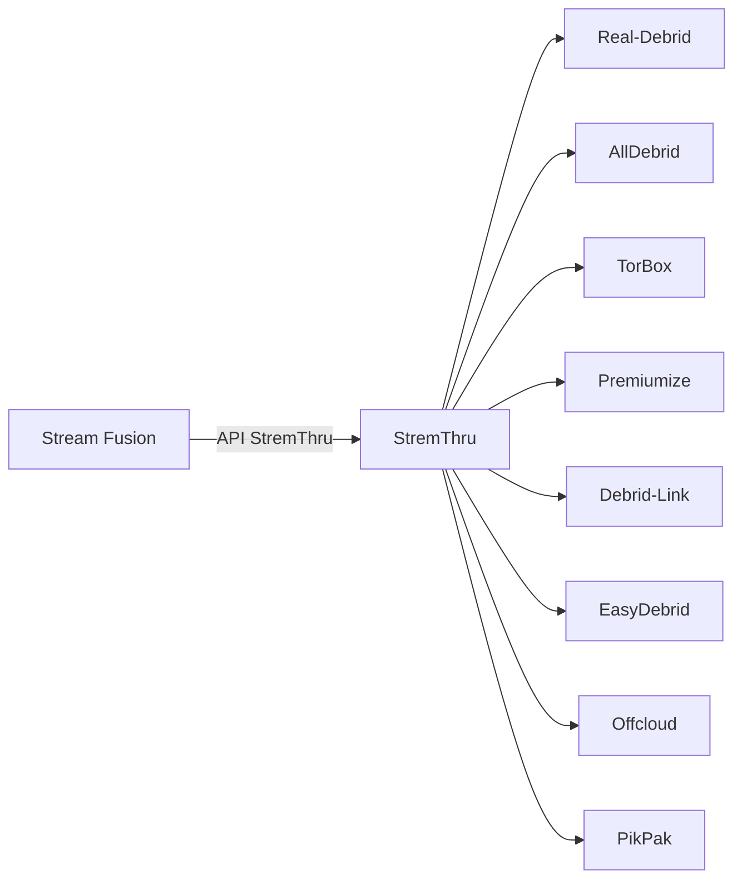

# StremThru

StremThru est un **proxy unifié** qui expose une API commune au-dessus de multiples services debrid. Il agit comme intermédiaire entre Stream Fusion et les backends debrid.

---

## Concept

Au lieu de configurer chaque service debrid individuellement, StremThru permet d'utiliser **un seul token** qui donne accès à plusieurs backends simultanément.



StremThru implémente l'interface `BaseDebrid` de Stream Fusion, ce qui signifie qu'il bénéficie de toutes les couches de cache (Redis L1, PostgreSQL L2, cache pair) comme n'importe quel autre service debrid natif.

### Avantages

<div class="grid cards" markdown>

-   :material-swap-horizontal: **Un point d'entrée unique**

    Un seul token StremThru au lieu de 8 tokens individuels
    
    Simplification de la configuration

-   :material-layers: **Multi-backend transparent**

    Disponibilité cumulée de tous les services configurés côté StremThru
    
    Fallback automatique entre backends

-   :material-shield-lock: **Sécurité**

    Les tokens des services individuels restent côté StremThru
    
    Stream Fusion ne voit que le token StremThru

-   :material-cached: **Cache intégré**

    Bénéficie du cache Redis/PostgreSQL de Stream Fusion
    
    Cache cross-service : un hit AllDebrid natif sert aussi StremThru

</div>

---

## Configuration

### Variable d'environnement

| Variable | Défaut | Description |
|---|---|---|
| `STREMTHRU_URL` | `https://stremthru.13377001.xyz` | URL de l'instance StremThru |

### Mode serveur (compte partagé)

En mode serveur, un token StremThru configuré dans les variables d'environnement est partagé entre tous les utilisateurs :

```env
STREMTHRU_URL=https://stremthru.13377001.xyz
STREMTHRU_TOKEN=votre-token-stremthru
```

!!! warning "Compte partagé"
    Comme pour les autres services debrid en mode serveur, le compte StremThru est alors partagé entre **tous les utilisateurs** de l'instance. Privilégiez ce mode uniquement pour les petites instances familiales.

### Mode utilisateur

Chaque utilisateur configure son propre token StremThru depuis la **page de configuration du plugin** Stremio. Aucune variable d'environnement n'est nécessaire.

L'interface de configuration du plugin expose les champs :
- **StremThru URL** : optionnel, utilise `STREMTHRU_URL` par défaut
- **StremThru Token** : token personnel

---

## Fonctionnement interne

### Architecture dans Stream Fusion

```
stream_fusion/utils/external/stremthru/
├── __init__.py      # Exports StremThruClient, StremThruDebrid
├── client.py        # Client HTTP (wrapper du SDK)
├── debrid.py        # Implémentation BaseDebrid
└── sdk/             # SDK vendu (ne pas modifier)
    ├── __init__.py
    ├── client.py    # StremThruSDK (bas niveau)
    └── error.py     # StremThruError
```

### Détection automatique du store

Quand un utilisateur configure StremThru **sans spécifier de store**, le système détecte automatiquement quel backend utiliser en vérifiant les tokens disponibles dans l'ordre de priorité suivant :

1. Real-Debrid (`RDToken`)
2. Premiumize (`PMToken`)
3. TorBox (`TBToken`)
4. AllDebrid (`ADToken`)
5. Debrid-Link (`DLToken`)
6. EasyDebrid (`EDToken`)
7. Offcloud (`OCCredentials`)
8. PikPak (`PPCredentials`)

### Intégration avec le cache

StremThru bénéficie de toutes les couches d'optimisation de Stream Fusion :

| Couche | Mécanisme |
|---|---|
| **Redis L1** | Cache avec TTL 3 jours (cached) / 10 minutes (uncached), clé `stremthru_{store}` |
| **PostgreSQL L2** | Cache cross-service : un hit AllDebrid natif sert aussi StremThru (et vice-versa) |
| **Peer cache** | Les résultats StremThru sont partagés entre pairs sous le nom du service natif |
| **Rate limiting** | 250 requêtes/60s global, 1 requête/1s par torrent |

### Optimisation TorBox

Pour le backend TorBox via StremThru, Stream Fusion contourne le CDN StremThru et appelle directement l'API `requestdl` de TorBox, réduisant la latence de streaming.

---

## Limitations

!!! warning "Dépendances externes"
    - StremThru dépend des **backends configurés côté StremThru** — si un service n'est pas activé sur l'instance StremThru, il ne sera pas disponible
    - La **qualité du cache** dépend de la popularité des contenus sur les backends configurés
    - StremThru ajoute une **couche d'indirection** qui peut augmenter légèrement la latence par rapport à une connexion directe au service debrid

!!! note "StremThru auto-hébergé"
    Vous pouvez déployer votre propre instance StremThru. Dans ce cas, configurez `STREMTHRU_URL` pour pointer vers votre instance. Consultez la [documentation StremThru](https://github.com/MunifTanjim/stremthru) pour les instructions de déploiement.

---

## Voir aussi

<div class="grid cards" markdown>

-   :material-download: **[Services Debrid](services-debrid.md)**

    Les 9 services debrid supportés nativement + StremThru

-   :material-cog: **[Variables d'environnement](variables-environnement.md)**

    Liste complète des variables de configuration

</div>
