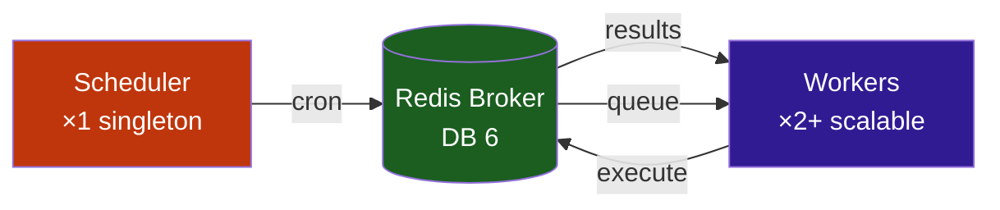

# :material-clock-outline: Tâches planifiées

Stream Fusion utilise **Taskiq** comme système de tâches de fond distribuées. Les tâches sont exécutées par des workers et planifiées par un scheduler singleton.

---

## :material-sitemap: Architecture Taskiq



!!! danger "Scheduler unique"
    Le scheduler **ne doit jamais** avoir plus de 1 replica. Scaler le scheduler cause des exécutions cron en double.

---

## :material-format-list-checks: Tâches automatiques

### :material-database: Maintenance base de données

| Tâche | Cron | Description |
|---|---|---|
| `debrid_cache_cleanup` | `0 */6 * * *` | :material-delete-sweep: Nettoyage cache debrid expiré |
| `torrent_orphan_cleanup` | `0 1 * * *` | :material-delete: Suppression orphelins (>7j sans TMDB) |
| `torrent_dedup` | `0 2 * * *` | :material-content-duplicate: Dédoublonnage |
| `torrent_group_hash` | `0 3 * * *` | :material-group: Groupement par hash |
| `torrent_group_title_size` | `0 4 * * *` | :material-group: Groupement titre/taille |
| `fix_type_inconsistencies` | `0 5 * * *` | :material-wrench: Correction types incohérents |
| `db_dump_create` | `0 4 * * 0` | :material-database-export: Création dumps DuckDB + Meilisearch (dimanche 4h, désactivé par défaut) |
| `db_dump_create_pg` | `0 3 * * *` | :material-database-export: Dump PostgreSQL quotidien (3h, désactivé par défaut) |

### :material-key: Nettoyage des clés

| Tâche | Cron | Description |
|---|---|---|
| `api_keys_cleanup` | `0 */6 * * *` | :material-key-remove: Nettoyage clés API expirées |
| `peer_keys_cleanup` | `0 */6 * * *` | :material-key-remove: Nettoyage peer keys expirées |

### :material-link-variant: Matching automatique

| Tâche | Cron | Description |
|---|---|---|
| `tmdb_orphan_matching` | `*/30 * * * *` | :material-movie-search: Matching TMDB |
| `imdb_orphan_matching` | `*/30 * * * *` | :material-movie-search: Matching IMDB (DuckDB) |

### :material-cloud-sync: Synchronisation

| Tâche | Cron | Description |
|---|---|---|
| `dmm_sync` | `0 2 * * *` | :material-download: Hashlists DMM (désactivé par défaut) |
| `u2p_sync` | `0 3 * * 0` | :material-swap-vertical: Nostr NIP-35 (désactivé par défaut) |
| `trash_sync` | `0 */6 * * *` | :material-star: Synchronisation TRaSH CFs + templates |
| `peer_sync` | Configurable | :material-share-variant: Cache inter-instances |
| `imdb_build` | `0 3 1,15 * *` | :material-database: Rebuild DuckDB (désactivé) |
| `imdb_enrich` | `0 5 * * *` | :material-magnify: Enrichissement Meili (désactivé) |
| `pg_rtn_parse` | `0 */6 * * *` | :material-code-braces: Parsing RTN PostgreSQL (toutes les 6h, désactivé) |
| `imdb_tmdb_enrich_duck` | `0 4 * * *` | :material-link-variant: Enrichissement TMDB → DuckDB (quotidien 4h, désactivé) |
| `tmdb_enrich_meili` | `0 * * * *` | :material-movie-search: Backfill TMDB IDs Meilisearch (chaque heure, désactivé) |

---

## :material-toggle-switch: Activation/désactivation

=== "Variables d'environnement"

    ```env
    # Désactiver une tâche spécifique
    TASK_SCHEDULE_ENABLED_DEBRID_CACHE_CLEANUP=False
    TASK_SCHEDULE_ENABLED_TORRENT_ORPHAN_CLEANUP=False
    
    # Modifer un horaire cron
    TASK_CRON_DEBRID_CACHE_CLEANUP=0 */4 * * *
    ```

=== "Panneau d'administration"

    1. Allez sur `/admin/`
    2. Section **Scheduler** : voir l'état, activer/désactiver
    3. Section **Maintenance** : nettoyage manuel

!!! warning "Redémarrage requis"
    Les changements de cron via variables d'environnement nécessitent un redémarrage du scheduler et des workers. Les flags `TASK_SCHEDULE_ENABLED_*` peuvent être modifiés à chaud via l'admin.

---

## :material-tune-vertical: Configuration avancée

```env
# Taille des batches de matching
TASKIQ_TMDB_MATCH_BATCH_SIZE=1000
TASKIQ_IMDB_MATCH_BATCH_SIZE=1000

# Âge max des orphelins
TASKIQ_TORRENT_ORPHAN_MAX_AGE_DAYS=7

# Dumps DB — DuckDB + Meilisearch
DB_DUMP_SCHEDULE_ENABLED=True
DB_DUMP_CRON=0 4 * * 0
DB_DUMP_RETENTION=3
DB_DUMP_TOKEN_TTL=600

# Dumps DB — PostgreSQL (local uniquement)
DB_DUMP_PG_SCHEDULE_ENABLED=True
DB_DUMP_PG_CRON=0 3 * * *
DB_DUMP_PG_RETENTION=7
```