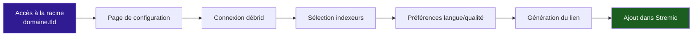

# Configuration Stremio

Stream Fusion Reborn expose une page de configuration utilisateur accessible à la racine du domaine. C'est depuis cette page que chaque utilisateur configure son addon Stremio.

---

## Accéder à la page de configuration

Rendez-vous sur la racine de votre instance :

| Déploiement | URL |
|---|---|
| Local | `http://localhost:8080` |
| Domaine HTTPS | `https://sf.example.com` |

La page de configuration vous permet de personnaliser l'addon selon vos préférences.

---

## Flux de configuration



---

## Étapes de configuration

### 1. Authentification

Si une clé API vous a été fournie par l'administrateur, entrez-la. Si l'inscription publique est activée, vous pouvez cliquer sur **Créer un compte** pour générer automatiquement votre clé.

### 2. Connexion des services debrid

Depuis la page de configuration, vous pouvez connecter votre propre service debrid :

=== "Real-Debrid"

    Collez votre token API Real-Debrid.

    !!! danger "Service déconseillé"
        Real-Debrid est un service en fin de vie : cache FR pauvre, résultats fréquemment faux, API restrictive. Il est conservé pour les comptes existants mais n'est plus recommandé.

=== "AllDebrid (recommandé)"

    Entrez votre token API AllDebrid ou utilisez l'authentification PIN.

=== "TorBox"

    Collez votre token API TorBox.

=== "Premiumize"

    Collez votre token API Premiumize.

=== "Autres"

    Debrid-Link, EasyDebrid, Offcloud, PikPak et StremThru sont également supportés.

!!! warning "Compte serveur vs compte personnel"
    - Si l'administrateur a configuré un service debrid au niveau serveur, tous les utilisateurs l'utilisent par défaut
    - Si vous configurez votre propre service debrid dans la page de configuration, il remplacera le compte serveur pour vous
    - **Ne partagez pas un compte debrid entre de nombreux utilisateurs** : les services debrid peuvent bannir les comptes pour usage suspect

### 3. Sélection des indexeurs

Cochez les indexeurs que vous souhaitez utiliser dans vos recherches. Les indexeurs désactivés au niveau serveur ne sont pas visibles.

### 4. Préférences

Configurez vos préférences de langue (VF, VOSTFR, TRUEFRENCH), de qualité (4K, 1080p, 720p) et de codec.

### 5. Génération du lien

Une fois la configuration terminée, cliquez sur **Installer** pour générer le lien Stremio. Le lien généré est de la forme :

```
https://sf.example.com/votre-cle-api/configure/manifest.json
```

Copiez ce lien et ajoutez-le dans Stremio via **Addons** → **Pegman** → collez l'URL.

---

## Inscription publique

Si l'administrateur a activé `ALLOW_PUBLIC_KEY_REGISTRATION=True`, la page de configuration propose un bouton **Créer un compte** permettant de générer automatiquement une clé API sans intervention de l'administrateur.

---

## Proxyfication des flux

Depuis la page de configuration ou le panneau d'administration, vous pouvez activer la **proxyfication des flux** pour une clé API donnée. Cela fait passer tous les liens de streaming par le serveur Stream Fusion. Voir la page [Proxy](../configuration/proxy.md) pour plus de détails.