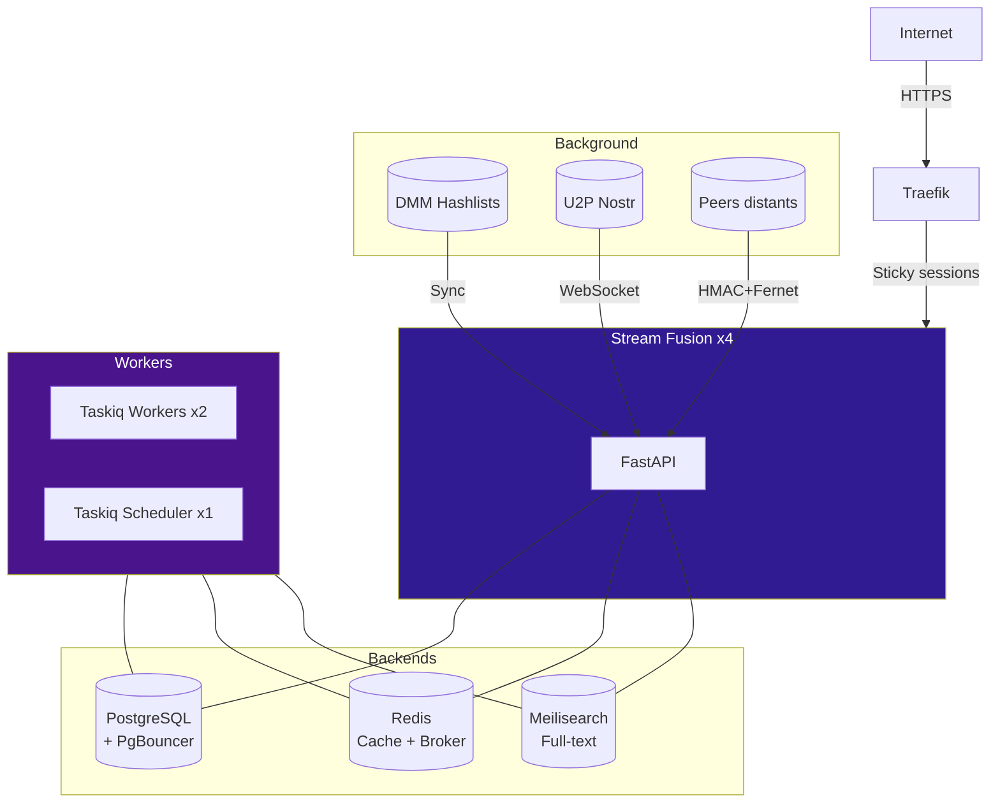

# Stream Fusion Reborn

<figure markdown>
  
</figure>

**Stream Fusion Reborn** est un addon Stremio haute performance pour la communauté francophone. Il agrège les sources debrid et les indexeurs torrents, optimise la recherche via un cache multi-couches (Redis, PostgreSQL, Meilisearch, DuckDB), et permet le partage inter-instances crypté via le protocole de peering.

Conçu pour la scalabilité (4 replicas, PgBouncer, sticky sessions), il intègre un pipeline de recherche multi-phases, un matching TMDB/IMDB automatique, la détection TRUEFRENCH/VFF/VOSTFR, et un panneau d'administration complet.

!!! warning "Projet en version beta"
    Des changements cassants peuvent survenir entre les versions. Faites des sauvegardes régulières de votre base PostgreSQL. Pour du support, rejoignez le [serveur Discord](https://discord.gg/87RV5DStEK).

---

## Fonctionnalités principales

<div class="grid cards" markdown>

-   :fontawesome-solid-download: **9 services debrid + proxy StremThru**

    Real-Debrid, AllDebrid, TorBox, Premiumize, Debrid-Link, EasyDebrid, Offcloud, PikPak + proxy StremThru

-   :material-share-variant: **Peering inter-instances**

    Partage de cache crypté via HMAC-SHA256 et Fernet (AES-128). Voir [Peering](peering/index.md)

-   :material-database: **Cache multi-couches**

    Redis (rapide), PostgreSQL (persistant), Meilisearch (full-text), DuckDB (IMDB)

-   :material-sitemap: **Pipeline DMM**

    Synchronisation automatique de +1M de hashlists depuis Debrid Media Manager

-   :material-magnify: **Recherche multi-phases**

    Cache-first, background refresh, préchargement d'épisodes

-   :fontawesome-solid-flag: **Indexeurs francophones**

    C411, Torr9, LaCale, GenerationFree, ABN, G3mini, TheOldSchool, Nostradamus, Zilean

-   :material-translate: **Optimisation VF/VOSTFR**

    Matching TMDB/IMDB, détection TRUEFRENCH/VFF/VOSTFR, fallback fr-FR

-   :material-cog-sync: **Tâches distribuées**

    Workers Taskiq scalables, scheduler singleton, tâches cron configurables

-   :material-shield-lock: **Sécurité renforcée**

    Chiffrement Fernet, auth HMAC, CSRF, rate limiting, proxy SOCKS5

-   :material-monitor-dashboard: **Panneau d'administration**

    Dashboard, gestion clés API, monitoring, sync peer, matching TMDB/IMDB

-   :material-account-key: **Inscription publique**

    Mode optionnel permettant aux utilisateurs de créer leur propre clé API automatiquement

-   :material-swap-horizontal: **Proxy de flux**

    Proxification des liens debrid via le serveur, gestion WARP intégrée

-   :material-star: **TRaSH Scoring**

    Moteur de scoring avec ~164 Custom Formats et 10 templates système pour classer les résultats par qualité réelle

-   :material-crystal-ball: **Indexeur Nostradamus**

    Indexeur privé Torznab supplémentaire pour la communauté francophone

-   :material-database: **Sauvegarde et restauration**

    Dumps automatisés DuckDB, Meilisearch et PostgreSQL, transfert chiffré entre pairs

</div>

---

## Architecture



---

## Démarrage rapide

=== "Instance unique"

    ```bash
    mkdir stream-fusion && cd stream-fusion
    nano .env                          # Voir [Environnement](installation/environnement.md)
    nano docker-compose.yml            # Coller le compose de la page Installation
    docker compose up -d
    ```

=== "Production scalable"

    ```bash
    mkdir stream-fusion && cd stream-fusion
    nano .env                          # Voir [Environnement](installation/environnement.md)
    nano docker-compose.yml            # Coller le compose de la page Production
    docker compose up -d
    ```

!!! tip "Variables obligatoires"
    Avant de lancer, configurez au minimum : `SECRET_API_KEY`, `CONFIG_SECRET_KEY`, `TMDB_API_KEY`, `PEER_MASTER_KEY`. Les services debrid peuvent être configurés ultérieurement depuis la page de configuration du plugin.

---

## Sections de la documentation

<div class="grid cards" markdown>

-   :material-download: **[Installation](installation/index.md)**

    Déploiement Docker, stack production, fichier `.env`

-   :material-cog: **[Configuration](configuration/index.md)**

    Variables d'environnement, services debrid, indexeurs, proxy, tâches planifiées

-   :material-api: **[API](api/index.md)**

    Endpoints Stremio, gestion clés API, API Peer chiffrée

-   :material-share-variant: **[Peering](peering/index.md)**

    Partage de cache inter-instances, setup bidirectionnel, sécurité

-   :material-floor-plan: **[Architecture](architecture/index.md)**

    Cache multi-couches, pipeline de recherche, workers distribués

-   :material-star: **[TRaSH Scoring](trash/index.md)**

    Custom Formats, templates de scoring, administration et testeur

-   :material-shield-lock: **[Sécurité](securite.md)**

    Auth API, HMAC, Fernet, CSRF, Docker hardening