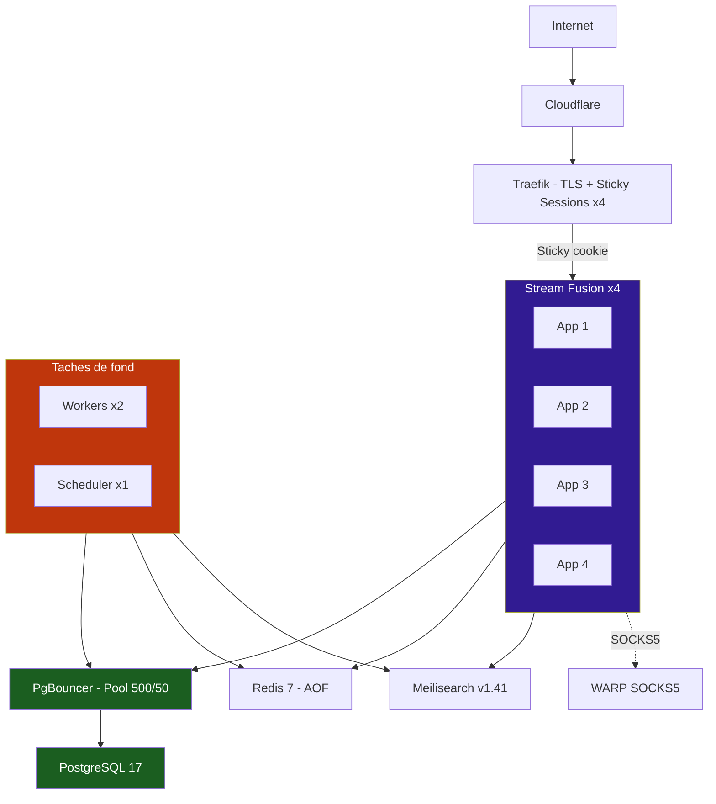

# :material-server-network:{ .md-icon } Déploiement production scalable

Configuration production avec **haute disponibilité**, **scalabilité horizontale** et **sécurité renforcée**.

!!! info "Prérequis réseau"
    Un réseau Docker externe `01_cloudflare_proxy` doit exister (créé par la stack Traefik).

---

## :material-sitemap:{ .md-icon } Architecture



---

## :material-security:{ .md-icon } Sécurité Docker

Tous les conteneurs appliquent un hardening maximal :

```yaml
security_opt:
  - no-new-privileges:true
cap_drop:
  - ALL
read_only: true
tmpfs:
  - /tmp:mode=1777
  - /home/appuser:uid=1000,gid=1000,mode=0700
```

---

## :material-key:{ .md-icon } Points clés

- **Sticky sessions** : cookie `sfr_sticky` pour la cohérence de session
- **PgBouncer** : pool de 50 connexions pour 4 replicas + 2 workers
- **Scheduler unique** : ne **jamais** scaler au-delà de 1 replica

---

## :material-play-circle:{ .md-icon } Lancement

```bash
# 1. Créer le répertoire
mkdir stream-fusion && cd stream-fusion

# 2. Créer le .env (voir la page Environnement pour le template — inclure DOMAIN pour Traefik)
nano .env

# 3. (Optionnel) Créer user.env pour le mode unique_account (debrid/indexeurs partagés)
# nano user.env

# 4. Créer le docker-compose.yml (copier le contenu ci-dessous)
nano docker-compose.yml

# 5. Lancer
docker compose up -d
```

---

## :material-file-document:{ .md-icon } Docker Compose complet

Copiez ce contenu dans un fichier `docker-compose.yml` :

```yaml
---
# docker-compose.yml — Déploiement production avec Traefik
#
# Prérequis :
#   - Réseau Docker externe "01_cloudflare_proxy" créé par la stack Traefik
#   - Fichier .env rempli
#
# Lancement :
#   docker compose up -d
#
# IMPORTANT : ne jamais scaler taskiq-scheduler au-delà de 1

networks:
  sfr-internal:
    name: sfr-internal
  01_cloudflare_proxy:
    name: 01_cloudflare_proxy
    external: true

services:

  # ─── PostgreSQL ──────────────────────────────────────────────────────────────
  stremio-postgres:
    image: postgres:17-alpine
    container_name: sfr-postgres
    restart: unless-stopped
    environment:
      PGDATA: /var/lib/postgresql/data/pgdata
      POSTGRES_USER: ${POSTGRES_USER}
      POSTGRES_PASSWORD: ${POSTGRES_PASSWORD}
      POSTGRES_DB: ${POSTGRES_DB}
    expose:
      - 5432
    volumes:
      - stremio-postgres:/var/lib/postgresql/data/pgdata
    healthcheck:
      test: ["CMD-SHELL", "pg_isready -U ${POSTGRES_USER} -d ${POSTGRES_DB}"]
      interval: 5s
      timeout: 5s
      retries: 10
    networks:
      - sfr-internal

  # ─── PgBouncer ────────────────────────────────────────────────────────────────
  pgbouncer:
    image: edoburu/pgbouncer:latest
    container_name: sfr-pgbouncer
    environment:
      DB_HOST: stremio-postgres
      DB_PORT: "5432"
      DB_NAME: ${POSTGRES_DB}
      DB_USER: ${POSTGRES_USER}
      DB_PASSWORD: ${POSTGRES_PASSWORD}
      POOL_MODE: transaction
      MAX_CLIENT_CONN: "500"
      DEFAULT_POOL_SIZE: "50"
      LISTEN_PORT: "6432"
      AUTH_TYPE: scram-sha-256
    expose:
      - 6432
    depends_on:
      stremio-postgres:
        condition: service_healthy
    restart: unless-stopped
    networks:
      - sfr-internal

  # ─── Redis ────────────────────────────────────────────────────────────────────
  stremio-redis:
    image: redis:7-alpine
    container_name: sfr-redis
    command: redis-server --appendonly yes
    expose:
      - 6379
    volumes:
      - stremio-redis:/data
    restart: unless-stopped
    healthcheck:
      test: ["CMD", "redis-cli", "ping"]
      interval: 5s
      timeout: 3s
      retries: 10
    networks:
      - sfr-internal

  # ─── Meilisearch ─────────────────────────────────────────────────────────────
  meilisearch:
    image: getmeili/meilisearch:v1.41.0
    container_name: sfr-meilisearch
    environment:
      MEILI_MASTER_KEY: ${MEILI_MASTER_KEY}
      MEILI_ENV: production
      MEILI_EXPERIMENTAL_DUMPLESS_UPGRADE: "true"
    expose:
      - 7700
    volumes:
      - meili-data:/meili_data
    restart: unless-stopped
    networks:
      - sfr-internal

  # ─── Cloudflare WARP ─────────────────────────────────────────────────────────
  warp:
    image: caomingjun/warp:latest
    container_name: sfr-warp
    restart: always
    expose:
      - 1080
    environment:
      WARP_SLEEP: "2"
    cap_add:
      - NET_ADMIN
    sysctls:
      - net.ipv6.conf.all.disable_ipv6=0
      - net.ipv4.conf.all.src_valid_mark=1
    volumes:
      - warp-data:/var/lib/cloudflare-warp
    networks:
      - sfr-internal

  # ─── Taskiq Scheduler — JAMAIS plus de 1 replica ──────────────────────────
  taskiq-scheduler:
    image: laster13/stream-fusion-reborn:latest
    container_name: sfr-taskiq-scheduler
    command: python -m taskiq scheduler stream_fusion.tkq:scheduler
    environment:
      PG_USER: ${PG_USER}
      PG_PASS: ${PG_PASS}
      TZ: ${TZ}
      # Service-to-service wiring
      REDIS_HOST: stremio-redis
      PG_HOST: pgbouncer
      PG_PORT: "6432"
      TASKIQ_REDIS_DB: "6"
    cap_drop:
      - ALL
    security_opt:
      - no-new-privileges:true
    read_only: true
    tmpfs:
      - /tmp:mode=1777
      - /home/appuser:uid=1000,gid=1000,mode=0700
    volumes:
      - taskiq-logs:/app/config/logs
    depends_on:
      pgbouncer:
        condition: service_started
      stremio-redis:
        condition: service_healthy
    restart: unless-stopped
    networks:
      - sfr-internal
    deploy:
      replicas: 1

  # ─── Taskiq Worker (2 replicas) ──────────────────────────────────────────────
  taskiq-worker:
    image: laster13/stream-fusion-reborn:latest
    command: python -m taskiq worker stream_fusion.worker:broker
    # env_file: user.env        # décommenter pour activer le mode unique_account
    environment:
      SECRET_API_KEY: ${SECRET_API_KEY}
      TMDB_API_KEY: ${TMDB_API_KEY}
      MEILI_MASTER_KEY: ${MEILI_MASTER_KEY}
      PG_USER: ${PG_USER}
      PG_PASS: ${PG_PASS}
      TZ: ${TZ}
      # Service-to-service wiring
      REDIS_HOST: stremio-redis
      PG_HOST: pgbouncer
      PG_PORT: "6432"
      MEILI_HOST: meilisearch
      MEILI_PORT: "7700"
      TASKIQ_REDIS_DB: "6"
    cap_drop:
      - ALL
    security_opt:
      - no-new-privileges:true
    read_only: true
    tmpfs:
      - /tmp:mode=1777,size=8g
      - /home/appuser:uid=1000,gid=1000,mode=0700
    volumes:
      - dmm-hashlists:/data/dmm_hashlists
      - imdb-db:/data/imdb_db
      - taskiq-logs:/app/config/logs
    depends_on:
      pgbouncer:
        condition: service_started
      stremio-redis:
        condition: service_healthy
      meilisearch:
        condition: service_started
    restart: unless-stopped
    networks:
      - sfr-internal
      - 01_cloudflare_proxy
    deploy:
      replicas: 2

  # ─── Stream Fusion (4 replicas) ────────────────────────────────────────────
  stream-fusion:
    image: laster13/stream-fusion-reborn:latest
    # env_file: user.env        # décommenter pour activer le mode unique_account
    environment:
      RUN_MIGRATIONS: "true"
      SECRET_API_KEY: ${SECRET_API_KEY}
      CONFIG_SECRET_KEY: ${CONFIG_SECRET_KEY}
      TMDB_API_KEY: ${TMDB_API_KEY}
      MEILI_MASTER_KEY: ${MEILI_MASTER_KEY}
      PG_USER: ${PG_USER}
      PG_PASS: ${PG_PASS}
      PG_BASE: ${PG_BASE}
      TZ: ${TZ}
      USE_HTTPS: "True"
      PROXY_URL: http://warp:1080
      # Service-to-service wiring
      REDIS_HOST: stremio-redis
      PG_HOST: pgbouncer
      PG_PORT: "6432"
      MEILI_HOST: meilisearch
      MEILI_PORT: "7700"
      TASKIQ_REDIS_DB: "6"
    cap_drop:
      - ALL
    security_opt:
      - no-new-privileges:true
    read_only: true
    tmpfs:
      - /tmp:mode=1777
      - /home/appuser:uid=1000,gid=1000,mode=0700
    expose:
      - 8080
    volumes:
      - stream-fusion:/app/config
      - taskiq-logs:/app/config/logs
      - torrent-cache:/var/cache/torrents
      - imdb-db:/data/imdb_db:ro
    depends_on:
      pgbouncer:
        condition: service_started
      stremio-redis:
        condition: service_healthy
      meilisearch:
        condition: service_started
    restart: unless-stopped
    networks:
      - sfr-internal
      - 01_cloudflare_proxy
    labels:
      - "traefik.enable=true"
      - "traefik.http.routers.stream-fusion-cf.rule=Host(`${DOMAIN}`)"
      - "traefik.http.routers.stream-fusion-cf.entrypoints=web,websecure"
      - "traefik.http.routers.stream-fusion-cf.tls=true"
      - "traefik.http.routers.stream-fusion-cf.tls.certresolver=cf"
      - "traefik.http.routers.stream-fusion-cf.service=stream-fusion-svc"
      - "traefik.http.routers.stream-fusion-cf.middlewares=external_auth@file"
      - "traefik.http.services.stream-fusion-svc.loadbalancer.server.port=8080"
      - "traefik.http.services.stream-fusion-svc.loadbalancer.sticky.cookie=true"
      - "traefik.http.services.stream-fusion-svc.loadbalancer.sticky.cookie.name=sfr_sticky"
      - "traefik.http.services.stream-fusion-svc.loadbalancer.sticky.cookie.httpOnly=true"
      - "traefik.http.services.stream-fusion-svc.loadbalancer.sticky.cookie.secure=true"
    deploy:
      replicas: 4

volumes:
  stremio-postgres:
  stremio-redis:
  stream-fusion:
  warp-data:
  meili-data:
  dmm-hashlists:
  imdb-db:
  torrent-cache:
  taskiq-logs:
```

---

## :material-update:{ .md-icon } Mise à jour

```bash
docker compose pull
docker compose up -d
```