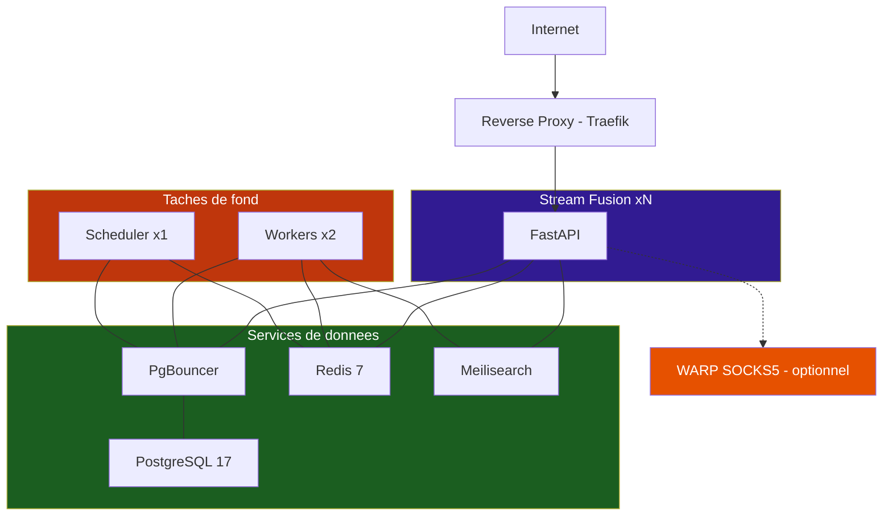

# Installation

Cette section détaille les méthodes de déploiement de Stream Fusion Reborn.

!!! info "Image Docker uniquement"
    L'image Docker officielle est disponible sur [Docker Hub](https://hub.docker.com/r/laster13/stream-fusion-reborn). Pour obtenir l'accès au dépôt privé et participer au développement, venez vous présenter sur le [serveur Discord](https://discord.gg/87RV5DStEK).

---

## Méthodes de déploiement

<div class="grid cards" markdown>

-   :material-numeric-1-circle: **Instance unique**

    Perso / petit groupe
    
    [:material-arrow-right: Guide simple](docker-compose-simple.md)

-   :material-numeric-4-circle: **Production scalable**

    Communauté / haute dispo
    
    [:material-arrow-right: Guide production](docker-compose-prod.md)

</div>

---

## Prérequis communs

- :material-docker: **Docker** >= 20.10
- :material-docker: **Docker Compose** >= 2.20
- :material-key: **Clé API TMDB** — [Créer un compte](https://developer.themoviedb.org/docs/getting-started)

!!! tip "Services debrid"
    Aucun service debrid n'est requis au démarrage. Vous pouvez les configurer plus tard depuis la page de configuration du plugin ou via les variables d'environnement.

---

## Architecture de la stack



---

## Services

| Service | Rôle | Obligatoire | Port |
|---|---|---|---|
| :material-web: **Stream Fusion** | Application FastAPI | :fontawesome-solid-check: | 8080 |
| :material-database: **PostgreSQL** | Base de données persistante | :fontawesome-solid-check: | 5432 |
| :material-memory: **Redis** | Cache rapide, sessions, broker | :fontawesome-solid-check: | 6379 |
| :material-magnify: **Meilisearch** | Recherche full-text | :fontawesome-solid-check: | 7700 |
| :material-timer: **Taskiq Scheduler** | Orchestration cron | :fontawesome-solid-check: | - |
| :material-cog: **Taskiq Worker** | Tâches de fond | :fontawesome-solid-check: | - |
| :material-connection: **PgBouncer** | Pool de connexions PG | Production | 6432 |
| :material-shield: **WARP** | Proxy SOCKS5 | Optionnel | 1080 |

---

## Image Docker

L'image officielle est disponible sur Docker Hub :

```bash
docker pull laster13/stream-fusion-reborn:latest
```

Pas de build local nécessaire — l'image contient tout le nécessaire pour fonctionner.

---

## Prochaines étapes

<div class="grid cards" markdown>

-   :material-server: **[Production scalable](docker-compose-prod.md)**

    Traefik, PgBouncer, 4 replicas, sécurité Docker

-   :material-monitor: **[Instance unique](docker-compose-simple.md)**

    Configuration simple pour débuter

-   :material-file-document-edit: **[Fichier d'environnement](environnement.md)**

    Fichier `.env` expliqué variable par variable