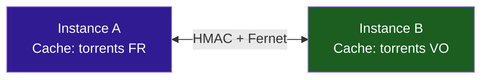
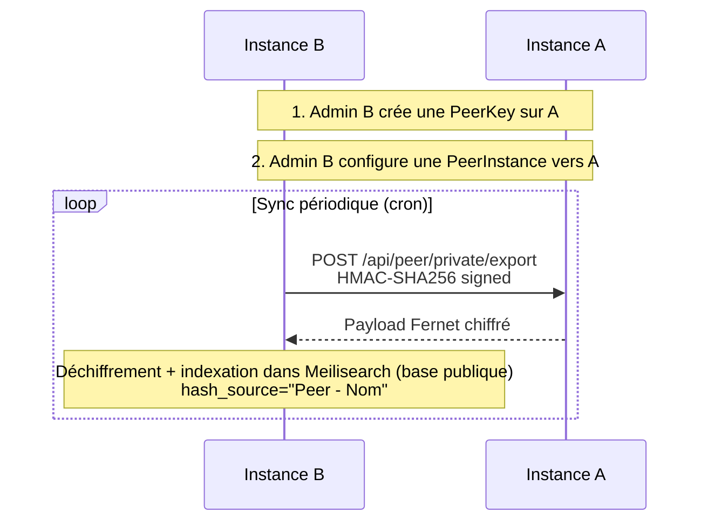
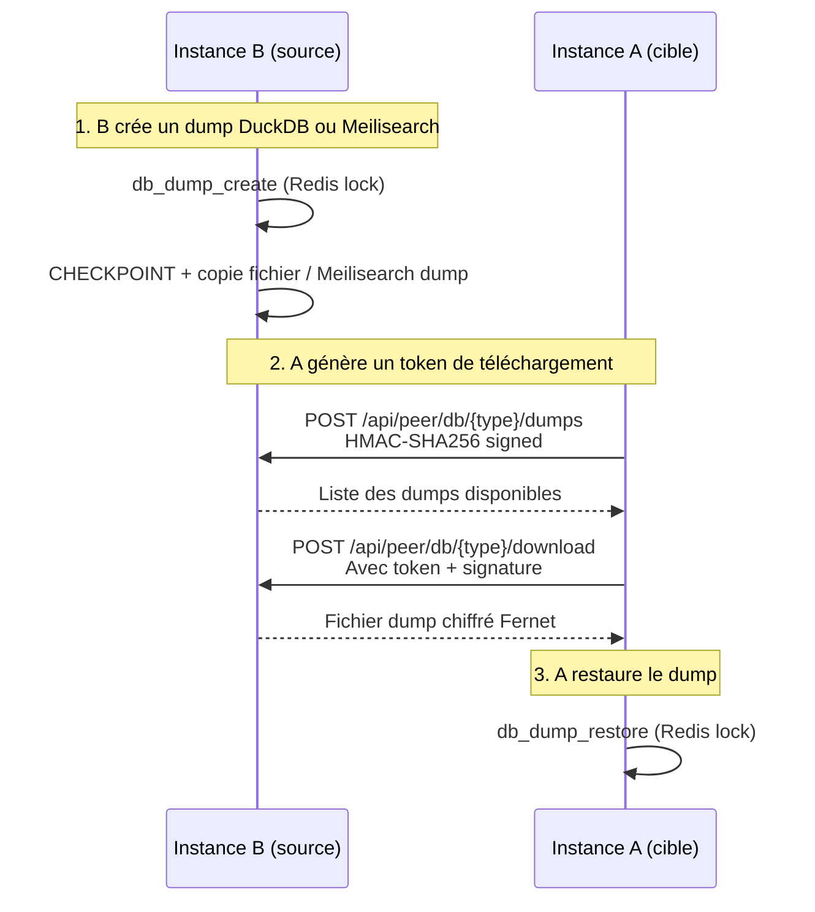

# :material-share-variant: Peering inter-instances

Le peering permet à plusieurs instances Stream Fusion de **partager leurs torrents privés** de manière sécurisée et chiffrée. L'instance source exporte les torrents de sa base privée (PostgreSQL), et l'instance cible les insère dans sa base publique (Meilisearch) — enrichissant ainsi son catalogue pour tous ses utilisateurs sans compromettre la sécurité des données sources.

---

## :material-sitemap: Concept

Chaque instance peut à la fois **exporter** son cache (via une PeerKey) et **importer** le cache des autres (via une PeerInstance).

---

## :material-format-list-bulleted: Modèle de données

### :material-key: PeerKey (authentification entrante)

Une PeerKey autorise une instance distante à **interroger** votre cache.

| Propriété | Description |
|---|---|
| `key_id` | UUID unique identifiant la clé |
| `secret` | Secret 256-bit hex (affiché **une seule fois**) |
| `name` | Nom descriptif |
| `is_active` | Si la clé est active |
| `rate_limit` | Max requêtes par fenêtre |
| `rate_window` | Durée de la fenêtre (s) |
| `expires_at` | Date d'expiration (optionnelle) |

### :material-server: PeerInstance (connexion sortante)

Une PeerInstance configure la connexion **vers** une instance distante.

| Propriété | Description |
|---|---| 
| `name` | Nom descriptif |
| `url` | URL de l'instance distante |
| `key_id` | UUID de la PeerKey distante |
| `secret_encrypted` | Secret distant chiffré au repos (Fernet) |
| `is_active` | Si la connexion est active |
| `sync_enabled` | Si la sync automatique est activée |
| `sync_cron` | Horaire de synchronisation |

Toutes les PeerInstances sont persistées dans la table PostgreSQL `peer_instances`. Au démarrage du worker Taskiq, les schedules sont automatiquement ré-enregistrés dans Redis via `seed_peer_schedules_from_db()` — aucune reconfiguration manuelle nécessaire après un redémarrage.

---

## :material-swap-vertical: Flux de données

### Sync incrémentale

### Transfert de dump (DuckDB / Meilisearch)

Le transfert de dump complète la sync incrémentale en permettant le transfert de **snapshots complets** de bases DuckDB ou Meilisearch entre pairs. Voir [Sauvegarde DuckDB](../cache/sauvegarde-duckdb.md) pour les détails techniques.

---

## :material-star-four-points: Avantages

-   :material-earth: **Couverture étendue**
    
    Les torrents d'une instance deviennent accessibles aux autres

-   :material-lock: **Sécurité cryptée**
    
    HMAC-SHA256 + Fernet (AES-128) + protection anti-rejeu

-   :material-update: **Sync incrémentale**
    
    Seul le delta (nouveaux items) est transféré

-   :material-package-variant-closed: **Transfert de dump**
    
    Snapshots complets DuckDB et Meilisearch transférables entre pairs, en complément de la sync incrémentale

-   :material-speedometer: **Rate limiting**
    
    Chaque clé a ses propres limites configurables

-   :material-swap-horizontal: **Bidirectionnel**
    
    Chaque instance peut exporter et importer

---

## :material-arrow-right: Sections détaillées

-   :material-cog: **[Configuration](configuration.md)**
    
    Setup bidirectionnel pas-à-pas

-   :material-shield-lock: **[Sécurité](securite.md)**
    
    HMAC-SHA256, Fernet, domaines de dérivation

-   :material-code-braces: **[Intégration externe](integration-externe.md)**
    
    Guide complet pour les apps tierces avec exemples Python et cURL