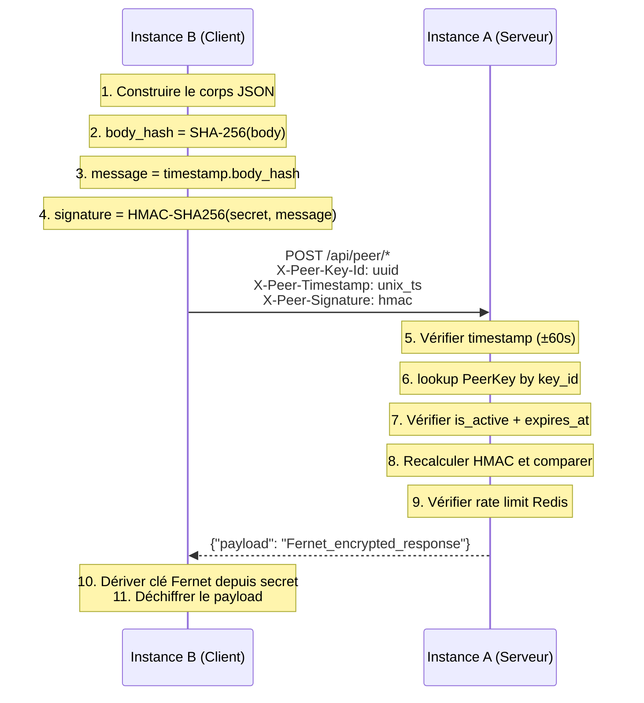

# :material-shield-lock: Sécurité du peering

Le peering utilise un modèle de sécurité à plusieurs couches : authentification HMAC, chiffrement Fernet en transit et au repos, protection anti-rejeu et rate limiting.

---

## :material-sitemap: Architecture de sécurité



---

## :material-numeric-1-circle: Authentification HMAC-SHA256

Chaque requête doit inclure **3 headers** :

| Header | Description |
|---|---|
| `X-Peer-Key-Id` | UUID de la PeerKey |
| `X-Peer-Timestamp` | Timestamp Unix actuel (secondes) |
| `X-Peer-Signature` | Signature HMAC-SHA256 |

### Construction de la signature

```python
import hmac, hashlib

def sign_request(secret: str, body: bytes, timestamp: int) -> str:
    body_hash = hashlib.sha256(body).hexdigest()
    message = f"{timestamp}.{body_hash}"
    return hmac.new(secret.encode(), message.encode(), hashlib.sha256).hexdigest()
```

### Protection anti-rejeu

Le serveur vérifie que le timestamp est dans une fenêtre de **±60 secondes**. Toute requête en dehors est rejetée (`401`).

---

## :material-numeric-2-circle: Chiffrement des réponses (Fernet)

Toutes les réponses sont chiffrées avec **Fernet** (AES-128-CBC + HMAC-SHA256).

### Dérivation de la clé

```python
import hashlib, base64
from cryptography.fernet import Fernet

def derive_fernet_key(secret: str) -> bytes:
    prefix = "sf-peer-cache-v1:"  # Domain separation
    key_material = prefix + secret
    key = hashlib.sha256(key_material.encode()).digest()
    return base64.urlsafe_b64encode(key)
```

### Format de réponse

```json
{
  "payload": "gAAAAAAB..."  // Token Fernet chiffré
}
```

---

## :material-numeric-3-circle: Chiffrement au repos

Les secrets des PeerInstances sont chiffrés en base de données avec une clé dérivée de `PEER_MASTER_KEY`.

```python
def derive_storage_key(master_key: str) -> bytes:
    prefix = "sf-peer-storage-v1:"  # Different du prefix cache
    key_material = prefix + master_key
    key = hashlib.sha256(key_material.encode()).digest()
    return base64.urlsafe_b64encode(key)
```

---

## :material-numeric-4-circle: Séparation des domaines

| Préfixe | Usage | Clé source |
|---|---|---|
| `sf-peer-cache-v1:` | Chiffrement réponses API | Secret PeerKey |
| `sf-peer-storage-v1:` | Chiffrement au repos en DB | `PEER_MASTER_KEY` |
| *(Fernet standard)* | Chiffrement tokens config | `CONFIG_SECRET_KEY` |

Cette séparation garantit qu'aucune clé dérivée ne peut être utilisée dans un autre contexte.

---

## :material-numeric-5-circle: Rate limiting

| Paramètre | Défaut | Description |
|---|---|---|
| `rate_limit` | 60 | Max requêtes par fenêtre |
| `rate_window` | 60 | Durée de la fenêtre (s) |

Implémenté via Redis avec des compteurs fixes par `key_id`.

---

## :material-key-variant: Rotation des clés

??? info "Rotation d'une PeerKey"
    1. Créez une nouvelle PeerKey
    2. Mettez à jour la PeerInstance distante
    3. Révoquez l'ancienne PeerKey

??? danger "Rotation du PEER_MASTER_KEY"
    **Impact majeur** : invalide tous les secrets stockés en base.
    
    1. Changez `PEER_MASTER_KEY` dans l'environnement
    2. Redémarrez l'application
    3. Recréez toutes les PeerInstances