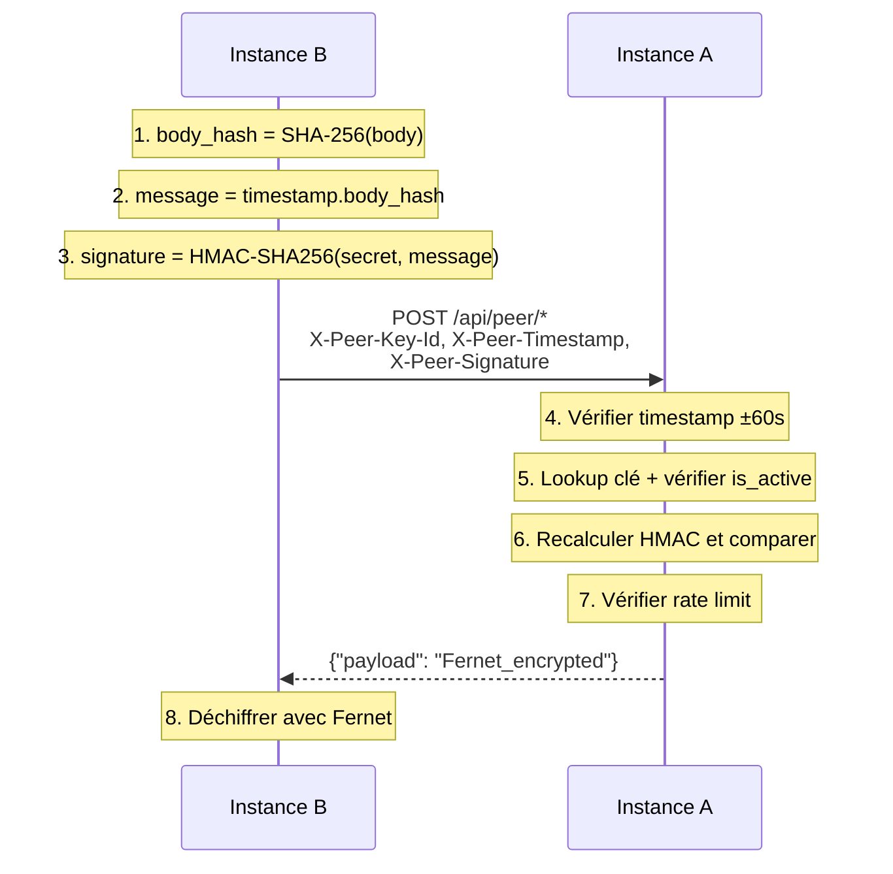
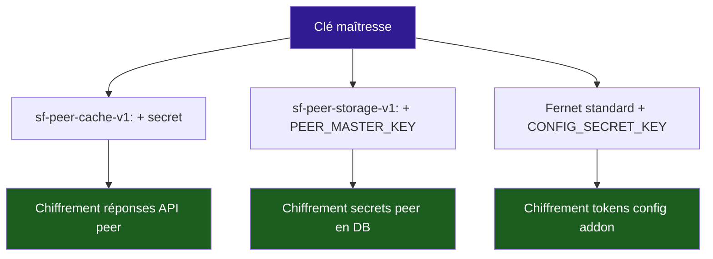

# :material-shield-lock: Sécurité

Stream Fusion implémente plusieurs couches de sécurité pour protéger l'application, les données utilisateur et les communications inter-instances.

---

## :material-layers: Vue d'ensemble

<div class="grid cards" markdown>

-   :material-key-variant: **API Stremio**

    Token Fernet encodé dans l'URL addon
    
    Routes : `/{config}/stream/*`, `/{config}/catalog/*`

-   :material-shield-lock: **API JSON**

    Header `secret-key` avec `SECRET_API_KEY`
    
    Routes : `/api/auth/*`, `/api/config/*`

-   :material-fingerprint: **API Peer**

    HMAC-SHA256 + Fernet chiffré
    
    Routes : `/api/peer/*`

-   :material-cookie: **Admin**

    Session cookie + CSRF
    
    Routes : `/admin/*`

-   :material-account-plus: **Enregistrement**

    Rate limiting IP (5/heure)
    
    Routes : `/register`

-   :material-speedometer: **Playback**

    Rate limiting par utilisateur
    
    Routes : `/playback/*`

</div>

---

## :material-numeric-1-circle: Authentification Stremio

Les URLs Stremio contiennent un token Fernet encodé :

```
/{config}/stream/{type}/{id}
```

Le `{config}` contient : clé API, préférences debrid, indexeurs activés, qualité, langue.

Les nouveaux tokens sont obligatoirement chiffrés avec `CONFIG_SECRET_KEY` (Fernet). Si le chiffrement est indisponible, la création échoue : aucun nouveau token Base64 n'est généré. Le décodage Base64 reste temporairement disponible uniquement pour la compatibilité avec les anciennes configurations.

!!! warning "Rotation de CONFIG_SECRET_KEY"
    Ne remplacez pas cette clé directement. Pendant une rotation contrôlée, placez temporairement l’ancienne valeur dans `CONFIG_SECRET_KEY_PREVIOUS`. Elle est utilisée uniquement pour déchiffrer les anciens tokens Fernet ; tous les nouveaux tokens restent chiffrés avec `CONFIG_SECRET_KEY`. Les identités R2 chiffrées doivent également être migrées avant la bascule.

---

## :material-numeric-2-circle: Authentification API JSON

```bash
curl -H "secret-key: votre-secret-api-key" \
  http://localhost:8080/api/auth/list
```

La comparaison utilise `secrets.compare_digest()` pour prévenir les attaques par timing.

---

## :material-numeric-3-circle: Authentification HMAC (Peer)

Voir [Peering - Sécurité](peering/securite.md) pour les détails complets.



---

## :material-numeric-4-circle: Authentification Admin

Sessions Starlette stockées dans Redis + protection CSRF sur tous les formulaires POST.

!!! info "Session key"
    `SESSION_KEY` est obligatoire lors d'un lancement direct. L'entrypoint Docker génère une clé aléatoire forte au démarrage si elle n'est pas fournie. En production, définissez une valeur unique et persistante afin de conserver les sessions lors des recréations du conteneur.

---

## :material-numeric-5-circle: Rate limiting

| Service | Limite | Stockage |
|---|---|---|
| Enregistrement (`/register`) | 5/heure/IP | Redis |
| Playback (`/playback`) | 60/60s/utilisateur | Redis |
| Peer API (`/api/peer`) | 60/60s/clé (configurable) | Redis |

---

## :material-numeric-6-circle: Chiffrement au repos



La **séparation des domaines** garantit qu'aucune clé dérivée ne peut être utilisée dans un autre contexte.

---

## :material-shield: Sécurité Docker (production)

```yaml
security_opt:
  - no-new-privileges:true    # Pas d'escalade de privilèges
cap_drop:
  - ALL                       # Aucun capability Linux
read_only: true               # Système de fichiers en lecture seule
tmpfs:
  - /tmp:mode=1777            # Tmpfs pour les écritures temporaires
  - /home/appuser:uid=1000,gid=1000,mode=0700
```

---

## :material-vpn: Proxy SOCKS5 (WARP)

En production, un conteneur Cloudflare WARP fournit un proxy SOCKS5 :

```env
PROXY_URL=http://warp:1080
```

Utilisé pour les requêtes vers les indexeurs et services debrid. Optionnel — retirez `PROXY_URL` pour désactiver.

---

## :material-eye-off: Masquage des logs

Par défaut, `LOG_REDACTED=True` censure les secrets dans les logs : tokens debrid, clés API, mots de passe PostgreSQL.

---

## :material-book-open: Documentation API

Swagger UI et ReDoc sont masqués par défaut (`SECURITY_HIDE_DOCS=True`). Pour les réactiver :

```env
SECURITY_HIDE_DOCS=False
```
