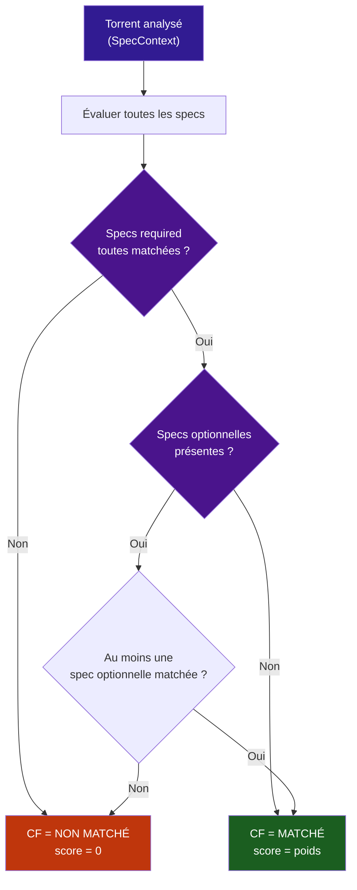

# :material-filter: Custom Formats

Un **Custom Format (CF)** est un ensemble de **spécifications** (règles de détection) qui décrivent un type de release torrent précis. Chaque CF produit un **score entier** (positif, négatif ou zéro) qui s'additionne dans le template de scoring actif pour classer les résultats.

---

## Concept fondamental

### Qu'est-ce qu'une specification ?

Une **specification** ("spec") est une règle de test unique qui évalue un torrent sur un critère précis :

- Le titre contient-il "REMUX" ?
- La résolution est-elle 2160p ?
- La source est-elle un WEB-DL ?
- Le groupe de release est-il "SiGERiS" ?

Chaque spec retourne un booléen (`True`/`False`). Le CF combine ces résultats via une logique de matching pour décider si le torrent **correspond** ou non.

### Logique de matching d'un CF



!!! info "Règles de matching"
    1. **Toutes** les specs `required: true` doivent matcher (ET logique)
    2. Si des specs `required: false` existent, **au moins une** doit matcher (OU logique)
    3. Si aucune spec optionnelle n'existe, le CF match dès que toutes les required passent
    4. `negate: true` **inverse** le résultat brut de la spec avant d'appliquer required/optional

---

## Structure JSON d'une spec

```json
{
  "name": "Regex titre",
  "implementation": "ReleaseTitleSpecification",
  "negate": false,
  "required": true,
  "fields": {
    "value": "\\bREMUX\\b"
  }
}
```

| Champ | Type | Description |
|---|---|---|
| `name` | `string` | Libellé de la spec (affiché dans l'admin) |
| `implementation` | `string` | Type de spec (voir [Implementations](#implementations)) |
| `negate` | `bool` | `true` = inverser le résultat du test |
| `required` | `bool` | `true` = spec obligatoire (ET logique) |
| `fields` | `object` | Paramètres spécifiques au type de spec |

### Exemple : logique negate

```json
{
  "name": "Exclure CAM",
  "implementation": "ReleaseTitleSpecification",
  "negate": true,
  "required": true,
  "fields": { "value": "\\bCAM\\b" }
}
```

**Exécution** : la spec teste si le titre contient "CAM" → résultat brut `True` → `negate: true` → résultat final `False`. Comme elle est `required: true`, le CF ne matche **pas** si le titre contient "CAM".

---

## Implementations

### :material-format-list-bulleted: Tableau récapitulatif

| Implementation | Détecte | Fields | Exemples de valeurs |
|---|---|---|---|
| `ReleaseTitleSpecification` | Titre du torrent (regex) | `{"value": "regex"}` | `\bREMUX\b`, `\bHDR\b`, `FRENCH\|TRUEFRENCH` |
| `ReleaseGroupSpecification` | Groupe de release (regex) | `{"value": "regex"}` | `^(SiGERiS\|EVO)$`, `^(YIFY\|RARBG)$` |
| `ResolutionSpecification` | Résolution vidéo | `{"value": int}` | `360`, `480`, `720`, `1080`, `2160`, `4320` |
| `SourceSpecification` | Source / qualité | `{"value": int}` | `1`=CAM, `5`=DVD, `7`=WEB-DL, `8`=WEBRip, `9`=BluRay, `10`=Remux |
| `QualityModifierSpecification` | Modificateur de qualité | `{"value": int}` | `0`=None, `1`=Regional, `2`=Screener, `4`=PROPER, `5`=REPACK, `6`=REMUX |
| `LanguageSpecification` | Langue audio | `{"value": int}` | `1`=EN, `2`=FR, `8`=JA, `-1`=Any |
| `SizeSpecification` | Taille du fichier | `{"min": float, "max": float}` | `"min": 1.0, "max": 80.0` (Go) |
| `ReleaseTypeSpecification` | Type de release | `{"value": int/str}` | `"movie"`, `"episode"`, `"season"` ou `1`=Movie/Standard, `2`=Daily, `3`=Anime |
| `DynamicRangeSpecification` | Format HDR/DV | `{"value": int}` | `0`=SDR, `1`=HDR(any), `2`=HDR10, `3`=HDR10+, `4`=DV, `5`=HLG, `7`=DV HDR10 |
| `IndexerFlagsSpecification` | Flags indexeur | `{"value": int}` | `8`=Internal, `16`=Scene (bitmask) |
| `SeriesTypeSpecification` | Alias de `ReleaseTypeSpecification` | — | Même comportement que `ReleaseTypeSpecification` |

### ReleaseTitleSpecification

Teste une expression régulière Python sur le **titre brut** du torrent (`raw_title`).

```json
{
  "name": "French Audio",
  "implementation": "ReleaseTitleSpecification",
  "negate": false,
  "required": true,
  "fields": { "value": "\\b(FRENCH|TRUEFRENCH|VFF|VFQ|MULTi)\\b" }
}
```

!!! tip "Astuce regex"
    Utilisez `\\b` pour les word boundaries (ex: `\\bREMUX\\b` ne matchera pas "REMUXED"). Les regex sont compilées en cache pour de meilleures performances.

### ResolutionSpecification

Match sur la résolution extraite par RTN. Accepte **deux formats** de `value` :

- **IDs Radarr** (ancien format) : `1`=360p, `2`=480p, `3`=540p, `4`=576p, `5`=720p, `6`=1080p, `7`=2160p, `8`=4320p
- **Valeurs pixels directes** (nouveau format TRaSH mirror) : `360`, `480`, `720`, `1080`, `2160`, `4320`

```json
{
  "name": "2160p",
  "implementation": "ResolutionSpecification",
  "negate": false,
  "required": true,
  "fields": { "value": 2160 }
}
```

### SourceSpecification

Match sur la source/qualité extraite par RTN. Valeurs possibles :

| ID | Source | Tokens RTN reconnus |
|---|---|---|
| `0` | Unknown | Aucun |
| `1` | CAM | `CAM`, `Cam` |
| `2` | Telesync | `Telesync`, `TS`, `TC` |
| `3` | Telecine | `Telecine` |
| `4` | WORKPRINT | `WORKPRINT` |
| `5` | DVD | `DVD`, `DVDRip` |
| `6` | TV (HDTV) | `HDTV` |
| `7` | WEB-DL | `WEB-DL`, `WebDL`, `WEB` |
| `8` | WEBRip | `WEBRip`, `WebRip` |
| `9` | BluRay | `BluRay`, `Blu-ray`, `BDRip`, `BRRip`, `BD` |
| `10` | Remux | `Remux`, `REMUX`, `BluRay REMUX` |

!!! note "Fallback regex"
    Si RTN ne détecte pas la source, une regex de fallback est appliquée sur le titre brut pour les sources courantes (WEB-DL, WEBRip, BluRay, Remux, DVD).

### QualityModifierSpecification

Match sur des modificateurs de qualité dans le titre :

| ID | Modificateur | Pattern regex |
|---|---|---|
| `0` | None | Aucun des modificateurs ci-dessous |
| `1` | Regional | `\bREGIONAL\b` |
| `2` | Screener | `\bSCREENER\b` |
| `3` | Ragged | `\bRAGGED\b` |
| `4` | PROPER | `\b(?:PROPER\|REMASTERED)\b` |
| `5` | REPACK | `\bREPACK\b` |
| `6` | REMUX | `\bREMUX\b` |

### LanguageSpecification

Match sur la langue audio. Utilise les codes de langue de `TorrentItem.languages` avec fallback sur les patterns dans le titre brut (spécialement pour le français).

| ID | Langue | Codes reconnus |
|---|---|---|
| `-1` | Any | Toujours `True` |
| `-2` | Original | Toujours `True` (conservateur) |
| `0` | Unknown | Liste de langues vide |
| `1` | English | `en`, `eng`, `english` |
| `2` | French | `fr`, `fra`, `fre`, `french`, `FRENCH`, `VF`, `VFF`, `VFQ`, `VOSTFR`, `MULTI` |
| `3` | Spanish | `es`, `spa`, `spanish` |
| `4` | German | `de`, `ger`, `deu`, `german` |
| `5` | Italian | `it`, `ita`, `italian` |
| `8` | Japanese | `ja`, `jpn`, `japanese` |
| `10` | Chinese | `zh`, `chi`, `zho`, `chinese`, `mandarin` |
| `11` | Russian | `ru`, `rus`, `russian` |
| `36` | Thai | `th`, `tha`, `thai` |

!!! tip "Détection française"
    Pour la langue française (ID `2`), le moteur détecte aussi automatiquement ces tokens dans le titre brut : `FRENCH`, `VFF`, `TRUEFRENCH`, `VFQ`, `VFI`, `VF2`, `VOF`, `VOQ`, `VQ`, `VOSTFR`, `SUBFRENCH`, `MULTI`.

### SizeSpecification

Match si la taille du torrent (en bytes) est dans l'intervalle `[min, max]` en **Go**.

```json
{
  "name": "Taille acceptable",
  "implementation": "SizeSpecification",
  "negate": false,
  "required": true,
  "fields": { "min": 1.0, "max": 80.0 }
}
```

- `min: 0` = pas de borne inférieure
- `max: 0` = pas de borne supérieure

### DynamicRangeSpecification

Match sur le format HDR/Dolby Vision. Utilise la liste `hdr` extraite par RTN avec fallback regex.

| ID | Format | Détection |
|---|---|---|
| `0` | SDR | Aucun tag HDR/DV présent |
| `1` | HDR (any) | Au moins un tag HDR/DV présent |
| `2` | HDR10 | `\bHDR10\b` |
| `3` | HDR10+ | `\bHDR10\+` |
| `4` | Dolby Vision | `\b(?:DV\|DOVI\|Dolby\s*Vision)\b` |
| `5` | HLG | `\bHLG\b` |
| `7` | DV HDR10 | Présence de `DV` **ET** `HDR10` dans la liste RTN |
| `8` | DV HLG | Présence de `DV` **ET** `HLG` dans la liste RTN |

### IndexerFlagsSpecification

Match sur les flags d'indexeur (trackers privés). Comme StreamFusion n'a pas de données de flags par item, seuls les flags détectables via regex sur le titre sont supportés :

| Bit | Flag | Pattern |
|---|---|---|
| `8` | Internal | `\bINTERNAL\b` |
| `16` | Scene | `\bSCENE\b` |

Les autres flags (Freeleech, Halfleech, etc.) retournent toujours `False` car ils nécessitent l'API du tracker.

### ReleaseTypeSpecification / SeriesTypeSpecification

Match sur le type de média. Utilisé principalement pour les CFs dédiés aux séries (anime, daily, standard).

| ID | Type | Condition |
|---|---|---|
| `1` | Movie / Standard Series | `item_type == "movie"` OU (`item_type == "series"` ET pas de mot-clé "anime" dans le titre) |
| `2` | Daily Series | `item_type == "series"` |
| `3` | Anime Series | Mot-clé `anime` ou `animation` dans le titre |

---

## Exemples complets de CFs

### Exemple 1 : "REMUX 4K UHD" (required + optional)

```json
[
  {
    "name": "REMUX",
    "implementation": "ReleaseTitleSpecification",
    "negate": false,
    "required": true,
    "fields": { "value": "\\bREMUX\\b" }
  },
  {
    "name": "4K UHD",
    "implementation": "ResolutionSpecification",
    "negate": false,
    "required": false,
    "fields": { "value": 2160 }
  }
]
```

**Logique** : REMUX obligatoire + 2160p optionnel. Le CF match si le titre contient "REMUX" ET (2160p OU pas de spec optionnelle). Ici il n'y a qu'une spec optionnelle, donc elle doit aussi matcher.

### Exemple 2 : "French Audio" (simple required)

```json
[
  {
    "name": "French Audio",
    "implementation": "ReleaseTitleSpecification",
    "negate": false,
    "required": true,
    "fields": { "value": "FRENCH|TRUEFRENCH|VFF|VF[FI]|MULTi" }
  }
]
```

**Logique** : Une seule spec required — le titre doit contenir l'un de ces tokens.

### Exemple 3 : "Pas de CAM/TS" (exclusion via negate)

```json
[
  {
    "name": "CAM",
    "implementation": "ReleaseTitleSpecification",
    "negate": true,
    "required": true,
    "fields": { "value": "\\bCAM\\b" }
  },
  {
    "name": "TS/TELESYNC",
    "implementation": "ReleaseTitleSpecification",
    "negate": true,
    "required": true,
    "fields": { "value": "\\b(TS|TELESYNC|TELECINE|HDCAM)\\b" }
  }
]
```

**Logique** : Les deux specs sont `required: true` + `negate: true` — le titre ne doit contenir NI "CAM" NI "TS/TELESYNC". Associez ce CF avec un score très négatif (ex. `-10000`) dans votre template pour bannir ces releases.

### Exemple 4 : "Netflix WEB-DL" (source + streaming)

```json
[
  {
    "name": "Source WEB-DL",
    "implementation": "SourceSpecification",
    "negate": false,
    "required": true,
    "fields": { "value": 7 }
  },
  {
    "name": "Netflix",
    "implementation": "ReleaseTitleSpecification",
    "negate": false,
    "required": true,
    "fields": { "value": "\\bNF\\b|Netflix" }
  }
]
```

**Logique** : Source WEB-DL (ID 7) ET token Netflix — les deux required. Donne un bonus aux WEB-DL Netflix dans votre template.

---

## CFs système vs CFs utilisateur

| Type | Source | Sync | Éditable | Verrou |
|---|---|---|---|---|
| **Système TRaSH** | `radarr`, `sonarr`, `both` | Mis à jour depuis le miroir | Non | `user_locked = true` |
| **SF-Custom** | `sf-custom` | Mis à jour depuis le miroir | Non | `user_locked = true` |
| **Utilisateur** | `user` | Ignoré par la sync | Oui | `user_locked = false` |

!!! warning "Protection des CFs système"
    Les CFs importés depuis le miroir TRaSH sont marqués `user_locked = true`. La synchronisation ne les écrase que si leur contenu JSON a changé dans le miroir. Vous pouvez désactiver un CF système (bouton toggle dans l'admin) mais pas modifier ses specifications.

!!! tip "Créer un CF personnalisé"
    Dans l'admin **TRaSH → Custom Formats → Nouveau CF**, vous pouvez créer des CFs avec `source = user`. Ils ne seront jamais touchés par la sync et restent entièrement modifiables.

---

## Contribuer un Custom Format SF-spécifique

StreamFusion maintient un dossier `sf-custom/` dans le [dépôt miroir](https://github.com/LimeHubs/streamfusion-trash-mirror) pour les Custom Formats **propres à StreamFusion** — des CFs qui ne font pas partie du catalogue TRaSH officiel mais qui sont utiles pour les releases francophones ou pour des cas d'usage spécifiques à l'addon.

Ces CFs sont synchronisés automatiquement sur **toutes les instances** StreamFusion comme les CFs TRaSH.

### Format JSON

Le fichier JSON doit être identique au format TRaSH :

```json
{
  "trash_id": "a1b2c3d4e5f6a1b2c3d4e5f6a1b2c3d4",
  "name": "Mon CF StreamFusion",
  "specifications": [
    {
      "name": "Condition 1",
      "implementation": "ReleaseTitleSpecification",
      "negate": false,
      "required": true,
      "fields": { "value": "\\bMON_PATTERN\\b" }
    }
  ]
}
```

### Générer un `trash_id` unique

Le `trash_id` doit être un **UUID hex 32 caractères** unique, différent de tous les IDs TRaSH existants :

```python
import uuid
print(uuid.uuid4().hex)  # ex : a1b2c3d4e5f6a1b2c3d4e5f6a1b2c3d4
```

Vérifiez qu'il n'existe pas déjà dans les fichiers `docs/json/radarr/cf/` et `docs/json/sonarr/cf/` du miroir.

### Règles de contribution

- Le fichier doit être placé dans `sf-custom/` à la racine du repo (ex: `sf-custom/french-vff-bonus.json`)
- Le nom du fichier est le slug du CF (sans extension)
- **TRaSH a la priorité** : si un stem identique existe dans `docs/json/radarr/cf/` ou `sonarr/cf/`, le SF-custom est ignoré lors du sync
- Chaque CF doit avoir un but clairement documenté dans sa `description` (ajoutez un champ `"description"` facultatif)
- Proposez une PR sur [github.com/LimeHubs/streamfusion-trash-mirror](https://github.com/LimeHubs/streamfusion-trash-mirror) — les CFs sont reviewés avant intégration

---

## Catalogue des Custom Formats

Voici le catalogue complet des Custom Formats disponibles dans le miroir [streamfusion-trash-mirror](https://github.com/LimeHubs/streamfusion-trash-mirror), organisés par catégorie. Utilisez le **slug** pour référencer un CF dans vos templates personnalisés.

### :material-television: Anime

| Nom | Slug | Source | Specs |
|---|---|---|---|
| Anime BD Tier 01 | `anime-bd-tier-01` | both | 12 |
| Anime BD Tier 02 | `anime-bd-tier-02` | both | 21 |
| Anime BD Tier 03 | `anime-bd-tier-03` | both | 32 |
| Anime BD Tier 04 | `anime-bd-tier-04` | both | 38 |
| Anime BD Tier 05 | `anime-bd-tier-05` | both | 32 |
| Anime BD Tier 06 | `anime-bd-tier-06` | both | 17 |
| Anime BD Tier 07 | `anime-bd-tier-07` | both | 36 |
| Anime BD Tier 08 | `anime-bd-tier-08` | both | 12 |
| Anime Dual Audio | `anime-dual-audio` | both | 5 |
| Anime LQ Groups | `anime-lq-groups` | both | 137 |
| Anime Raws | `anime-raws` | both | 22 |
| Anime Web Tier 01 | `anime-web-tier-01` | both | 17 |
| Anime Web Tier 02 | `anime-web-tier-02` | both | 21 |
| Anime Web Tier 03 | `anime-web-tier-03` | both | 7 |
| Anime Web Tier 04 | `anime-web-tier-04` | both | 5 |
| Anime Web Tier 05 | `anime-web-tier-05` | both | 16 |
| Anime Web Tier 06 | `anime-web-tier-06` | both | 13 |
| FR Anime FanSub | `fr-anime-fansub` | both | 11 |
| FR Anime Tier 01 | `fr-anime-tier-01` | both | 9 |
| FR Anime Tier 02 | `fr-anime-tier-02` | both | 9 |
| FR Anime Tier 03 | `fr-anime-tier-03` | both | 13 |


### :material-flag: Anime Flags

| Nom | Slug | Source | Specs |
|---|---|---|---|
| Dubs Only | `dubs-only` | both | 7 |
| FanSUB | `fansub` | both | 1 |
| FastSUB | `fastsub` | both | 1 |
| v0 | `v0` | both | 1 |
| v1 | `v1` | both | 1 |
| v2 | `v2` | both | 2 |
| v3 | `v3` | both | 2 |
| v4 | `v4` | both | 1 |


### :material-volume-high: Audio

| Nom | Slug | Source | Specs |
|---|---|---|---|
| 1.0 Mono | `1-0-mono` | both | 4 |
| 2.0 Stereo | `2-0-stereo` | both | 5 |
| 3.0 Sound | `3-0-sound` | both | 5 |
| 4.0 Sound | `4-0-sound` | both | 5 |
| 5.1 Surround | `5-1-surround` | both | 3 |
| 6.1 Surround | `6-1-surround` | both | 2 |
| 7.1 Surround | `7-1-surround` | both | 2 |
| AAC | `aac` | both | 7 |
| ATMOS (undefined) | `atmos-undefined` | both | 9 |
| DD | `dd` | both | 7 |
| DD+ | `dd` | both | 6 |
| DD+ ATMOS | `dd-atmos` | both | 8 |
| DTS | `dts` | both | 10 |
| DTS X | `dts-x` | both | 8 |
| DTS-ES | `dts-es` | both | 9 |
| DTS-HD HRA | `dts-hd-hra` | both | 11 |
| DTS-HD MA | `dts-hd-ma` | both | 9 |
| FLAC | `flac` | both | 7 |
| MP3 | `mp3` | both | 1 |
| Opus | `opus` | both | 2 |
| PCM | `pcm` | both | 7 |
| TrueHD | `truehd` | both | 7 |
| TrueHD ATMOS | `truehd-atmos` | both | 7 |


### :material-chip: Codec

| Nom | Slug | Source | Specs |
|---|---|---|---|
| 10bit | `10bit` | both | 2 |
| AV1 | `av1` | both | 1 |
| MPEG2 | `mpeg2` | both | 1 |
| VC-1 | `vc-1` | both | 1 |
| VP9 | `vp9` | both | 1 |
| x264 | `x264` | both | 2 |
| x265 | `x265` | both | 2 |
| x265 (HD) | `x265-hd` | both | 2 |
| x265 (no HDR/DV) | `x265-no-hdr-dv` | both | 3 |
| x266 | `x266` | both | 2 |


### :material-movie-open: Feature

| Nom | Slug | Source | Specs |
|---|---|---|---|
| Criterion Collection | `criterion-collection` | radarr | 5 |
| Extras | `extras` | both | 1 |
| FreeLeech | `freeleech` | both | 1 |
| HFR | `hfr` | both | 1 |
| Hybrid | `hybrid` | both | 3 |
| IMAX | `imax` | radarr | 2 |
| IMAX Enhanced | `imax-enhanced` | radarr | 1 |
| Masters of Cinema | `masters-of-cinema` | radarr | 2 |
| Multi-Episode | `multi-episode` | sonarr | 1 |
| Remaster | `remaster` | both | 2 |
| Repack/Proper | `repack-proper` | both | 2 |
| Repack2 | `repack2` | both | 2 |
| Repack3 | `repack3` | both | 1 |
| Season Pack | `season-pack` | sonarr | 1 |
| Single Episode | `single-episode` | sonarr | 1 |
| Special Edition | `special-edition` | radarr | 5 |
| Uncensored | `uncensored` | both | 1 |


### :material-flag: French

| Nom | Slug | Source | Specs |
|---|---|---|---|
| ADN | `adn` | sonarr | 4 |
| AUViO | `auvio` | sonarr | 4 |
| FR HD Bluray Tier 01 | `fr-hd-bluray-tier-01` | both | 10 |
| FR HD Bluray Tier 02 | `fr-hd-bluray-tier-02` | radarr | 12 |
| FR LQ | `fr-lq` | both | 4 |
| FR Remux Tier 01 | `fr-remux-tier-01` | both | 11 |
| FR Remux Tier 02 | `fr-remux-tier-02` | radarr | 12 |
| FR Scene Groups | `fr-scene-groups` | both | 23 |
| FR UHD Bluray Tier 01 | `fr-uhd-bluray-tier-01` | radarr | 9 |
| FR UHD Bluray Tier 02 | `fr-uhd-bluray-tier-02` | radarr | 9 |
| FR WEB Tier 01 | `fr-web-tier-01` | both | 16 |
| FR WEB Tier 02 | `fr-web-tier-02` | both | 12 |
| FR WEB Tier 03 | `fr-web-tier-03` | sonarr | 11 |
| MyCANAL | `mycanal` | sonarr | 5 |
| SALTO | `salto` | sonarr | 3 |
| VF2 | `vf2` | both | 2 |
| VFB | `vfb` | both | 1 |
| VFF | `vff` | both | 2 |
| VFI | `vfi` | both | 1 |
| VFQ | `vfq` | both | 2 |
| VOF | `vof` | both | 1 |
| VOQ | `voq` | both | 1 |
| VOSTFR | `vostfr` | both | 2 |
| VQ | `vq` | both | 1 |
| WKN | `wkn` | sonarr | 4 |


### :material-account-group: Group

| Nom | Slug | Source | Specs |
|---|---|---|---|
| Bad Dual Groups | `bad-dual-groups` | both | 31 |
| FLUX | `flux` | both | 1 |
| MainFrame | `mainframe` | radarr | 2 |
| Scene | `scene` | both | 3 |


### :material-brightness-6: HDR

| Nom | Slug | Source | Specs |
|---|---|---|---|
| DV (Disk) | `dv-disk` | both | 5 |
| DV (w/o HDR fallback) | `dv-w-o-hdr-fallback` | both | 6 |
| DV Boost | `dv-boost` | both | 1 |
| Generated Dynamic HDR | `generated-dynamic-hdr` | radarr | 11 |
| HDR | `hdr` | both | 7 |
| HDR10+ Boost | `hdr10-boost` | both | 1 |
| SDR | `sdr` | both | 3 |
| SDR (no WEBDL) | `sdr-no-webdl` | both | 5 |


### :material-translate: Language

| Nom | Slug | Source | Specs |
|---|---|---|---|
| Language: Not English | `language-not-english` | both | 1 |
| Language: Not French | `language-not-french` | both | 1 |
| Language: Original + French | `language-original-french` | both | 3 |
| MULTi | `multi` | both | 1 |


### :material-alert: Penalty (DE)

| Nom | Slug | Source | Specs |
|---|---|---|---|
| German LQ | `german-lq` | both | 45 |
| German LQ (release title) | `german-lq-release-title` | both | 3 |


### :material-certificate: Quality Flag

| Nom | Slug | Source | Specs |
|---|---|---|---|
| INTERNAL | `internal` | both | 1 |
| LQ | `lq` | both | 97 |
| LQ (Release Title) | `lq-release-title` | both | 15 |
| No-RlsGroup | `no-rlsgroup` | both | 1 |
| Obfuscated | `obfuscated` | both | 17 |
| P2P Internal | `p2p-internal` | both | 1 |
| Retags | `retags` | both | 7 |
| Upscaled | `upscaled` | both | 7 |


### :material-aspect-ratio: Resolution

| Nom | Slug | Source | Specs |
|---|---|---|---|
| 1080p | `1080p` | both | 1 |
| 2160p | `2160p` | both | 1 |
| 720p | `720p` | both | 1 |


### :material-television-play: Streaming

| Nom | Slug | Source | Specs |
|---|---|---|---|
| AMZN | `amzn` | both | 3 |
| ATV | `atv` | both | 3 |
| ATVP | `atvp` | both | 3 |
| DSNP | `dsnp` | both | 3 |
| HBO | `hbo` | both | 4 |
| HMAX | `hmax` | both | 4 |
| Hulu | `hulu` | both | 3 |
| MAX | `max` | both | 4 |
| NF | `nf` | both | 3 |
| Pathe | `pathe` | radarr | 3 |
| PCOK | `pcok` | both | 3 |
| PMTP | `pmtp` | both | 3 |


### :material-trophy: Tier

| Nom | Slug | Source | Specs |
|---|---|---|---|
| 4K Remaster | `4k-remaster` | radarr | 3 |
| BR-DISK | `br-disk` | both | 1 |
| BR-DISK (BTN) | `br-disk-btn` | sonarr | 1 |
| HD Bluray Tier 01 | `hd-bluray-tier-01` | both | 25 |
| HD Bluray Tier 02 | `hd-bluray-tier-02` | both | 12 |
| HD Bluray Tier 03 | `hd-bluray-tier-03` | radarr | 11 |
| HD Streaming Boost | `hd-streaming-boost` | sonarr | 4 |
| Remux Tier 01 | `remux-tier-01` | both | 11 |
| Remux Tier 02 | `remux-tier-02` | both | 7 |
| Remux Tier 03 | `remux-tier-03` | radarr | 12 |
| UHD Bluray Tier 01 | `uhd-bluray-tier-01` | radarr | 8 |
| UHD Bluray Tier 02 | `uhd-bluray-tier-02` | radarr | 5 |
| UHD Bluray Tier 03 | `uhd-bluray-tier-03` | radarr | 10 |
| UHD Streaming Boost | `uhd-streaming-boost` | sonarr | 7 |
| WEB Tier 01 | `web-tier-01` | both | 23 |
| WEB Tier 02 | `web-tier-02` | both | 13 |
| WEB Tier 03 | `web-tier-03` | both | 12 |
| WEBDL Boost | `webdl-boost` | radarr | 2 |


### :material-help-circle: Other

| Nom | Slug | Source | Specs |
|---|---|---|---|
| Theatrical Cut | `theatrical-cut` | radarr | 1 |


---

## Référence

- Dépôt miroir : [github.com/LimeHubs/streamfusion-trash-mirror](https://github.com/LimeHubs/streamfusion-trash-mirror)
- Tester un CF : [Admin → TRaSH → Testeur](admin.md#testeur-de-custom-formats)
- Créer un template : [Templates de scoring](templates.md)
