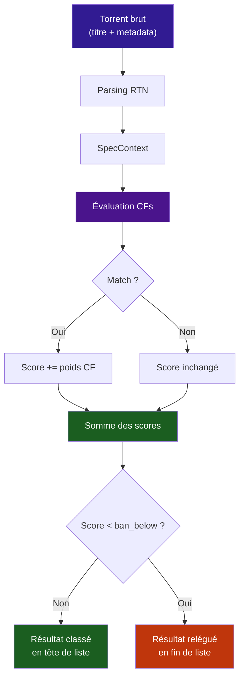
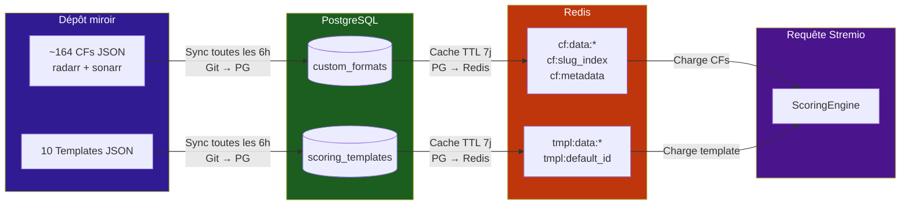

# :material-star: TRaSH Scoring

Stream Fusion Reborn intègre un **moteur de scoring TRaSH** (The Radarr & Sonarr Hardlinker) qui classe automatiquement les résultats de recherche selon la qualité réelle de chaque release. Le système repose sur deux concepts :

- **Custom Formats (CF)** : des règles de détection qui identifient des caractéristiques précises d'un torrent (résolution, source audio, groupe de release, HDR, etc.)
- **Templates de scoring** : des profils qui associent un **poids entier** à chaque CF matched, permettant de classer les résultats selon vos préférences

---

## Comment ça marche

1. **Parsing** : le titre du torrent est analysé par RTN (Release Title Normalizer) pour extraire résolution, codec, audio, groupe, HDR, etc.
2. **Évaluation** : chaque CF actif teste si le torrent correspond à ses spécifications
3. **Scoring** : les poids des CFs matched s'additionnent pour former un score total
4. **Classement** : les résultats sont triés par score décroissant. Ceux sous `ban_below` restent visibles mais en fin de liste

---

## Workflow complet — De zéro au scoring actif

-   :material-sync: **1. Synchroniser le miroir**

    Importe ~164 Custom Formats et les templates système depuis le dépôt communautaire [streamfusion-trash-mirror](https://github.com/LimeHubs/streamfusion-trash-mirror)
    
    [Aller à la sync →](admin.md#synchronisation)

-   :material-layers: **2. Choisir un template**

    Sélectionnez un template système (ex. `vff-vfi-hd`) ou clonez-en un pour le personnaliser
    
    [Voir les templates →](templates.md)

-   :material-toggle-switch: **3. Activer le scoring**

    Activez `TRASH_SCORING_ENABLED` dans les paramètres TRaSH de l'admin — hot-reloadable sans redémarrage
    
    [Paramètres TRaSH →](../configuration/variables-environnement.md#trash-custom-formats)

-   :material-tune: **4. Choisir dans /configure**

    L'utilisateur final sélectionne son template dans la page de configuration du plugin Stremio. Les résultats sont alors classés par score CF
    
    [Guide Stremio →](../guides/configuration-stremio.md)

---

## Templates système disponibles

| Slug | Nom | Cas d'usage |
|---|---|---|
| `vff-vfi-hd` | **VFF/VFI HD (1080p Priorité)** | Doublage français intégral en HD. Favorise x265 et groupes FR reconnus. Limite 30 Go |
| `vff-vfi-uhd` | **VFF/VFI UHD (2160p Priorité)** | Doublage français en 4K. Priorité HDR10+/Dolby Vision, encode x265. Taille illimitée |
| `vff-vfi-web` | **VFF/VFI WEB Compact** | WEB-DL 1080p VFF/VFI uniquement. Limite stricte 15 Go, idéal espace disque limité |
| `vff-vfi-uhd-web` | **VFF/VFI UHD WEB (2160p Streaming)** | 4K VFF/VFI depuis plateformes streaming (NF, AMZN, DSNP, HBO…). Taille illimitée |
| `multi-hd` | **MULTi HD (1080p Bilingue)** | Releases bilingues FR+VO en 1080p. MULTi prioritaire, limite 35 Go |
| `multi-uhd` | **MULTi UHD (2160p HDR Bilingue)** | 4K bilingue FR+VO avec HDR10+/DV. Audio lossless valorisé. Taille illimitée |
| `vostfr-hd` | **VOSTFR HD (VO + Sous-titres FR)** | VO avec sous-titres français. VOSTFR et Original+French valorisés. Limite 30 Go |
| `remux-cinephile` | **Remux Cinéphile (Qualité Absolue)** | Seul le meilleur compte. Remux Bluray des groupes top tiers. Aucune restriction de langue ni taille |
| `anime-vf` | **Animé VF (VFF/VFI + VOSTFR)** | Animé en français. VFF/VFI favorisés, VOSTFR en fallback. Limite 20 Go |
| `anime-multi` | **Animé MULTi (FR+JP Bilingue)** | Animé bilingue : MULTi et Dual Audio en priorité absolue. Limite 25 Go |

!!! tip "Templates en lecture seule"
    Les templates système sont **protégés** — ils sont mis à jour automatiquement par la sync TRaSH. Pour les modifier, utilisez le bouton **Cloner** dans l'admin pour créer une copie utilisateur.

---

## Structure du système

Les Custom Formats et templates sont désormais stockés dans **PostgreSQL** (et non plus uniquement dans Redis). Le flux de synchronisation est :

1. **Git mirror** → `trash_sync` clone le dépôt miroir
2. **PostgreSQL** → les CFs et templates sont persistés dans les tables `custom_formats` et `scoring_templates`
3. **Redis** → un cache TTL 7j accélère les lectures au runtime

!!! tip "Persistance PostgreSQL"
    La persistance dans PostgreSQL garantit que les CFs et templates survivent à un flush Redis. La sync `trash_sync` écrit directement dans PG, puis le cache Redis est peuplé depuis PG. Le cache Redis a un TTL de 7 jours — au-delà, il est re-peuplé automatiquement depuis PG.

---

## Sections de la documentation TRaSH

-   :material-filter: **[Custom Formats](custom-formats.md)**

    Qu'est-ce qu'un CF, logique de matching, les 11 implementations de specs, et le catalogue complet des ~164 CFs avec leurs slugs

-   :material-layers: **[Templates de scoring](templates.md)**

    Structure JSON complète, les 10 templates système documentés, guide de création personnalisée, export et contribution

-   :material-monitor-dashboard: **[Administration](admin.md)**

    Synchronisation manuelle/auto, monitoring temps réel, testeur CF, purge DB/Redis, gestion des verrous

---

## Référence rapide

| Variable d'environnement | Défaut | Description |
|---|---|---|
| `TRASH_SCORING_ENABLED` | `False` | Master switch du scoring (hot-reloadable) |
| `TRASH_SYNC_ENABLED` | `True` | Active la sync planifiée du miroir |
| `TRASH_SYNC_CRON` | `0 */6 * * *` | Fréquence de sync (toutes les 6h) |
| `TRASH_MIRROR_REPO_URL` | `https://github.com/LimeHubs/streamfusion-trash-mirror.git` | URL du dépôt miroir |
| `TRASH_MIRROR_BRANCH` | `main` | Branche Git à utiliser |
| `TRASH_DEFAULT_TEMPLATE_SLUG` | `balanced` | Slug du template par défaut. Utilisé si aucun template n'est marqué `is_default=True` dans la table `scoring_templates`. Priorité à la DB (via admin). |

Voir la page [Variables d'environnement](../configuration/variables-environnement.md) pour la liste complète.
